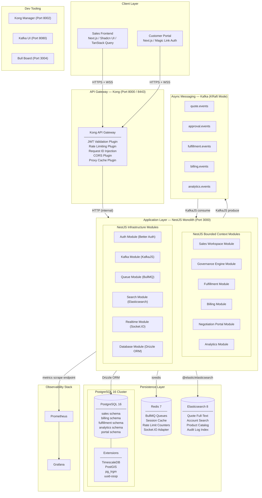
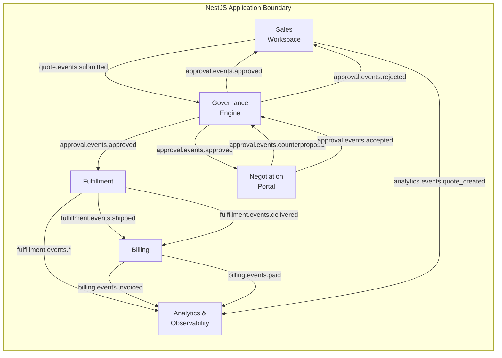
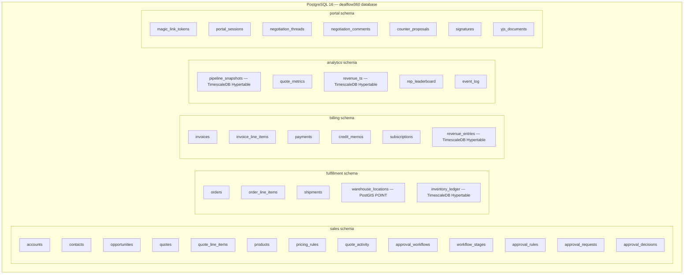
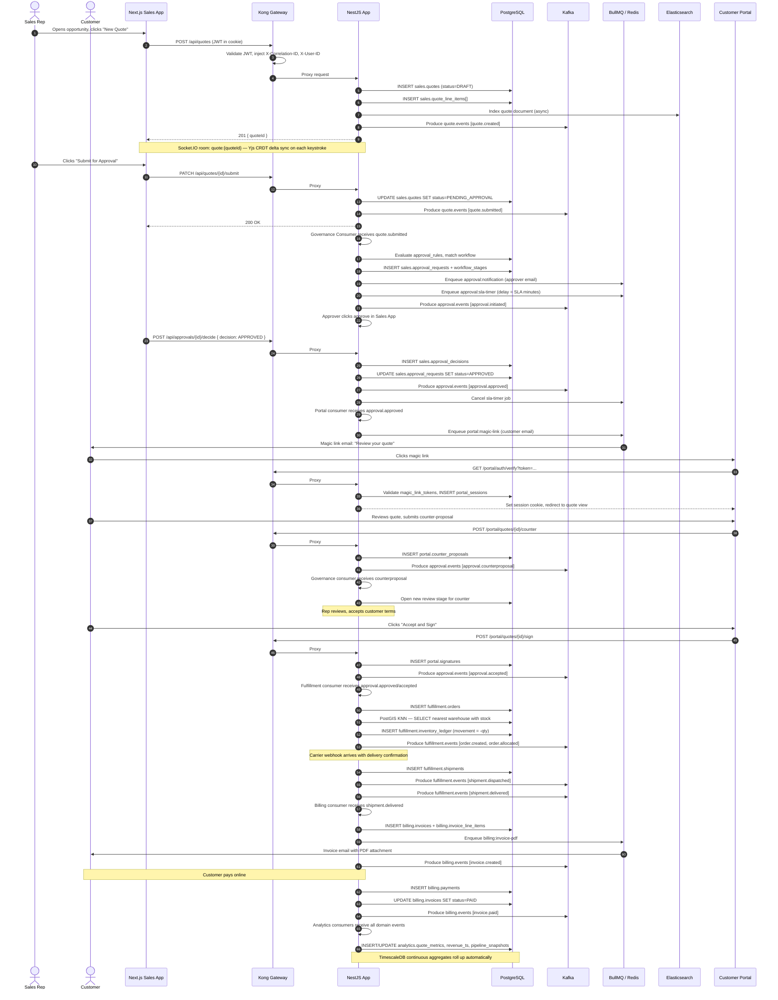

# DealFlow360

DealFlow360 is a enterprise-grade B2B quotation, governance, negotiation, fulfillment, and billing platform built on a modular monolith architecture.

---

## High-Level System Topology



---

## Service Context Boundaries



---

## Database Schema Topology



---

## End-to-End Deal Lifecycle Sequence



---

## Technology Stack

- **Backend Framework:** NestJS (Node.js/TypeScript monorepo)
- **Frontend Applications:** Next.js App Router, Tailwind CSS, Shadcn UI, TanStack Query
- **Database & Extensions:** PostgreSQL 16 (TimescaleDB, PostGIS, `pg_trgm`, `uuid-ossp`)
- **ORM & Migrations:** Drizzle ORM
- **Async Event Messaging:** Apache Kafka (KRaft mode)
- **Queue Engine:** BullMQ + Redis 7
- **Full-Text & Faceted Search:** Elasticsearch 8
- **API Gateway:** Kong API Gateway
- **Real-time Collaboration:** Socket.IO & Yjs CRDTs
- **Observability:** Prometheus & Grafana

---

## Directory Structure

```
.
├── apps/
│   ├── api/          # NestJS backend application
│   └── web/          # Next.js web client application (Sales workspace & Portal)
├── docs/             # Technical specifications & architecture guides
├── infra/            # Docker Compose & gateway configurations
└── packages/         # Shared internal libraries and packages
```

---

## Ports and Endpoints

| Component | Port | Purpose |
|---|---|---|
| Kong Ingress Proxy | `8000` / `8443` | Primary API Ingress |
| Kong Admin API | `8001` | Gateway Configuration API |
| Kong Manager | `8002` | Gateway Admin UI |
| NestJS Application | `3000` | Core API Application |
| Next.js Frontend | `3001` | Web Client |
| PostgreSQL | `5432` | Primary Relational Store |
| Redis | `6379` | Queue Broker and Cache |
| Kafka Broker | `9092` | Event Streaming Broker |
| Kafka UI | `8080` | Cluster Operations Console |
| Elasticsearch | `9200` | Search Engine REST API |
| Prometheus | `9090` | Metrics Collector |
| Grafana | `3003` | Metrics & Dashboards UI |
| Bull Board | `3004` | Task Queue Monitoring Console |

---

## Getting Started

### Prerequisites

- Node.js >= 20.x
- pnpm >= 9.x
- Docker & Docker Compose

### Installation and Run

1. Clone the repository and install dependencies:
   ```bash
   pnpm install
   ```

2. Start infrastructure backing services:
   ```bash
   docker compose up -d
   ```

3. Run database migrations:
   ```bash
   pnpm --filter api db:migrate
   ```

4. Start development services:
   ```bash
   pnpm dev
   ```

---

## Testing

Run tests across services:

```bash
# Run unit and integration tests for API
pnpm --filter api test

# Run e2e lifecycle test suite
pnpm test:e2e
```
