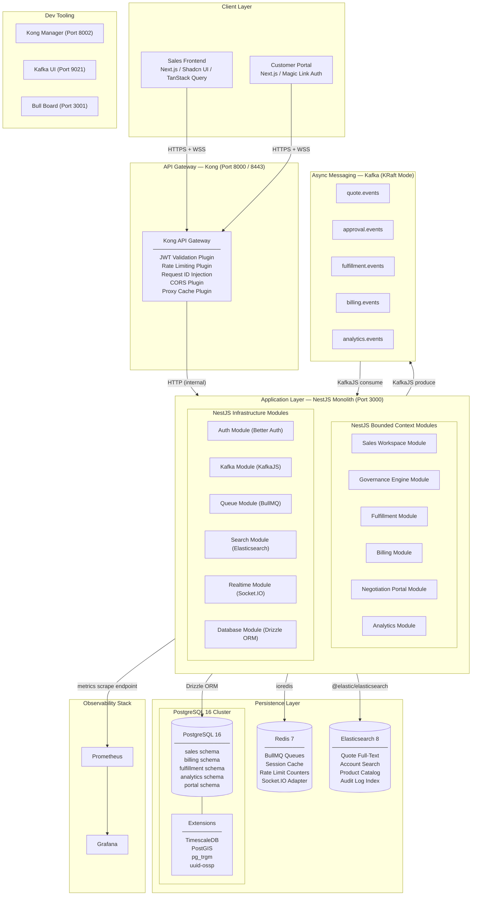
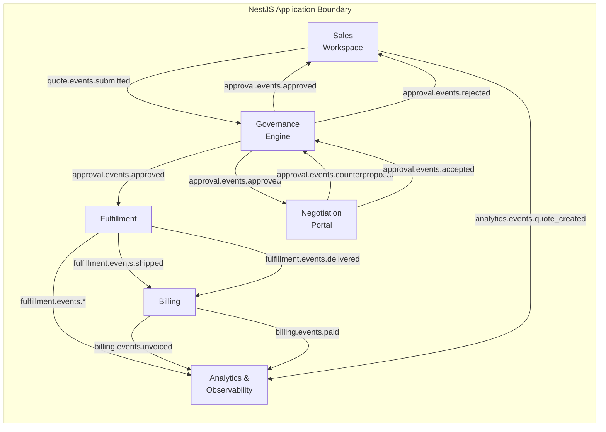
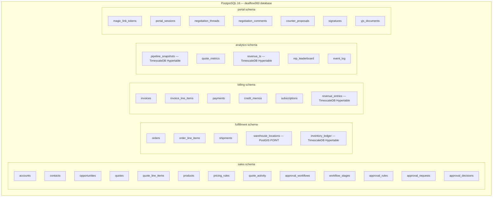
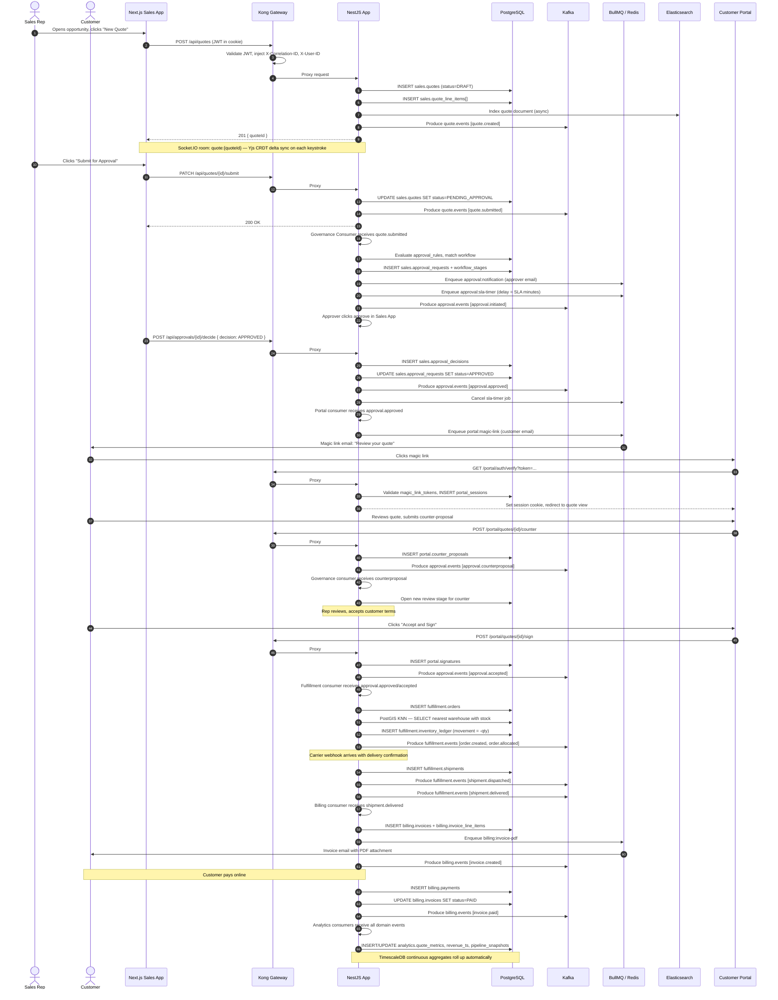
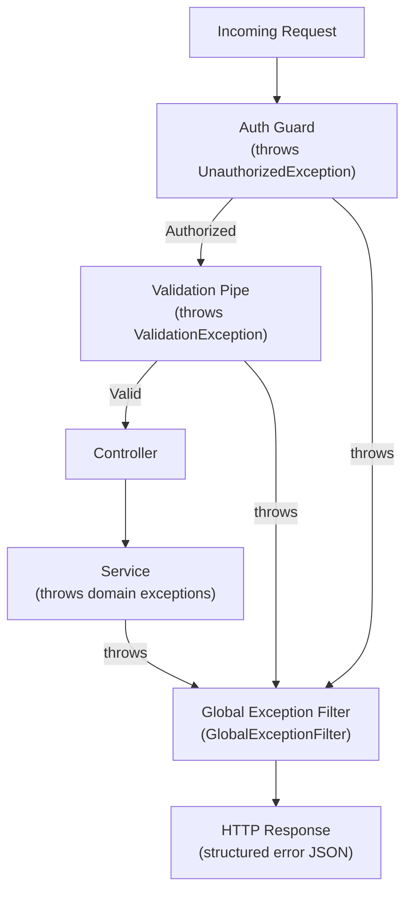

# DealFlow360 — System Architecture Document (SAD)

> **Document ID:** SAD-001  
> **Version:** 1.0.0  
> **Status:** ✅ Approved  
> **Last Updated:** 2026-09-05  
> **Authors:** Platform Architecture Team  
> **Audience:** Engineering, DevOps, Technical Leadership

---

## Table of Contents

1. [Introduction & Purpose](#1-introduction--purpose)
2. [Architectural Principles](#2-architectural-principles)
3. [High-Level System Topology](#3-high-level-system-topology)
4. [Service Context Boundaries](#4-service-context-boundaries)
   - 4.1 [Sales Workspace](#41-sales-workspace)
   - 4.2 [Governance Engine](#42-governance-engine)
   - 4.3 [Fulfillment](#43-fulfillment)
   - 4.4 [Billing](#44-billing)
   - 4.5 [Negotiation Portal](#45-negotiation-portal)
   - 4.6 [Analytics & Observability](#46-analytics--observability)
5. [Technology Justification](#5-technology-justification)
6. [Data Architecture](#6-data-architecture)
7. [End-to-End Data Flow](#7-end-to-end-data-flow)
8. [Authentication & Authorization Model](#8-authentication--authorization-model)
9. [Deployment Architecture](#9-deployment-architecture)
10. [Cross-Cutting Concerns](#10-cross-cutting-concerns)
11. [Appendix — ADR Index](#11-appendix--adr-index)

---

## 1. Introduction & Purpose

### 1.1 Product Overview

**DealFlow360** is a B2B sales platform engineered for high-velocity enterprise deal management. It surfaces a unified workspace where sales representatives compose complex, multi-line quotes; routing rules push quotes through configurable approval chains; an external-facing negotiation portal enables customers to redline terms in real time; and a post-approval pipeline drives automated fulfillment and billing. An embedded analytics layer gives revenue operations teams real-time visibility into pipeline health, pricing performance, and margin exposure.

### 1.2 Purpose of This Document

This document serves as the authoritative reference for the DealFlow360 system architecture. It captures:

- **Structural decisions** — how the codebase is organized, where the process boundaries are, and how the persistence layer is partitioned.
- **Technology choices** — the rationale behind every significant library, framework, and infrastructure component selection.
- **Runtime topology** — how traffic flows from the browser to Kong, through the NestJS application, and into the backing services.
- **Data flows** — the canonical happy-path sequence from quote creation to billing reconciliation.
- **Operational concerns** — observability, error handling, and the local development environment.

This document is not a low-level design specification. Module-level design, database schema definitions, and API contracts are captured in dedicated documents (see §11).

### 1.3 Scope

| In Scope | Out of Scope |
|---|---|
| Monorepo structure and NestJS module decomposition | Third-party ERP or CRM integration internals |
| Kong API Gateway configuration | End-user UI component design |
| PostgreSQL schema topology, TimescaleDB, PostGIS | CI/CD pipeline implementation |
| Kafka topics, BullMQ queues | Infrastructure-as-code (Terraform/Pulumi) |
| Auth model (Better Auth + Magic Link) | Production Kubernetes manifests |
| Docker Compose local dev environment | Disaster recovery runbooks |

---

## 2. Architectural Principles

The following principles govern all architectural decisions made in DealFlow360. When a conflict arises between implementation options, these principles act as a tie-breaker.

| # | Principle | Practical Implication |
|---|---|---|
| P-1 | **Monolith-first, boundaries enforced** | One deployable NestJS application. Domain isolation enforced via module encapsulation, not network calls. Avoids premature distributed-systems complexity. |
| P-2 | **Schema-per-domain, single engine** | PostgreSQL schemas (`sales`, `billing`, etc.) provide logical isolation without the operational cost of multiple databases. Cross-domain queries remain an option when performance demands it. |
| P-3 | **Async is the default for side-effects** | Any action that changes state in more than one domain is done via a Kafka event, never a synchronous service call. This decouples producers from consumers and enables replay. |
| P-4 | **Jobs are first-class** | All heavy or delayed work (PDF generation, email delivery, dunning, analytics roll-ups) runs through BullMQ queues, never in request handlers. |
| P-5 | **Observability is non-negotiable** | Every request carries a `correlationId`. All logs are structured JSON. Metrics are emitted to Prometheus. Tracing is instrumented via OpenTelemetry. |
| P-6 | **Security in depth** | Auth is verified at the gateway layer (Kong JWT plugin) AND re-validated in NestJS guards. Secrets are never in source control. |
| P-7 | **Type safety end-to-end** | TypeScript strict mode throughout. Drizzle ORM provides schema-inferred types. Zod validates all runtime boundaries (API payloads, Kafka messages, environment variables). |

---

## 3. High-Level System Topology

### 3.1 Topology Overview

DealFlow360 runs as a single NestJS application behind a Kong API Gateway, backed by a suite of purpose-fit infrastructure services. The Next.js frontends (internal sales app and external customer portal) are served independently and communicate exclusively through Kong.



### 3.2 Network Port Map

| Service | Internal Port | Exposed (Dev) | Purpose |
|---|---|---|---|
| Kong Proxy | 8000 / 8443 | 8000 / 8443 | HTTP / HTTPS ingress |
| Kong Admin API | 8001 | 8001 | Declarative config (`deck`) |
| Kong Manager | 8002 | 8002 | Web UI |
| NestJS App | 3000 | — | Application server (behind Kong) |
| Next.js Sales | 3001 | 3001 | Internal dev server |
| Next.js Portal | 3002 | 3002 | Portal dev server |
| PostgreSQL | 5432 | 5432 | Database |
| Redis | 6379 | 6379 | Cache / queue broker |
| Kafka Broker | 9092 / 9093 | 9092 | Broker (KRaft) / Controller |
| Kafka UI | 8080 | 8080 | Topic inspection |
| Elasticsearch | 9200 | 9200 | REST API |
| Prometheus | 9090 | 9090 | Metrics |
| Grafana | 3000 | 3003 | Dashboards |
| Bull Board | 3001 | 3004 | Queue management UI |

---

## 4. Service Context Boundaries

DealFlow360 uses **modular monolith** architecture. Each bounded context is a NestJS feature module with its own controllers, services, repositories, and Drizzle schema. Modules communicate internally through injected services **only within** the same bounded context; cross-context communication occurs exclusively via **Kafka events** for async operations or through well-defined **intra-app service facades** for synchronous reads.



### 4.1 Sales Workspace

The Sales Workspace is the primary user-facing bounded context. It owns the entire pre-submission lifecycle of a deal: accounts, contacts, opportunities, products, and quote line-item composition.

#### Responsibilities

- CRUD for Accounts, Contacts, and Opportunities
- Multi-line Quote Builder (line items, pricing rules, discounts, custom terms)
- Product catalog search (delegates read to Search Module / Elasticsearch)
- Quote versioning and document locking
- Collaborative editing via Yjs CRDT document state (Socket.IO transport)
- Submission of finalized quotes to the Governance Engine
- Real-time quote activity feed (Socket.IO broadcasts)

#### Key Entities

| Entity | Schema | Description |
|---|---|---|
| `Account` | `sales.accounts` | Customer organization |
| `Contact` | `sales.contacts` | Named individuals at an account |
| `Opportunity` | `sales.opportunities` | A pipeline deal, linked to an account |
| `Quote` | `sales.quotes` | The versioned quote document |
| `QuoteLineItem` | `sales.quote_line_items` | Individual line: product, qty, unit price, discount |
| `Product` | `sales.products` | Product/SKU catalog |
| `PricingRule` | `sales.pricing_rules` | Volume tiers, promo codes, bundle discounts |
| `QuoteActivity` | `sales.quote_activity` | Append-only audit trail per quote |

#### NestJS Module Layout

```
src/
  sales/
    sales.module.ts
    accounts/
      accounts.controller.ts
      accounts.service.ts
      accounts.repository.ts
      dto/
      schema/
    contacts/
    opportunities/
    quotes/
      quotes.controller.ts
      quotes.service.ts
      quotes.repository.ts
      quotes.gateway.ts          # Socket.IO gateway for collaborative editing
      quote-versions/
    products/
    pricing/
```

#### Events Published

| Topic | Event Type | Payload Summary | Trigger |
|---|---|---|---|
| `quote.events` | `quote.created` | `{ quoteId, opportunityId, repId, lineItemCount }` | New quote saved |
| `quote.events` | `quote.updated` | `{ quoteId, version, changedFields[] }` | Quote fields mutated |
| `quote.events` | `quote.submitted` | `{ quoteId, totalValue, repId, accountId }` | Rep clicks "Submit for Approval" |
| `analytics.events` | `sales.activity` | `{ type, actorId, entityId, entityType, ts }` | Any CUD operation |

#### Events Consumed

| Topic | Event Type | Action |
|---|---|---|
| `approval.events` | `approval.approved` | Unlock quote, set status → `APPROVED`, notify rep via Socket.IO |
| `approval.events` | `approval.rejected` | Set status → `REJECTED`, attach rejection reason, notify rep |
| `approval.events` | `approval.counterproposal` | Create new quote version with customer's proposed changes |

---

### 4.2 Governance Engine

The Governance Engine owns the approval workflow system. It is stateless in the sense that all routing decisions are driven by persisted rule configurations; it holds no business domain data beyond approval records.

#### Responsibilities

- Configurable approval routing rule engine (amount thresholds, discount %, product category, geo-region)
- Multi-stage, multi-approver chains with parallel and sequential support
- SLA timers (escalation on timeout via BullMQ delayed jobs)
- Approval history and full audit log
- Delegation and out-of-office routing
- Override capabilities for admins with mandatory comment

#### Key Entities

| Entity | Schema | Description |
|---|---|---|
| `ApprovalWorkflow` | `sales.approval_workflows` | A named, versioned workflow template |
| `WorkflowStage` | `sales.workflow_stages` | Ordered stage within a workflow (sequential or parallel) |
| `ApprovalRule` | `sales.approval_rules` | Condition predicate that maps to a workflow |
| `ApprovalRequest` | `sales.approval_requests` | Instance of an approval for a specific quote |
| `ApprovalDecision` | `sales.approval_decisions` | An individual approver's accept/reject/counter record |
| `DelegationRule` | `sales.delegation_rules` | Out-of-office routing entries |

#### NestJS Module Layout

```
src/
  governance/
    governance.module.ts
    workflows/
      workflows.controller.ts
      workflows.service.ts
    rules/
      rule-engine.service.ts      # Evaluates which workflow fires for a quote
    approvals/
      approvals.controller.ts
      approvals.service.ts
      approvals.repository.ts
    sla/
      sla-timer.processor.ts      # BullMQ processor for escalation
    schema/
```

#### Events Published

| Topic | Event Type | Payload Summary | Trigger |
|---|---|---|---|
| `approval.events` | `approval.initiated` | `{ approvalRequestId, quoteId, workflowId, stages[] }` | Workflow started |
| `approval.events` | `approval.approved` | `{ approvalRequestId, quoteId, approvedBy, ts }` | All stages passed |
| `approval.events` | `approval.rejected` | `{ approvalRequestId, quoteId, rejectedBy, reason, ts }` | Any stage rejected |
| `approval.events` | `approval.escalated` | `{ approvalRequestId, stageId, escalatedTo, reason }` | SLA timer fires |
| `approval.events` | `approval.counterproposal` | `{ approvalRequestId, quoteId, proposedChanges }` | Customer submits counter |

#### Events Consumed

| Topic | Event Type | Action |
|---|---|---|
| `quote.events` | `quote.submitted` | Evaluate routing rules, create `ApprovalRequest`, fan out to approvers |
| `approval.events` | `approval.counterproposal` | Open new review stage for the counter-proposal |

#### BullMQ Queues

| Queue Name | Processor | Description |
|---|---|---|
| `approval:sla-timer` | `SlaTimerProcessor` | Fires when a stage exceeds its configured SLA; triggers escalation |
| `approval:notification` | `ApprovalNotificationProcessor` | Sends email/in-app notification to the next approver |

---

### 4.3 Fulfillment

The Fulfillment context owns all post-approval operational work: order creation, inventory allocation, shipping coordination, and delivery confirmation.

#### Responsibilities

- Translate an approved quote into a fulfillment Order
- Allocate inventory (line-item reservation against warehouse stock)
- Route orders to regional fulfillment centers (PostGIS proximity queries)
- Track shipment status via carrier webhook ingestion
- Manage warehouse locations and capacity
- Publish delivery events to trigger billing

#### Key Entities

| Entity | Schema | Description |
|---|---|---|
| `Order` | `fulfillment.orders` | Derived from an approved quote; the fulfillment record |
| `OrderLineItem` | `fulfillment.order_line_items` | Individual product line with allocated qty |
| `Shipment` | `fulfillment.shipments` | Carrier tracking record per parcel |
| `WarehouseLocation` | `fulfillment.warehouse_locations` | Physical warehouse with `PostGIS POINT` geometry column |
| `InventoryLedger` | `fulfillment.inventory_ledger` | Append-only stock movement log (TimescaleDB hypertable) |
| `CarrierWebhookEvent` | `fulfillment.carrier_webhook_events` | Raw inbound carrier status payloads |

#### NestJS Module Layout

```
src/
  fulfillment/
    fulfillment.module.ts
    orders/
      orders.controller.ts
      orders.service.ts
      orders.repository.ts
    inventory/
      inventory.service.ts
      inventory-ledger.repository.ts    # Inserts to TimescaleDB hypertable
    routing/
      routing.service.ts               # PostGIS WITHIN / KNN queries
    shipments/
      shipments.controller.ts          # Carrier webhook receiver
      shipments.service.ts
    schema/
```

#### Events Published

| Topic | Event Type | Payload Summary | Trigger |
|---|---|---|---|
| `fulfillment.events` | `order.created` | `{ orderId, quoteId, lineItems[], warehouseId }` | Order entity created |
| `fulfillment.events` | `order.allocated` | `{ orderId, allocationMap }` | Inventory reserved |
| `fulfillment.events` | `shipment.dispatched` | `{ orderId, shipmentId, carrierId, trackingNumber }` | Carrier assigned |
| `fulfillment.events` | `shipment.delivered` | `{ orderId, shipmentId, deliveredAt, proofOfDelivery }` | Carrier confirms delivery |
| `analytics.events` | `fulfillment.activity` | `{ type, orderId, ts, metadata }` | Any state change |

#### Events Consumed

| Topic | Event Type | Action |
|---|---|---|
| `approval.events` | `approval.approved` | Create `Order` record from approved `Quote` |

---

### 4.4 Billing

The Billing context owns all financial operations post-fulfillment: invoice generation, payment tracking, subscription management (for SaaS-model customers), dunning, and revenue recognition.

#### Responsibilities

- Generate invoices from fulfilled orders (PDF via BullMQ job)
- Track payment lifecycle (pending → paid → overdue → written-off)
- Credit memo and adjustment management
- Recurring billing and subscription renewals
- Dunning workflow (payment reminder sequences via BullMQ)
- Revenue recognition schedules (TimescaleDB time-series bucketing)
- Billing event publishing for analytics roll-ups

#### Key Entities

| Entity | Schema | Description |
|---|---|---|
| `Invoice` | `billing.invoices` | Invoice document linked to an Order |
| `InvoiceLineItem` | `billing.invoice_line_items` | Per-product line with price snapshot at billing time |
| `Payment` | `billing.payments` | Payment records (amount, method, status) |
| `CreditMemo` | `billing.credit_memos` | Adjustments against invoices |
| `Subscription` | `billing.subscriptions` | Recurring billing schedules |
| `DunningEvent` | `billing.dunning_events` | Timestamped dunning action log |
| `RevenueEntry` | `billing.revenue_entries` | TimescaleDB hypertable for daily recognized revenue |

#### NestJS Module Layout

```
src/
  billing/
    billing.module.ts
    invoices/
      invoices.controller.ts
      invoices.service.ts
      invoice-pdf.processor.ts    # BullMQ processor: PDF generation
    payments/
      payments.controller.ts      # Inbound payment gateway webhooks
      payments.service.ts
    dunning/
      dunning.processor.ts        # BullMQ: reminder sequences
    subscriptions/
      subscriptions.service.ts
      subscription-renewal.processor.ts
    revenue/
      revenue-recognition.service.ts
    schema/
```

#### Events Published

| Topic | Event Type | Payload Summary | Trigger |
|---|---|---|---|
| `billing.events` | `invoice.created` | `{ invoiceId, orderId, amount, dueDate }` | Invoice generated |
| `billing.events` | `invoice.paid` | `{ invoiceId, paidAt, paymentId, amount }` | Payment recorded |
| `billing.events` | `invoice.overdue` | `{ invoiceId, daysOverdue, amount }` | Dunning timer fires |
| `analytics.events` | `billing.revenue` | `{ invoiceId, recognizedAmount, period, ts }` | Revenue entry recorded |

#### Events Consumed

| Topic | Event Type | Action |
|---|---|---|
| `fulfillment.events` | `shipment.delivered` | Trigger invoice generation |

#### BullMQ Queues

| Queue Name | Processor | Description |
|---|---|---|
| `billing:invoice-pdf` | `InvoicePdfProcessor` | Generate PDF, upload to object storage, email to customer |
| `billing:dunning` | `DunningProcessor` | Send payment reminder at configurable intervals |
| `billing:subscription-renewal` | `SubscriptionRenewalProcessor` | Renew recurring invoices on schedule |

---

### 4.5 Negotiation Portal

The Negotiation Portal is the external-facing bounded context. It powers the customer-accessible web experience where counterparties can review quotes, propose changes (redlines), sign off, and track order status.

#### Responsibilities

- Issue and validate magic-link tokens for customer authentication
- Serve read-only quote summaries to external customers
- Accept counter-proposal submissions (structured change requests)
- Serve real-time negotiation chat / comment threads (Socket.IO)
- Collaborative document annotation via Yjs CRDTs (persisted to `portal` schema)
- Digital signature capture and storage
- Order status tracking for customers (read from Fulfillment context via façade)

#### Key Entities

| Entity | Schema | Description |
|---|---|---|
| `MagicLinkToken` | `portal.magic_link_tokens` | Single-use, 24hr expiry auth tokens |
| `PortalSession` | `portal.portal_sessions` | Active customer session record |
| `NegotiationThread` | `portal.negotiation_threads` | Comment thread on a quote |
| `NegotiationComment` | `portal.negotiation_comments` | Individual comment with author, body, attachments |
| `CounterProposal` | `portal.counter_proposals` | Structured redline submission against specific line items |
| `Signature` | `portal.signatures` | Cryptographic signature record |
| `YjsDocument` | `portal.yjs_documents` | Serialized Yjs CRDT state vector for a quote document |

#### NestJS Module Layout

```
src/
  portal/
    portal.module.ts
    auth/
      portal-auth.controller.ts     # Magic link issue + verify endpoints
      portal-auth.service.ts
      magic-link.processor.ts       # BullMQ: email magic link
    quotes/
      portal-quotes.controller.ts   # Read-only quote view for customer
      portal-quotes.service.ts
    negotiation/
      negotiation.controller.ts
      negotiation.service.ts
      negotiation.gateway.ts        # Socket.IO: real-time comments
    crdt/
      crdt.service.ts               # Yjs state persistence
    signatures/
      signatures.controller.ts
    schema/
```

#### Events Published

| Topic | Event Type | Payload Summary | Trigger |
|---|---|---|---|
| `approval.events` | `approval.counterproposal` | `{ quoteId, customerId, proposedChanges[], message }` | Customer submits redlines |
| `approval.events` | `approval.accepted` | `{ quoteId, customerId, signatureId, ts }` | Customer accepts and signs |

#### Events Consumed

| Topic | Event Type | Action |
|---|---|---|
| `approval.events` | `approval.approved` | Unlock portal view; notify customer via email |
| `fulfillment.events` | `shipment.dispatched` | Update customer order status to "In Transit" |
| `fulfillment.events` | `shipment.delivered` | Update customer order status to "Delivered" |

#### BullMQ Queues

| Queue Name | Processor | Description |
|---|---|---|
| `portal:magic-link` | `MagicLinkProcessor` | Send magic link email via transactional email provider |

---

### 4.6 Analytics & Observability

The Analytics context is a read-optimized domain that aggregates data from all other contexts via Kafka. It never writes to peer schemas. It maintains its own materialized views, hypertables, and Elasticsearch indices.

#### Responsibilities

- Consume all domain events and project into analytics models
- Compute pipeline metrics: win rate, ASP, average deal cycle, quota attainment
- Time-series revenue roll-ups (daily/weekly/monthly ARR, MRR)
- Quote pricing health metrics (discount depth, margin %)
- Leaderboard and rep performance dashboards
- Exposure of read API for dashboard widgets in the Sales Frontend
- Grafana datasource configuration (direct PostgreSQL / TimescaleDB)

#### Key Entities

| Entity | Schema | Description |
|---|---|---|
| `PipelineSnapshot` | `analytics.pipeline_snapshots` | TimescaleDB: point-in-time pipeline value per rep/team |
| `QuoteMetric` | `analytics.quote_metrics` | Aggregated per-quote stats |
| `RevenueTimeSeries` | `analytics.revenue_ts` | TimescaleDB hypertable: revenue by day/product/region |
| `RepLeaderboard` | `analytics.rep_leaderboard` | Cached rep ranking (refreshed via BullMQ cron) |
| `EventLog` | `analytics.event_log` | Raw event archive for replay / re-projection |

#### NestJS Module Layout

```
src/
  analytics/
    analytics.module.ts
    consumers/
      quote-events.consumer.ts
      approval-events.consumer.ts
      fulfillment-events.consumer.ts
      billing-events.consumer.ts
    projectors/
      pipeline.projector.ts
      revenue.projector.ts
      rep-performance.projector.ts
    api/
      analytics.controller.ts      # Read API for dashboard widgets
      analytics.service.ts
    rollups/
      rollup.processor.ts          # BullMQ cron: daily aggregation
    schema/
```

#### Events Consumed

| Topic | Event Types |
|---|---|
| `quote.events` | `quote.created`, `quote.submitted`, `quote.updated` |
| `approval.events` | `approval.approved`, `approval.rejected`, `approval.escalated` |
| `fulfillment.events` | `order.created`, `shipment.delivered` |
| `billing.events` | `invoice.created`, `invoice.paid`, `invoice.overdue` |
| `analytics.events` | All `*.activity` and `*.revenue` events |

#### BullMQ Queues

| Queue Name | Processor | Description |
|---|---|---|
| `analytics:daily-rollup` | `RollupProcessor` | Cron (00:05 UTC daily) aggregate hypertable roll-ups |
| `analytics:leaderboard` | `LeaderboardProcessor` | Cron (every 15 min) refresh `rep_leaderboard` |

---

## 5. Technology Justification

> **Note:** Every technology in this stack was evaluated against at least two alternatives. The table below documents the final decision and the reasoning. This context must be preserved as the project scales to ensure future engineers understand why alternatives were rejected.

### 5.1 Backend Framework

| Decision | Choice | Alternatives Considered | Rationale |
|---|---|---|---|
| **Backend Framework** | **NestJS** | Express (raw), Fastify, Hapi | NestJS provides a first-class DI container, module system, decorators for guards/interceptors, and built-in support for Kafka consumers, BullMQ processors, and WebSocket gateways. Its opinionated structure enforces domain separation without custom conventions. Express would require substantial boilerplate to achieve the same architectural guardrails. |
| **ORM** | **Drizzle ORM** | Prisma, TypeORM, Sequelize | Drizzle operates entirely at the TypeScript type-inference level — schema definitions produce inferred types with zero code generation. Prisma's code-gen step adds CI friction and its Rust query engine is an opaque binary. TypeORM's decorator-based approach conflicts with strict TypeScript. Drizzle also supports raw SQL escapes cleanly, which is essential for TimescaleDB hypertable and PostGIS function calls that no ORM natively models. |
| **API Style** | **REST** | GraphQL, tRPC | DealFlow360 exposes data to an external customer portal (third-party potential) and must support machine-readable contracts. REST + OpenAPI provides the most universally consumable interface. GraphQL complicates Kong plugin application (rate limiting, caching). tRPC is excellent for internal full-stack TypeScript but breaks the contract portability requirement for external portal consumers. |

### 5.2 Database & Extensions

| Decision | Choice | Alternatives Considered | Rationale |
|---|---|---|---|
| **Primary Database** | **PostgreSQL 16** | MySQL 8, MongoDB, CockroachDB | PostgreSQL's extension ecosystem (TimescaleDB, PostGIS, pg_trgm) makes it uniquely capable of serving multiple analytical and geospatial needs without additional infrastructure. JSONB handles semi-structured quote terms. MySQL lacks comparable extension depth. MongoDB is unsuitable for the relational quote/line-item/approval graph. CockroachDB adds distributed complexity not yet warranted. |
| **Time-Series** | **TimescaleDB** | InfluxDB, QuestDB, ClickHouse | TimescaleDB runs as a PostgreSQL extension — the same connection pool, Drizzle migrations, and operational tooling cover both OLTP and OLAP. InfluxDB/QuestDB/ClickHouse each require a separate service, connection handling, backup strategy, and alerting. TimescaleDB's continuous aggregates and automatic hypertable partitioning cover DealFlow360's time-series needs with zero additional infra. |
| **Geospatial** | **PostGIS** | Google Maps API, Elasticsearch geo, Redis Geoset | Fulfillment routing requires KNN warehouse selection and WITHIN polygon queries for regional assignments. PostGIS runs natively in PostgreSQL; queries are transactional and can JOIN against warehouse inventory in a single query plan. External APIs add latency and egress cost. Elasticsearch geo is suitable for search but not for transactional routing decisions. |
| **Search** | **Elasticsearch 8** | Typesense, Meilisearch, PostgreSQL FTS | Quote and product catalog search requires multi-field relevance scoring, faceted filtering, and typo tolerance at scale. Typesense/Meilisearch lack the aggregation pipeline depth needed for analytics-quality search facets. PostgreSQL FTS via `pg_trgm` is used only for lightweight lookups. |
| **Schema Isolation** | **PostgreSQL Schemas** | Separate databases, separate services | Schema-per-domain keeps logical isolation while retaining a single connection pool, single backup, single migration tool, and the ability to do cross-domain read joins when operationally necessary. Separate databases would require distributed transactions for any cross-domain write — premature for this phase. |

### 5.3 Async & Queuing

| Decision | Choice | Alternatives Considered | Rationale |
|---|---|---|---|
| **Message Broker** | **Kafka (KRaft mode)** | RabbitMQ, AWS SQS, NATS | Kafka's durable, ordered, replayable log is the correct primitive for DealFlow360's event sourcing and analytics projection needs. The Analytics context must re-project the entire event history on demand; Kafka's configurable retention makes this straightforward. RabbitMQ is push-based — consumed messages are deleted, making replay impossible without external archival. KRaft mode eliminates ZooKeeper, simplifying the local dev topology. |
| **Background Jobs** | **BullMQ** | Bull (legacy), Temporal, Celery | BullMQ is the production successor to Bull, rewritten in TypeScript with Redis Streams as its backing store. It provides priority queues, rate limiting, delay/scheduling, job deduplication, and a first-class NestJS integration (`@nestjs/bullmq`). Temporal is operationally complex (requires a separate cluster). |
| **Caching** | **Redis 7** | Memcached, DragonflyDB | Redis serves triple duty: BullMQ backing store, Socket.IO adapter (for multi-instance horizontal scaling readiness), and application-level cache. Redis 7 introduced Redis Functions and multi-part AOF. Memcached cannot serve as a BullMQ store. |

### 5.4 Real-Time & Frontend

| Decision | Choice | Alternatives Considered | Rationale |
|---|---|---|---|
| **Real-Time Transport** | **Socket.IO** | Native WebSockets, Server-Sent Events, Ably | Socket.IO provides room-based broadcasting (per-quote rooms, per-user channels), automatic reconnection with state recovery, and a first-class NestJS `@WebSocketGateway` abstraction. The Redis adapter enables horizontal scaling without re-architecting. SSE is unidirectional. Ably/Pusher add external dependency and per-message cost. |
| **CRDT Library** | **Yjs** | Automerge, ShareDB | Yjs is the most performant CRDT library for collaborative document editing. It integrates directly with TipTap/ProseMirror and has Socket.IO provider adapters. The `y-protocols` binary encoding is compact over the wire. Automerge has a larger memory footprint. ShareDB requires a MongoDB backend. |
| **Frontend Framework** | **Next.js** | Remix, Vite SPA, Nuxt | Next.js App Router provides SSR for quote PDF previews, ISR for product catalog pages, and file-based routing. The same framework serves both internal and customer portal, sharing the component library and tooling. |
| **State Management** | **Zustand** | Redux Toolkit, Jotai, MobX | Zustand's minimal surface area is appropriate for DealFlow360's UI-only state (sidebar state, active quote selection, filter panels). TanStack Query handles server-state; Zustand handles UI-state. Redux Toolkit is overkill for the UI complexity at hand. |

### 5.5 Auth & Gateway

| Decision | Choice | Alternatives Considered | Rationale |
|---|---|---|---|
| **Internal Auth** | **Better Auth** | Auth.js (NextAuth), Clerk, Supabase Auth, custom JWT | Better Auth is framework-agnostic, runs server-side, and produces HttpOnly cookie-based sessions with configurable JWT access (15 min) and refresh (7d) token rotation. It integrates cleanly with NestJS custom guards. Clerk/Supabase Auth add external service dependencies and per-MAU cost. Auth.js is Next.js-centric and awkward in NestJS. Rolling custom JWT was rejected to avoid cryptographic implementation risk. |
| **Customer Portal Auth** | **Magic Link (24hr)** | OAuth, Password, WebAuthn | External customers are occasional users — a password is a security liability for infrequent logins. Magic links provide passwordless, phishing-resistant auth with zero credential management burden. 24hr expiry balances UX (customers may not act immediately) with security. |
| **API Gateway** | **Kong** | nginx, Traefik, AWS API Gateway, Envoy | Kong provides a declarative plugin ecosystem (JWT validation, rate limiting, request ID injection, CORS, proxy caching) without custom scripts. The `deck` CLI enables version-controlled Kong configuration. Kong Manager provides visual inspection for stakeholders. |

---

## 6. Data Architecture

### 6.1 Schema Topology



### 6.2 Cross-Schema Foreign Key Policy

> **Warning:** No cross-schema foreign key constraints are defined at the database level. Application-layer referential integrity is maintained via Kafka event ordering and idempotent projectors. This is a deliberate decision to preserve schema-level isolation and allow independent schema migrations.

Cross-schema references are stored as plain `UUID` columns (e.g., `fulfillment.orders.quote_id` references `sales.quotes.id` by convention, not FK constraint). The consuming service is responsible for validating that the referenced entity exists before writing.

### 6.3 TimescaleDB Hypertable Configuration

```sql
-- Example: inventory_ledger hypertable
CREATE TABLE fulfillment.inventory_ledger (
  id           UUID        NOT NULL DEFAULT gen_random_uuid(),
  recorded_at  TIMESTAMPTZ NOT NULL,
  product_id   UUID        NOT NULL,
  warehouse_id UUID        NOT NULL,
  movement     INTEGER     NOT NULL,  -- positive = stock in, negative = stock out
  reason       TEXT        NOT NULL,
  reference_id UUID,                  -- order_id or shipment_id
  PRIMARY KEY (id, recorded_at)
);

SELECT create_hypertable(
  'fulfillment.inventory_ledger',
  'recorded_at',
  chunk_time_interval => INTERVAL '1 week'
);

-- Continuous aggregate: daily stock balance per product per warehouse
CREATE MATERIALIZED VIEW fulfillment.daily_stock_balance
WITH (timescaledb.continuous) AS
SELECT
  time_bucket('1 day', recorded_at) AS day,
  product_id,
  warehouse_id,
  SUM(movement) AS net_movement
FROM fulfillment.inventory_ledger
GROUP BY 1, 2, 3;
```

### 6.4 PostGIS Warehouse Routing Query

```sql
-- KNN: Find the 3 nearest warehouses to a delivery point with sufficient stock
-- $1 = delivery longitude, $2 = delivery latitude
-- $3 = product_id UUID, $4 = required_quantity INTEGER
SELECT
  wl.id,
  wl.name,
  wl.geom <-> ST_SetSRID(ST_MakePoint($1, $2), 4326) AS distance_deg
FROM fulfillment.warehouse_locations wl
INNER JOIN fulfillment.daily_stock_balance dsb
  ON  dsb.warehouse_id = wl.id
  AND dsb.day          = CURRENT_DATE
  AND dsb.product_id   = $3
  AND dsb.net_movement >= $4
WHERE wl.active = true
ORDER BY distance_deg
LIMIT 3;
```

---

## 7. End-to-End Data Flow

The following sequence diagram traces the **happy path** from a sales rep creating a quote through to the customer receiving an invoice.



---

## 8. Authentication & Authorization Model

### 8.1 Internal User Authentication (Better Auth)

Internal users (sales reps, managers, admins) authenticate via the NestJS-hosted Better Auth endpoints.

```
Auth Flow:
  1. POST /auth/sign-in/email → validates credentials
  2. Better Auth issues:
       Access Token  (JWT, 15min TTL, signed HS256) → HttpOnly cookie: __access_token
       Refresh Token (opaque UUID, 7d TTL)           → HttpOnly cookie: __refresh_token
  3. Kong JWT plugin validates __access_token on every proxied request
  4. On 401, client calls POST /auth/refresh → new access token issued
  5. NestJS AuthGuard re-validates JWT claims (sub, role, org_id)
```

**JWT Claims Structure:**

```json
{
  "sub": "usr_01J7K2X...",
  "email": "rep@acme.com",
  "role": "SALES_REP",
  "org_id": "org_01J7K...",
  "permissions": ["quote:create", "quote:read", "opportunity:read"],
  "iat": 1756949296,
  "exp": 1756950196
}
```

### 8.2 Customer Portal Authentication (Magic Link)

```
Magic Link Flow:
  1. POST /portal/auth/request-link { email }
     → App looks up Contact by email
     → Generates 128-bit random token via crypto.randomBytes(16)
     → Stores SHA-256 hash in portal.magic_link_tokens (expires 24hr)
     → Enqueues portal:magic-link BullMQ job → email delivery

  2. Customer clicks link: GET /portal/auth/verify?token=<raw_token>
     → App hashes token, looks up un-expired record
     → Marks token used=true (single-use enforcement)
     → Creates portal.portal_sessions (7d expiry)
     → Sets HttpOnly session cookie

  3. Subsequent requests carry session cookie
     → NestJS PortalAuthGuard validates session in portal.portal_sessions
```

### 8.3 RBAC Model

| Role | Permissions |
|---|---|
| `SALES_REP` | Create/edit own quotes, view own opportunities, submit for approval |
| `SALES_MANAGER` | All SALES_REP + approve quotes up to $50k, view team pipeline |
| `VP_SALES` | All SALES_MANAGER + approve any amount, access analytics |
| `FINANCE` | View/edit billing, download invoices, manage dunning |
| `ADMIN` | Full access, manage users, configure workflows |
| `PORTAL_CUSTOMER` | Read assigned quotes, submit counter-proposals, sign, view order status |

### 8.4 Kong Security Plugins

```yaml
# Kong plugin configuration (deck format — abridged)
plugins:
  - name: jwt
    config:
      key_claim_name: sub
      claims_to_verify:
        - exp
      cookie_names:
        - __access_token
    route: internal-api-route

  - name: rate-limiting
    config:
      minute: 120
      hour: 2000
      policy: redis
      redis_host: redis
      redis_port: 6379
    route: internal-api-route

  - name: request-id
    config:
      header_name: X-Correlation-ID
      generator: uuid
      echo_downstream: true

  - name: cors
    config:
      origins:
        - "https://app.dealflow360.com"
        - "https://portal.dealflow360.com"
      methods: [GET, POST, PUT, PATCH, DELETE, OPTIONS]
      headers: [Authorization, Content-Type, X-Correlation-ID]
      credentials: true
      max_age: 3600
```

---

## 9. Deployment Architecture

### 9.1 Docker Compose — Local Development

All infrastructure services run in Docker Compose. The NestJS application and Next.js apps run natively on the host for hot-reload performance. All backing services are containerized.

```yaml
# docker-compose.yml (abridged — full file at /infra/docker-compose.yml)
version: "3.9"

networks:
  dealflow:
    driver: bridge

volumes:
  pg_data:
  redis_data:
  kafka_data:
  es_data:
  grafana_data:
  prometheus_data:

services:

  # ── PostgreSQL 16 + TimescaleDB + PostGIS ────────────────────
  postgres:
    image: timescale/timescaledb-ha:pg16-latest
    environment:
      POSTGRES_DB: dealflow360
      POSTGRES_USER: dealflow
      POSTGRES_PASSWORD: ${POSTGRES_PASSWORD}
    volumes:
      - pg_data:/home/postgres/pgdata/data
      - ./infra/postgres/init:/docker-entrypoint-initdb.d
    ports:
      - "5432:5432"
    networks:
      - dealflow
    healthcheck:
      test: ["CMD-SHELL", "pg_isready -U dealflow -d dealflow360"]
      interval: 10s
      timeout: 5s
      retries: 5

  # ── Redis 7 ──────────────────────────────────────────────────
  redis:
    image: redis:7-alpine
    command: >
      redis-server
      --appendonly yes
      --maxmemory 512mb
      --maxmemory-policy allkeys-lru
    volumes:
      - redis_data:/data
    ports:
      - "6379:6379"
    networks:
      - dealflow
    healthcheck:
      test: ["CMD", "redis-cli", "ping"]
      interval: 10s

  # ── Kafka (KRaft, single-node) ───────────────────────────────
  kafka:
    image: confluentinc/cp-kafka:7.7.0
    environment:
      KAFKA_NODE_ID: 1
      KAFKA_PROCESS_ROLES: broker,controller
      KAFKA_LISTENERS: PLAINTEXT://0.0.0.0:9092,CONTROLLER://0.0.0.0:9093
      KAFKA_ADVERTISED_LISTENERS: PLAINTEXT://kafka:9092
      KAFKA_CONTROLLER_LISTENER_NAMES: CONTROLLER
      KAFKA_LISTENER_SECURITY_PROTOCOL_MAP: PLAINTEXT:PLAINTEXT,CONTROLLER:PLAINTEXT
      KAFKA_CONTROLLER_QUORUM_VOTERS: "1@kafka:9093"
      KAFKA_OFFSETS_TOPIC_REPLICATION_FACTOR: 1
      KAFKA_LOG_RETENTION_HOURS: 168
      KAFKA_AUTO_CREATE_TOPICS_ENABLE: "false"
      CLUSTER_ID: "Df360KRaft000000000001"
    volumes:
      - kafka_data:/var/lib/kafka/data
      - ./infra/kafka/topics.sh:/docker-entrypoint-initkafka.d/topics.sh
    ports:
      - "9092:9092"
    networks:
      - dealflow
    healthcheck:
      test: ["CMD", "kafka-broker-api-versions", "--bootstrap-server", "localhost:9092"]
      interval: 15s
      timeout: 10s
      retries: 10

  # ── Elasticsearch 8 ──────────────────────────────────────────
  elasticsearch:
    image: docker.elastic.co/elasticsearch/elasticsearch:8.15.0
    environment:
      - discovery.type=single-node
      - ES_JAVA_OPTS=-Xms512m -Xmx512m
      - xpack.security.enabled=false
    volumes:
      - es_data:/usr/share/elasticsearch/data
    ports:
      - "9200:9200"
    networks:
      - dealflow
    healthcheck:
      test: ["CMD-SHELL", "curl -sf http://localhost:9200/_cluster/health | grep -qv 'red'"]
      interval: 15s
      timeout: 10s
      retries: 10

  # ── Kong API Gateway ─────────────────────────────────────────
  kong-db:
    image: postgres:16-alpine
    environment:
      POSTGRES_DB: kong
      POSTGRES_USER: kong
      POSTGRES_PASSWORD: ${KONG_DB_PASSWORD}
    networks:
      - dealflow

  kong-migration:
    image: kong:3.7
    command: kong migrations bootstrap
    environment:
      KONG_DATABASE: postgres
      KONG_PG_HOST: kong-db
      KONG_PG_USER: kong
      KONG_PG_PASSWORD: ${KONG_DB_PASSWORD}
      KONG_PG_DATABASE: kong
    depends_on:
      kong-db:
        condition: service_started
    networks:
      - dealflow

  kong:
    image: kong:3.7
    environment:
      KONG_DATABASE: postgres
      KONG_PG_HOST: kong-db
      KONG_PG_USER: kong
      KONG_PG_PASSWORD: ${KONG_DB_PASSWORD}
      KONG_PG_DATABASE: kong
      KONG_PROXY_LISTEN: "0.0.0.0:8000, 0.0.0.0:8443 ssl"
      KONG_ADMIN_LISTEN: "0.0.0.0:8001"
      KONG_ADMIN_GUI_LISTEN: "0.0.0.0:8002"
      KONG_LOG_LEVEL: info
    ports:
      - "8000:8000"
      - "8443:8443"
      - "8001:8001"
      - "8002:8002"
    depends_on:
      - kong-migration
    networks:
      - dealflow
    healthcheck:
      test: ["CMD", "kong", "health"]
      interval: 10s

  # ── Observability ─────────────────────────────────────────────
  prometheus:
    image: prom/prometheus:v2.54.0
    volumes:
      - ./infra/prometheus/prometheus.yml:/etc/prometheus/prometheus.yml
      - prometheus_data:/prometheus
    ports:
      - "9090:9090"
    networks:
      - dealflow

  grafana:
    image: grafana/grafana:11.2.0
    environment:
      GF_SECURITY_ADMIN_PASSWORD: ${GRAFANA_PASSWORD}
    volumes:
      - grafana_data:/var/lib/grafana
      - ./infra/grafana/provisioning:/etc/grafana/provisioning
    ports:
      - "3003:3000"
    networks:
      - dealflow

  # ── Dev Tooling ───────────────────────────────────────────────
  kafka-ui:
    image: provectuslabs/kafka-ui:latest
    environment:
      KAFKA_CLUSTERS_0_NAME: dealflow360
      KAFKA_CLUSTERS_0_BOOTSTRAPSERVERS: kafka:9092
    ports:
      - "8080:8080"
    networks:
      - dealflow
    depends_on:
      - kafka
```

### 9.2 Kafka Topic Provisioning

```bash
#!/bin/bash
# infra/kafka/topics.sh — executed inside the Kafka container after startup

BROKER="localhost:9092"

kafka-topics --create --if-not-exists --bootstrap-server $BROKER \
  --topic quote.events --partitions 6 --replication-factor 1 \
  --config retention.ms=604800000   # 7 days

kafka-topics --create --if-not-exists --bootstrap-server $BROKER \
  --topic approval.events --partitions 6 --replication-factor 1 \
  --config retention.ms=604800000

kafka-topics --create --if-not-exists --bootstrap-server $BROKER \
  --topic fulfillment.events --partitions 6 --replication-factor 1 \
  --config retention.ms=604800000

kafka-topics --create --if-not-exists --bootstrap-server $BROKER \
  --topic billing.events --partitions 6 --replication-factor 1 \
  --config retention.ms=604800000

kafka-topics --create --if-not-exists --bootstrap-server $BROKER \
  --topic analytics.events --partitions 12 --replication-factor 1 \
  --config retention.ms=2592000000  # 30 days (retained longer for re-projection)

# Dead-letter queues
for TOPIC in quote.events approval.events fulfillment.events billing.events; do
  kafka-topics --create --if-not-exists --bootstrap-server $BROKER \
    --topic "${TOPIC}.dlq" --partitions 3 --replication-factor 1 \
    --config retention.ms=2592000000
done
```

### 9.3 PostgreSQL Schema Initialization

```sql
-- infra/postgres/init/01-schemas.sql
-- Executed automatically by postgres docker-entrypoint-initdb.d

CREATE SCHEMA IF NOT EXISTS sales;
CREATE SCHEMA IF NOT EXISTS fulfillment;
CREATE SCHEMA IF NOT EXISTS billing;
CREATE SCHEMA IF NOT EXISTS analytics;
CREATE SCHEMA IF NOT EXISTS portal;

-- Extensions
CREATE EXTENSION IF NOT EXISTS "uuid-ossp";
CREATE EXTENSION IF NOT EXISTS postgis;
CREATE EXTENSION IF NOT EXISTS pg_trgm;
CREATE EXTENSION IF NOT EXISTS timescaledb;

-- Schema-scoped roles (production; dev uses single superuser)
CREATE ROLE sales_svc     LOGIN PASSWORD 'changeme_sales';
CREATE ROLE fulfill_svc   LOGIN PASSWORD 'changeme_fulfill';
CREATE ROLE billing_svc   LOGIN PASSWORD 'changeme_billing';
CREATE ROLE analytics_svc LOGIN PASSWORD 'changeme_analytics';
CREATE ROLE portal_svc    LOGIN PASSWORD 'changeme_portal';

GRANT USAGE, CREATE ON SCHEMA sales     TO sales_svc;
GRANT USAGE, CREATE ON SCHEMA fulfillment TO fulfill_svc;
GRANT USAGE, CREATE ON SCHEMA billing   TO billing_svc;
GRANT USAGE, CREATE ON SCHEMA analytics TO analytics_svc;
GRANT USAGE, CREATE ON SCHEMA portal    TO portal_svc;

-- Allow analytics to read from all schemas (read-only projection role)
GRANT USAGE ON SCHEMA sales, fulfillment, billing TO analytics_svc;
```

### 9.4 Environment Variable Schema

All secrets and configuration are managed via `.env` files (never committed) and validated at startup by `@nestjs/config` + Zod:

```typescript
// src/config/env.schema.ts
import { z } from 'zod';

export const envSchema = z.object({
  NODE_ENV:              z.enum(['development', 'test', 'production']),
  PORT:                  z.coerce.number().default(3000),

  // Database
  DATABASE_URL:          z.string().url(),

  // Redis
  REDIS_URL:             z.string().url(),

  // Kafka
  KAFKA_BROKERS:         z.string().transform(s => s.split(',')),
  KAFKA_CLIENT_ID:       z.string().default('dealflow360'),
  KAFKA_GROUP_ID:        z.string().default('dealflow360-app'),

  // Elasticsearch
  ELASTICSEARCH_URL:     z.string().url(),

  // Auth
  BETTER_AUTH_SECRET:    z.string().min(32),
  ACCESS_TOKEN_TTL:      z.coerce.number().default(900),    // 15 min
  REFRESH_TOKEN_TTL:     z.coerce.number().default(604800), // 7 days

  // Email
  SMTP_HOST:             z.string(),
  SMTP_PORT:             z.coerce.number().default(587),
  SMTP_USER:             z.string(),
  SMTP_PASS:             z.string(),
  SMTP_FROM:             z.string().email(),

  // Object Storage (invoice PDFs)
  S3_ENDPOINT:           z.string().url(),
  S3_BUCKET:             z.string(),
  S3_ACCESS_KEY:         z.string(),
  S3_SECRET_KEY:         z.string(),
});

export type Env = z.infer<typeof envSchema>;
```

---

## 10. Cross-Cutting Concerns

### 10.1 Correlation ID Propagation

Every request carries a `X-Correlation-ID` header injected by Kong's `request-id` plugin if absent. The ID propagates through all system layers:

```
Browser
  → Kong [inject X-Correlation-ID if absent]
  → NestJS HTTP request
  → NestJS LoggingInterceptor [extract → AsyncLocalStorage context]
  → Service layer [correlation ID available via getCorrelationId()]
  → Kafka message headers [key: correlationId]
  → BullMQ job data [field: correlationId]
  → PostgreSQL query comment [/* cid: abc123 */ SELECT ...]
  → Elasticsearch request headers
```

**Implementation:**

```typescript
// src/common/correlation/correlation.middleware.ts
import { Injectable, NestMiddleware } from '@nestjs/common';
import { Request, Response, NextFunction } from 'express';
import { AsyncLocalStorage } from 'async_hooks';

export const correlationStorage = new AsyncLocalStorage<{ correlationId: string }>();

@Injectable()
export class CorrelationMiddleware implements NestMiddleware {
  use(req: Request, _res: Response, next: NextFunction): void {
    const correlationId =
      (req.headers['x-correlation-id'] as string) ?? crypto.randomUUID();
    req.headers['x-correlation-id'] = correlationId;
    correlationStorage.run({ correlationId }, next);
  }
}

export function getCorrelationId(): string {
  return correlationStorage.getStore()?.correlationId ?? 'unknown';
}
```

**Kafka propagation:**

```typescript
// src/common/kafka/kafka-producer.service.ts
async produce(topic: string, message: KafkaMessage): Promise<void> {
  await this.producer.send({
    topic,
    messages: [{
      key:   message.key,
      value: JSON.stringify(message.payload),
      headers: {
        correlationId: getCorrelationId(),
        eventType:     message.eventType,
        producedAt:    new Date().toISOString(),
      },
    }],
  });
}
```

### 10.2 Structured JSON Logging

All logs are emitted as structured JSON using **Pino** (via `nestjs-pino`). The `no-console` ESLint rule is enforced across the codebase.

**Log Schema:**

```json
{
  "level": "info",
  "time": "2026-09-05T07:31:14.482Z",
  "pid": 1,
  "hostname": "dealflow-app-1",
  "correlationId": "a3f1b29c-84d2-4e10-b7f2-91c3d5a7e002",
  "userId": "usr_01J7K2XAB",
  "module": "QuotesService",
  "action": "submitQuote",
  "quoteId": "qut_01J7K9YZP",
  "durationMs": 43,
  "msg": "Quote submitted successfully"
}
```

**Configuration:**

```typescript
// src/common/logger/logger.module.ts
import { LoggerModule } from 'nestjs-pino';

LoggerModule.forRootAsync({
  useFactory: (config: ConfigService) => ({
    pinoHttp: {
      level: config.get('NODE_ENV') === 'production' ? 'info' : 'debug',
      transport: config.get('NODE_ENV') === 'development'
        ? { target: 'pino-pretty', options: { colorize: true } }
        : undefined,
      serializers: {
        req: (req) => ({
          method:        req.method,
          url:           req.url,
          correlationId: req.headers['x-correlation-id'],
        }),
        res: (res) => ({ statusCode: res.statusCode }),
      },
      customProps: (req) => ({
        correlationId: req.headers['x-correlation-id'],
      }),
    },
  }),
  inject: [ConfigService],
})
```

### 10.3 Error Handling Strategy

DealFlow360 uses a layered error handling model built on a domain exception hierarchy:



**Domain Exception Hierarchy:**

```typescript
// src/common/exceptions/domain.exception.ts
export class DomainException extends Error {
  constructor(
    public readonly code: string,
    public readonly message: string,
    public readonly context?: Record<string, unknown>,
  ) {
    super(message);
    this.name = 'DomainException';
  }
}

// Sales exceptions
export class QuoteNotFoundException extends DomainException {
  constructor(quoteId: string) {
    super('QUOTE_NOT_FOUND', `Quote ${quoteId} does not exist`, { quoteId });
  }
}

export class QuoteAlreadySubmittedException extends DomainException {
  constructor(quoteId: string) {
    super('QUOTE_ALREADY_SUBMITTED', `Quote ${quoteId} is not in DRAFT status`, { quoteId });
  }
}

// Governance exceptions
export class InsufficientApprovalAuthorityException extends DomainException {
  constructor(userId: string, requiredRole: string) {
    super('INSUFFICIENT_AUTHORITY', `User lacks role ${requiredRole}`, { userId, requiredRole });
  }
}

// Portal exceptions
export class MagicLinkExpiredException extends DomainException {
  constructor() {
    super('MAGIC_LINK_EXPIRED', 'This magic link has expired. Please request a new one.');
  }
}

export class MagicLinkAlreadyUsedException extends DomainException {
  constructor() {
    super('MAGIC_LINK_ALREADY_USED', 'This magic link has already been used.');
  }
}
```

**HTTP Status Mapping:**

```typescript
// src/common/filters/global-exception.filter.ts
private readonly domainStatusMap: Record<string, number> = {
  QUOTE_NOT_FOUND:              404,
  QUOTE_ALREADY_SUBMITTED:      409,
  INSUFFICIENT_AUTHORITY:       403,
  MAGIC_LINK_EXPIRED:           401,
  MAGIC_LINK_ALREADY_USED:      410,
  ORDER_NOT_FOUND:              404,
  INVOICE_NOT_FOUND:            404,
  WAREHOUSE_CAPACITY_EXCEEDED:  422,
};
```

**Standardized Error Response Shape:**

```json
{
  "success": false,
  "error": {
    "code": "QUOTE_NOT_FOUND",
    "message": "Quote qut_01J7K9YZP does not exist",
    "correlationId": "a3f1b29c-84d2-4e10-b7f2-91c3d5a7e002",
    "timestamp": "2026-09-05T07:31:14.482Z",
    "path": "/api/quotes/qut_01J7K9YZP"
  }
}
```

### 10.4 Kafka Consumer Error Handling — Dead-Letter Queue Pattern

```typescript
// src/common/kafka/consumer-base.service.ts
async processWithRetry(
  handler: () => Promise<void>,
  headers: KafkaMessageHeaders,
  topic: string,
): Promise<void> {
  const maxRetries = 3;

  for (let attempt = 1; attempt <= maxRetries; attempt++) {
    try {
      await handler();
      return;
    } catch (err) {
      this.logger.warn({
        correlationId: headers.correlationId,
        attempt,
        maxRetries,
        error: err.message,
        topic,
        msg: 'Kafka message processing failed',
      });

      if (attempt < maxRetries) {
        // Exponential backoff: 500ms, 1000ms, 2000ms
        await new Promise(r => setTimeout(r, Math.pow(2, attempt - 1) * 500));
      }
    }
  }

  // Publish to dead-letter topic for manual inspection and replay
  await this.kafkaProducer.produce(`${topic}.dlq`, {
    key: headers.key ?? 'unknown',
    eventType: 'dlq.failed',
    payload: {
      originalTopic:   topic,
      originalHeaders: headers,
      failedAt:        new Date().toISOString(),
    },
  });

  this.logger.error({
    correlationId: headers.correlationId,
    topic,
    msg: `Message sent to DLQ after ${maxRetries} failed attempts`,
  });
}
```

### 10.5 Request Validation

All inbound payloads are validated at the controller layer via the global `ValidationPipe`:

```typescript
// main.ts
app.useGlobalPipes(new ValidationPipe({
  whitelist:             true,   // Strip unknown properties
  forbidNonWhitelisted:  true,   // Throw on unknown properties
  transform:             true,   // Auto-transform (string → number, etc.)
  transformOptions: {
    enableImplicitConversion: true,
  },
}));
```

Kafka message payloads are validated with Zod schemas at the consumer entry point:

```typescript
// src/governance/approvals/consumers/quote-submitted.consumer.ts
const QuoteSubmittedPayloadSchema = z.object({
  quoteId:     z.string().uuid(),
  totalValue:  z.number().positive(),
  repId:       z.string().uuid(),
  accountId:   z.string().uuid(),
  submittedAt: z.string().datetime(),
});

// Called before handler logic:
const payload = QuoteSubmittedPayloadSchema.parse(rawMessage.value);
```

---

## 11. Appendix — ADR Index

Architecture Decision Records are maintained in `/docs/adr/`. Each ADR follows the MADR (Markdown Any Decision Record) format.

| ADR | Title | Status | Date |
|---|---|---|---|
| ADR-001 | Adopt Monorepo with NestJS Modular Monolith | ✅ Accepted | 2026-08-01 |
| ADR-002 | PostgreSQL Schema-per-Domain vs. Separate Databases | ✅ Accepted | 2026-08-01 |
| ADR-003 | Kafka over RabbitMQ for Async Events | ✅ Accepted | 2026-08-05 |
| ADR-004 | Drizzle ORM over Prisma | ✅ Accepted | 2026-08-05 |
| ADR-005 | REST over GraphQL for API Layer | ✅ Accepted | 2026-08-08 |
| ADR-006 | TimescaleDB for Time-Series within PostgreSQL | ✅ Accepted | 2026-08-10 |
| ADR-007 | PostGIS for Fulfillment Routing | ✅ Accepted | 2026-08-10 |
| ADR-008 | Better Auth for Internal JWT Auth | ✅ Accepted | 2026-08-12 |
| ADR-009 | Magic Link for Customer Portal Auth | ✅ Accepted | 2026-08-12 |
| ADR-010 | Kong as API Gateway | ✅ Accepted | 2026-08-15 |
| ADR-011 | BullMQ over Bull (Legacy) | ✅ Accepted | 2026-08-15 |
| ADR-012 | Socket.IO with Redis Adapter for Real-Time | ✅ Accepted | 2026-08-20 |
| ADR-013 | Yjs CRDTs for Collaborative Quote Editing | ✅ Accepted | 2026-08-20 |
| ADR-014 | Kafka KRaft Mode (ZooKeeper-less) | ✅ Accepted | 2026-08-22 |

---

*End of Document — DealFlow360 System Architecture Document v1.0.0*
