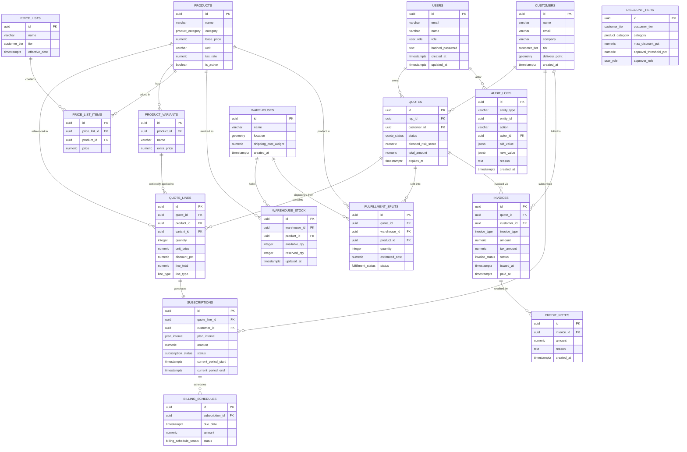

# Database Schema Specification — DealFlow360

> **Version:** 1.0.0  
> **Last Updated:** 2026-09-05  
> **Owner:** Platform Engineering  
> **Status:** Approved

---

## Table of Contents

1. [Database Strategy & Topology](#1-database-strategy--topology)
2. [Schema Organization](#2-schema-organization)
3. [Drizzle ORM Table Definitions](#3-drizzle-orm-table-definitions)
   - 3.1 [Sales Schema](#31-sales-schema)
   - 3.2 [Fulfillment Schema](#32-fulfillment-schema)
   - 3.3 [Billing Schema](#33-billing-schema)
   - 3.4 [Analytics Schema](#34-analytics-schema)
4. [PostGIS Spatial Setup](#4-postgis-spatial-setup)
5. [TimescaleDB Hypertables & Continuous Aggregates](#5-timescaledb-hypertables--continuous-aggregates)
6. [Indexes & Constraints](#6-indexes--constraints)
7. [Zod Data Contracts](#7-zod-data-contracts)
8. [Entity Relationship Overview](#8-entity-relationship-overview)

---

## 1. Database Strategy & Topology

### 1.1 Core Decisions

| Concern | Decision | Rationale |
|---|---|---|
| Database engine | PostgreSQL 16 | ACID compliance, extension ecosystem, JSONB support |
| Isolation model | Schema-level (single instance) | Shared connection pool, single migration surface, cross-schema FK possible |
| ORM | Drizzle ORM (TypeScript) | Type-safe, zero-runtime-overhead, SQL-first philosophy |
| Spatial data | PostGIS 3.4 extension | Native geometry types for warehouse/customer geo queries |
| Time-series | TimescaleDB 2.x extension | Automatic partitioning, continuous aggregates, compression |
| Runtime validation | Zod + `drizzle-zod` | Single source of truth — DB schema drives Zod shapes |
| Migrations | Drizzle Kit | `drizzle-kit generate` + `drizzle-kit migrate` in CI |

### 1.2 Extension Requirements

```sql
-- Must be run once by a superuser before first migration
CREATE EXTENSION IF NOT EXISTS "uuid-ossp";
CREATE EXTENSION IF NOT EXISTS "pgcrypto";
CREATE EXTENSION IF NOT EXISTS "postgis";
CREATE EXTENSION IF NOT EXISTS "timescaledb" CASCADE;
```

### 1.3 Schema Provisioning

```sql
CREATE SCHEMA IF NOT EXISTS sales;
CREATE SCHEMA IF NOT EXISTS billing;
CREATE SCHEMA IF NOT EXISTS fulfillment;
CREATE SCHEMA IF NOT EXISTS analytics;
CREATE SCHEMA IF NOT EXISTS portal;
```

### 1.4 Drizzle Config

```typescript
// drizzle.config.ts
import { defineConfig } from "drizzle-kit";

export default defineConfig({
  dialect: "postgresql",
  schema: "./src/db/schema/index.ts",
  out: "./drizzle/migrations",
  dbCredentials: {
    url: process.env.DATABASE_URL!,
  },
  schemaFilter: ["sales", "billing", "fulfillment", "analytics", "portal"],
  verbose: true,
  strict: true,
});
```

---

## 2. Schema Organization

### 2.1 Domain → Schema → Table Map

| Domain Schema | Tables | Purpose |
|---|---|---|
| `sales` | `users`, `customers`, `products`, `product_variants`, `price_lists`, `price_list_items`, `discount_tiers`, `quotes`, `quote_lines`, `audit_logs` | Core CRM entities — contacts, catalog, pricing, deal lifecycle |
| `billing` | `subscriptions`, `billing_schedules`, `invoices`, `credit_notes` | Revenue recognition, subscription lifecycle, invoicing |
| `fulfillment` | `warehouses`, `warehouse_stock`, `fulfillment_splits` | Physical inventory, warehouse geo-routing, shipment planning |
| `analytics` | `price_history`, `quote_events`, `rep_discount_tracking`, `deal_health_metrics` | TimescaleDB hypertables for all time-series operational telemetry |
| `portal` | *(reserved — customer self-service portal, scoped for v2)* | Customer-facing order/invoice portal entities |

### 2.2 Cross-Schema Reference Policy

> [!IMPORTANT]
> PostgreSQL foreign keys **across schemas** are fully supported but must be declared explicitly. Drizzle ORM handles this via table reference in FK definitions. All cross-schema FKs must be documented here to prevent circular dependency issues during migrations.

| FK Source | References | Notes |
|---|---|---|
| `billing.subscriptions.quote_line_id` | `sales.quote_lines.id` | Subscription tied to a recurring quote line |
| `billing.subscriptions.customer_id` | `sales.customers.id` | Billing entity linked to CRM customer |
| `billing.invoices.quote_id` | `sales.quotes.id` | Invoice generated from confirmed quote |
| `billing.invoices.customer_id` | `sales.customers.id` | Denormalized for billing isolation |
| `fulfillment.warehouse_stock.product_id` | `sales.products.id` | Inventory for CRM products |
| `fulfillment.fulfillment_splits.quote_id` | `sales.quotes.id` | Split fulfillment from confirmed quote |
| `fulfillment.fulfillment_splits.product_id` | `sales.products.id` | Product dispatched from warehouse |
| `analytics.*` | *(no FK constraints — append-only event log)* | Analytics tables reference IDs by value only for performance |

---

## 3. Drizzle ORM Table Definitions

> [!NOTE]
> All table definitions live under `src/db/schema/`. Each file exports its tables and inferred TypeScript types. The barrel `src/db/schema/index.ts` re-exports everything for Drizzle Kit discovery.

### 3.1 Sales Schema

```typescript
// src/db/schema/sales.ts
import {
  pgSchema,
  pgEnum,
  uuid,
  text,
  varchar,
  numeric,
  boolean,
  timestamp,
  jsonb,
  integer,
  index,
  uniqueIndex,
} from "drizzle-orm/pg-core";
import { geometry } from "drizzle-orm/pg-core"; // PostGIS geometry column helper
import { sql } from "drizzle-orm";

// ─── Schema namespace ────────────────────────────────────────────────────────
export const salesSchema = pgSchema("sales");

// ─── Enums ───────────────────────────────────────────────────────────────────
export const userRoleEnum = pgEnum("user_role", [
  "admin",
  "sales_rep",
  "sales_manager",
  "finance",
]);

export const customerTierEnum = pgEnum("customer_tier", [
  "bronze",
  "silver",
  "gold",
]);

export const productCategoryEnum = pgEnum("product_category", [
  "hardware",
  "services",
  "subscription",
]);

export const quoteStatusEnum = pgEnum("quote_status", [
  "draft",
  "pending_approval",
  "sent",
  "under_negotiation",
  "confirmed",
  "fulfilled",
]);

export const lineTypeEnum = pgEnum("line_type", ["one_time", "recurring"]);

// ─── users ───────────────────────────────────────────────────────────────────
export const users = salesSchema.table(
  "users",
  {
    id: uuid("id")
      .primaryKey()
      .default(sql`gen_random_uuid()`),
    email: varchar("email", { length: 320 }).notNull().unique(),
    name: varchar("name", { length: 255 }).notNull(),
    role: userRoleEnum("role").notNull().default("sales_rep"),
    hashedPassword: text("hashed_password").notNull(),
    createdAt: timestamp("created_at", { withTimezone: true })
      .notNull()
      .default(sql`now()`),
    updatedAt: timestamp("updated_at", { withTimezone: true })
      .notNull()
      .default(sql`now()`),
  },
  (table) => ({
    emailIdx: uniqueIndex("users_email_idx").on(table.email),
    roleIdx: index("users_role_idx").on(table.role),
  })
);

export type User = typeof users.$inferSelect;
export type NewUser = typeof users.$inferInsert;

// ─── customers ───────────────────────────────────────────────────────────────
export const customers = salesSchema.table(
  "customers",
  {
    id: uuid("id")
      .primaryKey()
      .default(sql`gen_random_uuid()`),
    name: varchar("name", { length: 255 }).notNull(),
    email: varchar("email", { length: 320 }).notNull().unique(),
    company: varchar("company", { length: 255 }).notNull(),
    tier: customerTierEnum("tier").notNull().default("bronze"),
    // PostGIS GEOMETRY(Point, 4326) — WGS84 lon/lat delivery point
    deliveryPoint: geometry("delivery_point", {
      type: "point",
      srid: 4326,
      mode: "xy",
    }),
    createdAt: timestamp("created_at", { withTimezone: true })
      .notNull()
      .default(sql`now()`),
  },
  (table) => ({
    emailIdx: uniqueIndex("customers_email_idx").on(table.email),
    tierIdx: index("customers_tier_idx").on(table.tier),
    // Spatial GIST index applied via raw SQL post-migration (see §4.2)
  })
);

export type Customer = typeof customers.$inferSelect;
export type NewCustomer = typeof customers.$inferInsert;

// ─── products ────────────────────────────────────────────────────────────────
export const products = salesSchema.table(
  "products",
  {
    id: uuid("id")
      .primaryKey()
      .default(sql`gen_random_uuid()`),
    name: varchar("name", { length: 255 }).notNull(),
    category: productCategoryEnum("category").notNull(),
    basePrice: numeric("base_price", { precision: 12, scale: 2 }).notNull(),
    unit: varchar("unit", { length: 50 }).notNull(), // e.g. "each", "seat/mo", "kg"
    taxRate: numeric("tax_rate", { precision: 5, scale: 4 })
      .notNull()
      .default("0.0000"), // e.g. 0.1800 = 18%
    description: text("description"),
    isActive: boolean("is_active").notNull().default(true),
  },
  (table) => ({
    categoryIdx: index("products_category_idx").on(table.category),
    activeIdx: index("products_active_idx").on(table.isActive),
    // GIN trigram index for product name search — requires pg_trgm extension
    nameTrgmIdx: index("products_name_trgm_idx").using(
      "gin",
      sql`name gin_trgm_ops`
    ),
  })
);

export type Product = typeof products.$inferSelect;
export type NewProduct = typeof products.$inferInsert;

// ─── product_variants ────────────────────────────────────────────────────────
export const productVariants = salesSchema.table(
  "product_variants",
  {
    id: uuid("id")
      .primaryKey()
      .default(sql`gen_random_uuid()`),
    productId: uuid("product_id")
      .notNull()
      .references(() => products.id, { onDelete: "cascade" }),
    name: varchar("name", { length: 255 }).notNull(),
    extraPrice: numeric("extra_price", { precision: 12, scale: 2 })
      .notNull()
      .default("0.00"),
  },
  (table) => ({
    productIdx: index("product_variants_product_idx").on(table.productId),
  })
);

export type ProductVariant = typeof productVariants.$inferSelect;
export type NewProductVariant = typeof productVariants.$inferInsert;

// ─── price_lists ─────────────────────────────────────────────────────────────
export const priceLists = salesSchema.table(
  "price_lists",
  {
    id: uuid("id")
      .primaryKey()
      .default(sql`gen_random_uuid()`),
    name: varchar("name", { length: 255 }).notNull(),
    tier: customerTierEnum("tier").notNull(),
    effectiveDate: timestamp("effective_date", { withTimezone: true }).notNull(),
  },
  (table) => ({
    tierEffectiveIdx: index("price_lists_tier_date_idx").on(
      table.tier,
      table.effectiveDate
    ),
  })
);

export type PriceList = typeof priceLists.$inferSelect;
export type NewPriceList = typeof priceLists.$inferInsert;

// ─── price_list_items ────────────────────────────────────────────────────────
export const priceListItems = salesSchema.table(
  "price_list_items",
  {
    id: uuid("id")
      .primaryKey()
      .default(sql`gen_random_uuid()`),
    priceListId: uuid("price_list_id")
      .notNull()
      .references(() => priceLists.id, { onDelete: "cascade" }),
    productId: uuid("product_id")
      .notNull()
      .references(() => products.id, { onDelete: "restrict" }),
    price: numeric("price", { precision: 12, scale: 2 }).notNull(),
  },
  (table) => ({
    priceListProductUnique: uniqueIndex("price_list_items_uq").on(
      table.priceListId,
      table.productId
    ),
    productIdx: index("price_list_items_product_idx").on(table.productId),
  })
);

export type PriceListItem = typeof priceListItems.$inferSelect;
export type NewPriceListItem = typeof priceListItems.$inferInsert;

// ─── discount_tiers ──────────────────────────────────────────────────────────
/**
 * Defines the maximum discount a rep may apply per customer tier × product
 * category combination, and the threshold at which manager approval is
 * required. approverRole specifies the minimum role that can approve a
 * quote exceeding approval_threshold_pct.
 */
export const discountTiers = salesSchema.table(
  "discount_tiers",
  {
    id: uuid("id")
      .primaryKey()
      .default(sql`gen_random_uuid()`),
    customerTier: customerTierEnum("customer_tier").notNull(),
    category: productCategoryEnum("category").notNull(),
    maxDiscountPct: numeric("max_discount_pct", {
      precision: 5,
      scale: 2,
    }).notNull(), // e.g. 25.00 = 25%
    approvalThresholdPct: numeric("approval_threshold_pct", {
      precision: 5,
      scale: 2,
    }).notNull(), // discount % at which approval is triggered
    approverRole: userRoleEnum("approver_role").notNull(),
  },
  (table) => ({
    tierCategoryUnique: uniqueIndex("discount_tiers_tier_cat_uq").on(
      table.customerTier,
      table.category
    ),
  })
);

export type DiscountTier = typeof discountTiers.$inferSelect;
export type NewDiscountTier = typeof discountTiers.$inferInsert;

// ─── quotes ──────────────────────────────────────────────────────────────────
export const quotes = salesSchema.table(
  "quotes",
  {
    id: uuid("id")
      .primaryKey()
      .default(sql`gen_random_uuid()`),
    repId: uuid("rep_id")
      .notNull()
      .references(() => users.id, { onDelete: "restrict" }),
    customerId: uuid("customer_id")
      .notNull()
      .references(() => customers.id, { onDelete: "restrict" }),
    status: quoteStatusEnum("status").notNull().default("draft"),
    blendedRiskScore: numeric("blended_risk_score", {
      precision: 5,
      scale: 4,
    }), // 0.0000 – 1.0000; computed by the risk engine
    totalAmount: numeric("total_amount", { precision: 14, scale: 2 })
      .notNull()
      .default("0.00"),
    createdAt: timestamp("created_at", { withTimezone: true })
      .notNull()
      .default(sql`now()`),
    updatedAt: timestamp("updated_at", { withTimezone: true })
      .notNull()
      .default(sql`now()`),
    expiresAt: timestamp("expires_at", { withTimezone: true }),
  },
  (table) => ({
    repIdx: index("quotes_rep_idx").on(table.repId),
    customerIdx: index("quotes_customer_idx").on(table.customerId),
    statusIdx: index("quotes_status_idx").on(table.status),
    // Partial index for active (non-terminal) quotes — speeds rep dashboard queries
    activeQuotesIdx: index("quotes_active_idx")
      .on(table.repId, table.status)
      .where(sql`status NOT IN ('fulfilled', 'confirmed')`),
    expiresAtIdx: index("quotes_expires_at_idx").on(table.expiresAt),
  })
);

export type Quote = typeof quotes.$inferSelect;
export type NewQuote = typeof quotes.$inferInsert;

// ─── quote_lines ─────────────────────────────────────────────────────────────
export const quoteLines = salesSchema.table(
  "quote_lines",
  {
    id: uuid("id")
      .primaryKey()
      .default(sql`gen_random_uuid()`),
    quoteId: uuid("quote_id")
      .notNull()
      .references(() => quotes.id, { onDelete: "cascade" }),
    productId: uuid("product_id")
      .notNull()
      .references(() => products.id, { onDelete: "restrict" }),
    variantId: uuid("variant_id").references(() => productVariants.id, {
      onDelete: "set null",
    }),
    quantity: integer("quantity").notNull(),
    unitPrice: numeric("unit_price", { precision: 12, scale: 2 }).notNull(),
    discountPct: numeric("discount_pct", { precision: 5, scale: 2 })
      .notNull()
      .default("0.00"),
    // lineTotal is pre-computed and stored: qty * unit_price * (1 - discount_pct/100)
    lineTotal: numeric("line_total", { precision: 14, scale: 2 }).notNull(),
    lineType: lineTypeEnum("line_type").notNull().default("one_time"),
  },
  (table) => ({
    quoteIdx: index("quote_lines_quote_idx").on(table.quoteId),
    productIdx: index("quote_lines_product_idx").on(table.productId),
    quantityCheck: sql`CONSTRAINT quote_lines_qty_check CHECK (quantity > 0)`,
    discountCheck: sql`CONSTRAINT quote_lines_discount_check CHECK (discount_pct BETWEEN 0 AND 100)`,
  })
);

export type QuoteLine = typeof quoteLines.$inferSelect;
export type NewQuoteLine = typeof quoteLines.$inferInsert;

// ─── audit_logs ──────────────────────────────────────────────────────────────
/**
 * Immutable append-only log. No UPDATE or DELETE should ever be issued against
 * this table. Enforced at application layer + row-level security policy.
 */
export const auditLogs = salesSchema.table(
  "audit_logs",
  {
    id: uuid("id")
      .primaryKey()
      .default(sql`gen_random_uuid()`),
    entityType: varchar("entity_type", { length: 100 }).notNull(), // e.g. "quote", "quote_line"
    entityId: uuid("entity_id").notNull(),
    action: varchar("action", { length: 50 }).notNull(), // e.g. "create", "update", "status_change"
    actorId: uuid("actor_id")
      .notNull()
      .references(() => users.id, { onDelete: "restrict" }),
    oldValue: jsonb("old_value"), // null on create
    newValue: jsonb("new_value"), // null on delete
    reason: text("reason"), // mandatory for status_change actions (enforced in app + Zod)
    createdAt: timestamp("created_at", { withTimezone: true })
      .notNull()
      .default(sql`now()`),
  },
  (table) => ({
    entityIdx: index("audit_logs_entity_idx").on(
      table.entityType,
      table.entityId
    ),
    actorIdx: index("audit_logs_actor_idx").on(table.actorId),
    createdAtIdx: index("audit_logs_created_at_idx").on(table.createdAt),
  })
);

export type AuditLog = typeof auditLogs.$inferSelect;
export type NewAuditLog = typeof auditLogs.$inferInsert;
```

---

### 3.2 Fulfillment Schema

```typescript
// src/db/schema/fulfillment.ts
import {
  pgSchema,
  uuid,
  varchar,
  numeric,
  integer,
  timestamp,
  pgEnum,
  index,
  uniqueIndex,
} from "drizzle-orm/pg-core";
import { geometry } from "drizzle-orm/pg-core";
import { sql } from "drizzle-orm";
import { quotes, products } from "./sales";

// ─── Schema namespace ────────────────────────────────────────────────────────
export const fulfillmentSchema = pgSchema("fulfillment");

// ─── Enums ───────────────────────────────────────────────────────────────────
export const fulfillmentStatusEnum = pgEnum("fulfillment_status", [
  "planned",
  "confirmed",
  "shipped",
  "delivered",
  "cancelled",
]);

// ─── warehouses ──────────────────────────────────────────────────────────────
export const warehouses = fulfillmentSchema.table(
  "warehouses",
  {
    id: uuid("id")
      .primaryKey()
      .default(sql`gen_random_uuid()`),
    name: varchar("name", { length: 255 }).notNull(),
    // PostGIS GEOMETRY(Point, 4326) — warehouse geographic centroid
    location: geometry("location", {
      type: "point",
      srid: 4326,
      mode: "xy",
    }).notNull(),
    shippingCostWeight: numeric("shipping_cost_weight", {
      precision: 10,
      scale: 4,
    }).notNull(), // cost per unit weight (e.g. USD/kg)
    createdAt: timestamp("created_at", { withTimezone: true })
      .notNull()
      .default(sql`now()`),
  },
  (table) => ({
    nameIdx: uniqueIndex("warehouses_name_idx").on(table.name),
    // GIST spatial index applied via raw SQL post-migration (see §4.2)
  })
);

export type Warehouse = typeof warehouses.$inferSelect;
export type NewWarehouse = typeof warehouses.$inferInsert;

// ─── warehouse_stock ─────────────────────────────────────────────────────────
export const warehouseStock = fulfillmentSchema.table(
  "warehouse_stock",
  {
    id: uuid("id")
      .primaryKey()
      .default(sql`gen_random_uuid()`),
    warehouseId: uuid("warehouse_id")
      .notNull()
      .references(() => warehouses.id, { onDelete: "cascade" }),
    productId: uuid("product_id")
      .notNull()
      .references(() => products.id, { onDelete: "restrict" }),
    availableQty: integer("available_qty").notNull().default(0),
    reservedQty: integer("reserved_qty").notNull().default(0),
    updatedAt: timestamp("updated_at", { withTimezone: true })
      .notNull()
      .default(sql`now()`),
  },
  (table) => ({
    warehouseProductUnique: uniqueIndex("warehouse_stock_wh_prod_uq").on(
      table.warehouseId,
      table.productId
    ),
    productIdx: index("warehouse_stock_product_idx").on(table.productId),
    availableCheck:
      sql`CONSTRAINT warehouse_stock_available_check CHECK (available_qty >= 0)`,
    reservedCheck:
      sql`CONSTRAINT warehouse_stock_reserved_check CHECK (reserved_qty >= 0)`,
    reservedLeAvailableCheck:
      sql`CONSTRAINT warehouse_stock_reserved_le_available CHECK (reserved_qty <= available_qty)`,
  })
);

export type WarehouseStock = typeof warehouseStock.$inferSelect;
export type NewWarehouseStock = typeof warehouseStock.$inferInsert;

// ─── fulfillment_splits ──────────────────────────────────────────────────────
/**
 * A confirmed quote may be split across multiple warehouses. Each row
 * represents one warehouse's share of one product line in a quote.
 */
export const fulfillmentSplits = fulfillmentSchema.table(
  "fulfillment_splits",
  {
    id: uuid("id")
      .primaryKey()
      .default(sql`gen_random_uuid()`),
    quoteId: uuid("quote_id")
      .notNull()
      .references(() => quotes.id, { onDelete: "restrict" }),
    warehouseId: uuid("warehouse_id")
      .notNull()
      .references(() => warehouses.id, { onDelete: "restrict" }),
    productId: uuid("product_id")
      .notNull()
      .references(() => products.id, { onDelete: "restrict" }),
    quantity: integer("quantity").notNull(),
    estimatedCost: numeric("estimated_cost", {
      precision: 14,
      scale: 2,
    }).notNull(),
    status: fulfillmentStatusEnum("status").notNull().default("planned"),
  },
  (table) => ({
    quoteIdx: index("fulfillment_splits_quote_idx").on(table.quoteId),
    warehouseIdx: index("fulfillment_splits_warehouse_idx").on(
      table.warehouseId
    ),
    statusIdx: index("fulfillment_splits_status_idx").on(table.status),
    quantityCheck:
      sql`CONSTRAINT fulfillment_splits_qty_check CHECK (quantity > 0)`,
  })
);

export type FulfillmentSplit = typeof fulfillmentSplits.$inferSelect;
export type NewFulfillmentSplit = typeof fulfillmentSplits.$inferInsert;
```

---

### 3.3 Billing Schema

```typescript
// src/db/schema/billing.ts
import {
  pgSchema,
  uuid,
  numeric,
  timestamp,
  pgEnum,
  text,
  index,
} from "drizzle-orm/pg-core";
import { sql } from "drizzle-orm";
import { quoteLines, quotes, customers } from "./sales";

// ─── Schema namespace ────────────────────────────────────────────────────────
export const billingSchema = pgSchema("billing");

// ─── Enums ───────────────────────────────────────────────────────────────────
export const planIntervalEnum = pgEnum("plan_interval", [
  "monthly",
  "quarterly",
  "yearly",
]);

export const subscriptionStatusEnum = pgEnum("subscription_status", [
  "active",
  "cancelled",
  "paused",
]);

export const billingScheduleStatusEnum = pgEnum("billing_schedule_status", [
  "pending",
  "paid",
  "failed",
]);

export const invoiceTypeEnum = pgEnum("invoice_type", [
  "one_time",
  "recurring",
]);

export const invoiceStatusEnum = pgEnum("invoice_status", [
  "draft",
  "sent",
  "paid",
  "voided",
]);

// ─── subscriptions ───────────────────────────────────────────────────────────
export const subscriptions = billingSchema.table(
  "subscriptions",
  {
    id: uuid("id")
      .primaryKey()
      .default(sql`gen_random_uuid()`),
    quoteLineId: uuid("quote_line_id")
      .notNull()
      .unique() // 1-to-1: one subscription per recurring quote line
      .references(() => quoteLines.id, { onDelete: "restrict" }),
    customerId: uuid("customer_id")
      .notNull()
      .references(() => customers.id, { onDelete: "restrict" }),
    planInterval: planIntervalEnum("plan_interval").notNull(),
    amount: numeric("amount", { precision: 12, scale: 2 }).notNull(),
    status: subscriptionStatusEnum("status").notNull().default("active"),
    currentPeriodStart: timestamp("current_period_start", {
      withTimezone: true,
    }).notNull(),
    currentPeriodEnd: timestamp("current_period_end", {
      withTimezone: true,
    }).notNull(),
    createdAt: timestamp("created_at", { withTimezone: true })
      .notNull()
      .default(sql`now()`),
  },
  (table) => ({
    customerIdx: index("subscriptions_customer_idx").on(table.customerId),
    statusIdx: index("subscriptions_status_idx").on(table.status),
    periodEndIdx: index("subscriptions_period_end_idx").on(
      table.currentPeriodEnd
    ),
    // Partial index: active subs approaching renewal — used by billing renewal cron
    activeIdx: index("subscriptions_active_idx")
      .on(table.customerId, table.currentPeriodEnd)
      .where(sql`status = 'active'`),
  })
);

export type Subscription = typeof subscriptions.$inferSelect;
export type NewSubscription = typeof subscriptions.$inferInsert;

// ─── billing_schedules ───────────────────────────────────────────────────────
export const billingSchedules = billingSchema.table(
  "billing_schedules",
  {
    id: uuid("id")
      .primaryKey()
      .default(sql`gen_random_uuid()`),
    subscriptionId: uuid("subscription_id")
      .notNull()
      .references(() => subscriptions.id, { onDelete: "cascade" }),
    dueDate: timestamp("due_date", { withTimezone: true }).notNull(),
    amount: numeric("amount", { precision: 12, scale: 2 }).notNull(),
    status: billingScheduleStatusEnum("status").notNull().default("pending"),
  },
  (table) => ({
    subscriptionIdx: index("billing_schedules_sub_idx").on(
      table.subscriptionId
    ),
    dueDateIdx: index("billing_schedules_due_date_idx").on(table.dueDate),
    statusIdx: index("billing_schedules_status_idx").on(table.status),
    // Partial index for collection runs — only pending/failed items
    pendingIdx: index("billing_schedules_pending_idx")
      .on(table.dueDate)
      .where(sql`status IN ('pending', 'failed')`),
  })
);

export type BillingSchedule = typeof billingSchedules.$inferSelect;
export type NewBillingSchedule = typeof billingSchedules.$inferInsert;

// ─── invoices ────────────────────────────────────────────────────────────────
export const invoices = billingSchema.table(
  "invoices",
  {
    id: uuid("id")
      .primaryKey()
      .default(sql`gen_random_uuid()`),
    quoteId: uuid("quote_id")
      .notNull()
      .references(() => quotes.id, { onDelete: "restrict" }),
    customerId: uuid("customer_id")
      .notNull()
      .references(() => customers.id, { onDelete: "restrict" }),
    invoiceType: invoiceTypeEnum("invoice_type").notNull(),
    amount: numeric("amount", { precision: 14, scale: 2 }).notNull(),
    taxAmount: numeric("tax_amount", { precision: 12, scale: 2 })
      .notNull()
      .default("0.00"),
    status: invoiceStatusEnum("status").notNull().default("draft"),
    issuedAt: timestamp("issued_at", { withTimezone: true }),
    paidAt: timestamp("paid_at", { withTimezone: true }),
  },
  (table) => ({
    quoteIdx: index("invoices_quote_idx").on(table.quoteId),
    customerIdx: index("invoices_customer_idx").on(table.customerId),
    statusIdx: index("invoices_status_idx").on(table.status),
    issuedAtIdx: index("invoices_issued_at_idx").on(table.issuedAt),
    // Partial index for accounts receivable aging — non-terminal invoices only
    unpaidIdx: index("invoices_unpaid_idx")
      .on(table.customerId, table.issuedAt)
      .where(sql`status NOT IN ('paid', 'voided')`),
  })
);

export type Invoice = typeof invoices.$inferSelect;
export type NewInvoice = typeof invoices.$inferInsert;

// ─── credit_notes ────────────────────────────────────────────────────────────
export const creditNotes = billingSchema.table(
  "credit_notes",
  {
    id: uuid("id")
      .primaryKey()
      .default(sql`gen_random_uuid()`),
    invoiceId: uuid("invoice_id")
      .notNull()
      .references(() => invoices.id, { onDelete: "restrict" }),
    amount: numeric("amount", { precision: 14, scale: 2 }).notNull(),
    reason: text("reason").notNull(),
    createdAt: timestamp("created_at", { withTimezone: true })
      .notNull()
      .default(sql`now()`),
  },
  (table) => ({
    invoiceIdx: index("credit_notes_invoice_idx").on(table.invoiceId),
    amountCheck:
      sql`CONSTRAINT credit_notes_amount_check CHECK (amount > 0)`,
  })
);

export type CreditNote = typeof creditNotes.$inferSelect;
export type NewCreditNote = typeof creditNotes.$inferInsert;
```

---

### 3.4 Analytics Schema

> [!NOTE]
> Analytics tables are **append-only TimescaleDB hypertables**. They carry no foreign key constraints intentionally — referential integrity is guaranteed at the application write path. This avoids FK overhead on high-frequency event ingestion.

```typescript
// src/db/schema/analytics.ts
import {
  pgSchema,
  uuid,
  varchar,
  numeric,
  timestamp,
  jsonb,
  index,
} from "drizzle-orm/pg-core";
import { sql } from "drizzle-orm";

// ─── Schema namespace ────────────────────────────────────────────────────────
export const analyticsSchema = pgSchema("analytics");

// ─── price_history ───────────────────────────────────────────────────────────
/**
 * Hypertable partitioned by `time` (chunk_time_interval = 7 days).
 * Records every price change event for a product on a price list.
 */
export const priceHistory = analyticsSchema.table(
  "price_history",
  {
    time: timestamp("time", { withTimezone: true })
      .notNull()
      .default(sql`now()`),
    productId: uuid("product_id").notNull(),
    priceListId: uuid("price_list_id").notNull(),
    price: numeric("price", { precision: 12, scale: 2 }).notNull(),
  },
  (table) => ({
    timeProductIdx: index("price_history_time_product_idx").on(
      table.time,
      table.productId
    ),
    priceListIdx: index("price_history_price_list_idx").on(table.priceListId),
  })
);

export type PriceHistoryRow = typeof priceHistory.$inferSelect;
export type NewPriceHistoryRow = typeof priceHistory.$inferInsert;

// ─── quote_events ────────────────────────────────────────────────────────────
/**
 * Hypertable partitioned by `time` (chunk_time_interval = 1 day).
 * One row per state transition or notable event on a quote.
 * event_type examples: "created", "status_changed_confirmed", "viewed", "exported"
 */
export const quoteEvents = analyticsSchema.table(
  "quote_events",
  {
    time: timestamp("time", { withTimezone: true })
      .notNull()
      .default(sql`now()`),
    quoteId: uuid("quote_id").notNull(),
    eventType: varchar("event_type", { length: 100 }).notNull(),
    repId: uuid("rep_id").notNull(),
    metadata: jsonb("metadata").default(sql`'{}'::jsonb`),
  },
  (table) => ({
    timeQuoteIdx: index("quote_events_time_quote_idx").on(
      table.time,
      table.quoteId
    ),
    repIdx: index("quote_events_rep_idx").on(table.repId, table.time),
    eventTypeIdx: index("quote_events_event_type_idx").on(table.eventType),
  })
);

export type QuoteEvent = typeof quoteEvents.$inferSelect;
export type NewQuoteEvent = typeof quoteEvents.$inferInsert;

// ─── rep_discount_tracking ───────────────────────────────────────────────────
/**
 * Hypertable partitioned by `time` (chunk_time_interval = 7 days).
 * Captures each discount application for rollup into rep-level analytics.
 */
export const repDiscountTracking = analyticsSchema.table(
  "rep_discount_tracking",
  {
    time: timestamp("time", { withTimezone: true })
      .notNull()
      .default(sql`now()`),
    repId: uuid("rep_id").notNull(),
    quoteId: uuid("quote_id").notNull(),
    category: varchar("category", { length: 50 }).notNull(),
    appliedDiscountPct: numeric("applied_discount_pct", {
      precision: 5,
      scale: 2,
    }).notNull(),
    tierCeilingPct: numeric("tier_ceiling_pct", {
      precision: 5,
      scale: 2,
    }).notNull(),
  },
  (table) => ({
    timeRepIdx: index("rep_discount_tracking_time_rep_idx").on(
      table.time,
      table.repId
    ),
    categoryIdx: index("rep_discount_tracking_category_idx").on(table.category),
  })
);

export type RepDiscountRow = typeof repDiscountTracking.$inferSelect;
export type NewRepDiscountRow = typeof repDiscountTracking.$inferInsert;

// ─── deal_health_metrics ─────────────────────────────────────────────────────
/**
 * Hypertable partitioned by `time` (chunk_time_interval = 1 day).
 * Periodic snapshot (e.g. every hour via cron) of each active deal's health.
 * Drives the deal health dashboard and stall-detection continuous aggregate.
 */
export const dealHealthMetrics = analyticsSchema.table(
  "deal_health_metrics",
  {
    time: timestamp("time", { withTimezone: true })
      .notNull()
      .default(sql`now()`),
    quoteId: uuid("quote_id").notNull(),
    status: varchar("status", { length: 50 }).notNull(),
    daysSinceUpdate: numeric("days_since_update", {
      precision: 6,
      scale: 2,
    }).notNull(),
    blendedRiskScore: numeric("blended_risk_score", {
      precision: 5,
      scale: 4,
    }),
  },
  (table) => ({
    timeQuoteIdx: index("deal_health_metrics_time_quote_idx").on(
      table.time,
      table.quoteId
    ),
    riskScoreIdx: index("deal_health_metrics_risk_idx").on(
      table.blendedRiskScore
    ),
  })
);

export type DealHealthMetric = typeof dealHealthMetrics.$inferSelect;
export type NewDealHealthMetric = typeof dealHealthMetrics.$inferInsert;
```

### 3.5 Schema Barrel Export

```typescript
// src/db/schema/index.ts
export * from "./sales";
export * from "./fulfillment";
export * from "./billing";
export * from "./analytics";
```

---

## 4. PostGIS Spatial Setup

### 4.1 Extension & Schema Grant

```sql
-- 001_postgis_setup.sql
-- Run as superuser before Drizzle migrations

CREATE EXTENSION IF NOT EXISTS postgis SCHEMA public;
CREATE EXTENSION IF NOT EXISTS pg_trgm;  -- for GIN trigram product search

-- Allow application role to use PostGIS functions
GRANT USAGE ON SCHEMA public TO dealflow_app;
GRANT EXECUTE ON ALL FUNCTIONS IN SCHEMA public TO dealflow_app;
```

### 4.2 Spatial Indexes

> [!IMPORTANT]
> GIST spatial indexes **cannot** be expressed in Drizzle ORM's current column API. They must be applied as raw SQL in a migration file that runs after Drizzle's schema migration.

```sql
-- 002_spatial_indexes.sql

-- Warehouse location spatial index (GIST)
CREATE INDEX IF NOT EXISTS warehouses_location_gist_idx
    ON fulfillment.warehouses
    USING GIST (location);

-- Customer delivery point spatial index (GIST)
CREATE INDEX IF NOT EXISTS customers_delivery_point_gist_idx
    ON sales.customers
    USING GIST (delivery_point);
```

### 4.3 Warehouse Proximity Query — ST_DistanceSpheroid

The fulfillment engine uses `ST_DistanceSpheroid` for accurate geodesic distance calculations (metres) on the WGS84 spheroid, then ranks warehouses by a composite score of distance and shipping cost efficiency.

```sql
-- Find the top candidate warehouses to fulfil a product for a given customer.
-- :customer_id  UUID of the customer
-- :product_id   UUID of the product
-- :qty_required Integer quantity needed

WITH customer_point AS (
    SELECT delivery_point AS pt
    FROM   sales.customers
    WHERE  id = :customer_id
),
candidate_warehouses AS (
    SELECT
        w.id                                                        AS warehouse_id,
        w.name,
        w.shipping_cost_weight,
        ws.available_qty - ws.reserved_qty                         AS net_available,
        -- Geodesic distance in metres on the WGS84 spheroid
        ST_DistanceSpheroid(
            w.location,
            cp.pt,
            'SPHEROID["WGS 84", 6378137, 298.257223563]'
        )                                                           AS distance_m
    FROM   fulfillment.warehouses        w
    JOIN   fulfillment.warehouse_stock   ws ON ws.warehouse_id = w.id
    CROSS  JOIN customer_point           cp
    WHERE  ws.product_id   = :product_id
      AND  (ws.available_qty - ws.reserved_qty) >= :qty_required
)
SELECT
    warehouse_id,
    name,
    net_available,
    ROUND(distance_m / 1000.0, 2)                                  AS distance_km,
    -- Composite routing score: lower is better
    -- 60% weight on normalised distance (per 1000 km), 40% on cost×distance
    (0.6 * (distance_m / 1000000.0))
    + (0.4 * shipping_cost_weight * (distance_m / 1000.0))         AS routing_score
FROM   candidate_warehouses
ORDER  BY routing_score ASC
LIMIT  3;  -- Return top 3 candidates for split fulfilment consideration
```

---

## 5. TimescaleDB Hypertables & Continuous Aggregates

### 5.1 Hypertable Conversion

> [!IMPORTANT]
> `create_hypertable` must be called **after** Drizzle creates the base table but **before** any data is inserted. These SQL statements live in a dedicated post-migration hook script: `drizzle/post-migrate/001_timescaledb.sql`.

```sql
-- drizzle/post-migrate/001_timescaledb.sql

-- price_history: 7-day chunks (price changes are low-frequency)
SELECT create_hypertable(
    'analytics.price_history',
    'time',
    chunk_time_interval => INTERVAL '7 days',
    if_not_exists        => TRUE
);

-- quote_events: 1-day chunks (high write volume during business hours)
SELECT create_hypertable(
    'analytics.quote_events',
    'time',
    chunk_time_interval => INTERVAL '1 day',
    if_not_exists        => TRUE
);

-- rep_discount_tracking: 7-day chunks
SELECT create_hypertable(
    'analytics.rep_discount_tracking',
    'time',
    chunk_time_interval => INTERVAL '7 days',
    if_not_exists        => TRUE
);

-- deal_health_metrics: 1-day chunks (hourly snapshots)
SELECT create_hypertable(
    'analytics.deal_health_metrics',
    'time',
    chunk_time_interval => INTERVAL '1 day',
    if_not_exists        => TRUE
);

-- ─── Compression policies (cold chunks older than 30 days) ─────────────────

ALTER TABLE analytics.quote_events SET (
    timescaledb.compress,
    timescaledb.compress_segmentby = 'rep_id',
    timescaledb.compress_orderby   = 'time DESC'
);
SELECT add_compression_policy('analytics.quote_events', INTERVAL '30 days');

ALTER TABLE analytics.rep_discount_tracking SET (
    timescaledb.compress,
    timescaledb.compress_segmentby = 'rep_id',
    timescaledb.compress_orderby   = 'time DESC'
);
SELECT add_compression_policy('analytics.rep_discount_tracking', INTERVAL '30 days');

ALTER TABLE analytics.deal_health_metrics SET (
    timescaledb.compress,
    timescaledb.compress_segmentby = 'quote_id',
    timescaledb.compress_orderby   = 'time DESC'
);
SELECT add_compression_policy('analytics.deal_health_metrics', INTERVAL '30 days');
```

### 5.2 Continuous Aggregate — `rep_discount_avg_30d`

Rolling 30-day average discount per rep per product category. Refreshed every hour. Used on the rep performance dashboard and for discount-policy compliance alerts.

**Formula:**

$$\bar{d}_{rep,cat,t} = \frac{\displaystyle\sum_{i \,\in\, [t-30d,\; t]} \text{applied\_discount\_pct}_i}{\;N_{rep,cat}\;}$$

```sql
-- drizzle/post-migrate/002_continuous_aggregates.sql

CREATE MATERIALIZED VIEW analytics.rep_discount_avg_30d
WITH (timescaledb.continuous) AS
SELECT
    time_bucket('1 hour', time)                                     AS bucket,
    rep_id,
    category,
    AVG(applied_discount_pct)                                       AS avg_discount_pct,
    MAX(tier_ceiling_pct)                                           AS tier_ceiling_pct,
    COUNT(*)                                                        AS num_quotes,
    -- Headroom: avg unused ceiling available to the rep
    MAX(tier_ceiling_pct) - AVG(applied_discount_pct)              AS avg_headroom_pct
FROM   analytics.rep_discount_tracking
GROUP  BY
    time_bucket('1 hour', time),
    rep_id,
    category
WITH NO DATA;

-- Refresh policy: rebuild last 31 days every hour
SELECT add_continuous_aggregate_policy(
    'analytics.rep_discount_avg_30d',
    start_offset      => INTERVAL '31 days',
    end_offset        => INTERVAL '1 hour',
    schedule_interval => INTERVAL '1 hour'
);

-- ── Application query: rolling 30-day average for a specific rep ────────────
-- SELECT
--     rep_id,
--     category,
--     AVG(avg_discount_pct)   AS rolling_30d_avg,
--     MAX(tier_ceiling_pct)   AS ceiling,
--     SUM(num_quotes)         AS total_quotes
-- FROM   analytics.rep_discount_avg_30d
-- WHERE  bucket  >= now() - INTERVAL '30 days'
--   AND  rep_id   = :rep_id
-- GROUP  BY rep_id, category;
```

### 5.3 Continuous Aggregate — `quote_velocity_daily`

Daily counts of quotes created and confirmed per rep. Feeds the pipeline-velocity chart on the sales manager dashboard.

```sql
CREATE MATERIALIZED VIEW analytics.quote_velocity_daily
WITH (timescaledb.continuous) AS
SELECT
    time_bucket('1 day', time)                                           AS bucket,
    rep_id,
    COUNT(*) FILTER (WHERE event_type = 'created')                       AS quotes_created,
    COUNT(*) FILTER (WHERE event_type = 'status_changed_confirmed')      AS quotes_confirmed,
    COUNT(*) FILTER (WHERE event_type = 'status_changed_fulfilled')      AS quotes_fulfilled,
    -- Confirmation rate materialised per bucket for fast dashboard reads
    ROUND(
        100.0
        * COUNT(*) FILTER (WHERE event_type = 'status_changed_confirmed')
        / NULLIF(COUNT(*) FILTER (WHERE event_type = 'created'), 0),
        2
    )                                                                    AS confirmation_rate_pct
FROM   analytics.quote_events
GROUP  BY
    time_bucket('1 day', time),
    rep_id
WITH NO DATA;

SELECT add_continuous_aggregate_policy(
    'analytics.quote_velocity_daily',
    start_offset      => INTERVAL '90 days',
    end_offset        => INTERVAL '1 day',
    schedule_interval => INTERVAL '1 day'
);
```

### 5.4 Continuous Aggregate — `deal_stall_detection`

Identifies quotes that have had no update for more than 7 days and remain in a non-terminal status. Used by the rep nudge engine to trigger automated follow-up tasks.

```sql
CREATE MATERIALIZED VIEW analytics.deal_stall_detection
WITH (timescaledb.continuous) AS
SELECT
    time_bucket('1 hour', time)                                    AS bucket,
    quote_id,
    status,
    MAX(days_since_update)                                         AS max_days_since_update,
    MAX(blended_risk_score)                                        AS latest_risk_score,
    -- TRUE when the deal has been idle > 7 days in a non-terminal state
    BOOL_OR(
        days_since_update > 7
        AND status NOT IN ('fulfilled', 'confirmed')
    )                                                              AS is_stalled
FROM   analytics.deal_health_metrics
GROUP  BY
    time_bucket('1 hour', time),
    quote_id,
    status
WITH NO DATA;

SELECT add_continuous_aggregate_policy(
    'analytics.deal_stall_detection',
    start_offset      => INTERVAL '30 days',
    end_offset        => INTERVAL '1 hour',
    schedule_interval => INTERVAL '1 hour'
);

-- ── Application query: currently stalled deals (latest bucket per quote) ────
-- SELECT DISTINCT ON (quote_id)
--     quote_id,
--     status,
--     max_days_since_update,
--     latest_risk_score
-- FROM   analytics.deal_stall_detection
-- WHERE  bucket    >= now() - INTERVAL '1 hour'
--   AND  is_stalled = TRUE
-- ORDER  BY quote_id, bucket DESC;
```

---

## 6. Indexes & Constraints

### 6.1 Complete Index Inventory

| Schema | Table | Index Name | Columns | Type | Notes |
|---|---|---|---|---|---|
| `sales` | `users` | `users_email_idx` | `email` | B-tree UNIQUE | Login lookup |
| `sales` | `users` | `users_role_idx` | `role` | B-tree | Role-based dashboard filters |
| `sales` | `customers` | `customers_email_idx` | `email` | B-tree UNIQUE | Dedup guard |
| `sales` | `customers` | `customers_tier_idx` | `tier` | B-tree | Price list resolution |
| `sales` | `customers` | `customers_delivery_point_gist_idx` | `delivery_point` | GIST | Spatial proximity queries |
| `sales` | `products` | `products_category_idx` | `category` | B-tree | Catalog filtering |
| `sales` | `products` | `products_active_idx` | `is_active` | B-tree | Filter inactive products |
| `sales` | `products` | `products_name_trgm_idx` | `name` | GIN (trigram) | Full-text product search |
| `sales` | `product_variants` | `product_variants_product_idx` | `product_id` | B-tree | Variant lookup by product |
| `sales` | `price_lists` | `price_lists_tier_date_idx` | `tier, effective_date` | B-tree | Active price list resolution |
| `sales` | `price_list_items` | `price_list_items_uq` | `price_list_id, product_id` | B-tree UNIQUE | One price per product per list |
| `sales` | `price_list_items` | `price_list_items_product_idx` | `product_id` | B-tree | Reverse lookup |
| `sales` | `discount_tiers` | `discount_tiers_tier_cat_uq` | `customer_tier, category` | B-tree UNIQUE | One rule per tier × category |
| `sales` | `quotes` | `quotes_rep_idx` | `rep_id` | B-tree | Rep's quote list |
| `sales` | `quotes` | `quotes_customer_idx` | `customer_id` | B-tree | Customer's quote history |
| `sales` | `quotes` | `quotes_status_idx` | `status` | B-tree | Pipeline board queries |
| `sales` | `quotes` | `quotes_active_idx` | `rep_id, status` | Partial B-tree | WHERE status NOT IN ('fulfilled','confirmed') |
| `sales` | `quotes` | `quotes_expires_at_idx` | `expires_at` | B-tree | Expiry sweep cron |
| `sales` | `quote_lines` | `quote_lines_quote_idx` | `quote_id` | B-tree | Line item fetch |
| `sales` | `quote_lines` | `quote_lines_product_idx` | `product_id` | B-tree | Reverse usage lookup |
| `sales` | `audit_logs` | `audit_logs_entity_idx` | `entity_type, entity_id` | B-tree | Entity audit trail |
| `sales` | `audit_logs` | `audit_logs_actor_idx` | `actor_id` | B-tree | Actor activity report |
| `sales` | `audit_logs` | `audit_logs_created_at_idx` | `created_at` | B-tree | Time-range audit queries |
| `fulfillment` | `warehouses` | `warehouses_name_idx` | `name` | B-tree UNIQUE | Admin UI dedup |
| `fulfillment` | `warehouses` | `warehouses_location_gist_idx` | `location` | GIST | Spatial routing |
| `fulfillment` | `warehouse_stock` | `warehouse_stock_wh_prod_uq` | `warehouse_id, product_id` | B-tree UNIQUE | One stock record per pair |
| `fulfillment` | `warehouse_stock` | `warehouse_stock_product_idx` | `product_id` | B-tree | Cross-warehouse availability |
| `fulfillment` | `fulfillment_splits` | `fulfillment_splits_quote_idx` | `quote_id` | B-tree | All splits for a quote |
| `fulfillment` | `fulfillment_splits` | `fulfillment_splits_warehouse_idx` | `warehouse_id` | B-tree | Warehouse dispatch view |
| `fulfillment` | `fulfillment_splits` | `fulfillment_splits_status_idx` | `status` | B-tree | Status board |
| `billing` | `subscriptions` | `subscriptions_customer_idx` | `customer_id` | B-tree | Customer subscription list |
| `billing` | `subscriptions` | `subscriptions_status_idx` | `status` | B-tree | Active sub count |
| `billing` | `subscriptions` | `subscriptions_period_end_idx` | `current_period_end` | B-tree | Renewal sweep |
| `billing` | `subscriptions` | `subscriptions_active_idx` | `customer_id, current_period_end` | Partial B-tree | WHERE status = 'active' |
| `billing` | `billing_schedules` | `billing_schedules_sub_idx` | `subscription_id` | B-tree | Schedule by sub |
| `billing` | `billing_schedules` | `billing_schedules_due_date_idx` | `due_date` | B-tree | Billing cron sweep |
| `billing` | `billing_schedules` | `billing_schedules_status_idx` | `status` | B-tree | Status filter |
| `billing` | `billing_schedules` | `billing_schedules_pending_idx` | `due_date` | Partial B-tree | WHERE status IN ('pending','failed') |
| `billing` | `invoices` | `invoices_quote_idx` | `quote_id` | B-tree | Invoice by quote |
| `billing` | `invoices` | `invoices_customer_idx` | `customer_id` | B-tree | Customer statement |
| `billing` | `invoices` | `invoices_status_idx` | `status` | B-tree | AR status board |
| `billing` | `invoices` | `invoices_issued_at_idx` | `issued_at` | B-tree | Date-range reporting |
| `billing` | `invoices` | `invoices_unpaid_idx` | `customer_id, issued_at` | Partial B-tree | WHERE status NOT IN ('paid','voided') |
| `billing` | `credit_notes` | `credit_notes_invoice_idx` | `invoice_id` | B-tree | Credit notes per invoice |
| `analytics` | `quote_events` | `quote_events_time_quote_idx` | `time, quote_id` | B-tree | Timeline per quote |
| `analytics` | `quote_events` | `quote_events_rep_idx` | `rep_id, time` | B-tree | Rep event stream |
| `analytics` | `rep_discount_tracking` | `rep_discount_tracking_time_rep_idx` | `time, rep_id` | B-tree | TimescaleDB partition-aware |
| `analytics` | `deal_health_metrics` | `deal_health_metrics_risk_idx` | `blended_risk_score` | B-tree | High-risk deal filter |

### 6.2 CHECK Constraints Summary

| Table | Constraint Name | Expression |
|---|---|---|
| `sales.quote_lines` | `quote_lines_qty_check` | `quantity > 0` |
| `sales.quote_lines` | `quote_lines_discount_check` | `discount_pct BETWEEN 0 AND 100` |
| `fulfillment.warehouse_stock` | `warehouse_stock_available_check` | `available_qty >= 0` |
| `fulfillment.warehouse_stock` | `warehouse_stock_reserved_check` | `reserved_qty >= 0` |
| `fulfillment.warehouse_stock` | `warehouse_stock_reserved_le_available` | `reserved_qty <= available_qty` |
| `fulfillment.fulfillment_splits` | `fulfillment_splits_qty_check` | `quantity > 0` |
| `billing.credit_notes` | `credit_notes_amount_check` | `amount > 0` |

### 6.3 Row-Level Security Policies

```sql
-- sales.quotes: reps can only see their own quotes; managers and above see all
ALTER TABLE sales.quotes ENABLE ROW LEVEL SECURITY;

CREATE POLICY quotes_rep_isolation ON sales.quotes
    USING (
        rep_id = current_setting('app.current_user_id')::uuid
        OR current_setting('app.current_user_role') IN ('admin', 'sales_manager', 'finance')
    );

-- sales.audit_logs: immutable — only INSERT permitted for non-superusers
ALTER TABLE sales.audit_logs ENABLE ROW LEVEL SECURITY;

CREATE POLICY audit_logs_insert_only ON sales.audit_logs
    FOR INSERT
    WITH CHECK (TRUE);

-- No UPDATE/DELETE policy defined — absence means denied to all non-superusers
```

---

## 7. Zod Data Contracts

> [!NOTE]
> `drizzle-zod`'s `createInsertSchema` / `createSelectSchema` automatically infer the base Zod shape from the Drizzle table definition. Custom refinements are layered on top using `.extend()` and `.refine()`.

### 7.1 Setup

```typescript
// src/db/validation/index.ts
import { createInsertSchema, createSelectSchema } from "drizzle-zod";
import { z } from "zod";
import {
  quotes,
  quoteLines,
  auditLogs,
  customers,
  products,
} from "../schema/sales";
import { warehouses } from "../schema/fulfillment";
import { subscriptions, invoices, creditNotes } from "../schema/billing";
```

### 7.2 Insert Schemas

```typescript
// ─── insertQuoteSchema ────────────────────────────────────────────────────────
export const insertQuoteSchema = createInsertSchema(quotes, {
  repId: z.string().uuid({ message: "repId must be a valid UUID" }),
  customerId: z.string().uuid({ message: "customerId must be a valid UUID" }),
  blendedRiskScore: z
    .string()
    .regex(/^\d+(\.\d{1,4})?$/, "Must be numeric with up to 4 decimal places")
    .refine(
      (v) => parseFloat(v) >= 0 && parseFloat(v) <= 1,
      { message: "blendedRiskScore must be between 0.0000 and 1.0000" }
    )
    .optional(),
  totalAmount: z
    .string()
    .regex(/^\d+(\.\d{1,2})?$/, "Must be a valid monetary amount")
    .default("0.00"),
  expiresAt: z.coerce
    .date()
    .min(new Date(), { message: "expiresAt must be in the future" })
    .optional(),
}).omit({
  id: true,
  createdAt: true,
  updatedAt: true,
});

export type InsertQuote = z.infer<typeof insertQuoteSchema>;

// ─── insertQuoteLineSchema ────────────────────────────────────────────────────
export const insertQuoteLineSchema = createInsertSchema(quoteLines, {
  quoteId: z.string().uuid(),
  productId: z.string().uuid(),
  variantId: z.string().uuid().optional().nullable(),
  quantity: z
    .number()
    .int()
    .positive({ message: "quantity must be a positive integer" }),
  unitPrice: z
    .string()
    .regex(/^\d+(\.\d{1,2})?$/)
    .refine((v) => parseFloat(v) >= 0, { message: "unitPrice must be >= 0" }),
  discountPct: z
    .string()
    .regex(/^\d+(\.\d{1,2})?$/)
    .refine(
      (v) => parseFloat(v) >= 0 && parseFloat(v) <= 100,
      { message: "discountPct must be between 0 and 100" }
    )
    .default("0.00"),
  lineTotal: z
    .string()
    .regex(/^\d+(\.\d{1,2})?$/)
    .refine((v) => parseFloat(v) >= 0, { message: "lineTotal must be >= 0" }),
})
  .omit({ id: true })
  .refine(
    (data) => {
      // Cross-field: verify lineTotal = quantity × unitPrice × (1 − discountPct/100)
      const expected =
        data.quantity *
        parseFloat(data.unitPrice) *
        (1 - parseFloat(data.discountPct ?? "0") / 100);
      const actual = parseFloat(data.lineTotal);
      return Math.abs(expected - actual) < 0.01; // 1 cent tolerance for float arithmetic
    },
    {
      message:
        "lineTotal must equal quantity × unitPrice × (1 − discountPct/100)",
      path: ["lineTotal"],
    }
  );

export type InsertQuoteLine = z.infer<typeof insertQuoteLineSchema>;

// ─── insertWarehouseSchema ────────────────────────────────────────────────────
export const insertWarehouseSchema = createInsertSchema(warehouses, {
  name: z
    .string()
    .min(2, "Warehouse name must be at least 2 characters")
    .max(255),
  // Accept GeoJSON Point at API boundary; serialised to PostGIS geometry in the repository layer
  location: z
    .object({
      type: z.literal("Point"),
      coordinates: z
        .tuple([
          z
            .number()
            .min(-180)
            .max(180, "Longitude must be between -180 and 180"),
          z.number().min(-90).max(90, "Latitude must be between -90 and 90"),
        ])
        .describe("[longitude, latitude] in WGS84"),
    })
    .describe("GeoJSON Point (SRID 4326)"),
  shippingCostWeight: z
    .string()
    .regex(/^\d+(\.\d{1,4})?$/)
    .refine((v) => parseFloat(v) > 0, {
      message: "shippingCostWeight must be a positive number",
    }),
}).omit({ id: true, createdAt: true });

export type InsertWarehouse = z.infer<typeof insertWarehouseSchema>;

// ─── insertSubscriptionSchema ─────────────────────────────────────────────────
export const insertSubscriptionSchema = createInsertSchema(subscriptions, {
  quoteLineId: z.string().uuid(),
  customerId: z.string().uuid(),
  amount: z
    .string()
    .regex(/^\d+(\.\d{1,2})?$/)
    .refine((v) => parseFloat(v) > 0, { message: "amount must be positive" }),
  currentPeriodStart: z.coerce.date(),
  currentPeriodEnd: z.coerce.date(),
})
  .omit({ id: true, createdAt: true })
  .refine(
    (data) => data.currentPeriodEnd > data.currentPeriodStart,
    {
      message: "currentPeriodEnd must be after currentPeriodStart",
      path: ["currentPeriodEnd"],
    }
  );

export type InsertSubscription = z.infer<typeof insertSubscriptionSchema>;

// ─── insertAuditLogSchema ─────────────────────────────────────────────────────
export const insertAuditLogSchema = createInsertSchema(auditLogs, {
  entityType: z
    .string()
    .min(1)
    .max(100)
    .regex(/^[a-z_]+$/, "entityType must be snake_case"),
  entityId: z.string().uuid(),
  action: z.enum([
    "create",
    "update",
    "delete",
    "status_change",
    "approve",
    "reject",
  ]),
  actorId: z.string().uuid(),
  oldValue: z.record(z.unknown()).optional().nullable(),
  newValue: z.record(z.unknown()).optional().nullable(),
  reason: z
    .string()
    .min(5, "Reason must be at least 5 characters")
    .optional(),
})
  .omit({ id: true, createdAt: true })
  .refine(
    (data) => {
      // reason is mandatory for state-changing actions
      if (
        ["status_change", "approve", "reject"].includes(data.action) &&
        !data.reason
      ) {
        return false;
      }
      return true;
    },
    {
      message:
        "reason is required for status_change, approve, and reject actions",
      path: ["reason"],
    }
  );

export type InsertAuditLog = z.infer<typeof insertAuditLogSchema>;
```

### 7.3 Select (API Response) Schemas

```typescript
// ─── selectQuoteSchema ────────────────────────────────────────────────────────
export const selectQuoteSchema = createSelectSchema(quotes, {
  id: z.string().uuid(),
  blendedRiskScore: z.string().nullable(),
  totalAmount: z.string(),
  createdAt: z.coerce.date(),
  updatedAt: z.coerce.date(),
  expiresAt: z.coerce.date().nullable(),
});
export type SelectQuote = z.infer<typeof selectQuoteSchema>;

// ─── selectQuoteLineSchema ────────────────────────────────────────────────────
export const selectQuoteLineSchema = createSelectSchema(quoteLines, {
  id: z.string().uuid(),
  unitPrice: z.string(),
  discountPct: z.string(),
  lineTotal: z.string(),
  variantId: z.string().uuid().nullable(),
});
export type SelectQuoteLine = z.infer<typeof selectQuoteLineSchema>;

// ─── selectWarehouseSchema ────────────────────────────────────────────────────
export const selectWarehouseSchema = createSelectSchema(warehouses, {
  id: z.string().uuid(),
  shippingCostWeight: z.string(),
  createdAt: z.coerce.date(),
  // PostGIS geometry is serialised to GeoJSON by the DB driver / repository layer
  location: z
    .object({
      type: z.literal("Point"),
      coordinates: z.tuple([z.number(), z.number()]),
    })
    .nullable(),
});
export type SelectWarehouse = z.infer<typeof selectWarehouseSchema>;

// ─── selectSubscriptionSchema ─────────────────────────────────────────────────
export const selectSubscriptionSchema = createSelectSchema(subscriptions, {
  id: z.string().uuid(),
  amount: z.string(),
  currentPeriodStart: z.coerce.date(),
  currentPeriodEnd: z.coerce.date(),
  createdAt: z.coerce.date(),
});
export type SelectSubscription = z.infer<typeof selectSubscriptionSchema>;

// ─── selectAuditLogSchema ─────────────────────────────────────────────────────
export const selectAuditLogSchema = createSelectSchema(auditLogs, {
  id: z.string().uuid(),
  oldValue: z.record(z.unknown()).nullable(),
  newValue: z.record(z.unknown()).nullable(),
  createdAt: z.coerce.date(),
});
export type SelectAuditLog = z.infer<typeof selectAuditLogSchema>;

// ─── selectInvoiceSchema ──────────────────────────────────────────────────────
export const selectInvoiceSchema = createSelectSchema(invoices, {
  id: z.string().uuid(),
  amount: z.string(),
  taxAmount: z.string(),
  issuedAt: z.coerce.date().nullable(),
  paidAt: z.coerce.date().nullable(),
});
export type SelectInvoice = z.infer<typeof selectInvoiceSchema>;

// ─── Composite API response schemas ──────────────────────────────────────────

/** Full quote with embedded lines — used by GET /quotes/:id */
export const quoteDetailSchema = selectQuoteSchema.extend({
  lines: z.array(selectQuoteLineSchema),
  customer: z.object({
    id: z.string().uuid(),
    name: z.string(),
    company: z.string(),
    tier: z.enum(["bronze", "silver", "gold"]),
  }),
});
export type QuoteDetail = z.infer<typeof quoteDetailSchema>;

/** Rep discount summary — sourced from rep_discount_avg_30d continuous aggregate */
export const repDiscountSummarySchema = z.object({
  repId: z.string().uuid(),
  category: z.enum(["hardware", "services", "subscription"]),
  rollingAvgDiscountPct: z.number(),
  tierCeilingPct: z.number(),
  avgHeadroomPct: z.number(),
  numQuotes: z.number().int(),
});
export type RepDiscountSummary = z.infer<typeof repDiscountSummarySchema>;

/** Deal stall alert — sourced from deal_stall_detection continuous aggregate */
export const dealStallAlertSchema = z.object({
  quoteId: z.string().uuid(),
  status: z.string(),
  maxDaysSinceUpdate: z.number(),
  latestRiskScore: z.number().nullable(),
  isStalled: z.boolean(),
});
export type DealStallAlert = z.infer<typeof dealStallAlertSchema>;
```

---

## 8. Entity Relationship Overview



---

*End of Database Schema Specification — DealFlow360 v1.0.0*
