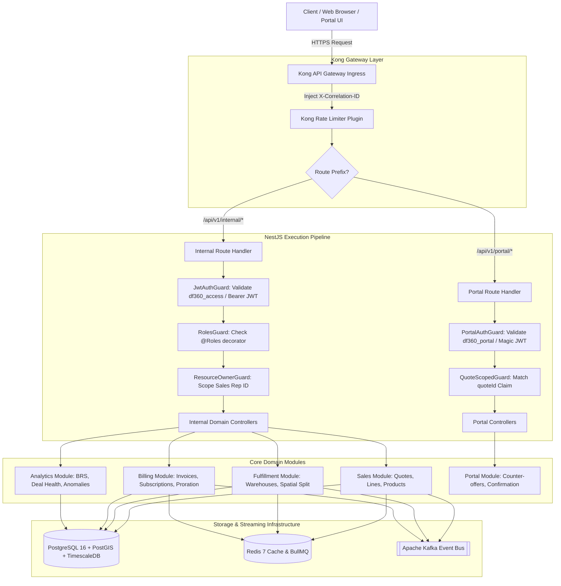

# DealFlow360 — REST API & OpenAPI 3.1 Specification

**Document ID:** DF360-SPEC-003  
**Version:** 1.0.0  
**Status:** Approved  
**Owner:** Platform Architecture Team  
**Last Updated:** 2026-09-05  

---

## Table of Contents

1. [OpenAPI 3.1.0 Specification Root & Security Schemes](#1-openapi-310-specification-root--security-schemes)
2. [Standard Response Envelope Model](#2-standard-response-envelope-model)
   - 2.1 [Success Response Envelope (Single Entity)](#21-success-response-envelope-single-entity)
   - 2.2 [Success Response Envelope (Paginated Collection)](#22-success-response-envelope-paginated-collection)
   - 2.3 [Metadata Contract Specification](#23-metadata-contract-specification)
3. [Global Error Handling & Error Code Taxonomy](#3-global-error-handling--error-code-taxonomy)
   - 3.1 [Standardized Error Payload](#31-standardized-error-payload)
   - 3.2 [Error Code Mapping by HTTP Status Code](#32-error-code-mapping-by-http-status-code)
4. [Complete Endpoint Catalog — Domain Specification](#4-complete-endpoint-catalog--domain-specification)
   - 4.1 [Internal Authentication Module (`/api/v1/internal/auth`)](#41-internal-authentication-module-apiv1internalauth)
   - 4.2 [Portal Authentication Module (`/api/v1/portal/auth`)](#42-portal-authentication-module-apiv1portalauth)
   - 4.3 [Products & Catalog Module (`/api/v1/internal/products`)](#43-products--catalog-module-apiv1internalproducts)
   - 4.4 [Price Lists Module (`/api/v1/internal/price-lists`)](#44-price-lists-module-apiv1internalprice-lists)
   - 4.5 [Discount Tiers Module (`/api/v1/internal/discount-tiers`)](#45-discount-tiers-module-apiv1internaldiscount-tiers)
   - 4.6 [Quotes Lifecycle Module (`/api/v1/internal/quotes`)](#46-quotes-lifecycle-module-apiv1internalquotes)
   - 4.7 [Quote Lines Module (`/api/v1/internal/quotes/:quoteId/lines`)](#47-quote-lines-module-apiv1internalquotesquoteidlines)
   - 4.8 [Approval Workflows Module (`/api/v1/internal/approvals`)](#48-approval-workflows-module-apiv1internalapprovals)
   - 4.9 [Warehouses & Spatial Inventory Module (`/api/v1/internal/warehouses`)](#49-warehouses--spatial-inventory-module-apiv1internalwarehouses)
   - 4.10 [Fulfillment & Spatial Split Module (`/api/v1/internal/fulfillment`)](#410-fulfillment--spatial-split-module-apiv1internalfulfillment)
   - 4.11 [Subscriptions & Proration Module (`/api/v1/internal/subscriptions`)](#411-subscriptions--proration-module-apiv1internalsubscriptions)
   - 4.12 [Invoicing, Billing & Credit Notes Module (`/api/v1/internal/invoices`)](#412-invoicing-billing--credit-notes-module-apiv1internalinvoices)
   - 4.13 [Operational & Telemetry Analytics Module (`/api/v1/internal/analytics`)](#413-operational--telemetry-analytics-module-apiv1internalanalytics)
   - 4.14 [Customer Portal Interactive Module (`/api/v1/portal`)](#414-customer-portal-interactive-module-apiv1portal)
5. [Workspace Isolation Table & Gateway Routing Architecture](#5-workspace-isolation-table--gateway-routing-architecture)
   - 5.1 [Workspace Isolation Matrix](#51-workspace-isolation-matrix)
   - 5.2 [Workspace Isolation Route Catalog](#52-workspace-isolation-route-catalog)
6. [Route Guards & RBAC Permission Matrix](#6-route-guards--rbac-permission-matrix)
   - 6.1 [Role Permission Matrix](#61-role-permission-matrix)
7. [OpenAPI 3.1 Component Schemas (YAML)](#7-openapi-31-component-schemas-yaml)

---

## Executive Summary & Architectural Context

DealFlow360 is an enterprise B2B quotation, billing, spatial fulfillment, and subscription lifecycle orchestration platform. The backend is implemented as a single, domain-separated NestJS deployable service, fronted by Kong API Gateway. All incoming traffic is partitioned into two distinct security zones:

1. **Internal Routes (`/api/v1/internal/*`):** Restricted to enterprise internal personas (Sales Representatives, Sales Managers, Finance Officers, System Administrators) authenticated via Better Auth JWT bearer tokens or HttpOnly enterprise cookies.
2. **Portal Routes (`/api/v1/portal/*`):** Publicly reachable endpoints dedicated to customer self-service quote negotiation, digital signature confirmation, and subscription telemetry. Authenticated exclusively via short-lived magic-link tokens or portal-scoped session JWTs.

### Core Architectural Principles

- **Unified Response Enveloping:** Every HTTP response across both internal and portal domains strictly adheres to the standard envelope `{ "data": T | null, "meta": Meta | null, "error": ErrorPayload | null }`.
- **Stateless Authentication with Distributed Invalidation:** Better Auth manages stateful session revocation via Redis while issuing stateless EdDSA/RS256 or HS256 signed JWTs for sub-millisecond route authorization.
- **Traceability & Correlation:** Kong API Gateway injects an `X-Correlation-ID` header (UUID v4) on every ingress request. NestJS extracts this via `CorrelationIdMiddleware`, binds it to Node.js `AsyncLocalStorage`, and propagates it to all downstream database queries, asynchronous Kafka messages, BullMQ jobs, and API response headers.
- **Strict Role-Based and Ownership Guards:** Access control uses a multi-tier NestJS guard pipeline: `JwtAuthGuard` / `PortalAuthGuard` $\rightarrow$ `RolesGuard` $\rightarrow$ `ResourceOwnerGuard` (ensuring sales reps can only view/modify quotes assigned to their ID unless explicitly delegated).



---
## 1. OpenAPI 3.1.0 Specification Root & Security Schemes

The full OpenAPI 3.1 specification header defines the global API metadata, gateways, contact protocols, and security authentication schemes for internal operators and external portal visitors.

```yaml
openapi: 3.1.0
info:
  title: DealFlow360 Platform REST API
  version: 1.0.0
  description: >
    Comprehensive enterprise REST API specification for DealFlow360 B2B Sales,
    Quotation Lifecycle Governance, PostGIS-powered Spatial Fulfillment,
    Multi-tier Approval Workflows, and Subscription Billing Engine.
  termsOfService: https://dealflow360.com/terms
  contact:
    name: DealFlow360 Platform Architecture & API Operations
    email: api-support@dealflow360.com
    url: https://developer.dealflow360.com
  license:
    name: Proprietary / Commercial
    url: https://dealflow360.com/license
servers:
  - url: https://api.dealflow360.com
    description: Production API Gateway (Kong Managed Ingress)
  - url: https://staging-api.dealflow360.com
    description: Staging Environment API Gateway
  - url: http://localhost:3000
    description: Local NestJS Development Server (Direct Ingress)
tags:
  - name: Internal Auth
    description: Session lifecycle, credentials verification, and token rotation for enterprise operators.
  - name: Portal Auth
    description: One-time magic link verification and customer portal token issuance.
  - name: Products & Catalog
    description: Multi-category product management, variants, and catalog metadata.
  - name: Price Lists
    description: Tiered, regional, and promotional price lists with bulk item synchronization.
  - name: Discount Tiers
    description: Governance bounds and automated approval thresholds for sales discounts.
  - name: Quotes Lifecycle
    description: Deal authoring, BRS risk calculation, workflow dispatch, and customer delivery.
  - name: Quote Lines
    description: Granular one-time and recurring quote itemization, plus AI upsell recommendations.
  - name: Approval Workflows
    description: Multi-level risk governance queues for Sales Managers, Finance Directors, and Admins.
  - name: Warehouses & Spatial Inventory
    description: PostGIS spatial centroid queries, facility logistics, and physical stock tracking.
  - name: Fulfillment Engine
    description: Greedy spatial split optimization, multi-warehouse routing, and override audits.
  - name: Subscriptions & Proration
    description: Recurring contract management, mid-cycle seat adjustments, and proration calculations.
  - name: Invoicing & Billing
    description: Invoice generation, PDF dispatch, lifecycle voiding, and credit note issuance.
  - name: Operational Analytics
    description: TimescaleDB pipeline health, quote velocity, rep performance, and anomaly detection.
  - name: Customer Portal
    description: External customer deal negotiation, counter-proposals, and acceptance confirmations.
paths: {}
components:
  securitySchemes:
    BearerAuth:
      type: http
      scheme: bearer
      bearerFormat: JWT
      description: >
        Better Auth issued JSON Web Token used for internal enterprise routes (`/api/v1/internal/*`).
        Passed either via the `Authorization: Bearer <token>` HTTP header or inside the
        secure `df360_access` HttpOnly cookie.
    MagicLinkToken:
      type: http
      scheme: bearer
      bearerFormat: JWT
      description: >
        Cryptographically signed customer session JWT issued upon verification of a magic link.
        Scoped strictly to customer operations on the specific quote or subscription records.
        Passed via the `Authorization: Bearer <token>` HTTP header or `df360_portal` cookie.
```

---

## 2. Standard Response Envelope Model

All API endpoints return JSON responses wrapped in a uniform tripartite envelope containing `data`, `meta`, and `error`. This design guarantees deterministic contract deserialization across frontend clients (Next.js), SDKs, and third-party webhooks.

### 2.1 Success Response Envelope (Single Entity)

```json
{
  "data": {
    "id": "7c9e6679-7425-40de-944b-e07fc1f90ae7",
    "quoteNumber": "QTE-2026-0814",
    "status": "draft",
    "totalAmount": "145000.00",
    "currency": "USD",
    "customerId": "8f3c7e42-9a21-4f2a-b6d3-90d2e8b15a6e",
    "repId": "1a2b3c4d-5e6f-7a8b-9c0d-1e2f3a4b5c6d",
    "createdAt": "2026-09-05T08:30:00.000Z",
    "updatedAt": "2026-09-05T08:45:00.000Z"
  },
  "meta": {
    "correlationId": "4f9d2a6e-7b1c-4389-a2e1-8d5f3c9a0b12",
    "timestamp": "2026-09-05T08:45:01.120Z"
  },
  "error": null
}
```

### 2.2 Success Response Envelope (Paginated Collection)

```json
{
  "data": [
    {
      "id": "7c9e6679-7425-40de-944b-e07fc1f90ae7",
      "quoteNumber": "QTE-2026-0814",
      "status": "pending_approval",
      "totalAmount": "145000.00"
    }
  ],
  "meta": {
    "page": 1,
    "limit": 20,
    "total": 142,
    "totalPages": 8,
    "hasNextPage": true,
    "hasPreviousPage": false,
    "correlationId": "4f9d2a6e-7b1c-4389-a2e1-8d5f3c9a0b12",
    "timestamp": "2026-09-05T08:45:01.120Z"
  },
  "error": null
}
```

### 2.3 Metadata Contract Specification

| Field | Type | Required | Description |
|---|---|---|---|
| `correlationId` | `string` (UUID v4) | **Yes** | Injected by Kong or NestJS `CorrelationIdMiddleware`. Corresponds to `X-Correlation-ID` header. |
| `timestamp` | `string` (ISO 8601 UTC) | **Yes** | Server timestamp when the response envelope was constructed. |
| `page` | `integer` | No | Current 1-based page index for paginated collections. |
| `limit` | `integer` | No | Number of records requested per page (maximum: 100). |
| `total` | `integer` | No | Total count of records matching the query criteria across all pages. |
| `totalPages` | `integer` | No | Total number of pages: $\lceil \text{total} / \text{limit} \rceil$. |
| `hasNextPage` | `boolean` | No | True if `page < totalPages`. |
| `hasPreviousPage` | `boolean` | No | True if `page > 1`. |

---

## 3. Global Error Handling & Error Code Taxonomy

When an operational, authorization, or business domain rule violation occurs, the API returns HTTP status code $\ge 400$, populates `error` with a structured payload, and sets `data` to `null`.

### 3.1 Standardized Error Payload

```json
{
  "data": null,
  "meta": {
    "correlationId": "abc-123-def",
    "timestamp": "2026-09-05T13:20:00.000Z"
  },
  "error": {
    "code": "QUOTE_NOT_FOUND",
    "message": "Quote with id 8f3c7e42-9a21-4f2a-b6d3-90d2e8b15a6e was not found",
    "statusCode": 404,
    "timestamp": "2026-09-05T13:20:00.000Z",
    "correlationId": "abc-123-def",
    "details": [
      {
        "field": "id",
        "issue": "Entity does not exist in sales.quotes table",
        "value": "8f3c7e42-9a21-4f2a-b6d3-90d2e8b15a6e"
      }
    ]
  }
}
```

### 3.2 Error Code Mapping by HTTP Status Code

The following comprehensive taxonomy documents all standardized error codes across HTTP status codes 400, 401, 403, 404, 422, and 500:

| HTTP Status | Error Code | Description | Typical Triggers |
|---|---|---|---|
| **400 Bad Request** | `BAD_REQUEST` | Generic malformed request syntax or unparseable input. | Invalid JSON syntax, illegal data types in parameters. |
| | `MALFORMED_REQUEST_BODY` | Body failed parser checks before reaching validation layer. | Missing mandatory JSON brackets, invalid UTF-8 encoding. |
| | `INVALID_QUERY_PARAMETER` | Query string argument out of bounds or unrecognized. | `limit > 100`, `page < 1`, unparseable date range strings. |
| | `INVALID_COORDINATES` | Geo-coordinates out of standard WGS84 bounds. | Latitude outside $[-90, +90]$ or Longitude outside $[-180, +180]$. |
| | `SPLIT_ALREADY_ACCEPTED` | Split has already been locked and cannot be modified. | Calling `POST /split/accept` or `PATCH /split` on confirmed split. |
| | `CANNOT_CANCEL_COMPLETED_SUBSCRIPTION` | Attempting to cancel an already expired/cancelled contract. | Mid-cycle cancellation invoked on status `cancelled`. |
| **401 Unauthorized** | `UNAUTHORIZED` | Client lacks valid authentication credentials. | Request sent with no Bearer token or HttpOnly cookie. |
| | `TOKEN_MISSING` | Authentication header or cookie not provided. | Empty `Authorization` header on protected route. |
| | `TOKEN_EXPIRED` | JWT lifetime (`exp`) has elapsed. | Internal access token older than 900s (15 min). |
| | `TOKEN_INVALID` | JWT cryptographic signature check failed. | Tampered token signature or corrupted payload. |
| | `REFRESH_TOKEN_EXPIRED` | Better Auth refresh session has expired in Redis. | Refresh token session older than 7 days (604,800s). |
| | `MAGIC_LINK_EXPIRED` | Customer portal one-time magic link has expired. | Attempted access $>15$ minutes after email dispatch. |
| | `MAGIC_LINK_ALREADY_USED` | One-time token was already exchanged for a session. | Re-clicking a consumed magic link URL. |
| **403 Forbidden** | `FORBIDDEN` | Principal authenticated but lacks required permission. | Standard RBAC denial. |
| | `INSUFFICIENT_ROLE_PERMISSIONS` | Role does not meet `@Roles(...)` metadata requirements. | Sales Rep attempting to create a new Product (`Admin` only). |
| | `RESOURCE_NOT_OWNED` | User cannot modify resources owned by another rep. | `ResourceOwnerGuard` triggered on quote access. |
| | `PORTAL_QUOTE_ACCESS_DENIED` | Portal token `quoteId` does not match URL target. | Customer trying to query another customer's quote. |
| | `APPROVAL_NOT_ASSIGNED` | Approver is not authorized for this specific approval tier. | Sales Rep trying to execute `POST /approvals/:id/approve`. |
| **404 Not Found** | `RESOURCE_NOT_FOUND` | Generic target resource does not exist. | Unmatched route or database primary key lookup failure. |
| | `USER_NOT_FOUND` | Referenced user ID does not exist in `sales.users`. | Lookup for non-existent sales representative ID. |
| | `PRODUCT_NOT_FOUND` | Product ID not found in `sales.products`. | Creating quote line with invalid `productId`. |
| | `PRICE_LIST_NOT_FOUND` | Price list ID not found in `sales.price_lists`. | Referencing non-existent pricing schedule. |
| | `QUOTE_NOT_FOUND` | Quote ID not found in `sales.quotes`. | Accessing missing quote identifier. |
| | `QUOTE_LINE_NOT_FOUND` | Line item not found on the specified quote. | Patching line item that does not exist in `sales.quote_lines`. |
| | `WAREHOUSE_NOT_FOUND` | Warehouse ID not found in `fulfillment.warehouses`. | Spatial allocation referencing inactive warehouse. |
| | `SUBSCRIPTION_NOT_FOUND` | Subscription ID not found in `billing.subscriptions`. | Modifying seats on non-existent subscription contract. |
| | `INVOICE_NOT_FOUND` | Invoice ID not found in `billing.invoices`. | Voiding or sending an invoice that does not exist. |
| | `APPROVAL_NOT_FOUND` | Pending approval item not found in queue. | Approval action targeting an already deleted or invalid ID. |
| **422 Unprocessable Entity** | `VALIDATION_FAILED` | Request schema failed runtime Zod or class-validator rules. | String passed where number expected, negative quantities. |
| | `DISCOUNT_CEILING_EXCEEDED` | Line discount exceeds maximum enterprise allowable discount. | Sales Rep entered 85% discount when absolute max is 60%. |
| | `STOCK_INSUFFICIENT` | Total warehouse inventory cannot fulfill required quantity. | Attempting to accept split when inventory was depleted. |
| | `INVALID_STATE_TRANSITION` | Entity state prohibits the requested action. | Attempting to edit a quote in `pending_approval` or `confirmed`. |
| | `PRORATION_INVALID_PERIOD` | Modification timestamp falls outside active cycle window. | Mid-cycle upgrade requested with modification date > periodEnd. |
| | `MISSING_REQUIRED_LINE_FIELDS` | Line item lacks domain attributes (e.g. interval for recurring). | Creating `subscription` line without specifying `planInterval`. |
| **500 Internal Server Error** | `INTERNAL_SERVER_ERROR` | Unhandled runtime exception within NestJS backend. | Uncaught null pointer, memory fault, unexpected runtime crash. |
| | `DATABASE_TRANSACTION_FAILED` | Multi-table ACID transaction rolled back due to error. | Deadlock during concurrent quote line bulk insertion. |
| | `KAFKA_PUBLISH_FAILED` | Message broker rejected event publication. | Kafka cluster timeout on `quote.submitted` event. |
| | `GEO_SPATIAL_CALCULATION_FAILED` | PostGIS spatial distance computation returned error. | PostGIS internal geometry projection calculation error. |
| | `PAYMENT_GATEWAY_FAILURE` | External billing integration exception. | Downstream payment processor connection timeout. |

---
## 4. Complete Endpoint Catalog — Domain Specification

---

### 4.1 Internal Authentication Module (`/api/v1/internal/auth`)

The Internal Authentication module handles enterprise session creation, token revocation, token rotation, and principal identity introspection using Better Auth.

#### 4.1.1 `POST /api/v1/internal/auth/login`
- **Method & Path:** `POST /api/v1/internal/auth/login`
- **Authentication:** None (Public internal endpoint)
- **Role Guards:** None
- **Description:** Authenticates enterprise staff via email and password. Upon successful credential validation, creates a server-side session in Redis and issues an access token (JWT, 15m TTL) and refresh token (JWT, 7d TTL). If requested by a web browser, tokens are returned both in the JSON body and set via secure HttpOnly `df360_access` and `df360_refresh` cookies.
- **Request Headers:**
  - `Content-Type: application/json`
  - `X-Correlation-ID: <string>` (Optional, injected by gateway)
- **Request Body:**
```json
{
  "email": "sarah.rep@dealflow360.com",
  "password": "SuperSecretPassword123!"
}
```
- **Response Schema (200 OK):**
```json
{
  "data": {
    "user": {
      "id": "1a2b3c4d-5e6f-7a8b-9c0d-1e2f3a4b5c6d",
      "email": "sarah.rep@dealflow360.com",
      "name": "Sarah Connor",
      "role": "sales_rep",
      "createdAt": "2026-01-10T10:00:00.000Z"
    },
    "tokens": {
      "accessToken": "eyJhbGciOiJIUzI1NiIsInR5cCI6IkpXVCJ9...",
      "refreshToken": "eyJhbGciOiJIUzI1NiIsInR5cCI6IkpXVCJ9...",
      "expiresIn": 900,
      "tokenType": "Bearer"
    }
  },
  "meta": {
    "correlationId": "4f9d2a6e-7b1c-4389-a2e1-8d5f3c9a0b12",
    "timestamp": "2026-09-05T08:45:00.000Z"
  },
  "error": null
}
```
- **Error Responses:**
  - `400 Bad Request` (`VALIDATION_FAILED`): Missing email or password format invalid.
  - `401 Unauthorized` (`INVALID_CREDENTIALS`): Password mismatch or email not registered.
  - `429 Too Many Requests`: Exceeded 5 failed attempts per minute.

---

#### 4.1.2 `POST /api/v1/internal/auth/logout`
- **Method & Path:** `POST /api/v1/internal/auth/logout`
- **Authentication:** `BearerAuth` (JWT) or `df360_access` cookie
- **Role Guards:** `@Roles('admin', 'sales_rep', 'sales_manager', 'finance')`
- **Description:** Terminates the current user session, revoking the associated refresh token in Redis and clearing client-side HttpOnly cookies.
- **Request Headers:**
  - `Authorization: Bearer <token>`
- **Request Body:** None
- **Response Schema (200 OK):**
```json
{
  "data": {
    "success": true,
    "message": "User session successfully terminated."
  },
  "meta": {
    "correlationId": "4f9d2a6e-7b1c-4389-a2e1-8d5f3c9a0b12",
    "timestamp": "2026-09-05T08:50:00.000Z"
  },
  "error": null
}
```
- **Error Responses:**
  - `401 Unauthorized` (`TOKEN_MISSING`, `TOKEN_INVALID`): Bearer token missing or expired.

---

#### 4.1.3 `POST /api/v1/internal/auth/refresh`
- **Method & Path:** `POST /api/v1/internal/auth/refresh`
- **Authentication:** Refresh Token via `df360_refresh` HttpOnly cookie or `Authorization: Bearer <refreshToken>`
- **Role Guards:** None
- **Description:** Performs cryptographic token rotation. Verifies the existing refresh token against the Redis active token whitelist, invalidates the used refresh token (replay protection), and issues a new access token and refresh token pair.
- **Request Headers:**
  - `Cookie: df360_refresh=<refreshToken>` OR `Authorization: Bearer <refreshToken>`
- **Request Body:** None (or optional `{ "refreshToken": "<string>" }`)
- **Response Schema (200 OK):**
```json
{
  "data": {
    "accessToken": "eyJhbGciOiJIUzI1NiIsInR5cCI6IkpXVCJ9...",
    "refreshToken": "eyJhbGciOiJIUzI1NiIsInR5cCI6IkpXVCJ9...",
    "expiresIn": 900,
    "tokenType": "Bearer"
  },
  "meta": {
    "correlationId": "4f9d2a6e-7b1c-4389-a2e1-8d5f3c9a0b12",
    "timestamp": "2026-09-05T08:55:00.000Z"
  },
  "error": null
}
```
- **Error Responses:**
  - `401 Unauthorized` (`REFRESH_TOKEN_EXPIRED`, `TOKEN_REVOKED`): Refresh token has expired or was revoked.

---

#### 4.1.4 `GET /api/v1/internal/auth/me`
- **Method & Path:** `GET /api/v1/internal/auth/me`
- **Authentication:** `BearerAuth`
- **Role Guards:** All internal roles
- **Description:** Retrieves the authenticated identity profile, assigned permissions, department affiliation, and current tenant context.
- **Request Headers:**
  - `Authorization: Bearer <token>`
- **Request Parameters:** None
- **Response Schema (200 OK):**
```json
{
  "data": {
    "id": "1a2b3c4d-5e6f-7a8b-9c0d-1e2f3a4b5c6d",
    "email": "sarah.rep@dealflow360.com",
    "name": "Sarah Connor",
    "role": "sales_rep",
    "permissions": ["quotes:create", "quotes:read:own", "quotes:update:own", "quotes:submit"],
    "createdAt": "2026-01-10T10:00:00.000Z",
    "updatedAt": "2026-09-01T12:00:00.000Z"
  },
  "meta": {
    "correlationId": "4f9d2a6e-7b1c-4389-a2e1-8d5f3c9a0b12",
    "timestamp": "2026-09-05T09:00:00.000Z"
  },
  "error": null
}
```
- **Error Responses:**
  - `401 Unauthorized` (`TOKEN_EXPIRED`, `TOKEN_MISSING`): Token validation failed.

---

### 4.2 Portal Authentication Module (`/api/v1/portal/auth`)

Provides token generation, dispatch, and verification for customer magic-link authentication, enabling passwordless portal access.

#### 4.2.1 `POST /api/v1/portal/auth/magic-link/request`
- **Method & Path:** `POST /api/v1/portal/auth/magic-link/request`
- **Authentication:** None (Protected by Kong rate limiter: max 5 requests / 10 minutes per IP/email)
- **Role Guards:** None
- **Description:** Initiates a passwordless login sequence for an external buyer. Validates the recipient email against confirmed quote or subscription records. Generates a cryptographically random 256-bit token with a 15-minute TTL, persists the hash in Redis (`portal:magic:<tokenHash>`), and enqueues an asynchronous BullMQ email delivery job.
- **Request Headers:**
  - `Content-Type: application/json`
- **Request Body:**
```json
{
  "email": "buyer@enterpriseclient.com",
  "quoteId": "7c9e6679-7425-40de-944b-e07fc1f90ae7"
}
```
- **Response Schema (200 OK):**
```json
{
  "data": {
    "dispatched": true,
    "message": "A secure magic link has been sent to your registered email address.",
    "expiresInSeconds": 900
  },
  "meta": {
    "correlationId": "8a7b6c5d-4e3f-2a1b-0c9d-8e7f6a5b4c3d",
    "timestamp": "2026-09-05T09:10:00.000Z"
  },
  "error": null
}
```
- **Error Responses:**
  - `400 Bad Request` (`VALIDATION_FAILED`): Email or quoteId malformed.
  - `404 Not Found` (`QUOTE_NOT_FOUND`): Quote does not exist or does not match email.
  - `429 Too Many Requests`: Rate limit exceeded.

---

#### 4.2.2 `POST /api/v1/portal/auth/magic-link/verify`
- **Method & Path:** `POST /api/v1/portal/auth/magic-link/verify`
- **Authentication:** None
- **Role Guards:** None
- **Description:** Verifies the one-time magic token. Atomically deletes the token key from Redis to prevent replay attacks, and issues a 24-hour scoped portal session JWT containing `quoteId`, `customerId`, and `email` claims.
- **Request Headers:**
  - `Content-Type: application/json`
- **Request Body:**
```json
{
  "token": "4a8c9b2e0f1d3c5e7a9b8c0d1e2f3a4b5c6d7e8f9a0b1c2d3e4f5a6b7c8d9e0f"
}
```
- **Response Schema (200 OK):**
```json
{
  "data": {
    "portalToken": "eyJhbGciOiJIUzI1NiIsInR5cCI6IkpXVCJ9...",
    "tokenType": "Bearer",
    "expiresIn": 86400,
    "quoteId": "7c9e6679-7425-40de-944b-e07fc1f90ae7",
    "customerId": "8f3c7e42-9a21-4f2a-b6d3-90d2e8b15a6e",
    "customerEmail": "buyer@enterpriseclient.com"
  },
  "meta": {
    "correlationId": "8a7b6c5d-4e3f-2a1b-0c9d-8e7f6a5b4c3d",
    "timestamp": "2026-09-05T09:12:00.000Z"
  },
  "error": null
}
```
- **Error Responses:**
  - `401 Unauthorized` (`MAGIC_LINK_EXPIRED`, `MAGIC_LINK_ALREADY_USED`, `TOKEN_INVALID`): Token invalid, already consumed, or expired.

---

### 4.3 Products & Catalog Module (`/api/v1/internal/products`)

Governs the enterprise catalog, category tagging, SKUs, inventory configurations, and product variants.

#### 4.3.1 `GET /api/v1/internal/products`
- **Method & Path:** `GET /api/v1/internal/products`
- **Authentication:** `BearerAuth`
- **Role Guards:** `@Roles('admin', 'sales_rep', 'sales_manager', 'finance')`
- **Description:** Retrieves a paginated catalog of enterprise products with filtering by category, search text, and active state.
- **Query Parameters:**
  - `category` (optional, string): Filter by category (`hardware`, `services`, `subscription`).
  - `search` (optional, string): Fuzzy search against product `name` or `sku`.
  - `isActive` (optional, boolean): Filter by active status (defaults to true).
  - `page` (optional, integer, default: 1): Page number.
  - `limit` (optional, integer, default: 20, max: 100): Page limit.
- **Response Schema (200 OK):**
```json
{
  "data": [
    {
      "id": "3b1a8f9c-7d6e-5a4b-3c2d-1e0f9a8b7c6d",
      "sku": "HW-SRV-9000",
      "name": "Edge Computing Server Unit",
      "description": "High-density rackmount compute node with integrated AI coprocessor",
      "category": "hardware",
      "basePrice": "12500.00",
      "costPrice": "7800.00",
      "currency": "USD",
      "isActive": true,
      "metadata": { "weightKg": 14.5, "rackUnits": 2 },
      "createdAt": "2026-02-01T00:00:00.000Z",
      "updatedAt": "2026-08-15T12:00:00.000Z"
    }
  ],
  "meta": {
    "page": 1,
    "limit": 20,
    "total": 45,
    "totalPages": 3,
    "hasNextPage": true,
    "hasPreviousPage": false,
    "correlationId": "4f9d2a6e-7b1c-4389-a2e1-8d5f3c9a0b12",
    "timestamp": "2026-09-05T09:15:00.000Z"
  },
  "error": null
}
```

---

#### 4.3.2 `POST /api/v1/internal/products`
- **Method & Path:** `POST /api/v1/internal/products`
- **Authentication:** `BearerAuth`
- **Role Guards:** `@Roles('admin')`
- **Description:** Creates a new product entity within the global catalog.
- **Request Body:**
```json
{
  "sku": "SUB-SEC-ENT",
  "name": "Enterprise Threat Defense SaaS",
  "description": "24/7 AI-driven network telemetry and remediation subscription",
  "category": "subscription",
  "basePrice": "499.00",
  "costPrice": "120.00",
  "currency": "USD",
  "metadata": {
    "slaTier": "platinum",
    "retentionDays": 365
  }
}
```
- **Response Schema (201 Created):**
```json
{
  "data": {
    "id": "e2f1a0b9-8c7d-6e5f-4a3b-2c1d0e9f8a7b",
    "sku": "SUB-SEC-ENT",
    "name": "Enterprise Threat Defense SaaS",
    "category": "subscription",
    "basePrice": "499.00",
    "costPrice": "120.00",
    "currency": "USD",
    "isActive": true,
    "createdAt": "2026-09-05T09:20:00.000Z",
    "updatedAt": "2026-09-05T09:20:00.000Z"
  },
  "meta": {
    "correlationId": "4f9d2a6e-7b1c-4389-a2e1-8d5f3c9a0b12",
    "timestamp": "2026-09-05T09:20:00.000Z"
  },
  "error": null
}
```
- **Error Responses:**
  - `403 Forbidden` (`INSUFFICIENT_ROLE_PERMISSIONS`): Only `admin` role may create products.
  - `422 Unprocessable Entity` (`VALIDATION_FAILED`): Duplicate SKU or missing mandatory fields.

---

#### 4.3.3 `GET /api/v1/internal/products/:id`
- **Method & Path:** `GET /api/v1/internal/products/:id`
- **Authentication:** `BearerAuth`
- **Role Guards:** All internal roles
- **Description:** Fetches complete product details including attached variants, active pricing tier bindings, and physical fulfillment attributes.
- **Path Parameters:**
  - `id` (UUID v4, required): Product unique identifier.
- **Response Schema (200 OK):**
```json
{
  "data": {
    "id": "3b1a8f9c-7d6e-5a4b-3c2d-1e0f9a8b7c6d",
    "sku": "HW-SRV-9000",
    "name": "Edge Computing Server Unit",
    "description": "High-density rackmount compute node with integrated AI coprocessor",
    "category": "hardware",
    "basePrice": "12500.00",
    "costPrice": "7800.00",
    "currency": "USD",
    "isActive": true,
    "metadata": { "weightKg": 14.5, "rackUnits": 2 },
    "variantsCount": 3,
    "createdAt": "2026-02-01T00:00:00.000Z",
    "updatedAt": "2026-08-15T12:00:00.000Z"
  },
  "meta": {
    "correlationId": "4f9d2a6e-7b1c-4389-a2e1-8d5f3c9a0b12",
    "timestamp": "2026-09-05T09:22:00.000Z"
  },
  "error": null
}
```
- **Error Responses:**
  - `404 Not Found` (`PRODUCT_NOT_FOUND`): Product ID not found in database.

---

#### 4.3.4 `PATCH /api/v1/internal/products/:id`
- **Method & Path:** `PATCH /api/v1/internal/products/:id`
- **Authentication:** `BearerAuth`
- **Role Guards:** `@Roles('admin')`
- **Description:** Updates product metadata, base price, cost price, or active status.
- **Path Parameters:**
  - `id` (UUID v4, required): Product unique identifier.
- **Request Body:**
```json
{
  "basePrice": "12900.00",
  "costPrice": "8100.00",
  "description": "Updated 2026 refresh specification"
}
```
- **Response Schema (200 OK):**
```json
{
  "data": {
    "id": "3b1a8f9c-7d6e-5a4b-3c2d-1e0f9a8b7c6d",
    "sku": "HW-SRV-9000",
    "name": "Edge Computing Server Unit",
    "basePrice": "12900.00",
    "costPrice": "8100.00",
    "updatedAt": "2026-09-05T09:25:00.000Z"
  },
  "meta": {
    "correlationId": "4f9d2a6e-7b1c-4389-a2e1-8d5f3c9a0b12",
    "timestamp": "2026-09-05T09:25:00.000Z"
  },
  "error": null
}
```

---

#### 4.3.5 `DELETE /api/v1/internal/products/:id`
- **Method & Path:** `DELETE /api/v1/internal/products/:id`
- **Authentication:** `BearerAuth`
- **Role Guards:** `@Roles('admin')`
- **Description:** Soft-deletes a product by setting `isActive = false` and flagging archival in the Elasticsearch index. Existing quote lines preserve their frozen price snapshot.
- **Path Parameters:**
  - `id` (UUID v4, required): Product unique identifier.
- **Response Schema (200 OK):**
```json
{
  "data": {
    "id": "3b1a8f9c-7d6e-5a4b-3c2d-1e0f9a8b7c6d",
    "isActive": false,
    "archivedAt": "2026-09-05T09:28:00.000Z"
  },
  "meta": {
    "correlationId": "4f9d2a6e-7b1c-4389-a2e1-8d5f3c9a0b12",
    "timestamp": "2026-09-05T09:28:00.000Z"
  },
  "error": null
}
```

---

#### 4.3.6 `GET /api/v1/internal/products/:id/variants`
- **Method & Path:** `GET /api/v1/internal/products/:id/variants`
- **Authentication:** `BearerAuth`
- **Role Guards:** All internal roles
- **Description:** Lists all variants associated with the specified product.
- **Path Parameters:**
  - `id` (UUID v4, required): Parent product identifier.
- **Response Schema (200 OK):**
```json
{
  "data": [
    {
      "id": "7a6b5c4d-3e2f-1a0b-9c8d-7e6f5a4b3c2d",
      "productId": "3b1a8f9c-7d6e-5a4b-3c2d-1e0f9a8b7c6d",
      "sku": "HW-SRV-9000-64GB",
      "name": "64GB RAM / 2TB NVMe Edition",
      "priceDelta": "1500.00",
      "weightKg": "14.80",
      "attributes": { "ram": "64GB", "storage": "2TB NVMe" },
      "createdAt": "2026-02-10T00:00:00.000Z"
    }
  ],
  "meta": {
    "correlationId": "4f9d2a6e-7b1c-4389-a2e1-8d5f3c9a0b12",
    "timestamp": "2026-09-05T09:30:00.000Z"
  },
  "error": null
}
```

---

#### 4.3.7 `POST /api/v1/internal/products/:id/variants`
- **Method & Path:** `POST /api/v1/internal/products/:id/variants`
- **Authentication:** `BearerAuth`
- **Role Guards:** `@Roles('admin')`
- **Description:** Adds a new variant to a parent product.
- **Path Parameters:**
  - `id` (UUID v4, required): Parent product identifier.
- **Request Body:**
```json
{
  "sku": "HW-SRV-9000-128GB",
  "name": "128GB RAM / 4TB NVMe Edition",
  "priceDelta": "3200.00",
  "weightKg": 15.2,
  "attributes": {
    "ram": "128GB",
    "storage": "4TB NVMe",
    "gpu": "Dual Tensor Cores"
  }
}
```
- **Response Schema (201 Created):**
```json
{
  "data": {
    "id": "8b7c6d5e-4f3a-2b1c-0d9e-8f7a6b5c4d3e",
    "productId": "3b1a8f9c-7d6e-5a4b-3c2d-1e0f9a8b7c6d",
    "sku": "HW-SRV-9000-128GB",
    "name": "128GB RAM / 4TB NVMe Edition",
    "priceDelta": "3200.00",
    "weightKg": "15.20",
    "attributes": { "ram": "128GB", "storage": "4TB NVMe", "gpu": "Dual Tensor Cores" },
    "createdAt": "2026-09-05T09:32:00.000Z"
  },
  "meta": {
    "correlationId": "4f9d2a6e-7b1c-4389-a2e1-8d5f3c9a0b12",
    "timestamp": "2026-09-05T09:32:00.000Z"
  },
  "error": null
}
```

---

### 4.4 Price Lists Module (`/api/v1/internal/price-lists`)

Manages market-specific, customer-tier, and promotional price lists.

#### 4.4.1 `GET /api/v1/internal/price-lists`
- **Method & Path:** `GET /api/v1/internal/price-lists`
- **Authentication:** `BearerAuth`
- **Role Guards:** `@Roles('admin', 'sales_rep', 'sales_manager', 'finance')`
- **Description:** Retrieves all price lists, supporting pagination and active filter.
- **Query Parameters:**
  - `isActive` (optional, boolean): Filter active price lists.
  - `currency` (optional, string): Filter by currency code (`USD`, `EUR`, `GBP`).
- **Response Schema (200 OK):**
```json
{
  "data": [
    {
      "id": "1c2d3e4f-5a6b-7c8d-9e0f-1a2b3c4d5e6f",
      "name": "North America Enterprise 2026",
      "currency": "USD",
      "isDefault": true,
      "validFrom": "2026-01-01T00:00:00.000Z",
      "validTo": "2026-12-31T23:59:59.000Z",
      "isActive": true,
      "createdAt": "2025-12-15T00:00:00.000Z"
    }
  ],
  "meta": {
    "page": 1,
    "limit": 20,
    "total": 5,
    "totalPages": 1,
    "correlationId": "4f9d2a6e-7b1c-4389-a2e1-8d5f3c9a0b12",
    "timestamp": "2026-09-05T09:35:00.000Z"
  },
  "error": null
}
```

---

#### 4.4.2 `POST /api/v1/internal/price-lists`
- **Method & Path:** `POST /api/v1/internal/price-lists`
- **Authentication:** `BearerAuth`
- **Role Guards:** `@Roles('admin', 'finance')`
- **Description:** Creates a new price list definition.
- **Request Body:**
```json
{
  "name": "EMEA Direct Sales 2026",
  "currency": "EUR",
  "isDefault": false,
  "validFrom": "2026-01-01T00:00:00.000Z",
  "validTo": "2026-12-31T23:59:59.000Z"
}
```
- **Response Schema (201 Created):**
```json
{
  "data": {
    "id": "2d3e4f5a-6b7c-8d9e-0f1a-2b3c4d5e6f7a",
    "name": "EMEA Direct Sales 2026",
    "currency": "EUR",
    "isDefault": false,
    "validFrom": "2026-01-01T00:00:00.000Z",
    "validTo": "2026-12-31T23:59:59.000Z",
    "isActive": true,
    "createdAt": "2026-09-05T09:38:00.000Z"
  },
  "meta": {
    "correlationId": "4f9d2a6e-7b1c-4389-a2e1-8d5f3c9a0b12",
    "timestamp": "2026-09-05T09:38:00.000Z"
  },
  "error": null
}
```

---

#### 4.4.3 `GET /api/v1/internal/price-lists/:id`
- **Method & Path:** `GET /api/v1/internal/price-lists/:id`
- **Authentication:** `BearerAuth`
- **Role Guards:** All internal roles
- **Description:** Retrieves details of a specific price list including its current item count.
- **Path Parameters:**
  - `id` (UUID v4, required): Price list identifier.
- **Response Schema (200 OK):**
```json
{
  "data": {
    "id": "1c2d3e4f-5a6b-7c8d-9e0f-1a2b3c4d5e6f",
    "name": "North America Enterprise 2026",
    "currency": "USD",
    "isDefault": true,
    "validFrom": "2026-01-01T00:00:00.000Z",
    "validTo": "2026-12-31T23:59:59.000Z",
    "itemCount": 184,
    "isActive": true,
    "createdAt": "2025-12-15T00:00:00.000Z"
  },
  "meta": {
    "correlationId": "4f9d2a6e-7b1c-4389-a2e1-8d5f3c9a0b12",
    "timestamp": "2026-09-05T09:40:00.000Z"
  },
  "error": null
}
```

---

#### 4.4.4 `PATCH /api/v1/internal/price-lists/:id`
- **Method & Path:** `PATCH /api/v1/internal/price-lists/:id`
- **Authentication:** `BearerAuth`
- **Role Guards:** `@Roles('admin', 'finance')`
- **Description:** Updates price list name, dates, or default status.
- **Path Parameters:**
  - `id` (UUID v4, required): Price list identifier.
- **Request Body:**
```json
{
  "name": "North America Enterprise 2026 (Revised Q3)",
  "validTo": "2027-03-31T23:59:59.000Z"
}
```
- **Response Schema (200 OK):**
```json
{
  "data": {
    "id": "1c2d3e4f-5a6b-7c8d-9e0f-1a2b3c4d5e6f",
    "name": "North America Enterprise 2026 (Revised Q3)",
    "validTo": "2027-03-31T23:59:59.000Z",
    "updatedAt": "2026-09-05T09:42:00.000Z"
  },
  "meta": {
    "correlationId": "4f9d2a6e-7b1c-4389-a2e1-8d5f3c9a0b12",
    "timestamp": "2026-09-05T09:42:00.000Z"
  },
  "error": null
}
```

---

#### 4.4.5 `POST /api/v1/internal/price-lists/:id/items`
- **Method & Path:** `POST /api/v1/internal/price-lists/:id/items`
- **Authentication:** `BearerAuth`
- **Role Guards:** `@Roles('admin', 'finance')`
- **Description:** Bulk upserts item prices inside the price list using an atomic PostgreSQL `ON CONFLICT (price_list_id, product_id, product_variant_id) DO UPDATE` transaction.
- **Path Parameters:**
  - `id` (UUID v4, required): Price list identifier.
- **Request Body:**
```json
{
  "items": [
    {
      "productId": "3b1a8f9c-7d6e-5a4b-3c2d-1e0f9a8b7c6d",
      "productVariantId": null,
      "customPrice": "11900.00"
    },
    {
      "productId": "3b1a8f9c-7d6e-5a4b-3c2d-1e0f9a8b7c6d",
      "productVariantId": "7a6b5c4d-3e2f-1a0b-9c8d-7e6f5a4b3c2d",
      "customPrice": "13200.00"
    }
  ]
}
```
- **Response Schema (200 OK):**
```json
{
  "data": {
    "priceListId": "1c2d3e4f-5a6b-7c8d-9e0f-1a2b3c4d5e6f",
    "upsertedCount": 2,
    "processedAt": "2026-09-05T09:45:00.000Z"
  },
  "meta": {
    "correlationId": "4f9d2a6e-7b1c-4389-a2e1-8d5f3c9a0b12",
    "timestamp": "2026-09-05T09:45:00.000Z"
  },
  "error": null
}
```
- **Error Responses:**
  - `422 Unprocessable Entity` (`VALIDATION_FAILED`): Negative price or unreferenced product ID.

---

### 4.5 Discount Tiers Module (`/api/v1/internal/discount-tiers`)

Defines governance rules, maximum allowed representative discounts, and approval ceiling parameters by customer tier.

#### 4.5.1 `GET /api/v1/internal/discount-tiers`
- **Method & Path:** `GET /api/v1/internal/discount-tiers`
- **Authentication:** `BearerAuth`
- **Role Guards:** All internal roles
- **Description:** Lists all active discount tier rules defining standard allowable discounts and hard ceiling bounds.
- **Response Schema (200 OK):**
```json
{
  "data": [
    {
      "id": "5f6a7b8c-9d0e-1f2a-3b4c-5d6e7f8a9b0c",
      "tier": "gold",
      "category": "hardware",
      "maxDiscountPct": "25.00",
      "ceilingDiscountPct": "45.00",
      "description": "Gold customers hardware threshold: max 25% rep discretion, 45% ceiling",
      "createdAt": "2026-01-01T00:00:00.000Z"
    },
    {
      "id": "6a7b8c9d-0e1f-2a3b-4c5d-6e7f8a9b0c1d",
      "tier": "silver",
      "category": "hardware",
      "maxDiscountPct": "15.00",
      "ceilingDiscountPct": "30.00",
      "description": "Silver customers hardware threshold: max 15% rep discretion, 30% ceiling",
      "createdAt": "2026-01-01T00:00:00.000Z"
    }
  ],
  "meta": {
    "correlationId": "4f9d2a6e-7b1c-4389-a2e1-8d5f3c9a0b12",
    "timestamp": "2026-09-05T09:50:00.000Z"
  },
  "error": null
}
```

---

#### 4.5.2 `POST /api/v1/internal/discount-tiers`
- **Method & Path:** `POST /api/v1/internal/discount-tiers`
- **Authentication:** `BearerAuth`
- **Role Guards:** `@Roles('admin', 'finance')`
- **Description:** Creates a new discount tier governance threshold.
- **Request Body:**
```json
{
  "tier": "bronze",
  "category": "subscription",
  "maxDiscountPct": 10.0,
  "ceilingDiscountPct": 25.0,
  "description": "Bronze tier SaaS subscriptions: 10% rep auto-approve, 25% ceiling"
}
```
- **Response Schema (201 Created):**
```json
{
  "data": {
    "id": "7b8c9d0e-1f2a-3b4c-5d6e-7f8a9b0c1d2e",
    "tier": "bronze",
    "category": "subscription",
    "maxDiscountPct": "10.00",
    "ceilingDiscountPct": "25.00",
    "description": "Bronze tier SaaS subscriptions: 10% rep auto-approve, 25% ceiling",
    "createdAt": "2026-09-05T09:55:00.000Z"
  },
  "meta": {
    "correlationId": "4f9d2a6e-7b1c-4389-a2e1-8d5f3c9a0b12",
    "timestamp": "2026-09-05T09:55:00.000Z"
  },
  "error": null
}
```

---

#### 4.5.3 `PATCH /api/v1/internal/discount-tiers/:id`
- **Method & Path:** `PATCH /api/v1/internal/discount-tiers/:id`
- **Authentication:** `BearerAuth`
- **Role Guards:** `@Roles('admin', 'finance')`
- **Description:** Updates existing discount tier parameters.
- **Path Parameters:**
  - `id` (UUID v4, required): Discount tier identifier.
- **Request Body:**
```json
{
  "maxDiscountPct": 12.0,
  "ceilingDiscountPct": 28.0
}
```
- **Response Schema (200 OK):**
```json
{
  "data": {
    "id": "7b8c9d0e-1f2a-3b4c-5d6e-7f8a9b0c1d2e",
    "tier": "bronze",
    "maxDiscountPct": "12.00",
    "ceilingDiscountPct": "28.00",
    "updatedAt": "2026-09-05T09:58:00.000Z"
  },
  "meta": {
    "correlationId": "4f9d2a6e-7b1c-4389-a2e1-8d5f3c9a0b12",
    "timestamp": "2026-09-05T09:58:00.000Z"
  },
  "error": null
}
```

---

#### 4.5.4 `DELETE /api/v1/internal/discount-tiers/:id`
- **Method & Path:** `DELETE /api/v1/internal/discount-tiers/:id`
- **Authentication:** `BearerAuth`
- **Role Guards:** `@Roles('admin')`
- **Description:** Deletes a discount tier threshold.
- **Path Parameters:**
  - `id` (UUID v4, required): Discount tier identifier.
- **Response Schema (200 OK):**
```json
{
  "data": {
    "id": "7b8c9d0e-1f2a-3b4c-5d6e-7f8a9b0c1d2e",
    "deleted": true,
    "timestamp": "2026-09-05T10:00:00.000Z"
  },
  "meta": {
    "correlationId": "4f9d2a6e-7b1c-4389-a2e1-8d5f3c9a0b12",
    "timestamp": "2026-09-05T10:00:00.000Z"
  },
  "error": null
}
```

---
### 4.6 Quotes Lifecycle Module (`/api/v1/internal/quotes`)

Governs deal authoring, discount risk evaluation via the Blended Risk Score (BRS) engine, multi-tier approval routing, and digital proposal dispatch.

#### 4.6.1 `GET /api/v1/internal/quotes`
- **Method & Path:** `GET /api/v1/internal/quotes`
- **Authentication:** `BearerAuth`
- **Role Guards:** `@Roles('admin', 'sales_rep', 'sales_manager', 'finance')`
- **Resource Ownership:** `ResourceOwnerGuard` scopes `sales_rep` queries automatically to `rep_id = req.user.id`. Managers, Finance, and Admins can query all deals.
- **Description:** Retrieves a paginated list of quotes with flexible filtering on status, sales rep, customer, and date ranges.
- **Query Parameters:**
  - `status` (optional, enum): Filter by quote status (`draft`, `pending_approval`, `sent`, `under_negotiation`, `confirmed`, `fulfilled`, `rejected`, `cancelled`).
  - `rep_id` (optional, UUID): Filter by sales representative.
  - `customer_id` (optional, UUID): Filter by customer organization.
  - `page` (optional, integer, default: 1): Page index.
  - `limit` (optional, integer, default: 20, max: 100): Page limit.
- **Response Schema (200 OK):**
```json
{
  "data": [
    {
      "id": "7c9e6679-7425-40de-944b-e07fc1f90ae7",
      "quoteNumber": "QTE-2026-0814",
      "status": "draft",
      "version": 1,
      "totalAmount": "145000.00",
      "currency": "USD",
      "brsScore": "34.41",
      "approvalRequired": true,
      "customerId": "8f3c7e42-9a21-4f2a-b6d3-90d2e8b15a6e",
      "repId": "1a2b3c4d-5e6f-7a8b-9c0d-1e2f3a4b5c6d",
      "createdAt": "2026-09-05T08:30:00.000Z",
      "updatedAt": "2026-09-05T08:45:00.000Z"
    }
  ],
  "meta": {
    "page": 1,
    "limit": 20,
    "total": 1,
    "totalPages": 1,
    "hasNextPage": false,
    "hasPreviousPage": false,
    "correlationId": "4f9d2a6e-7b1c-4389-a2e1-8d5f3c9a0b12",
    "timestamp": "2026-09-05T10:05:00.000Z"
  },
  "error": null
}
```

---

#### 4.6.2 `POST /api/v1/internal/quotes`
- **Method & Path:** `POST /api/v1/internal/quotes`
- **Authentication:** `BearerAuth`
- **Role Guards:** `@Roles('admin', 'sales_rep', 'sales_manager')`
- **Description:** Creates a new quote header in `draft` state. Generates a unique sequential `quoteNumber` (`QTE-YYYY-XXXX`).
- **Request Body:**
```json
{
  "customerId": "8f3c7e42-9a21-4f2a-b6d3-90d2e8b15a6e",
  "currency": "USD",
  "priceListId": "1c2d3e4f-5a6b-7c8d-9e0f-1a2b3c4d5e6f",
  "expiresAt": "2026-10-05T23:59:59.000Z",
  "notes": "Annual hardware expansion and managed detection services"
}
```
- **Response Schema (201 Created):**
```json
{
  "data": {
    "id": "7c9e6679-7425-40de-944b-e07fc1f90ae7",
    "quoteNumber": "QTE-2026-0814",
    "status": "draft",
    "version": 1,
    "totalAmount": "0.00",
    "currency": "USD",
    "brsScore": null,
    "approvalRequired": false,
    "customerId": "8f3c7e42-9a21-4f2a-b6d3-90d2e8b15a6e",
    "repId": "1a2b3c4d-5e6f-7a8b-9c0d-1e2f3a4b5c6d",
    "expiresAt": "2026-10-05T23:59:59.000Z",
    "notes": "Annual hardware expansion and managed detection services",
    "createdAt": "2026-09-05T10:10:00.000Z",
    "updatedAt": "2026-09-05T10:10:00.000Z"
  },
  "meta": {
    "correlationId": "4f9d2a6e-7b1c-4389-a2e1-8d5f3c9a0b12",
    "timestamp": "2026-09-05T10:10:00.000Z"
  },
  "error": null
}
```
- **Error Responses:**
  - `400 Bad Request` (`VALIDATION_FAILED`): `expiresAt` must be in the future.
  - `404 Not Found` (`CUSTOMER_NOT_FOUND`): `customerId` does not exist in `sales.customers`.

---

#### 4.6.3 `GET /api/v1/internal/quotes/:id`
- **Method & Path:** `GET /api/v1/internal/quotes/:id`
- **Authentication:** `BearerAuth`
- **Role Guards:** `@Roles('admin', 'sales_rep', 'sales_manager', 'finance')`
- **Resource Ownership:** Reps can only access their own quotes; Managers, Finance, and Admins can access all.
- **Description:** Retrieves full quote entity including nested customer information, all quote line items, computed financial totals, BRS score, and current approval status.
- **Path Parameters:**
  - `id` (UUID v4, required): Quote identifier.
- **Response Schema (200 OK):**
```json
{
  "data": {
    "id": "7c9e6679-7425-40de-944b-e07fc1f90ae7",
    "quoteNumber": "QTE-2026-0814",
    "status": "draft",
    "version": 1,
    "totalAmount": "145000.00",
    "subtotal": "165000.00",
    "totalDiscount": "20000.00",
    "currency": "USD",
    "brsScore": "34.41",
    "approvalRequired": true,
    "customer": {
      "id": "8f3c7e42-9a21-4f2a-b6d3-90d2e8b15a6e",
      "companyName": "Acme Global Industries",
      "tier": "gold",
      "contactEmail": "buyer@enterpriseclient.com"
    },
    "salesRep": {
      "id": "1a2b3c4d-5e6f-7a8b-9c0d-1e2f3a4b5c6d",
      "name": "Sarah Connor",
      "email": "sarah.rep@dealflow360.com"
    },
    "lines": [
      {
        "id": "8a9b0c1d-2e3f-4a5b-6c7d-8e9f0a1b2c3d",
        "productId": "3b1a8f9c-7d6e-5a4b-3c2d-1e0f9a8b7c6d",
        "productName": "Edge Computing Server Unit",
        "lineType": "one_time",
        "quantity": 10,
        "unitPrice": "12500.00",
        "discountPct": "30.00",
        "lineTotal": "87500.00",
        "fulfillmentRequired": true
      },
      {
        "id": "9b0c1d2e-3f4a-5b6c-7d8e-9f0a1b2c3d4e",
        "productId": "e2f1a0b9-8c7d-6e5f-4a3b-2c1d0e9f8a7b",
        "productName": "Enterprise Threat Defense SaaS",
        "lineType": "recurring",
        "planInterval": "yearly",
        "quantity": 100,
        "unitPrice": "499.00",
        "discountPct": "15.00",
        "lineTotal": "42415.00",
        "fulfillmentRequired": false
      }
    ],
    "createdAt": "2026-09-05T08:30:00.000Z",
    "updatedAt": "2026-09-05T08:45:00.000Z"
  },
  "meta": {
    "correlationId": "4f9d2a6e-7b1c-4389-a2e1-8d5f3c9a0b12",
    "timestamp": "2026-09-05T10:15:00.000Z"
  },
  "error": null
}
```
- **Error Responses:**
  - `403 Forbidden` (`RESOURCE_NOT_OWNED`): User is a Sales Rep but not the owner of this quote.
  - `404 Not Found` (`QUOTE_NOT_FOUND`): Quote does not exist.

---

#### 4.6.4 `PATCH /api/v1/internal/quotes/:id`
- **Method & Path:** `PATCH /api/v1/internal/quotes/:id`
- **Authentication:** `BearerAuth`
- **Role Guards:** `@Roles('admin', 'sales_rep', 'sales_manager')`
- **Description:** Modifies draft quote header fields (notes, expiration date). Only quotes in `draft` status can be edited.
- **Path Parameters:**
  - `id` (UUID v4, required): Quote identifier.
- **Request Body:**
```json
{
  "notes": "Updated terms: net-30 billing cycle agreed with CFO",
  "expiresAt": "2026-11-01T00:00:00.000Z"
}
```
- **Response Schema (200 OK):**
```json
{
  "data": {
    "id": "7c9e6679-7425-40de-944b-e07fc1f90ae7",
    "notes": "Updated terms: net-30 billing cycle agreed with CFO",
    "expiresAt": "2026-11-01T00:00:00.000Z",
    "updatedAt": "2026-09-05T10:18:00.000Z"
  },
  "meta": {
    "correlationId": "4f9d2a6e-7b1c-4389-a2e1-8d5f3c9a0b12",
    "timestamp": "2026-09-05T10:18:00.000Z"
  },
  "error": null
}
```
- **Error Responses:**
  - `422 Unprocessable Entity` (`INVALID_STATE_TRANSITION`): Quote is in `pending_approval` or `confirmed` status and cannot be edited.

---

#### 4.6.5 `DELETE /api/v1/internal/quotes/:id`
- **Method & Path:** `DELETE /api/v1/internal/quotes/:id`
- **Authentication:** `BearerAuth`
- **Role Guards:** `@Roles('admin', 'sales_rep', 'sales_manager')`
- **Description:** Deletes a draft quote and all associated line items. Cannot delete quotes that have transitioned beyond `draft`.
- **Path Parameters:**
  - `id` (UUID v4, required): Quote identifier.
- **Response Schema (200 OK):**
```json
{
  "data": {
    "id": "7c9e6679-7425-40de-944b-e07fc1f90ae7",
    "deleted": true,
    "message": "Quote and lines successfully removed."
  },
  "meta": {
    "correlationId": "4f9d2a6e-7b1c-4389-a2e1-8d5f3c9a0b12",
    "timestamp": "2026-09-05T10:20:00.000Z"
  },
  "error": null
}
```
- **Error Responses:**
  - `422 Unprocessable Entity` (`INVALID_STATE_TRANSITION`): Attempting to delete non-draft quote.

---

#### 4.6.6 `POST /api/v1/internal/quotes/:id/submit`
- **Method & Path:** `POST /api/v1/internal/quotes/:id/submit`
- **Authentication:** `BearerAuth`
- **Role Guards:** `@Roles('admin', 'sales_rep', 'sales_manager')`
- **Description:** Triggers the quotation governance evaluation pipeline. Runs the BRS algorithm across all line items:
  1. Computes line violations against customer tier ceilings.
  2. Calculates weighted BRS:
     $$\text{BRS} = \sum_{i=1}^{N} (\text{lineViolation}_i \times \text{lineWeight}_i)$$
  3. If $\text{BRS} = 0$: Transitions quote directly to `sent` or `confirmed` (auto-approval), emits `quote.submitted` and `quote.auto_approved` Kafka events.
  4. If $\text{BRS} > 0$: Transitions quote to `pending_approval`, locks lines against modification, creates approval queue records, and emits `approval.triggered`.
- **Path Parameters:**
  - `id` (UUID v4, required): Quote identifier.
- **Request Body:**
```json
{
  "submissionNotes": "Quarterly hardware bundle with standard partner discount"
}
```
- **Response Schema (200 OK):**
```json
{
  "data": {
    "id": "7c9e6679-7425-40de-944b-e07fc1f90ae7",
    "status": "pending_approval",
    "brsScore": "34.41",
    "approvalRequired": true,
    "approvalLevel": "level_2",
    "requiredRoles": ["sales_manager", "finance"],
    "approvalId": "4e5f6a7b-8c9d-0e1f-2a3b-4c5d6e7f8a9b",
    "submittedAt": "2026-09-05T10:25:00.000Z"
  },
  "meta": {
    "correlationId": "4f9d2a6e-7b1c-4389-a2e1-8d5f3c9a0b12",
    "timestamp": "2026-09-05T10:25:00.000Z"
  },
  "error": null
}
```
- **Error Responses:**
  - `422 Unprocessable Entity` (`DISCOUNT_CEILING_EXCEEDED`): One or more lines exceed the hard ceiling limit.
  - `422 Unprocessable Entity` (`INVALID_STATE_TRANSITION`): Quote is not in `draft` state.

---

#### 4.6.7 `POST /api/v1/internal/quotes/:id/send`
- **Method & Path:** `POST /api/v1/internal/quotes/:id/send`
- **Authentication:** `BearerAuth`
- **Role Guards:** `@Roles('admin', 'sales_rep', 'sales_manager')`
- **Description:** Dispatches the finalized quote to the customer contact email. Generates a one-time magic-link token, stores the hash in Redis with a 15-minute validity window, changes quote status to `sent`, and enqueues customer notification email with PDF proposal attachment. Emits Kafka event `quote.sent`.
- **Path Parameters:**
  - `id` (UUID v4, required): Quote identifier.
- **Request Body:**
```json
{
  "recipientEmail": "buyer@enterpriseclient.com",
  "ccEmails": ["procurement@enterpriseclient.com"],
  "customMessage": "Here is the customized quote for your Q4 server deployment."
}
```
- **Response Schema (200 OK):**
```json
{
  "data": {
    "id": "7c9e6679-7425-40de-944b-e07fc1f90ae7",
    "status": "sent",
    "dispatchedTo": "buyer@enterpriseclient.com",
    "sentAt": "2026-09-05T10:30:00.000Z",
    "magicLinkExpiry": "2026-09-05T10:45:00.000Z"
  },
  "meta": {
    "correlationId": "4f9d2a6e-7b1c-4389-a2e1-8d5f3c9a0b12",
    "timestamp": "2026-09-05T10:30:00.000Z"
  },
  "error": null
}
```
- **Error Responses:**
  - `422 Unprocessable Entity` (`INVALID_STATE_TRANSITION`): Quote is still in `pending_approval` and cannot be sent until approvals clear.

---

#### 4.6.8 `GET /api/v1/internal/quotes/:id/risk-score`
- **Method & Path:** `GET /api/v1/internal/quotes/:id/risk-score`
- **Authentication:** `BearerAuth`
- **Role Guards:** All internal roles
- **Description:** Computes and returns the transparent mathematical breakdown of the Blended Risk Score (BRS), per-line violation scores, category weights, and required approval routing levels.
- **Path Parameters:**
  - `id` (UUID v4, required): Quote identifier.
- **Response Schema (200 OK):**
```json
{
  "data": {
    "quoteId": "7c9e6679-7425-40de-944b-e07fc1f90ae7",
    "brsScore": 34.41,
    "approvalRequired": true,
    "approvalLevel": "level_2",
    "requiredApprovers": ["sales_manager", "finance"],
    "totalQuoteValue": 129915.00,
    "linesBreakdown": [
      {
        "lineId": "8a9b0c1d-2e3f-4a5b-6c7d-8e9f0a1b2c3d",
        "productName": "Edge Computing Server Unit",
        "category": "hardware",
        "discountPct": 30.00,
        "tierMaxDiscountPct": 25.00,
        "ceilingDiscountPct": 45.00,
        "lineViolation": 25.00,
        "lineWeight": 0.6735,
        "weightedViolation": 16.84
      },
      {
        "lineId": "9b0c1d2e-3f4a-5b6c-7d8e-9f0a1b2c3d4e",
        "productName": "Enterprise Threat Defense SaaS",
        "category": "subscription",
        "discountPct": 20.00,
        "tierMaxDiscountPct": 10.00,
        "ceilingDiscountPct": 25.00,
        "lineViolation": 66.67,
        "lineWeight": 0.3265,
        "weightedViolation": 21.77
      }
    ],
    "thresholdTiers": {
      "level_0": "BRS = 0 (Auto-approve)",
      "level_1": "1 <= BRS <= 25 (Sales Manager)",
      "level_2": "26 <= BRS <= 50 (Sales Manager + Finance)",
      "level_3": "BRS > 50 (Sales Manager + Finance + Admin Alert)"
    }
  },
  "meta": {
    "correlationId": "4f9d2a6e-7b1c-4389-a2e1-8d5f3c9a0b12",
    "timestamp": "2026-09-05T10:35:00.000Z"
  },
  "error": null
}
```

---

### 4.7 Quote Lines Module (`/api/v1/internal/quotes/:quoteId/lines`)

Granular itemization of hardware, one-time professional services, and recurring subscriptions. Includes AI/ML upsell and cross-sell recommendations.

#### 4.7.1 `GET /api/v1/internal/quotes/:quoteId/lines`
- **Method & Path:** `GET /api/v1/internal/quotes/:quoteId/lines`
- **Authentication:** `BearerAuth`
- **Role Guards:** All internal roles
- **Description:** Lists all line items belonging to the quote.
- **Path Parameters:**
  - `quoteId` (UUID v4, required): Parent quote identifier.
- **Response Schema (200 OK):**
```json
{
  "data": [
    {
      "id": "8a9b0c1d-2e3f-4a5b-6c7d-8e9f0a1b2c3d",
      "quoteId": "7c9e6679-7425-40de-944b-e07fc1f90ae7",
      "productId": "3b1a8f9c-7d6e-5a4b-3c2d-1e0f9a8b7c6d",
      "productVariantId": "7a6b5c4d-3e2f-1a0b-9c8d-7e6f5a4b3c2d",
      "lineType": "one_time",
      "quantity": 10,
      "unitPrice": "14000.00",
      "discountPct": "20.00",
      "lineTotal": "112000.00",
      "fulfillmentRequired": true,
      "createdAt": "2026-09-05T08:35:00.000Z"
    }
  ],
  "meta": {
    "correlationId": "4f9d2a6e-7b1c-4389-a2e1-8d5f3c9a0b12",
    "timestamp": "2026-09-05T10:40:00.000Z"
  },
  "error": null
}
```

---

#### 4.7.2 `POST /api/v1/internal/quotes/:quoteId/lines`
- **Method & Path:** `POST /api/v1/internal/quotes/:quoteId/lines`
- **Authentication:** `BearerAuth`
- **Role Guards:** `@Roles('admin', 'sales_rep', 'sales_manager')`
- **Description:** Appends a line item to a draft quote. Snapshots product pricing from active price list or base price.
- **Path Parameters:**
  - `quoteId` (UUID v4, required): Parent quote identifier.
- **Request Body:**
```json
{
  "productId": "3b1a8f9c-7d6e-5a4b-3c2d-1e0f9a8b7c6d",
  "productVariantId": "7a6b5c4d-3e2f-1a0b-9c8d-7e6f5a4b3c2d",
  "lineType": "one_time",
  "quantity": 5,
  "discountPct": 15.0,
  "fulfillmentRequired": true
}
```
- **Response Schema (201 Created):**
```json
{
  "data": {
    "id": "5c6d7e8f-9a0b-1c2d-3e4f-5a6b7c8d9e0f",
    "quoteId": "7c9e6679-7425-40de-944b-e07fc1f90ae7",
    "productId": "3b1a8f9c-7d6e-5a4b-3c2d-1e0f9a8b7c6d",
    "lineType": "one_time",
    "quantity": 5,
    "unitPrice": "14000.00",
    "discountPct": "15.00",
    "lineTotal": "59500.00",
    "fulfillmentRequired": true,
    "createdAt": "2026-09-05T10:42:00.000Z"
  },
  "meta": {
    "correlationId": "4f9d2a6e-7b1c-4389-a2e1-8d5f3c9a0b12",
    "timestamp": "2026-09-05T10:42:00.000Z"
  },
  "error": null
}
```
- **Error Responses:**
  - `422 Unprocessable Entity` (`DISCOUNT_CEILING_EXCEEDED`): Discount exceeds absolute ceiling for tier.
  - `422 Unprocessable Entity` (`INVALID_STATE_TRANSITION`): Quote not in draft status.

---

#### 4.7.3 `PATCH /api/v1/internal/quotes/:quoteId/lines/:lineId`
- **Method & Path:** `PATCH /api/v1/internal/quotes/:quoteId/lines/:lineId`
- **Authentication:** `BearerAuth`
- **Role Guards:** `@Roles('admin', 'sales_rep', 'sales_manager')`
- **Description:** Updates quantity, discount percentage, or plan interval for an existing quote line. Automatically recalculates quote header totals.
- **Path Parameters:**
  - `quoteId` (UUID v4, required): Parent quote identifier.
  - `lineId` (UUID v4, required): Line item identifier.
- **Request Body:**
```json
{
  "quantity": 8,
  "discountPct": 18.0
}
```
- **Response Schema (200 OK):**
```json
{
  "data": {
    "id": "5c6d7e8f-9a0b-1c2d-3e4f-5a6b7c8d9e0f",
    "quantity": 8,
    "discountPct": "18.00",
    "lineTotal": "91840.00",
    "updatedAt": "2026-09-05T10:45:00.000Z"
  },
  "meta": {
    "correlationId": "4f9d2a6e-7b1c-4389-a2e1-8d5f3c9a0b12",
    "timestamp": "2026-09-05T10:45:00.000Z"
  },
  "error": null
}
```

---

#### 4.7.4 `DELETE /api/v1/internal/quotes/:quoteId/lines/:lineId`
- **Method & Path:** `DELETE /api/v1/internal/quotes/:quoteId/lines/:lineId`
- **Authentication:** `BearerAuth`
- **Role Guards:** `@Roles('admin', 'sales_rep', 'sales_manager')`
- **Description:** Removes a line item from a draft quote.
- **Path Parameters:**
  - `quoteId` (UUID v4, required): Parent quote identifier.
  - `lineId` (UUID v4, required): Line item identifier.
- **Response Schema (200 OK):**
```json
{
  "data": {
    "lineId": "5c6d7e8f-9a0b-1c2d-3e4f-5a6b7c8d9e0f",
    "deleted": true
  },
  "meta": {
    "correlationId": "4f9d2a6e-7b1c-4389-a2e1-8d5f3c9a0b12",
    "timestamp": "2026-09-05T10:48:00.000Z"
  },
  "error": null
}
```

---

#### 4.7.5 `GET /api/v1/internal/quotes/:quoteId/lines/recommendations`
- **Method & Path:** `GET /api/v1/internal/quotes/:quoteId/lines/recommendations`
- **Authentication:** `BearerAuth`
- **Role Guards:** `@Roles('admin', 'sales_rep', 'sales_manager')`
- **Description:** Uses collaborative filtering and historical deal graph analytics to recommend high-margin cross-sell products, upsell variant configurations, and complementary warranty/SaaS bundles tailored to current line items.
- **Path Parameters:**
  - `quoteId` (UUID v4, required): Parent quote identifier.
- **Response Schema (200 OK):**
```json
{
  "data": [
    {
      "productId": "e2f1a0b9-8c7d-6e5f-4a3b-2c1d0e9f8a7b",
      "name": "Enterprise Threat Defense SaaS",
      "type": "cross_sell",
      "confidenceScore": 0.89,
      "rationale": "92% of customers deploying Edge Computing Servers also purchase Enterprise Threat Defense SaaS.",
      "suggestedDiscountPct": 10.0,
      "projectedMarginPct": 68.5
    },
    {
      "productId": "3b1a8f9c-7d6e-5a4b-3c2d-1e0f9a8b7c6d",
      "variantId": "8b7c6d5e-4f3a-2b1c-0d9e-8f7a6b5c4d3e",
      "name": "128GB RAM / 4TB NVMe Edition",
      "type": "upsell",
      "confidenceScore": 0.74,
      "rationale": "Upgrading to 128GB RAM variant yields +18% contract value with minimal BRS impact.",
      "suggestedDiscountPct": 12.0,
      "projectedMarginPct": 54.2
    }
  ],
  "meta": {
    "correlationId": "4f9d2a6e-7b1c-4389-a2e1-8d5f3c9a0b12",
    "timestamp": "2026-09-05T10:50:00.000Z"
  },
  "error": null
}
```

---

### 4.8 Approval Workflows Module (`/api/v1/internal/approvals`)

Manages multi-tier discount approval requests triggered when quotes exceed the rep's authorized discount bounds ($BRS > 0$).

#### 4.8.1 `GET /api/v1/internal/approvals`
- **Method & Path:** `GET /api/v1/internal/approvals`
- **Authentication:** `BearerAuth`
- **Role Guards:** `@Roles('sales_manager', 'finance', 'admin')`
- **Description:** Returns the queue of pending approval items assigned to the authenticated approver's role or user ID.
- **Query Parameters:**
  - `status` (optional, string): Filter by approval status (`pending`, `approved`, `rejected`, `returned`). Defaults to `pending`.
  - `page` (optional, integer, default: 1): Page number.
  - `limit` (optional, integer, default: 20): Items per page.
- **Response Schema (200 OK):**
```json
{
  "data": [
    {
      "id": "4e5f6a7b-8c9d-0e1f-2a3b-4c5d6e7f8a9b",
      "quoteId": "7c9e6679-7425-40de-944b-e07fc1f90ae7",
      "quoteNumber": "QTE-2026-0814",
      "repName": "Sarah Connor",
      "customerName": "Acme Global Industries",
      "totalAmount": "145000.00",
      "brsScore": "34.41",
      "requiredLevel": "level_2",
      "assignedRole": "finance",
      "status": "pending",
      "submittedAt": "2026-09-05T10:25:00.000Z"
    }
  ],
  "meta": {
    "page": 1,
    "limit": 20,
    "total": 1,
    "totalPages": 1,
    "correlationId": "4f9d2a6e-7b1c-4389-a2e1-8d5f3c9a0b12",
    "timestamp": "2026-09-05T10:55:00.000Z"
  },
  "error": null
}
```

---

#### 4.8.2 `GET /api/v1/internal/approvals/:id`
- **Method & Path:** `GET /api/v1/internal/approvals/:id`
- **Authentication:** `BearerAuth`
- **Role Guards:** `@Roles('sales_manager', 'finance', 'admin')`
- **Description:** Retrieves detailed approval record with quote snapshot, BRS metrics, and historical comments.
- **Path Parameters:**
  - `id` (UUID v4, required): Approval record identifier.
- **Response Schema (200 OK):**
```json
{
  "data": {
    "id": "4e5f6a7b-8c9d-0e1f-2a3b-4c5d6e7f8a9b",
    "quoteId": "7c9e6679-7425-40de-944b-e07fc1f90ae7",
    "status": "pending",
    "requiredLevel": "level_2",
    "approvals": [
      {
        "role": "sales_manager",
        "status": "approved",
        "approverName": "Marcus Wright",
        "decidedAt": "2026-09-05T10:30:00.000Z",
        "comment": "Approved discount for key strategic account"
      },
      {
        "role": "finance",
        "status": "pending",
        "approverName": null,
        "decidedAt": null,
        "comment": null
      }
    ]
  },
  "meta": {
    "correlationId": "4f9d2a6e-7b1c-4389-a2e1-8d5f3c9a0b12",
    "timestamp": "2026-09-05T10:58:00.000Z"
  },
  "error": null
}
```

---

#### 4.8.3 `POST /api/v1/internal/approvals/:id/approve`
- **Method & Path:** `POST /api/v1/internal/approvals/:id/approve`
- **Authentication:** `BearerAuth`
- **Role Guards:** `@Roles('sales_manager', 'finance', 'admin')`
- **Description:** Approves the pending approval request. If all required multi-tier approvals are satisfied, automatically transitions the underlying quote to `sent` or `confirmed`. Emits `approval.approved` and `quote.approved`.
- **Path Parameters:**
  - `id` (UUID v4, required): Approval request identifier.
- **Request Body:**
```json
{
  "comment": "Margin threshold reviewed. Approved based on multi-year contract commitment."
}
```
- **Response Schema (200 OK):**
```json
{
  "data": {
    "id": "4e5f6a7b-8c9d-0e1f-2a3b-4c5d6e7f8a9b",
    "quoteId": "7c9e6679-7425-40de-944b-e07fc1f90ae7",
    "status": "approved",
    "allApprovalsCleared": true,
    "quoteStatus": "sent",
    "approvedAt": "2026-09-05T11:00:00.000Z"
  },
  "meta": {
    "correlationId": "4f9d2a6e-7b1c-4389-a2e1-8d5f3c9a0b12",
    "timestamp": "2026-09-05T11:00:00.000Z"
  },
  "error": null
}
```

---

#### 4.8.4 `POST /api/v1/internal/approvals/:id/reject`
- **Method & Path:** `POST /api/v1/internal/approvals/:id/reject`
- **Authentication:** `BearerAuth`
- **Role Guards:** `@Roles('sales_manager', 'finance', 'admin')`
- **Description:** Rejects the quote approval request. Requires a mandatory rejection comment explaining governance policy non-compliance. Quote moves to `rejected` state and triggers notification email to the owning sales rep.
- **Path Parameters:**
  - `id` (UUID v4, required): Approval request identifier.
- **Request Body:**
```json
{
  "reason": "Hardware line discount of 30% breaches target margin threshold of 22%. Max permitted is 20%."
}
```
- **Response Schema (200 OK):**
```json
{
  "data": {
    "id": "4e5f6a7b-8c9d-0e1f-2a3b-4c5d6e7f8a9b",
    "quoteId": "7c9e6679-7425-40de-944b-e07fc1f90ae7",
    "status": "rejected",
    "quoteStatus": "rejected",
    "rejectedAt": "2026-09-05T11:05:00.000Z"
  },
  "meta": {
    "correlationId": "4f9d2a6e-7b1c-4389-a2e1-8d5f3c9a0b12",
    "timestamp": "2026-09-05T11:05:00.000Z"
  },
  "error": null
}
```

---

#### 4.8.5 `POST /api/v1/internal/approvals/:id/return`
- **Method & Path:** `POST /api/v1/internal/approvals/:id/return`
- **Authentication:** `BearerAuth`
- **Role Guards:** `@Roles('sales_manager', 'finance', 'admin')`
- **Description:** Returns the quote to `draft` state with revision instructions, unlocking quote lines so the sales rep can adjust discounts or bundle alternative products without starting a new quote from scratch.
- **Path Parameters:**
  - `id` (UUID v4, required): Approval request identifier.
- **Request Body:**
```json
{
  "revisionFeedback": "Please reduce the hardware discount from 30% to 22% and compensate with 2 free months of SaaS."
}
```
- **Response Schema (200 OK):**
```json
{
  "data": {
    "id": "4e5f6a7b-8c9d-0e1f-2a3b-4c5d6e7f8a9b",
    "quoteId": "7c9e6679-7425-40de-944b-e07fc1f90ae7",
    "status": "returned",
    "quoteStatus": "draft",
    "returnedAt": "2026-09-05T11:10:00.000Z"
  },
  "meta": {
    "correlationId": "4f9d2a6e-7b1c-4389-a2e1-8d5f3c9a0b12",
    "timestamp": "2026-09-05T11:10:00.000Z"
  },
  "error": null
}
```

---
### 4.9 Warehouses & Spatial Inventory Module (`/api/v1/internal/warehouses`)

Integrates PostGIS spatial indexing (`GEOMETRY(Point, 4326)`) to query warehouse centroids, manage physical inventory quantities, and support multi-facility routing.

#### 4.9.1 `GET /api/v1/internal/warehouses`
- **Method & Path:** `GET /api/v1/internal/warehouses`
- **Authentication:** `BearerAuth`
- **Role Guards:** `@Roles('admin', 'sales_rep', 'sales_manager', 'finance')`
- **Description:** Returns warehouses, with optional spatial radial filtering using PostGIS `ST_DWithin`. When coordinates are passed, calculates geodesic distance using `ST_DistanceSpheroid` and sorts nearest-first.
- **Query Parameters:**
  - `lat` (optional, float): Customer delivery latitude ($-90.0$ to $+90.0$).
  - `lng` (optional, float): Customer delivery longitude ($-180.0$ to $+180.0$).
  - `radius_km` (optional, float, default: 500.0): Search radius in kilometers.
  - `page` (optional, integer, default: 1): Page number.
  - `limit` (optional, integer, default: 20): Maximum records.
- **Response Schema (200 OK):**
```json
{
  "data": [
    {
      "id": "e1f2a3b4-c5d6-e7f8-a9b0-c1d2e3f4a5b6",
      "name": "Midwest Distribution Center (ORD-1)",
      "code": "WH-ORD-01",
      "location": {
        "latitude": 41.9742,
        "longitude": -87.9073
      },
      "distanceKm": 48.25,
      "shippingCostWeight": "1.8500",
      "isActive": true,
      "createdAt": "2025-11-01T00:00:00.000Z"
    },
    {
      "id": "f2a3b4c5-d6e7-f8a9-b0c1-d2e3f4a5b6c7",
      "name": "East Coast Logistics Hub (EWR-2)",
      "code": "WH-EWR-02",
      "location": {
        "latitude": 40.6895,
        "longitude": -74.1745
      },
      "distanceKm": 1120.40,
      "shippingCostWeight": "2.1000",
      "isActive": true,
      "createdAt": "2025-11-15T00:00:00.000Z"
    }
  ],
  "meta": {
    "page": 1,
    "limit": 20,
    "total": 2,
    "totalPages": 1,
    "correlationId": "4f9d2a6e-7b1c-4389-a2e1-8d5f3c9a0b12",
    "timestamp": "2026-09-05T11:15:00.000Z"
  },
  "error": null
}
```
- **Error Responses:**
  - `400 Bad Request` (`INVALID_COORDINATES`): Lat or Lng values out of bounds.

---

#### 4.9.2 `POST /api/v1/internal/warehouses`
- **Method & Path:** `POST /api/v1/internal/warehouses`
- **Authentication:** `BearerAuth`
- **Role Guards:** `@Roles('admin')`
- **Description:** Provisions a new warehouse facility and registers its spatial point in PostGIS.
- **Request Body:**
```json
{
  "name": "Pacific Northwest Fulfillment (SEA-1)",
  "code": "WH-SEA-01",
  "latitude": 47.4502,
  "longitude": -122.3088,
  "shippingCostWeight": 2.4500,
  "address": "2800 S 176th St, Seattle, WA 98158"
}
```
- **Response Schema (201 Created):**
```json
{
  "data": {
    "id": "a1b2c3d4-e5f6-a7b8-c9d0-e1f2a3b4c5d6",
    "name": "Pacific Northwest Fulfillment (SEA-1)",
    "code": "WH-SEA-01",
    "location": {
      "latitude": 47.4502,
      "longitude": -122.3088
    },
    "shippingCostWeight": "2.4500",
    "isActive": true,
    "createdAt": "2026-09-05T11:20:00.000Z"
  },
  "meta": {
    "correlationId": "4f9d2a6e-7b1c-4389-a2e1-8d5f3c9a0b12",
    "timestamp": "2026-09-05T11:20:00.000Z"
  },
  "error": null
}
```

---

#### 4.9.3 `GET /api/v1/internal/warehouses/:id`
- **Method & Path:** `GET /api/v1/internal/warehouses/:id`
- **Authentication:** `BearerAuth`
- **Role Guards:** All internal roles
- **Description:** Retrieves warehouse facility metadata, spatial coordinates, and current stock SKU counts.
- **Path Parameters:**
  - `id` (UUID v4, required): Warehouse identifier.
- **Response Schema (200 OK):**
```json
{
  "data": {
    "id": "e1f2a3b4-c5d6-e7f8-a9b0-c1d2e3f4a5b6",
    "name": "Midwest Distribution Center (ORD-1)",
    "code": "WH-ORD-01",
    "location": { "latitude": 41.9742, "longitude": -87.9073 },
    "shippingCostWeight": "1.8500",
    "totalSkuCount": 38,
    "isActive": true,
    "createdAt": "2025-11-01T00:00:00.000Z"
  },
  "meta": {
    "correlationId": "4f9d2a6e-7b1c-4389-a2e1-8d5f3c9a0b12",
    "timestamp": "2026-09-05T11:22:00.000Z"
  },
  "error": null
}
```

---

#### 4.9.4 `PATCH /api/v1/internal/warehouses/:id`
- **Method & Path:** `PATCH /api/v1/internal/warehouses/:id`
- **Authentication:** `BearerAuth`
- **Role Guards:** `@Roles('admin')`
- **Description:** Updates warehouse name, shipping cost weighting, or active status.
- **Path Parameters:**
  - `id` (UUID v4, required): Warehouse identifier.
- **Request Body:**
```json
{
  "shippingCostWeight": 1.9200,
  "isActive": true
}
```
- **Response Schema (200 OK):**
```json
{
  "data": {
    "id": "e1f2a3b4-c5d6-e7f8-a9b0-c1d2e3f4a5b6",
    "shippingCostWeight": "1.9200",
    "updatedAt": "2026-09-05T11:25:00.000Z"
  },
  "meta": {
    "correlationId": "4f9d2a6e-7b1c-4389-a2e1-8d5f3c9a0b12",
    "timestamp": "2026-09-05T11:25:00.000Z"
  },
  "error": null
}
```

---

#### 4.9.5 `GET /api/v1/internal/warehouses/:id/stock`
- **Method & Path:** `GET /api/v1/internal/warehouses/:id/stock`
- **Authentication:** `BearerAuth`
- **Role Guards:** `@Roles('admin', 'sales_rep', 'sales_manager', 'finance')`
- **Description:** Retrieves real-time stock levels for all products and variants held at this warehouse facility.
- **Path Parameters:**
  - `id` (UUID v4, required): Warehouse identifier.
- **Query Parameters:**
  - `productId` (optional, UUID): Filter by product.
- **Response Schema (200 OK):**
```json
{
  "data": [
    {
      "warehouseId": "e1f2a3b4-c5d6-e7f8-a9b0-c1d2e3f4a5b6",
      "productId": "3b1a8f9c-7d6e-5a4b-3c2d-1e0f9a8b7c6d",
      "productName": "Edge Computing Server Unit",
      "productVariantId": "7a6b5c4d-3e2f-1a0b-9c8d-7e6f5a4b3c2d",
      "variantName": "64GB RAM / 2TB NVMe Edition",
      "quantityAvailable": 45,
      "quantityReserved": 12,
      "reorderThreshold": 10,
      "updatedAt": "2026-09-05T08:00:00.000Z"
    }
  ],
  "meta": {
    "correlationId": "4f9d2a6e-7b1c-4389-a2e1-8d5f3c9a0b12",
    "timestamp": "2026-09-05T11:28:00.000Z"
  },
  "error": null
}
```

---

#### 4.9.6 `PATCH /api/v1/internal/warehouses/:id/stock`
- **Method & Path:** `PATCH /api/v1/internal/warehouses/:id/stock`
- **Authentication:** `BearerAuth`
- **Role Guards:** `@Roles('admin', 'finance')`
- **Description:** Updates physical inventory levels (receipts, stock cycle adjustments, or inventory reservations) for a batch of products within the warehouse.
- **Path Parameters:**
  - `id` (UUID v4, required): Warehouse identifier.
- **Request Body:**
```json
{
  "adjustments": [
    {
      "productId": "3b1a8f9c-7d6e-5a4b-3c2d-1e0f9a8b7c6d",
      "productVariantId": "7a6b5c4d-3e2f-1a0b-9c8d-7e6f5a4b3c2d",
      "deltaQuantity": 20,
      "reason": "Shipment receipt PO-90823"
    }
  ]
}
```
- **Response Schema (200 OK):**
```json
{
  "data": {
    "warehouseId": "e1f2a3b4-c5d6-e7f8-a9b0-c1d2e3f4a5b6",
    "updatedItems": 1,
    "processedAt": "2026-09-05T11:30:00.000Z"
  },
  "meta": {
    "correlationId": "4f9d2a6e-7b1c-4389-a2e1-8d5f3c9a0b12",
    "timestamp": "2026-09-05T11:30:00.000Z"
  },
  "error": null
}
```

---

### 4.10 Fulfillment & Spatial Split Module (`/api/v1/internal/fulfillment`)

Executes greedy multi-facility spatial split optimization for physical hardware quote lines, balancing geodesic distance and warehouse freight costs.

#### 4.10.1 `GET /api/v1/internal/fulfillment/quotes/:quoteId/split`
- **Method & Path:** `GET /api/v1/internal/fulfillment/quotes/:quoteId/split`
- **Authentication:** `BearerAuth`
- **Role Guards:** `@Roles('admin', 'sales_rep', 'sales_manager', 'finance')`
- **Description:** Computes the recommended multi-warehouse fulfillment split using the greedy spatial routing algorithm. Candidate warehouses are ranked using the composite objective function:
  $$\text{CandidateScore}(w, d) = 0.6 \times \frac{\text{DistanceKm}(w, d)}{\max(\text{DistanceKm})} + 0.4 \times \frac{\text{ShippingCostWeight}_w}{\max(\text{ShippingCostWeight})}$$
  Allocates available on-hand stock greedily until the full line quantity is satisfied.
- **Path Parameters:**
  - `quoteId` (UUID v4, required): Confirmed quote identifier.
- **Response Schema (200 OK):**
```json
{
  "data": {
    "quoteId": "7c9e6679-7425-40de-944b-e07fc1f90ae7",
    "destination": {
      "address": "100 Innovation Way, Chicago, IL 60601",
      "latitude": 41.8781,
      "longitude": -87.6298
    },
    "totalUnitsRequired": 15,
    "totalUnitsAllocated": 15,
    "isCompletelyFulfilled": true,
    "estimatedFreightCost": "845.50",
    "splits": [
      {
        "warehouseId": "e1f2a3b4-c5d6-e7f8-a9b0-c1d2e3f4a5b6",
        "warehouseName": "Midwest Distribution Center (ORD-1)",
        "productId": "3b1a8f9c-7d6e-5a4b-3c2d-1e0f9a8b7c6d",
        "allocatedQuantity": 10,
        "distanceKm": 24.5,
        "unitShippingCost": "45.00",
        "subtotalCost": "450.00"
      },
      {
        "warehouseId": "f2a3b4c5-d6e7-f8a9-b0c1-d2e3f4a5b6c7",
        "warehouseName": "East Coast Logistics Hub (EWR-2)",
        "productId": "3b1a8f9c-7d6e-5a4b-3c2d-1e0f9a8b7c6d",
        "allocatedQuantity": 5,
        "distanceKm": 1140.0,
        "unitShippingCost": "79.10",
        "subtotalCost": "395.50"
      }
    ]
  },
  "meta": {
    "correlationId": "4f9d2a6e-7b1c-4389-a2e1-8d5f3c9a0b12",
    "timestamp": "2026-09-05T11:35:00.000Z"
  },
  "error": null
}
```
- **Error Responses:**
  - `422 Unprocessable Entity` (`STOCK_INSUFFICIENT`): Total inventory across all facilities cannot satisfy the requested quantity.

---

#### 4.10.2 `POST /api/v1/internal/fulfillment/quotes/:quoteId/split/accept`
- **Method & Path:** `POST /api/v1/internal/fulfillment/quotes/:quoteId/split/accept`
- **Authentication:** `BearerAuth`
- **Role Guards:** `@Roles('finance', 'admin')`
- **Description:** Finalizes and accepts the calculated spatial warehouse split. Atomically creates records in `fulfillment.fulfillment_splits`, reserves stock across participating warehouses, and emits Kafka event `fulfillment.split_accepted`.
- **Path Parameters:**
  - `quoteId` (UUID v4, required): Target quote identifier.
- **Request Body:**
```json
{
  "acceptanceNotes": "Standard spatial split accepted; optimal shipping cost profile confirmed."
}
```
- **Response Schema (200 OK):**
```json
{
  "data": {
    "splitId": "3d4e5f6a-7b8c-9d0e-1f2a-3b4c5d6e7f8a",
    "quoteId": "7c9e6679-7425-40de-944b-e07fc1f90ae7",
    "status": "confirmed",
    "allocatedLinesCount": 2,
    "acceptedBy": "finance.officer@dealflow360.com",
    "acceptedAt": "2026-09-05T11:38:00.000Z"
  },
  "meta": {
    "correlationId": "4f9d2a6e-7b1c-4389-a2e1-8d5f3c9a0b12",
    "timestamp": "2026-09-05T11:38:00.000Z"
  },
  "error": null
}
```
- **Error Responses:**
  - `400 Bad Request` (`SPLIT_ALREADY_ACCEPTED`): Split has already been locked.

---

#### 4.10.3 `PATCH /api/v1/internal/fulfillment/quotes/:quoteId/split`
- **Method & Path:** `PATCH /api/v1/internal/fulfillment/quotes/:quoteId/split`
- **Authentication:** `BearerAuth`
- **Role Guards:** `@Roles('finance', 'admin')`
- **Description:** Allows authorized operations and finance personnel to manually reallocate quantities across warehouses prior to split acceptance (e.g. reserving stock for regional proximity).
- **Path Parameters:**
  - `quoteId` (UUID v4, required): Target quote identifier.
- **Request Body:**
```json
{
  "overrides": [
    {
      "warehouseId": "e1f2a3b4-c5d6-e7f8-a9b0-c1d2e3f4a5b6",
      "productId": "3b1a8f9c-7d6e-5a4b-3c2d-1e0f9a8b7c6d",
      "overrideQuantity": 15
    },
    {
      "warehouseId": "f2a3b4c5-d6e7-f8a9-b0c1-d2e3f4a5b6c7",
      "productId": "3b1a8f9c-7d6e-5a4b-3c2d-1e0f9a8b7c6d",
      "overrideQuantity": 0
    }
  ],
  "overrideJustification": "ORD-1 received an expedited restock batch; single-shipment dispatch chosen."
}
```
- **Response Schema (200 OK):**
```json
{
  "data": {
    "quoteId": "7c9e6679-7425-40de-944b-e07fc1f90ae7",
    "status": "overridden",
    "totalAllocated": 15,
    "estimatedFreightCost": "675.00",
    "modifiedBy": "ops.lead@dealflow360.com",
    "modifiedAt": "2026-09-05T11:42:00.000Z"
  },
  "meta": {
    "correlationId": "4f9d2a6e-7b1c-4389-a2e1-8d5f3c9a0b12",
    "timestamp": "2026-09-05T11:42:00.000Z"
  },
  "error": null
}
```

---

#### 4.10.4 `GET /api/v1/internal/fulfillment/quotes/:quoteId/split/status`
- **Method & Path:** `GET /api/v1/internal/fulfillment/quotes/:quoteId/split/status`
- **Authentication:** `BearerAuth`
- **Role Guards:** All internal roles
- **Description:** Returns the real-time shipment status (`planned`, `confirmed`, `shipped`, `delivered`) and tracking identifiers across all allocated warehouse facilities.
- **Path Parameters:**
  - `quoteId` (UUID v4, required): Target quote identifier.
- **Response Schema (200 OK):**
```json
{
  "data": {
    "quoteId": "7c9e6679-7425-40de-944b-e07fc1f90ae7",
    "overallStatus": "shipped",
    "shipments": [
      {
        "splitLineId": "1a2b3c4d-5e6f-7a8b-9c0d-1e2f3a4b5c6d",
        "warehouseName": "Midwest Distribution Center (ORD-1)",
        "quantity": 10,
        "status": "shipped",
        "carrier": "FedEx Freight",
        "trackingNumber": "794612348901",
        "dispatchedAt": "2026-09-05T09:00:00.000Z"
      },
      {
        "splitLineId": "2b3c4d5e-6f7a-8b9c-0d1e-2f3a4b5c6d7e",
        "warehouseName": "East Coast Logistics Hub (EWR-2)",
        "quantity": 5,
        "status": "confirmed",
        "carrier": "UPS Ground",
        "trackingNumber": null,
        "dispatchedAt": null
      }
    ]
  },
  "meta": {
    "correlationId": "4f9d2a6e-7b1c-4389-a2e1-8d5f3c9a0b12",
    "timestamp": "2026-09-05T11:45:00.000Z"
  },
  "error": null
}
```

---

### 4.11 Subscriptions & Proration Module (`/api/v1/internal/subscriptions`)

Governs recurring SaaS contracts, mid-cycle seat expansions/reductions, automated proration calculations, and cancellation workflows.

#### 4.11.1 `GET /api/v1/internal/subscriptions`
- **Method & Path:** `GET /api/v1/internal/subscriptions`
- **Authentication:** `BearerAuth`
- **Role Guards:** All internal roles
- **Description:** Lists customer recurring subscriptions, filtered by customer or active status.
- **Query Parameters:**
  - `customer_id` (optional, UUID): Filter by customer ID.
  - `status` (optional, string): Filter by subscription status (`active`, `paused`, `cancelled`).
  - `page` (optional, integer, default: 1): Page number.
  - `limit` (optional, integer, default: 20): Items per page.
- **Response Schema (200 OK):**
```json
{
  "data": [
    {
      "id": "5e6f7a8b-9c0d-1e2f-3a4b-5c6d7e8f9a0b",
      "customerId": "8f3c7e42-9a21-4f2a-b6d3-90d2e8b15a6e",
      "customerName": "Acme Global Industries",
      "productId": "e2f1a0b9-8c7d-6e5f-4a3b-2c1d0e9f8a7b",
      "productName": "Enterprise Threat Defense SaaS",
      "planInterval": "monthly",
      "quantity": 100,
      "unitPrice": "499.00",
      "mrr": "49900.00",
      "status": "active",
      "currentPeriodStart": "2026-09-01T00:00:00.000Z",
      "currentPeriodEnd": "2026-10-01T00:00:00.000Z",
      "createdAt": "2026-03-01T00:00:00.000Z"
    }
  ],
  "meta": {
    "page": 1,
    "limit": 20,
    "total": 1,
    "totalPages": 1,
    "correlationId": "4f9d2a6e-7b1c-4389-a2e1-8d5f3c9a0b12",
    "timestamp": "2026-09-05T11:50:00.000Z"
  },
  "error": null
}
```

---

#### 4.11.2 `GET /api/v1/internal/subscriptions/:id`
- **Method & Path:** `GET /api/v1/internal/subscriptions/:id`
- **Authentication:** `BearerAuth`
- **Role Guards:** All internal roles
- **Description:** Retrieves detailed subscription contract data, renewal configuration, and active billing schedule.
- **Path Parameters:**
  - `id` (UUID v4, required): Subscription identifier.
- **Response Schema (200 OK):**
```json
{
  "data": {
    "id": "5e6f7a8b-9c0d-1e2f-3a4b-5c6d7e8f9a0b",
    "customerId": "8f3c7e42-9a21-4f2a-b6d3-90d2e8b15a6e",
    "quoteLineId": "9b0c1d2e-3f4a-5b6c-7d8e-9f0a1b2c3d4e",
    "planInterval": "monthly",
    "quantity": 100,
    "unitPrice": "499.00",
    "discountPct": "15.00",
    "amount": "42415.00",
    "status": "active",
    "currentPeriodStart": "2026-09-01T00:00:00.000Z",
    "currentPeriodEnd": "2026-10-01T00:00:00.000Z",
    "autoRenew": true,
    "createdAt": "2026-03-01T00:00:00.000Z"
  },
  "meta": {
    "correlationId": "4f9d2a6e-7b1c-4389-a2e1-8d5f3c9a0b12",
    "timestamp": "2026-09-05T11:52:00.000Z"
  },
  "error": null
}
```

---

#### 4.11.3 `PATCH /api/v1/internal/subscriptions/:id/quantity`
- **Method & Path:** `PATCH /api/v1/internal/subscriptions/:id/quantity`
- **Authentication:** `BearerAuth`
- **Role Guards:** `@Roles('admin', 'sales_rep', 'sales_manager', 'finance')`
- **Description:** Executes a mid-cycle quantity change (seat expansion or reduction). Triggers the proration calculation engine:
  $$\text{ProrationFactor} = \frac{T_{\text{periodEnd}} - T_{\text{now}}}{T_{\text{periodEnd}} - T_{\text{periodStart}}}$$
  $$\Delta \text{Amount} = (\text{NewQty} - \text{OldQty}) \times \text{UnitPrice} \times (1 - \text{DiscountPct}) \times \text{ProrationFactor}$$
  If $\Delta \text{Amount} > 0$, generates an immediate mid-cycle invoice. If $\Delta \text{Amount} < 0$, generates a credit note.
- **Path Parameters:**
  - `id` (UUID v4, required): Subscription identifier.
- **Request Body:**
```json
{
  "newQuantity": 150,
  "effectiveDate": "2026-09-15T00:00:00.000Z"
}
```
- **Response Schema (200 OK):**
```json
{
  "data": {
    "subscriptionId": "5e6f7a8b-9c0d-1e2f-3a4b-5c6d7e8f9a0b",
    "oldQuantity": 100,
    "newQuantity": 150,
    "prorationFactor": 0.5333,
    "prorationDeltaAmount": "11310.67",
    "actionTaken": "invoice_generated",
    "invoiceId": "6a7b8c9d-0e1f-2a3b-4c5d-6e7f8a9b0c1d",
    "updatedAt": "2026-09-05T11:55:00.000Z"
  },
  "meta": {
    "correlationId": "4f9d2a6e-7b1c-4389-a2e1-8d5f3c9a0b12",
    "timestamp": "2026-09-05T11:55:00.000Z"
  },
  "error": null
}
```
- **Error Responses:**
  - `422 Unprocessable Entity` (`PRORATION_INVALID_PERIOD`): `effectiveDate` is outside the current period.

---

#### 4.11.4 `POST /api/v1/internal/subscriptions/:id/cancel`
- **Method & Path:** `POST /api/v1/internal/subscriptions/:id/cancel`
- **Authentication:** `BearerAuth`
- **Role Guards:** `@Roles('admin', 'finance', 'sales_manager')`
- **Description:** Cancels an active subscription either immediately (with unused time credited via credit note) or at period end.
- **Path Parameters:**
  - `id` (UUID v4, required): Subscription identifier.
- **Request Body:**
```json
{
  "cancellationType": "immediate",
  "reason": "Customer migrated to custom enterprise on-prem deployment",
  "issueCredit": true
}
```
- **Response Schema (200 OK):**
```json
{
  "data": {
    "subscriptionId": "5e6f7a8b-9c0d-1e2f-3a4b-5c6d7e8f9a0b",
    "status": "cancelled",
    "cancelledAt": "2026-09-05T11:58:00.000Z",
    "creditAmountIssued": "22621.33",
    "creditNoteId": "7b8c9d0e-1f2a-3b4c-5d6e-7f8a9b0c1d2e"
  },
  "meta": {
    "correlationId": "4f9d2a6e-7b1c-4389-a2e1-8d5f3c9a0b12",
    "timestamp": "2026-09-05T11:58:00.000Z"
  },
  "error": null
}
```

---

#### 4.11.5 `GET /api/v1/internal/subscriptions/:id/billing-schedule`
- **Method & Path:** `GET /api/v1/internal/subscriptions/:id/billing-schedule`
- **Authentication:** `BearerAuth`
- **Role Guards:** All internal roles
- **Description:** Returns the past and upcoming billing schedule milestones and their payment states.
- **Path Parameters:**
  - `id` (UUID v4, required): Subscription identifier.
- **Response Schema (200 OK):**
```json
{
  "data": [
    {
      "id": "1b2c3d4e-5f6a-7b8c-9d0e-1f2a3b4c5d6e",
      "billingDate": "2026-09-01T00:00:00.000Z",
      "amount": "42415.00",
      "status": "paid",
      "invoiceId": "2c3d4e5f-6a7b-8c9d-0e1f-2a3b4c5d6e7f"
    },
    {
      "id": "2c3d4e5f-6a7b-8c9d-0e1f-2a3b4c5d6e7f",
      "billingDate": "2026-10-01T00:00:00.000Z",
      "amount": "63622.50",
      "status": "pending",
      "invoiceId": null
    }
  ],
  "meta": {
    "correlationId": "4f9d2a6e-7b1c-4389-a2e1-8d5f3c9a0b12",
    "timestamp": "2026-09-05T12:00:00.000Z"
  },
  "error": null
}
```

---

#### 4.11.6 `GET /api/v1/internal/subscriptions/:id/proration-preview`
- **Method & Path:** `GET /api/v1/internal/subscriptions/:id/proration-preview`
- **Authentication:** `BearerAuth`
- **Role Guards:** All internal roles
- **Description:** Dry-run calculation of proration amounts for a hypothetical seat adjustment without applying changes to the database.
- **Path Parameters:**
  - `id` (UUID v4, required): Subscription identifier.
- **Query Parameters:**
  - `targetQuantity` (integer, required): Proposed new quantity.
  - `effectiveDate` (string ISO-8601, optional): Defaults to current server time.
- **Response Schema (200 OK):**
```json
{
  "data": {
    "subscriptionId": "5e6f7a8b-9c0d-1e2f-3a4b-5c6d7e8f9a0b",
    "currentQuantity": 100,
    "targetQuantity": 150,
    "effectiveDate": "2026-09-15T12:00:00.000Z",
    "daysRemaining": 16,
    "daysInCycle": 30,
    "prorationFactor": 0.5333,
    "estimatedCharge": "11310.67",
    "estimatedCredit": "0.00",
    "newCycleMrr": "63622.50"
  },
  "meta": {
    "correlationId": "4f9d2a6e-7b1c-4389-a2e1-8d5f3c9a0b12",
    "timestamp": "2026-09-05T12:02:00.000Z"
  },
  "error": null
}
```

---

### 4.12 Invoicing, Billing & Credit Notes Module (`/api/v1/internal/invoices`)

Handles accounts receivable, PDF invoice rendering, customer email dispatch, invoice voiding, and credit note balance reconciliation.

#### 4.12.1 `GET /api/v1/internal/invoices`
- **Method & Path:** `GET /api/v1/internal/invoices`
- **Authentication:** `BearerAuth`
- **Role Guards:** `@Roles('admin', 'finance', 'sales_manager', 'sales_rep')`
- **Description:** Retrieves paginated invoices with customer, status, and date range filters.
- **Query Parameters:**
  - `customer_id` (optional, UUID): Filter by customer ID.
  - `status` (optional, string): Filter by status (`draft`, `sent`, `paid`, `voided`).
  - `page` (optional, integer, default: 1): Page number.
  - `limit` (optional, integer, default: 20): Items per page.
- **Response Schema (200 OK):**
```json
{
  "data": [
    {
      "id": "2c3d4e5f-6a7b-8c9d-0e1f-2a3b4c5d6e7f",
      "invoiceNumber": "INV-2026-0091",
      "customerId": "8f3c7e42-9a21-4f2a-b6d3-90d2e8b15a6e",
      "customerName": "Acme Global Industries",
      "type": "one_time",
      "totalAmount": "112000.00",
      "status": "paid",
      "dueDate": "2026-10-05T00:00:00.000Z",
      "paidAt": "2026-09-05T08:00:00.000Z",
      "createdAt": "2026-09-05T07:30:00.000Z"
    }
  ],
  "meta": {
    "page": 1,
    "limit": 20,
    "total": 1,
    "totalPages": 1,
    "correlationId": "4f9d2a6e-7b1c-4389-a2e1-8d5f3c9a0b12",
    "timestamp": "2026-09-05T12:05:00.000Z"
  },
  "error": null
}
```

---

#### 4.12.2 `GET /api/v1/internal/invoices/:id`
- **Method & Path:** `GET /api/v1/internal/invoices/:id`
- **Authentication:** `BearerAuth`
- **Role Guards:** All internal roles
- **Description:** Fetches complete invoice record including itemized line items, tax calculations, and payment allocations.
- **Path Parameters:**
  - `id` (UUID v4, required): Invoice identifier.
- **Response Schema (200 OK):**
```json
{
  "data": {
    "id": "2c3d4e5f-6a7b-8c9d-0e1f-2a3b4c5d6e7f",
    "invoiceNumber": "INV-2026-0091",
    "customerId": "8f3c7e42-9a21-4f2a-b6d3-90d2e8b15a6e",
    "type": "one_time",
    "subtotal": "140000.00",
    "discountAmount": "28000.00",
    "taxAmount": "0.00",
    "totalAmount": "112000.00",
    "status": "paid",
    "dueDate": "2026-10-05T00:00:00.000Z",
    "items": [
      {
        "id": "3d4e5f6a-7b8c-9d0e-1f2a-3b4c5d6e7f8a",
        "productName": "Edge Computing Server Unit",
        "quantity": 10,
        "unitPrice": "14000.00",
        "discountPct": "20.00",
        "total": "112000.00"
      }
    ],
    "createdAt": "2026-09-05T07:30:00.000Z"
  },
  "meta": {
    "correlationId": "4f9d2a6e-7b1c-4389-a2e1-8d5f3c9a0b12",
    "timestamp": "2026-09-05T12:08:00.000Z"
  },
  "error": null
}
```

---

#### 4.12.3 `POST /api/v1/internal/invoices/:id/send`
- **Method & Path:** `POST /api/v1/internal/invoices/:id/send`
- **Authentication:** `BearerAuth`
- **Role Guards:** `@Roles('admin', 'finance')`
- **Description:** Renders PDF invoice and sends it via email to the customer billing contact.
- **Path Parameters:**
  - `id` (UUID v4, required): Invoice identifier.
- **Request Body:**
```json
{
  "billingEmail": "billing@acmeglobal.com",
  "ccEmails": ["ap@acmeglobal.com"]
}
```
- **Response Schema (200 OK):**
```json
{
  "data": {
    "invoiceId": "2c3d4e5f-6a7b-8c9d-0e1f-2a3b4c5d6e7f",
    "status": "sent",
    "sentTo": "billing@acmeglobal.com",
    "dispatchedAt": "2026-09-05T12:10:00.000Z"
  },
  "meta": {
    "correlationId": "4f9d2a6e-7b1c-4389-a2e1-8d5f3c9a0b12",
    "timestamp": "2026-09-05T12:10:00.000Z"
  },
  "error": null
}
```

---

#### 4.12.4 `POST /api/v1/internal/invoices/:id/void`
- **Method & Path:** `POST /api/v1/internal/invoices/:id/void`
- **Authentication:** `BearerAuth`
- **Role Guards:** `@Roles('admin', 'finance')`
- **Description:** Voids an unpaid invoice, releasing accounts receivable claims. Emits `invoice.voided`.
- **Path Parameters:**
  - `id` (UUID v4, required): Invoice identifier.
- **Request Body:**
```json
{
  "voidReason": "Contract renegotiation resulted in unified master agreement replacement."
}
```
- **Response Schema (200 OK):**
```json
{
  "data": {
    "invoiceId": "2c3d4e5f-6a7b-8c9d-0e1f-2a3b4c5d6e7f",
    "status": "voided",
    "voidedAt": "2026-09-05T12:12:00.000Z"
  },
  "meta": {
    "correlationId": "4f9d2a6e-7b1c-4389-a2e1-8d5f3c9a0b12",
    "timestamp": "2026-09-05T12:12:00.000Z"
  },
  "error": null
}
```

---

#### 4.12.5 `GET /api/v1/internal/invoices/:id/credit-notes`
- **Method & Path:** `GET /api/v1/internal/invoices/:id/credit-notes`
- **Authentication:** `BearerAuth`
- **Role Guards:** `@Roles('admin', 'finance')`
- **Description:** Lists all credit notes issued against an invoice (e.g. from partial returns, down-scaling, or proration adjustments).
- **Path Parameters:**
  - `id` (UUID v4, required): Invoice identifier.
- **Response Schema (200 OK):**
```json
{
  "data": [
    {
      "id": "7b8c9d0e-1f2a-3b4c-5d6e-7f8a9b0c1d2e",
      "creditNoteNumber": "CRN-2026-0012",
      "invoiceId": "2c3d4e5f-6a7b-8c9d-0e1f-2a3b4c5d6e7f",
      "amount": "22621.33",
      "reason": "Mid-cycle subscription cancellation credit",
      "issuedAt": "2026-09-05T11:58:00.000Z"
    }
  ],
  "meta": {
    "correlationId": "4f9d2a6e-7b1c-4389-a2e1-8d5f3c9a0b12",
    "timestamp": "2026-09-05T12:15:00.000Z"
  },
  "error": null
}
```

---

### 4.13 Operational & Telemetry Analytics Module (`/api/v1/internal/analytics`)

Harnesses TimescaleDB continuous aggregates to provide pipeline health, rep performance metrics, quotation turnaround SLA velocity, and statistical anomaly detection.

#### 4.13.1 `GET /api/v1/internal/analytics/deal-health`
- **Method & Path:** `GET /api/v1/internal/analytics/deal-health`
- **Authentication:** `BearerAuth`
- **Role Guards:** `@Roles('admin', 'sales_manager', 'finance')`
- **Description:** Returns pipeline funnel status, stalled deals exceeding configurable age thresholds, and conversion metrics across 30-day continuous aggregate windows.
- **Query Parameters:**
  - `windowDays` (optional, integer, default: 30): Analysis lookback window.
- **Response Schema (200 OK):**
```json
{
  "data": {
    "generatedAt": "2026-09-05T12:20:00.000Z",
    "windowDays": 30,
    "pipeline": {
      "draft": 142,
      "pendingApproval": 38,
      "approved": 21,
      "confirmed": 204,
      "rejected": 17,
      "cancelled": 9,
      "totalActive": 201,
      "conversionRatePct": 57.8
    },
    "stalledDeals": {
      "total": 14,
      "stalledThresholdDays": 7,
      "byRep": [
        {
          "repId": "1a2b3c4d-5e6f-7a8b-9c0d-1e2f3a4b5c6d",
          "repEmail": "sarah.rep@dealflow360.com",
          "stalledCount": 4,
          "avgDaysStalled": 11.2
        }
      ],
      "oldest": {
        "quoteId": "7c9e6679-7425-40de-944b-e07fc1f90ae7",
        "repId": "1a2b3c4d-5e6f-7a8b-9c0d-1e2f3a4b5c6d",
        "customerId": "8f3c7e42-9a21-4f2a-b6d3-90d2e8b15a6e",
        "daysStalled": 14,
        "status": "pending_approval"
      }
    }
  },
  "meta": {
    "correlationId": "4f9d2a6e-7b1c-4389-a2e1-8d5f3c9a0b12",
    "timestamp": "2026-09-05T12:20:00.000Z"
  },
  "error": null
}
```

---

#### 4.13.2 `GET /api/v1/internal/analytics/discount-anomalies`
- **Method & Path:** `GET /api/v1/internal/analytics/discount-anomalies`
- **Authentication:** `BearerAuth`
- **Role Guards:** `@Roles('admin', 'sales_manager', 'finance')`
- **Description:** Computes statistical Z-score discount deviations across sales reps and product categories:
  $$Z_{\text{rep}, c} = \frac{\bar{D}_{\text{rep}, c} - \mu_c}{\sigma_c}$$
  Flags reps with $Z > 2.0$ as `WARNING` and $Z > 3.0$ as `CRITICAL`.
- **Response Schema (200 OK):**
```json
{
  "data": {
    "totalAnomalies": 3,
    "criticalCount": 1,
    "warningCount": 2,
    "flaggedReps": [
      {
        "repId": "9c0d1e2f-3a4b-5c6d-7e8f-9a0b1c2d3e4f",
        "repName": "Tom Davis",
        "repEmail": "tom.davis@dealflow360.com",
        "category": "hardware",
        "meanRepDiscount": 32.5,
        "globalCategoryMean": 18.2,
        "categoryStdDev": 4.1,
        "zScore": 3.48,
        "severity": "CRITICAL",
        "flaggedQuoteCount": 8
      }
    ]
  },
  "meta": {
    "correlationId": "4f9d2a6e-7b1c-4389-a2e1-8d5f3c9a0b12",
    "timestamp": "2026-09-05T12:22:00.000Z"
  },
  "error": null
}
```

---

#### 4.13.3 `GET /api/v1/internal/analytics/quote-velocity`
- **Method & Path:** `GET /api/v1/internal/analytics/quote-velocity`
- **Authentication:** `BearerAuth`
- **Role Guards:** `@Roles('admin', 'sales_manager', 'finance')`
- **Description:** Tracks daily quotation creation, approval cycle durations, SLA compliance percentages, and turnaround percentiles (p50, p95).
- **Query Parameters:**
  - `days` (optional, integer, default: 14): Time window in days.
- **Response Schema (200 OK):**
```json
{
  "data": {
    "windowDays": 14,
    "approvalSla": {
      "withinSla": 184,
      "breachedSla": 12,
      "compliancePct": 93.88,
      "avgApprovalMinutes": 142.5,
      "p95ApprovalMinutes": 480.0
    },
    "dailyVelocity": [
      {
        "date": "2026-09-04",
        "createdCount": 28,
        "approvedCount": 24,
        "confirmedCount": 19,
        "totalValue": "2450000.00"
      }
    ]
  },
  "meta": {
    "correlationId": "4f9d2a6e-7b1c-4389-a2e1-8d5f3c9a0b12",
    "timestamp": "2026-09-05T12:25:00.000Z"
  },
  "error": null
}
```

---

#### 4.13.4 `GET /api/v1/internal/analytics/rep-performance`
- **Method & Path:** `GET /api/v1/internal/analytics/rep-performance`
- **Authentication:** `BearerAuth`
- **Role Guards:** `@Roles('admin', 'sales_manager')`
- **Description:** Aggregates rep deal conversion efficiency, total closed ARR/TCV, average discount margin sacrifice, and quota attainment.
- **Response Schema (200 OK):**
```json
{
  "data": [
    {
      "repId": "1a2b3c4d-5e6f-7a8b-9c0d-1e2f3a4b5c6d",
      "repName": "Sarah Connor",
      "repEmail": "sarah.rep@dealflow360.com",
      "quotesCreated": 42,
      "quotesConfirmed": 28,
      "conversionRatePct": 66.67,
      "totalRevenueBooked": "3840000.00",
      "averageDiscountPct": 14.8,
      "averageBrsScore": 12.4
    }
  ],
  "meta": {
    "correlationId": "4f9d2a6e-7b1c-4389-a2e1-8d5f3c9a0b12",
    "timestamp": "2026-09-05T12:28:00.000Z"
  },
  "error": null
}
```

---

### 4.14 Customer Portal Interactive Module (`/api/v1/portal`)

Publicly accessible customer workspace for secure quote review, interactive discount negotiations, digital signature confirmations, and subscription self-service.

#### 4.14.1 `GET /api/v1/portal/quotes/:token`
- **Method & Path:** `GET /api/v1/portal/quotes/:token`
- **Authentication:** None OR `MagicLinkToken` (Token parameter accepted in URL path or `Authorization: Bearer <portalToken>`)
- **Role Guards:** Portal Customer
- **Description:** Renders the full proposal view for the external buyer. Resolves the magic-link token from Redis or validates the portal JWT. Returns line items, terms, and total pricing.
- **Path Parameters:**
  - `token` (string, required): One-time magic link token or portal JWT token string.
- **Response Schema (200 OK):**
```json
{
  "data": {
    "quoteId": "7c9e6679-7425-40de-944b-e07fc1f90ae7",
    "quoteNumber": "QTE-2026-0814",
    "seller": {
      "organization": "DealFlow360 Enterprise Solutions",
      "repName": "Sarah Connor",
      "repEmail": "sarah.rep@dealflow360.com"
    },
    "customer": {
      "companyName": "Acme Global Industries",
      "contactEmail": "buyer@enterpriseclient.com"
    },
    "status": "sent",
    "currency": "USD",
    "totalAmount": "129915.00",
    "lines": [
      {
        "id": "8a9b0c1d-2e3f-4a5b-6c7d-8e9f0a1b2c3d",
        "productName": "Edge Computing Server Unit",
        "lineType": "one_time",
        "quantity": 10,
        "unitPrice": "12500.00",
        "discountPct": "30.00",
        "lineTotal": "87500.00"
      },
      {
        "id": "9b0c1d2e-3f4a-5b6c-7d8e-9f0a1b2c3d4e",
        "productName": "Enterprise Threat Defense SaaS",
        "lineType": "recurring",
        "planInterval": "yearly",
        "quantity": 100,
        "unitPrice": "499.00",
        "discountPct": "15.00",
        "lineTotal": "42415.00"
      }
    ],
    "expiresAt": "2026-10-05T23:59:59.000Z"
  },
  "meta": {
    "correlationId": "8a7b6c5d-4e3f-2a1b-0c9d-8e7f6a5b4c3d",
    "timestamp": "2026-09-05T12:30:00.000Z"
  },
  "error": null
}
```
- **Error Responses:**
  - `401 Unauthorized` (`MAGIC_LINK_EXPIRED`, `TOKEN_INVALID`): Magic link expired or invalid.

---

#### 4.14.2 `POST /api/v1/portal/quotes/:id/negotiate`
- **Method & Path:** `POST /api/v1/portal/quotes/:id/negotiate`
- **Authentication:** `MagicLinkToken` (`df360_portal` cookie or Bearer token)
- **Role Guards:** Portal Customer (`QuoteScopedGuard` ensures JWT `quoteId` matches URL `:id`)
- **Description:** Enables the buyer to propose counter-discounts or add feedback comments. Changes quote state to `under_negotiation`, triggers BRS re-evaluation on proposed terms, and notifies the assigned sales representative.
- **Path Parameters:**
  - `id` (UUID v4, required): Quote identifier.
- **Request Body:**
```json
{
  "requestedDiscountPct": 35.0,
  "buyerComments": "If you can match 35% on the server nodes, our committee is prepared to sign today.",
  "targetLineId": "8a9b0c1d-2e3f-4a5b-6c7d-8e9f0a1b2c3d"
}
```
- **Response Schema (200 OK):**
```json
{
  "data": {
    "quoteId": "7c9e6679-7425-40de-944b-e07fc1f90ae7",
    "status": "under_negotiation",
    "counterTermsSubmitted": true,
    "submittedAt": "2026-09-05T12:35:00.000Z",
    "message": "Your counter-offer has been routed to your account representative."
  },
  "meta": {
    "correlationId": "8a7b6c5d-4e3f-2a1b-0c9d-8e7f6a5b4c3d",
    "timestamp": "2026-09-05T12:35:00.000Z"
  },
  "error": null
}
```
- **Error Responses:**
  - `403 Forbidden` (`PORTAL_QUOTE_ACCESS_DENIED`): Customer token does not match `:id`.
  - `422 Unprocessable Entity` (`INVALID_STATE_TRANSITION`): Quote is not in `sent` or `under_negotiation`.

---

#### 4.14.3 `POST /api/v1/portal/quotes/:id/confirm`
- **Method & Path:** `POST /api/v1/portal/quotes/:id/confirm`
- **Authentication:** `MagicLinkToken`
- **Role Guards:** Portal Customer (`QuoteScopedGuard`)
- **Description:** Customer executes digital acceptance of the proposal. Records signer signature, legal name, and IP address. Atomically transitions quote status to `confirmed`, creates recurring subscription records, generates initial invoices, and triggers spatial warehouse split computations for physical hardware lines. Emits `quote.confirmed`.
- **Path Parameters:**
  - `id` (UUID v4, required): Quote identifier.
- **Request Body:**
```json
{
  "signerName": "Jonathan Vance",
  "signerTitle": "Chief Technology Officer",
  "signatureDataUrl": "data:image/png;base64,iVBORw0KGgoAAAANSUhEUgAA...",
  "termsAccepted": true
}
```
- **Response Schema (200 OK):**
```json
{
  "data": {
    "quoteId": "7c9e6679-7425-40de-944b-e07fc1f90ae7",
    "status": "confirmed",
    "orderReference": "ORD-2026-8801",
    "confirmedAt": "2026-09-05T12:40:00.000Z",
    "message": "Quote officially confirmed. Order fulfillment and subscription activation initiated."
  },
  "meta": {
    "correlationId": "8a7b6c5d-4e3f-2a1b-0c9d-8e7f6a5b4c3d",
    "timestamp": "2026-09-05T12:40:00.000Z"
  },
  "error": null
}
```
- **Error Responses:**
  - `422 Unprocessable Entity` (`VALIDATION_FAILED`): `termsAccepted` must be true.

---

#### 4.14.4 `GET /api/v1/portal/subscriptions`
- **Method & Path:** `GET /api/v1/portal/subscriptions`
- **Authentication:** `MagicLinkToken`
- **Role Guards:** Portal Customer
- **Description:** Lists customer active and recurring subscriptions scoped strictly to the authenticated portal token's `customerId` claim.
- **Response Schema (200 OK):**
```json
{
  "data": [
    {
      "id": "5e6f7a8b-9c0d-1e2f-3a4b-5c6d7e8f9a0b",
      "productName": "Enterprise Threat Defense SaaS",
      "planInterval": "monthly",
      "quantity": 100,
      "amount": "42415.00",
      "status": "active",
      "currentPeriodEnd": "2026-10-01T00:00:00.000Z"
    }
  ],
  "meta": {
    "correlationId": "8a7b6c5d-4e3f-2a1b-0c9d-8e7f6a5b4c3d",
    "timestamp": "2026-09-05T12:45:00.000Z"
  },
  "error": null
}
```

---
## 5. Workspace Isolation Table & Gateway Routing Architecture

DealFlow360 enforces strict network and application workspace isolation between enterprise personnel and external customer portal users. The Kong API Gateway acts as the perimeter ingress filter, applying distinct security policies, rate limits, CORS profiles, and path rewrites before requests ever touch NestJS route guards.

### 5.1 Workspace Isolation Matrix

| Isolation Dimension | Internal Workspace (`/api/v1/internal/*`) | External Portal Workspace (`/api/v1/portal/*`) |
|---|---|---|
| **Primary Audience** | Enterprise staff (Sales Rep, Manager, Finance, Admin) | External customer buyers, CFOs, procurement leads |
| **Kong Ingress Route** | `dealflow-internal-api` | `dealflow-portal-api` |
| **Path Prefix** | `/api/v1/internal` | `/api/v1/portal` |
| **Auth Mechanism** | Better Auth JWT Bearer / `df360_access` Cookie | Magic-link HMAC token / `df360_portal` Session JWT |
| **Token Lifetime** | Access: 15 minutes (900s), Refresh: 7 days | Portal Access: 24 hours (86,400s), Magic Link: 15 minutes |
| **Stateful Revocation** | Redis token blacklist checked on refresh/logout | Single-use Redis key atomically deleted on verify |
| **Rate Limiting Policy** | 100 req/min per authenticated user | 20 req/min general; Magic link dispatch: 5 req/10 min |
| **CORS Allowed Origins** | `https://app.dealflow360.com`, `https://admin.dealflow360.com` | `https://portal.dealflow360.com`, customer custom domains |
| **Network Perimeter** | Optional VPN / Corporate IP whitelist enforcement | Public internet accessible |
| **Guard Chain** | `JwtAuthGuard` $\rightarrow$ `RolesGuard` $\rightarrow$ `ResourceOwnerGuard` | `PortalAuthGuard` $\rightarrow$ `QuoteScopedGuard` |
| **Data Scope Boundary** | Tenant-wide, filtered by rep ownership or role | Scoped strictly to `customerId` and `quoteId` claims |

---

### 5.2 Workspace Isolation Route Catalog

The following table explicitly defines every API route, method, authentication requirement, and role guard across internal and portal boundaries:

| Method | Path | Workspace | Auth Requirement | Guard / Role Constraint |
|---|---|---|---|---|
| `POST` | `/api/v1/internal/auth/login` | Internal | Public (None) | Rate-limited (5/min) |
| `POST` | `/api/v1/internal/auth/logout` | Internal | `BearerAuth` | Valid access token |
| `POST` | `/api/v1/internal/auth/refresh` | Internal | Refresh Cookie / Token | Replay-protected token rotation |
| `GET` | `/api/v1/internal/auth/me` | Internal | `BearerAuth` | Any internal role |
| `POST` | `/api/v1/portal/auth/magic-link/request` | Portal | Public (None) | Rate-limited (5/10 min per email) |
| `POST` | `/api/v1/portal/auth/magic-link/verify` | Portal | Public (None) | Single-use atomic token verification |
| `GET` | `/api/v1/internal/products` | Internal | `BearerAuth` | `Admin`, `Sales Rep`, `Sales Manager`, `Finance` |
| `POST` | `/api/v1/internal/products` | Internal | `BearerAuth` | `Admin` only |
| `GET` | `/api/v1/internal/products/:id` | Internal | `BearerAuth` | `Admin`, `Sales Rep`, `Sales Manager`, `Finance` |
| `PATCH` | `/api/v1/internal/products/:id` | Internal | `BearerAuth` | `Admin` only |
| `DELETE` | `/api/v1/internal/products/:id` | Internal | `BearerAuth` | `Admin` only |
| `GET` | `/api/v1/internal/products/:id/variants` | Internal | `BearerAuth` | `Admin`, `Sales Rep`, `Sales Manager`, `Finance` |
| `POST` | `/api/v1/internal/products/:id/variants` | Internal | `BearerAuth` | `Admin` only |
| `GET` | `/api/v1/internal/price-lists` | Internal | `BearerAuth` | `Admin`, `Sales Rep`, `Sales Manager`, `Finance` |
| `POST` | `/api/v1/internal/price-lists` | Internal | `BearerAuth` | `Admin`, `Finance` |
| `GET` | `/api/v1/internal/price-lists/:id` | Internal | `BearerAuth` | `Admin`, `Sales Rep`, `Sales Manager`, `Finance` |
| `PATCH` | `/api/v1/internal/price-lists/:id` | Internal | `BearerAuth` | `Admin`, `Finance` |
| `POST` | `/api/v1/internal/price-lists/:id/items` | Internal | `BearerAuth` | `Admin`, `Finance` |
| `GET` | `/api/v1/internal/discount-tiers` | Internal | `BearerAuth` | `Admin`, `Sales Rep`, `Sales Manager`, `Finance` |
| `POST` | `/api/v1/internal/discount-tiers` | Internal | `BearerAuth` | `Admin`, `Finance` |
| `PATCH` | `/api/v1/internal/discount-tiers/:id` | Internal | `BearerAuth` | `Admin`, `Finance` |
| `DELETE` | `/api/v1/internal/discount-tiers/:id` | Internal | `BearerAuth` | `Admin` only |
| `GET` | `/api/v1/internal/quotes` | Internal | `BearerAuth` | Scoped: Reps own only; Managers/Finance/Admin all |
| `POST` | `/api/v1/internal/quotes` | Internal | `BearerAuth` | `Admin`, `Sales Rep`, `Sales Manager` |
| `GET` | `/api/v1/internal/quotes/:id` | Internal | `BearerAuth` | Scoped: Reps own only; Managers/Finance/Admin all |
| `PATCH` | `/api/v1/internal/quotes/:id` | Internal | `BearerAuth` | Scoped: Reps own only (`draft` state only) |
| `DELETE` | `/api/v1/internal/quotes/:id` | Internal | `BearerAuth` | Scoped: Reps own only (`draft` state only) |
| `POST` | `/api/v1/internal/quotes/:id/submit` | Internal | `BearerAuth` | Scoped: Reps own only (`draft` state only) |
| `POST` | `/api/v1/internal/quotes/:id/send` | Internal | `BearerAuth` | Scoped: Reps own only (Cleared approvals) |
| `GET` | `/api/v1/internal/quotes/:id/risk-score` | Internal | `BearerAuth` | All internal roles |
| `GET` | `/api/v1/internal/quotes/:quoteId/lines` | Internal | `BearerAuth` | All internal roles (Quote ownership enforced) |
| `POST` | `/api/v1/internal/quotes/:quoteId/lines` | Internal | `BearerAuth` | `Admin`, `Sales Rep`, `Sales Manager` (`draft` only) |
| `PATCH` | `/api/v1/internal/quotes/:quoteId/lines/:lineId` | Internal | `BearerAuth` | `Admin`, `Sales Rep`, `Sales Manager` (`draft` only) |
| `DELETE` | `/api/v1/internal/quotes/:quoteId/lines/:lineId` | Internal | `BearerAuth` | `Admin`, `Sales Rep`, `Sales Manager` (`draft` only) |
| `GET` | `/api/v1/internal/quotes/:quoteId/lines/recommendations` | Internal | `BearerAuth` | `Admin`, `Sales Rep`, `Sales Manager` |
| `GET` | `/api/v1/internal/approvals` | Internal | `BearerAuth` | `Sales Manager`, `Finance`, `Admin` |
| `GET` | `/api/v1/internal/approvals/:id` | Internal | `BearerAuth` | `Sales Manager`, `Finance`, `Admin` |
| `POST` | `/api/v1/internal/approvals/:id/approve` | Internal | `BearerAuth` | `Sales Manager` (L1/L2), `Finance` (L2/L3), `Admin` |
| `POST` | `/api/v1/internal/approvals/:id/reject` | Internal | `BearerAuth` | `Sales Manager`, `Finance`, `Admin` |
| `POST` | `/api/v1/internal/approvals/:id/return` | Internal | `BearerAuth` | `Sales Manager`, `Finance`, `Admin` |
| `GET` | `/api/v1/internal/warehouses` | Internal | `BearerAuth` | All internal roles |
| `POST` | `/api/v1/internal/warehouses` | Internal | `BearerAuth` | `Admin` only |
| `GET` | `/api/v1/internal/warehouses/:id` | Internal | `BearerAuth` | All internal roles |
| `PATCH` | `/api/v1/internal/warehouses/:id` | Internal | `BearerAuth` | `Admin` only |
| `GET` | `/api/v1/internal/warehouses/:id/stock` | Internal | `BearerAuth` | All internal roles |
| `PATCH` | `/api/v1/internal/warehouses/:id/stock` | Internal | `BearerAuth` | `Admin`, `Finance` |
| `GET` | `/api/v1/internal/fulfillment/quotes/:quoteId/split` | Internal | `BearerAuth` | All internal roles |
| `POST` | `/api/v1/internal/fulfillment/quotes/:quoteId/split/accept` | Internal | `BearerAuth` | `Finance`, `Admin` |
| `PATCH` | `/api/v1/internal/fulfillment/quotes/:quoteId/split` | Internal | `BearerAuth` | `Finance`, `Admin` |
| `GET` | `/api/v1/internal/fulfillment/quotes/:quoteId/split/status` | Internal | `BearerAuth` | All internal roles |
| `GET` | `/api/v1/internal/subscriptions` | Internal | `BearerAuth` | All internal roles |
| `GET` | `/api/v1/internal/subscriptions/:id` | Internal | `BearerAuth` | All internal roles |
| `PATCH` | `/api/v1/internal/subscriptions/:id/quantity` | Internal | `BearerAuth` | `Admin`, `Finance`, `Sales Manager`, `Sales Rep` |
| `POST` | `/api/v1/internal/subscriptions/:id/cancel` | Internal | `BearerAuth` | `Admin`, `Finance`, `Sales Manager` |
| `GET` | `/api/v1/internal/subscriptions/:id/billing-schedule` | Internal | `BearerAuth` | All internal roles |
| `GET` | `/api/v1/internal/subscriptions/:id/proration-preview` | Internal | `BearerAuth` | All internal roles |
| `GET` | `/api/v1/internal/invoices` | Internal | `BearerAuth` | All internal roles |
| `GET` | `/api/v1/internal/invoices/:id` | Internal | `BearerAuth` | All internal roles |
| `POST` | `/api/v1/internal/invoices/:id/send` | Internal | `BearerAuth` | `Admin`, `Finance` |
| `POST` | `/api/v1/internal/invoices/:id/void` | Internal | `BearerAuth` | `Admin`, `Finance` |
| `GET` | `/api/v1/internal/invoices/:id/credit-notes` | Internal | `BearerAuth` | `Admin`, `Finance` |
| `GET` | `/api/v1/internal/analytics/deal-health` | Internal | `BearerAuth` | `Admin`, `Sales Manager`, `Finance` |
| `GET` | `/api/v1/internal/analytics/discount-anomalies` | Internal | `BearerAuth` | `Admin`, `Sales Manager`, `Finance` |
| `GET` | `/api/v1/internal/analytics/quote-velocity` | Internal | `BearerAuth` | `Admin`, `Sales Manager`, `Finance` |
| `GET` | `/api/v1/internal/analytics/rep-performance` | Internal | `BearerAuth` | `Admin`, `Sales Manager` |
| `GET` | `/api/v1/portal/quotes/:token` | Portal | Magic Token / Portal JWT | Valid token / `QuoteScopedGuard` |
| `POST` | `/api/v1/portal/quotes/:id/negotiate` | Portal | `MagicLinkToken` | `QuoteScopedGuard` (`quoteId` must match) |
| `POST` | `/api/v1/portal/quotes/:id/confirm` | Portal | `MagicLinkToken` | `QuoteScopedGuard` (`quoteId` must match) |
| `GET` | `/api/v1/portal/subscriptions` | Portal | `MagicLinkToken` | Scoped to customer ID in portal JWT |

---

## 6. Route Guards & RBAC Permission Matrix

The application employs a deterministic guard pipeline:
1. **Authentication Guard (`JwtAuthGuard` or `PortalAuthGuard`):** Authenticates bearer credentials or HttpOnly cookies.
2. **Roles Guard (`RolesGuard`):** Compares JWT claims against `@Roles(...)` metadata.
3. **Resource Ownership Guard (`ResourceOwnerGuard`):** On quotes and quote lines, verifies if `user.role === 'sales_rep'`. If true, injects an immutable SQL constraint `WHERE quotes.rep_id = user.id`. Admins, Managers, and Finance bypass ownership restrictions.

### 6.1 Role Permission Matrix

| Endpoint Group | Admin | Sales Rep | Sales Manager | Finance | Portal Customer | Scope / Enforcement Guard |
|---|:---:|:---:|:---:|:---:|:---:|---|
| **Internal Auth (`/auth/*`)** | Full | Full | Full | Full | ❌ No Access | Open credentials / session check |
| **Portal Auth (`/portal/auth/*`)** | ❌ No Access | ❌ No Access | ❌ No Access | ❌ No Access | Full | Rate-limited magic link verification |
| **Products Read** | Full | Full | Full | Full | ❌ No Access | `JwtAuthGuard` |
| **Products Write** | Full | ❌ No Access | ❌ No Access | ❌ No Access | ❌ No Access | `RolesGuard('admin')` |
| **Price Lists Read** | Full | Full | Full | Full | ❌ No Access | `JwtAuthGuard` |
| **Price Lists Write** | Full | ❌ No Access | ❌ No Access | Full | ❌ No Access | `RolesGuard('admin', 'finance')` |
| **Discount Tiers Read** | Full | Full | Full | Full | ❌ No Access | `JwtAuthGuard` |
| **Discount Tiers Write** | Full | ❌ No Access | ❌ No Access | Full | ❌ No Access | `RolesGuard('admin', 'finance')` |
| **Quotes Read** | Full | Scoped (Own) | Full | Full | ❌ No Access | `ResourceOwnerGuard` |
| **Quotes Create/Edit** | Full | Scoped (Own) | Full | ❌ No Access | ❌ No Access | `ResourceOwnerGuard`, `draft` state only |
| **Quotes Submit** | Full | Scoped (Own) | Full | ❌ No Access | ❌ No Access | BRS evaluation engine trigger |
| **Quote Approvals Queue** | Full | ❌ No Access | Full (L1/L2) | Full (L2/L3) | ❌ No Access | `RolesGuard('sales_manager', 'finance', 'admin')` |
| **Warehouses & Stock Read** | Full | Full | Full | Full | ❌ No Access | `JwtAuthGuard` |
| **Warehouses & Stock Write** | Full | ❌ No Access | ❌ No Access | Full (Stock) | ❌ No Access | `RolesGuard('admin', 'finance')` |
| **Fulfillment Split Read** | Full | Full | Full | Full | ❌ No Access | `JwtAuthGuard` |
| **Fulfillment Split Accept/Override** | Full | ❌ No Access | ❌ No Access | Full | ❌ No Access | `RolesGuard('admin', 'finance')` |
| **Subscriptions Read** | Full | Scoped (Own) | Full | Full | ❌ No Access | `JwtAuthGuard` |
| **Subscriptions Modify/Cancel** | Full | Scoped (Own) | Full | Full | ❌ No Access | Proration engine trigger |
| **Invoices Read** | Full | Scoped (Own) | Full | Full | ❌ No Access | `JwtAuthGuard` |
| **Invoices Send/Void** | Full | ❌ No Access | ❌ No Access | Full | ❌ No Access | `RolesGuard('admin', 'finance')` |
| **Operational Analytics** | Full | ❌ No Access | Full | Full | ❌ No Access | `RolesGuard('admin', 'sales_manager', 'finance')` |
| **Portal Quote View** | ❌ No Access | ❌ No Access | ❌ No Access | ❌ No Access | Full (Scoped) | Magic Link token or `PortalAuthGuard` |
| **Portal Quote Counter-Offer** | ❌ No Access | ❌ No Access | ❌ No Access | ❌ No Access | Full (Scoped) | `QuoteScopedGuard` |
| **Portal Quote Digital Confirm** | ❌ No Access | ❌ No Access | ❌ No Access | ❌ No Access | Full (Scoped) | `QuoteScopedGuard` |
| **Portal Subscriptions View** | ❌ No Access | ❌ No Access | ❌ No Access | ❌ No Access | Full (Scoped) | Scoped to customer ID |

---
## 7. OpenAPI 3.1 Component Schemas (YAML)

The following YAML components block provides the exhaustive canonical data schemas for all request DTOs, response entities, envelopes, enums, and error contracts.

```yaml
components:
  schemas:
    # ─── Standard Envelopes & Meta ──────────────────────────────────────────
    PaginationMeta:
      type: object
      required:
        - correlationId
        - timestamp
      properties:
        correlationId:
          type: string
          format: uuid
          example: 4f9d2a6e-7b1c-4389-a2e1-8d5f3c9a0b12
        timestamp:
          type: string
          format: date-time
          example: 2026-09-05T12:00:00.000Z
        page:
          type: integer
          minimum: 1
          example: 1
        limit:
          type: integer
          minimum: 1
          maximum: 100
          example: 20
        total:
          type: integer
          minimum: 0
          example: 142
        totalPages:
          type: integer
          minimum: 0
          example: 8
        hasNextPage:
          type: boolean
          example: true
        hasPreviousPage:
          type: boolean
          example: false

    ErrorDetail:
      type: object
      required:
        - field
        - issue
      properties:
        field:
          type: string
          example: discountPct
        issue:
          type: string
          example: Discount percentage exceeds maximum allowable tier ceiling of 25.0%
        value:
          type: string
          example: "35.0"

    ErrorPayload:
      type: object
      required:
        - code
        - message
        - statusCode
        - timestamp
        - correlationId
      properties:
        code:
          type: string
          example: DISCOUNT_CEILING_EXCEEDED
        message:
          type: string
          example: Line discount of 35.0% exceeds customer tier ceiling of 25.0%
        statusCode:
          type: integer
          example: 422
        timestamp:
          type: string
          format: date-time
          example: 2026-09-05T12:00:00.000Z
        correlationId:
          type: string
          format: uuid
          example: 4f9d2a6e-7b1c-4389-a2e1-8d5f3c9a0b12
        details:
          type: array
          items:
            $ref: '#/components/schemas/ErrorDetail'

    StandardErrorResponse:
      type: object
      required:
        - data
        - meta
        - error
      properties:
        data:
          type: "null"
        meta:
          $ref: '#/components/schemas/PaginationMeta'
        error:
          $ref: '#/components/schemas/ErrorPayload'

    # ─── Auth Schemas ────────────────────────────────────────────────────────
    LoginRequestDto:
      type: object
      required:
        - email
        - password
      properties:
        email:
          type: string
          format: email
          example: sarah.rep@dealflow360.com
        password:
          type: string
          format: password
          minLength: 8
          example: SuperSecretPassword123!

    AuthTokens:
      type: object
      required:
        - accessToken
        - refreshToken
        - expiresIn
        - tokenType
      properties:
        accessToken:
          type: string
          example: eyJhbGciOiJIUzI1NiIsInR5cCI6IkpXVCJ9...
        refreshToken:
          type: string
          example: eyJhbGciOiJIUzI1NiIsInR5cCI6IkpXVCJ9...
        expiresIn:
          type: integer
          example: 900
        tokenType:
          type: string
          example: Bearer

    UserProfile:
      type: object
      required:
        - id
        - email
        - name
        - role
      properties:
        id:
          type: string
          format: uuid
          example: 1a2b3c4d-5e6f-7a8b-9c0d-1e2f3a4b5c6d
        email:
          type: string
          format: email
          example: sarah.rep@dealflow360.com
        name:
          type: string
          example: Sarah Connor
        role:
          type: string
          enum: [admin, sales_rep, sales_manager, finance]
          example: sales_rep
        permissions:
          type: array
          items:
            type: string
          example: ["quotes:create", "quotes:read:own", "quotes:submit"]
        createdAt:
          type: string
          format: date-time
          example: 2026-01-10T10:00:00.000Z

    MagicLinkRequestDto:
      type: object
      required:
        - email
        - quoteId
      properties:
        email:
          type: string
          format: email
          example: buyer@enterpriseclient.com
        quoteId:
          type: string
          format: uuid
          example: 7c9e6679-7425-40de-944b-e07fc1f90ae7

    MagicLinkVerifyDto:
      type: object
      required:
        - token
      properties:
        token:
          type: string
          example: 4a8c9b2e0f1d3c5e7a9b8c0d1e2f3a4b5c6d7e8f9a0b1c2d3e4f5a6b7c8d9e0f

    # ─── Products & Catalog ──────────────────────────────────────────────────
    Product:
      type: object
      required:
        - id
        - sku
        - name
        - category
        - basePrice
        - currency
        - isActive
      properties:
        id:
          type: string
          format: uuid
          example: 3b1a8f9c-7d6e-5a4b-3c2d-1e0f9a8b7c6d
        sku:
          type: string
          example: HW-SRV-9000
        name:
          type: string
          example: Edge Computing Server Unit
        description:
          type: string
          example: High-density rackmount compute node with integrated AI coprocessor
        category:
          type: string
          enum: [hardware, services, subscription]
          example: hardware
        basePrice:
          type: string
          pattern: '^\d+\.\d{2}$'
          example: "12500.00"
        costPrice:
          type: string
          pattern: '^\d+\.\d{2}$'
          example: "7800.00"
        currency:
          type: string
          example: USD
        isActive:
          type: boolean
          example: true
        metadata:
          type: object
          example: { "weightKg": 14.5, "rackUnits": 2 }
        createdAt:
          type: string
          format: date-time
          example: 2026-02-01T00:00:00.000Z
        updatedAt:
          type: string
          format: date-time
          example: 2026-08-15T12:00:00.000Z

    CreateProductDto:
      type: object
      required:
        - sku
        - name
        - category
        - basePrice
      properties:
        sku:
          type: string
          example: SUB-SEC-ENT
        name:
          type: string
          example: Enterprise Threat Defense SaaS
        description:
          type: string
          example: 24/7 AI-driven network telemetry subscription
        category:
          type: string
          enum: [hardware, services, subscription]
          example: subscription
        basePrice:
          type: string
          example: "499.00"
        costPrice:
          type: string
          example: "120.00"
        currency:
          type: string
          default: USD
          example: USD
        metadata:
          type: object
          example: { "retentionDays": 365 }

    ProductVariant:
      type: object
      required:
        - id
        - productId
        - sku
        - name
        - priceDelta
      properties:
        id:
          type: string
          format: uuid
          example: 7a6b5c4d-3e2f-1a0b-9c8d-7e6f5a4b3c2d
        productId:
          type: string
          format: uuid
          example: 3b1a8f9c-7d6e-5a4b-3c2d-1e0f9a8b7c6d
        sku:
          type: string
          example: HW-SRV-9000-64GB
        name:
          type: string
          example: 64GB RAM / 2TB NVMe Edition
        priceDelta:
          type: string
          example: "1500.00"
        weightKg:
          type: string
          example: "14.80"
        attributes:
          type: object
          example: { "ram": "64GB", "storage": "2TB NVMe" }

    # ─── Price Lists & Discount Tiers ────────────────────────────────────────
    PriceList:
      type: object
      required:
        - id
        - name
        - currency
        - isDefault
        - isActive
      properties:
        id:
          type: string
          format: uuid
          example: 1c2d3e4f-5a6b-7c8d-9e0f-1a2b3c4d5e6f
        name:
          type: string
          example: North America Enterprise 2026
        currency:
          type: string
          example: USD
        isDefault:
          type: boolean
          example: true
        validFrom:
          type: string
          format: date-time
          example: 2026-01-01T00:00:00.000Z
        validTo:
          type: string
          format: date-time
          example: 2026-12-31T23:59:59.000Z
        isActive:
          type: boolean
          example: true

    DiscountTier:
      type: object
      required:
        - id
        - tier
        - category
        - maxDiscountPct
        - ceilingDiscountPct
      properties:
        id:
          type: string
          format: uuid
          example: 5f6a7b8c-9d0e-1f2a-3b4c-5d6e7f8a9b0c
        tier:
          type: string
          enum: [bronze, silver, gold]
          example: gold
        category:
          type: string
          enum: [hardware, services, subscription]
          example: hardware
        maxDiscountPct:
          type: string
          example: "25.00"
        ceilingDiscountPct:
          type: string
          example: "45.00"
        description:
          type: string
          example: Gold customers hardware threshold

    # ─── Quotes & Quote Lines ────────────────────────────────────────────────
    Quote:
      type: object
      required:
        - id
        - quoteNumber
        - status
        - version
        - totalAmount
        - currency
        - customerId
        - repId
      properties:
        id:
          type: string
          format: uuid
          example: 7c9e6679-7425-40de-944b-e07fc1f90ae7
        quoteNumber:
          type: string
          example: QTE-2026-0814
        status:
          type: string
          enum: [draft, pending_approval, sent, under_negotiation, confirmed, fulfilled, rejected, cancelled]
          example: draft
        version:
          type: integer
          example: 1
        totalAmount:
          type: string
          example: "145000.00"
        subtotal:
          type: string
          example: "165000.00"
        totalDiscount:
          type: string
          example: "20000.00"
        currency:
          type: string
          example: USD
        brsScore:
          type: string
          nullable: true
          example: "34.41"
        approvalRequired:
          type: boolean
          example: true
        customerId:
          type: string
          format: uuid
          example: 8f3c7e42-9a21-4f2a-b6d3-90d2e8b15a6e
        repId:
          type: string
          format: uuid
          example: 1a2b3c4d-5e6f-7a8b-9c0d-1e2f3a4b5c6d
        expiresAt:
          type: string
          format: date-time
          example: 2026-10-05T23:59:59.000Z
        notes:
          type: string
          nullable: true
          example: Annual hardware expansion and managed detection services
        createdAt:
          type: string
          format: date-time
          example: 2026-09-05T08:30:00.000Z
        updatedAt:
          type: string
          format: date-time
          example: 2026-09-05T08:45:00.000Z

    QuoteLine:
      type: object
      required:
        - id
        - quoteId
        - productId
        - lineType
        - quantity
        - unitPrice
        - discountPct
        - lineTotal
        - fulfillmentRequired
      properties:
        id:
          type: string
          format: uuid
          example: 8a9b0c1d-2e3f-4a5b-6c7d-8e9f0a1b2c3d
        quoteId:
          type: string
          format: uuid
          example: 7c9e6679-7425-40de-944b-e07fc1f90ae7
        productId:
          type: string
          format: uuid
          example: 3b1a8f9c-7d6e-5a4b-3c2d-1e0f9a8b7c6d
        productVariantId:
          type: string
          format: uuid
          nullable: true
          example: 7a6b5c4d-3e2f-1a0b-9c8d-7e6f5a4b3c2d
        lineType:
          type: string
          enum: [one_time, recurring]
          example: one_time
        planInterval:
          type: string
          enum: [monthly, quarterly, yearly]
          nullable: true
          example: yearly
        quantity:
          type: integer
          minimum: 1
          example: 10
        unitPrice:
          type: string
          example: "12500.00"
        discountPct:
          type: string
          example: "30.00"
        lineTotal:
          type: string
          example: "87500.00"
        fulfillmentRequired:
          type: boolean
          example: true

    CreateQuoteDto:
      type: object
      required:
        - customerId
      properties:
        customerId:
          type: string
          format: uuid
          example: 8f3c7e42-9a21-4f2a-b6d3-90d2e8b15a6e
        currency:
          type: string
          default: USD
          example: USD
        priceListId:
          type: string
          format: uuid
          nullable: true
          example: 1c2d3e4f-5a6b-7c8d-9e0f-1a2b3c4d5e6f
        expiresAt:
          type: string
          format: date-time
          example: 2026-10-05T23:59:59.000Z
        notes:
          type: string
          example: Annual hardware expansion and managed detection services

    AddQuoteLineDto:
      type: object
      required:
        - productId
        - lineType
        - quantity
      properties:
        productId:
          type: string
          format: uuid
          example: 3b1a8f9c-7d6e-5a4b-3c2d-1e0f9a8b7c6d
        productVariantId:
          type: string
          format: uuid
          nullable: true
          example: 7a6b5c4d-3e2f-1a0b-9c8d-7e6f5a4b3c2d
        lineType:
          type: string
          enum: [one_time, recurring]
          example: one_time
        planInterval:
          type: string
          enum: [monthly, quarterly, yearly]
          nullable: true
          example: yearly
        quantity:
          type: integer
          minimum: 1
          example: 10
        discountPct:
          type: number
          minimum: 0.0
          maximum: 100.0
          default: 0.0
          example: 15.0
        fulfillmentRequired:
          type: boolean
          default: false
          example: true

    # ─── Approvals ───────────────────────────────────────────────────────────
    ApprovalRecord:
      type: object
      required:
        - id
        - quoteId
        - requiredLevel
        - status
      properties:
        id:
          type: string
          format: uuid
          example: 4e5f6a7b-8c9d-0e1f-2a3b-4c5d6e7f8a9b
        quoteId:
          type: string
          format: uuid
          example: 7c9e6679-7425-40de-944b-e07fc1f90ae7
        requiredLevel:
          type: string
          enum: [level_1, level_2, level_3]
          example: level_2
        status:
          type: string
          enum: [pending, approved, rejected, returned]
          example: pending
        approvals:
          type: array
          items:
            type: object
            properties:
              role:
                type: string
                example: sales_manager
              status:
                type: string
                example: approved
              approverName:
                type: string
                example: Marcus Wright
              decidedAt:
                type: string
                format: date-time
                example: 2026-09-05T10:30:00.000Z
              comment:
                type: string
                example: Approved discount for key strategic account

    ApprovalActionDto:
      type: object
      properties:
        comment:
          type: string
          example: Approved discount for strategic expansion account
        reason:
          type: string
          example: Breaches 20% margin ceiling
        revisionFeedback:
          type: string
          example: Please adjust hardware discount to 22%

    # ─── Warehouses & Spatial Fulfillment ────────────────────────────────────
    Warehouse:
      type: object
      required:
        - id
        - name
        - code
        - location
        - shippingCostWeight
        - isActive
      properties:
        id:
          type: string
          format: uuid
          example: e1f2a3b4-c5d6-e7f8-a9b0-c1d2e3f4a5b6
        name:
          type: string
          example: Midwest Distribution Center (ORD-1)
        code:
          type: string
          example: WH-ORD-01
        location:
          type: object
          required:
            - latitude
            - longitude
          properties:
            latitude:
              type: number
              example: 41.9742
            longitude:
              type: number
              example: -87.9073
        shippingCostWeight:
          type: string
          example: "1.8500"
        distanceKm:
          type: number
          nullable: true
          example: 48.25
        isActive:
          type: boolean
          example: true

    FulfillmentSplitItem:
      type: object
      required:
        - warehouseId
        - warehouseName
        - productId
        - allocatedQuantity
        - distanceKm
        - subtotalCost
      properties:
        warehouseId:
          type: string
          format: uuid
          example: e1f2a3b4-c5d6-e7f8-a9b0-c1d2e3f4a5b6
        warehouseName:
          type: string
          example: Midwest Distribution Center (ORD-1)
        productId:
          type: string
          format: uuid
          example: 3b1a8f9c-7d6e-5a4b-3c2d-1e0f9a8b7c6d
        allocatedQuantity:
          type: integer
          example: 10
        distanceKm:
          type: number
          example: 24.5
        unitShippingCost:
          type: string
          example: "45.00"
        subtotalCost:
          type: string
          example: "450.00"

    # ─── Subscriptions & Billing ─────────────────────────────────────────────
    Subscription:
      type: object
      required:
        - id
        - customerId
        - quoteLineId
        - planInterval
        - quantity
        - amount
        - status
      properties:
        id:
          type: string
          format: uuid
          example: 5e6f7a8b-9c0d-1e2f-3a4b-5c6d7e8f9a0b
        customerId:
          type: string
          format: uuid
          example: 8f3c7e42-9a21-4f2a-b6d3-90d2e8b15a6e
        quoteLineId:
          type: string
          format: uuid
          example: 9b0c1d2e-3f4a-5b6c-7d8e-9f0a1b2c3d4e
        planInterval:
          type: string
          enum: [monthly, quarterly, yearly]
          example: monthly
        quantity:
          type: integer
          example: 100
        unitPrice:
          type: string
          example: "499.00"
        discountPct:
          type: string
          example: "15.00"
        amount:
          type: string
          example: "42415.00"
        status:
          type: string
          enum: [active, paused, cancelled]
          example: active
        currentPeriodStart:
          type: string
          format: date-time
          example: 2026-09-01T00:00:00.000Z
        currentPeriodEnd:
          type: string
          format: date-time
          example: 2026-10-01T00:00:00.000Z
        autoRenew:
          type: boolean
          example: true

    Invoice:
      type: object
      required:
        - id
        - invoiceNumber
        - customerId
        - type
        - totalAmount
        - status
      properties:
        id:
          type: string
          format: uuid
          example: 2c3d4e5f-6a7b-8c9d-0e1f-2a3b4c5d6e7f
        invoiceNumber:
          type: string
          example: INV-2026-0091
        customerId:
          type: string
          format: uuid
          example: 8f3c7e42-9a21-4f2a-b6d3-90d2e8b15a6e
        type:
          type: string
          enum: [one_time, recurring]
          example: one_time
        subtotal:
          type: string
          example: "140000.00"
        discountAmount:
          type: string
          example: "28000.00"
        taxAmount:
          type: string
          example: "0.00"
        totalAmount:
          type: string
          example: "112000.00"
        status:
          type: string
          enum: [draft, sent, paid, voided]
          example: paid
        dueDate:
          type: string
          format: date-time
          example: 2026-10-05T00:00:00.000Z
        paidAt:
          type: string
          format: date-time
          nullable: true
          example: 2026-09-05T08:00:00.000Z

    # ─── Portal Interactive DTOs ─────────────────────────────────────────────
    PortalNegotiateDto:
      type: object
      required:
        - requestedDiscountPct
        - buyerComments
      properties:
        requestedDiscountPct:
          type: number
          minimum: 0.0
          maximum: 100.0
          example: 35.0
        buyerComments:
          type: string
          example: If you can match 35% on the server nodes, our committee is prepared to sign today.
        targetLineId:
          type: string
          format: uuid
          nullable: true
          example: 8a9b0c1d-2e3f-4a5b-6c7d-8e9f0a1b2c3d

    PortalConfirmDto:
      type: object
      required:
        - signerName
        - signerTitle
        - signatureDataUrl
        - termsAccepted
      properties:
        signerName:
          type: string
          example: Jonathan Vance
        signerTitle:
          type: string
          example: Chief Technology Officer
        signatureDataUrl:
          type: string
          example: "data:image/png;base64,iVBORw0KGgoAAAANSUhEUgAA..."
        termsAccepted:
          type: boolean
          example: true
```

---
*End of Document — DealFlow360 REST API & OpenAPI 3.1 Specification v1.0.0*
