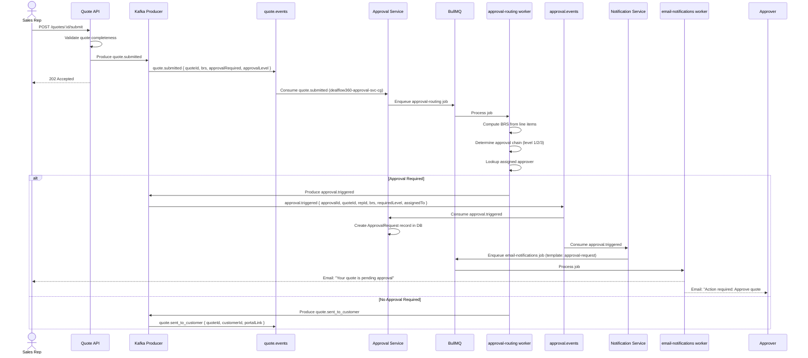
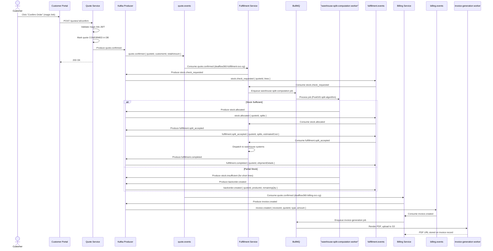
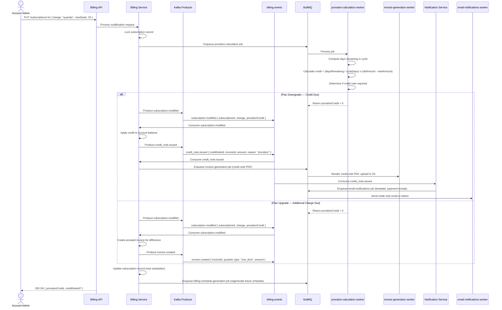

# 04 — Async Event & Worker Job Catalog

> **DealFlow360 B2B Sales Platform**
> Document version: 1.0.0 · Last updated: 2026-09-05 · Status: **Authoritative**

This catalog is the single source of truth for every asynchronous event produced or consumed by DealFlow360 and every background worker job managed by BullMQ. All engineering teams must keep schema changes in sync with this document via the ADR process.

---

## Table of Contents

1. [Kafka Overview](#1-kafka-overview)
2. [Kafka Topic Definitions](#2-kafka-topic-definitions)
3. [Event Schemas — TypeScript Interfaces](#3-event-schemas--typescript-interfaces)
4. [BullMQ Queue Catalog](#4-bullmq-queue-catalog)
5. [Event Flow Diagrams](#5-event-flow-diagrams)
6. [Error Handling & DLQ Strategy](#6-error-handling--dlq-strategy)

---

## 1. Kafka Overview

DealFlow360 uses **Apache Kafka in KRaft mode** (no ZooKeeper) as the primary event backbone for inter-service communication. Producers are implemented with **KafkaJS** and consumers are wired as **NestJS microservice transports** via `@nestjs/microservices`.

### 1.1 Topic Naming Convention

Topics follow a **domain-scoped dot-notation** scheme:

```
<domain>.<event_noun>
```

| Segment | Rule | Example |
|---|---|---|
| `domain` | Lowercase, singular noun representing the bounded context | `quote`, `approval`, `fulfillment`, `billing`, `analytics` |
| `event_noun` | Lowercase, underscore-separated past-participle or noun phrase | `created`, `line_added`, `sent_to_customer` |

**Full example:** `quote.events` is the *topic*; `quote.created` is the *event type* carried in the message header `eventType`.

> [!IMPORTANT]
> The topic name is the Kafka topic (physical resource). The event type is encoded as a message **header** key `eventType: string` on every message. Consumers use the header to dispatch to the correct handler — they do **not** infer the event type from the topic name alone.

### 1.2 Partition Strategy

| Topic | Partitions | Partition Key | Rationale |
|---|---|---|---|
| `quote.events` | 12 | `quoteId` | Preserves ordering for all state transitions on a single quote |
| `approval.events` | 6 | `approvalId` | Low-volume; ordering within an approval chain is critical |
| `fulfillment.events` | 12 | `quoteId` | Co-partitioned with `quote.events` for exactly-one-quote ordering |
| `billing.events` | 12 | `invoiceId` or `subscriptionId` | Independent billing lifecycle; high throughput from payment webhooks |
| `analytics.events` | 3 | `repId` (where present) or round-robin | Write-intensive, read by batch consumers; ordering not required |

Partition counts are powers of two or multiples of the planned consumer-group concurrency to allow even distribution without remainder partitions.

### 1.3 Consumer Group Naming Convention

```
dealflow360-<service>-cg
```

| Service slug | Full group name | Subscribes to |
|---|---|---|
| `quote-svc` | `dealflow360-quote-svc-cg` | `quote.events` |
| `approval-svc` | `dealflow360-approval-svc-cg` | `quote.events`, `approval.events` |
| `fulfillment-svc` | `dealflow360-fulfillment-svc-cg` | `quote.events`, `fulfillment.events` |
| `billing-svc` | `dealflow360-billing-svc-cg` | `quote.events`, `billing.events` |
| `notification-svc` | `dealflow360-notification-svc-cg` | `quote.events`, `approval.events`, `billing.events` |
| `analytics-svc` | `dealflow360-analytics-svc-cg` | `quote.events`, `approval.events`, `analytics.events` |
| `audit-svc` | `dealflow360-audit-svc-cg` | All topics (fan-out audit trail) |

> [!NOTE]
> Each NestJS microservice declares its consumer group in `ClientsModule` registration. Never reuse a consumer group name across services — this would cause unpredictable partition assignment.

### 1.4 Retention Policy Recommendations

| Topic | Retention Time | Retention Bytes | Compaction | Rationale |
|---|---|---|---|---|
| `quote.events` | 90 days | 50 GB | None | Long audit window required for sales compliance |
| `approval.events` | 90 days | 10 GB | None | Approval audit trail (regulatory) |
| `fulfillment.events` | 30 days | 20 GB | None | Operational; replayed only on warehouse system failures |
| `billing.events` | 365 days | 30 GB | None | Financial records; 1-year retention per accounting policy |
| `analytics.events` | 7 days | 50 GB | None | Consumed immediately by stream processors; no replay need |

> [!TIP]
> Enable **Tiered Storage** (Kafka 3.6+) for `billing.events` and `quote.events` to offload cold segments to object storage without changing retention windows.

---

## 2. Kafka Topic Definitions

### 2.1 `quote.events`

| Property | Value |
|---|---|
| **Topic name** | `quote.events` |
| **Partitions** | 12 |
| **Replication factor** | 3 |
| **Retention** | 90 days |
| **Partition key** | `quoteId` |
| **Min ISR** | 2 |

#### Event Types

| Event Type | Trigger | Key Payload Fields |
|---|---|---|
| `quote.created` | Sales rep creates a new quote | `quoteId`, `repId`, `customerId`, `timestamp`, `metadata` |
| `quote.line_added` | Line item added to an existing draft | `quoteId`, `lineId`, `productId`, `quantity`, `discountPct` |
| `quote.submitted` | Rep submits quote for approval/send | `quoteId`, `brs`, `approvalRequired`, `approvalLevel` |
| `quote.sent_to_customer` | Quote dispatched to customer portal | `quoteId`, `customerId`, `portalLink` |
| `quote.confirmed` | Customer accepts and confirms | `quoteId`, `customerId`, `totalAmount` |
| `quote.cancelled` | Quote cancelled by rep or customer | `quoteId`, `reason` |

---

### 2.2 `approval.events`

| Property | Value |
|---|---|
| **Topic name** | `approval.events` |
| **Partitions** | 6 |
| **Replication factor** | 3 |
| **Retention** | 90 days |
| **Partition key** | `approvalId` |
| **Min ISR** | 2 |

#### Event Types

| Event Type | Trigger | Key Payload Fields |
|---|---|---|
| `approval.triggered` | BRS threshold breached on submit | `approvalId`, `quoteId`, `repId`, `brs`, `requiredLevel`, `assignedTo` |
| `approval.approved` | Approver accepts the quote | `approvalId`, `quoteId`, `approverId`, `level`, `comment`, `timestamp` |
| `approval.rejected` | Approver rejects the quote | `approvalId`, `quoteId`, `approverId`, `reason`, `timestamp` |
| `approval.returned` | Approver sends back for revision | `approvalId`, `quoteId`, `approverId`, `reason` |
| `approval.escalated` | Timeout or manual escalation | `approvalId`, `quoteId`, `fromLevel`, `toLevel`, `reason` |

---

### 2.3 `fulfillment.events`

| Property | Value |
|---|---|
| **Topic name** | `fulfillment.events` |
| **Partitions** | 12 |
| **Replication factor** | 3 |
| **Retention** | 30 days |
| **Partition key** | `quoteId` |
| **Min ISR** | 2 |

#### Event Types

| Event Type | Trigger | Key Payload Fields |
|---|---|---|
| `stock.check_requested` | Quote confirmed; fulfillment svc initiates check | `quoteId`, `lines: [{productId, quantity}]` |
| `stock.allocated` | Stock successfully reserved across warehouses | `quoteId`, `splits: [{warehouseId, productId, quantity}]` |
| `stock.insufficient` | Insufficient stock found for a line | `quoteId`, `productId`, `requested`, `available` |
| `fulfillment.split_accepted` | Rep/system accepts multi-warehouse split | `quoteId`, `splits`, `estimatedCost` |
| `fulfillment.completed` | Physical shipment dispatched | `quoteId`, `shipmentDetails` |
| `backorder.created` | Remaining quantity placed on backorder | `quoteId`, `productId`, `remainingQty` |

---

### 2.4 `billing.events`

| Property | Value |
|---|---|
| **Topic name** | `billing.events` |
| **Partitions** | 12 |
| **Replication factor** | 3 |
| **Retention** | 365 days |
| **Partition key** | `invoiceId` / `subscriptionId` |
| **Min ISR** | 2 |

#### Event Types

| Event Type | Trigger | Key Payload Fields |
|---|---|---|
| `invoice.created` | New invoice generated | `invoiceId`, `quoteId`, `type: one_time\|recurring`, `amount` |
| `payment.succeeded` | Payment gateway confirms success | `invoiceId`, `paymentId`, `amount`, `timestamp` |
| `payment.failed` | Payment gateway returns failure | `invoiceId`, `reason`, `retryAt` |
| `subscription.created` | New recurring subscription activated | `subscriptionId`, `customerId`, `planInterval`, `amount` |
| `subscription.modified` | Seat count or plan tier changed | `subscriptionId`, `change: quantity\|plan`, `prorationCredit` |
| `subscription.cancelled` | Subscription cancellation requested | `subscriptionId`, `effectiveDate`, `creditNote` |
| `credit_note.issued` | Credit note generated after cancel/proration | `creditNoteId`, `invoiceId`, `amount`, `reason` |

---

### 2.5 `analytics.events`

| Property | Value |
|---|---|
| **Topic name** | `analytics.events` |
| **Partitions** | 3 |
| **Replication factor** | 3 |
| **Retention** | 7 days |
| **Partition key** | `repId` (where present), else round-robin |
| **Min ISR** | 2 |

#### Event Types

| Event Type | Trigger | Key Payload Fields |
|---|---|---|
| `discount.anomaly_detected` | Z-score exceeds ±2σ threshold | `repId`, `quoteId`, `category`, `appliedDiscount`, `mean`, `sigma`, `zScore` |
| `deal.stalled` | No state change in configurable window | `quoteId`, `repId`, `daysSinceUpdate`, `currentStatus` |
| `quote.velocity_snapshot` | Scheduled hourly aggregation | `timestamp`, `created`, `confirmed`, `rejected` |

---

## 3. Event Schemas — TypeScript Interfaces

All event messages share a common envelope. The payload is the `data` field typed per event.

```typescript
// src/shared/kafka/kafka-event-envelope.interface.ts

export interface KafkaEventEnvelope<T = unknown> {
  /** Unique event ID (UUID v4) — set by the producer */
  eventId: string;
  /** ISO-8601 UTC timestamp of when the event was produced */
  producedAt: string;
  /** Kafka topic this event belongs to */
  topic: string;
  /** Dot-notation event type, e.g. "quote.created" */
  eventType: string;
  /** Schema version for forward-compatibility */
  schemaVersion: '1.0';
  /** Service that produced this event */
  source: string;
  /** Strongly-typed event payload */
  data: T;
}
```

---

### 3.1 `quote.events` Schemas

```typescript
// src/modules/quote/events/quote-events.interfaces.ts

export interface QuoteMetadata {
  channel: 'web' | 'api' | 'mobile';
  campaignId?: string;
  opportunityId?: string;
}

/** quote.created */
export interface QuoteCreatedPayload {
  quoteId: string;
  repId: string;
  customerId: string;
  timestamp: string; // ISO-8601
  metadata: QuoteMetadata;
}

/** quote.line_added */
export interface QuoteLineAddedPayload {
  quoteId: string;
  lineId: string;
  productId: string;
  quantity: number;
  /** Discount percentage, 0–100 */
  discountPct: number;
}

/** quote.submitted */
export interface QuoteSubmittedPayload {
  quoteId: string;
  /** Blended Revenue Score, 0–100 */
  brs: number;
  approvalRequired: boolean;
  /** Approval level required: 1 = manager, 2 = director, 3 = VP */
  approvalLevel: 1 | 2 | 3 | null;
}

/** quote.sent_to_customer */
export interface QuoteSentToCustomerPayload {
  quoteId: string;
  customerId: string;
  /** Signed JWT magic-link URL */
  portalLink: string;
}

/** quote.confirmed */
export interface QuoteConfirmedPayload {
  quoteId: string;
  customerId: string;
  /** Total confirmed amount in USD cents */
  totalAmount: number;
}

/** quote.cancelled */
export interface QuoteCancelledPayload {
  quoteId: string;
  reason: string;
}
```

---

### 3.2 `approval.events` Schemas

```typescript
// src/modules/approval/events/approval-events.interfaces.ts

export type ApprovalLevel = 1 | 2 | 3;

/** approval.triggered */
export interface ApprovalTriggeredPayload {
  approvalId: string;
  quoteId: string;
  repId: string;
  brs: number;
  requiredLevel: ApprovalLevel;
  /** User ID of the approver this was assigned to */
  assignedTo: string;
}

/** approval.approved */
export interface ApprovalApprovedPayload {
  approvalId: string;
  quoteId: string;
  approverId: string;
  level: ApprovalLevel;
  comment: string;
  timestamp: string;
}

/** approval.rejected */
export interface ApprovalRejectedPayload {
  approvalId: string;
  quoteId: string;
  approverId: string;
  reason: string;
  timestamp: string;
}

/** approval.returned */
export interface ApprovalReturnedPayload {
  approvalId: string;
  quoteId: string;
  approverId: string;
  /** Revision guidance for the rep */
  reason: string;
}

/** approval.escalated */
export interface ApprovalEscalatedPayload {
  approvalId: string;
  quoteId: string;
  fromLevel: ApprovalLevel;
  toLevel: ApprovalLevel;
  reason: 'timeout' | 'manual' | 'policy';
}
```

---

### 3.3 `fulfillment.events` Schemas

```typescript
// src/modules/fulfillment/events/fulfillment-events.interfaces.ts

export interface LineItem {
  productId: string;
  quantity: number;
}

export interface WarehouseSplit {
  warehouseId: string;
  productId: string;
  quantity: number;
}

export interface ShipmentDetails {
  trackingNumber: string;
  carrier: 'UPS' | 'FedEx' | 'DHL' | 'internal';
  estimatedDelivery: string; // ISO-8601 date
  warehouseId: string;
}

/** stock.check_requested */
export interface StockCheckRequestedPayload {
  quoteId: string;
  lines: LineItem[];
}

/** stock.allocated */
export interface StockAllocatedPayload {
  quoteId: string;
  splits: WarehouseSplit[];
}

/** stock.insufficient */
export interface StockInsufficientPayload {
  quoteId: string;
  productId: string;
  requested: number;
  available: number;
}

/** fulfillment.split_accepted */
export interface FulfillmentSplitAcceptedPayload {
  quoteId: string;
  splits: WarehouseSplit[];
  /** Estimated additional shipping cost in USD cents */
  estimatedCost: number;
}

/** fulfillment.completed */
export interface FulfillmentCompletedPayload {
  quoteId: string;
  shipmentDetails: ShipmentDetails[];
}

/** backorder.created */
export interface BackorderCreatedPayload {
  quoteId: string;
  productId: string;
  remainingQty: number;
}
```

---

### 3.4 `billing.events` Schemas

```typescript
// src/modules/billing/events/billing-events.interfaces.ts

export type InvoiceType = 'one_time' | 'recurring';
export type SubscriptionChange = 'quantity' | 'plan';
export type PlanInterval = 'monthly' | 'quarterly' | 'annual';

/** invoice.created */
export interface InvoiceCreatedPayload {
  invoiceId: string;
  quoteId: string;
  type: InvoiceType;
  /** Amount in USD cents */
  amount: number;
}

/** payment.succeeded */
export interface PaymentSucceededPayload {
  invoiceId: string;
  paymentId: string;
  amount: number;
  timestamp: string;
}

/** payment.failed */
export interface PaymentFailedPayload {
  invoiceId: string;
  reason: string;
  /** ISO-8601 UTC timestamp of scheduled retry */
  retryAt: string;
}

/** subscription.created */
export interface SubscriptionCreatedPayload {
  subscriptionId: string;
  customerId: string;
  planInterval: PlanInterval;
  /** Recurring amount in USD cents */
  amount: number;
}

/** subscription.modified */
export interface SubscriptionModifiedPayload {
  subscriptionId: string;
  change: SubscriptionChange;
  /** Proration credit in USD cents (negative = customer owes more) */
  prorationCredit: number;
}

/** subscription.cancelled */
export interface SubscriptionCancelledPayload {
  subscriptionId: string;
  /** ISO-8601 date the cancellation takes effect */
  effectiveDate: string;
  /** Reference to the credit note issued, if any */
  creditNote: string | null;
}

/** credit_note.issued */
export interface CreditNoteIssuedPayload {
  creditNoteId: string;
  invoiceId: string;
  /** Credit amount in USD cents */
  amount: number;
  reason: 'cancellation' | 'proration' | 'dispute' | 'manual';
}
```

---

### 3.5 `analytics.events` Schemas

```typescript
// src/modules/analytics/events/analytics-events.interfaces.ts

/** discount.anomaly_detected */
export interface DiscountAnomalyDetectedPayload {
  repId: string;
  quoteId: string;
  /** Product category the anomaly was detected in */
  category: string;
  /** Discount % applied on the quote line */
  appliedDiscount: number;
  /** Rolling 90-day mean discount for this category x rep */
  mean: number;
  /** Rolling 90-day standard deviation */
  sigma: number;
  /** Z-score: (appliedDiscount - mean) / sigma */
  zScore: number;
}

/** deal.stalled */
export interface DealStalledPayload {
  quoteId: string;
  repId: string;
  daysSinceUpdate: number;
  currentStatus:
    | 'draft'
    | 'submitted'
    | 'pending_approval'
    | 'sent_to_customer'
    | 'confirmed';
}

/** quote.velocity_snapshot */
export interface QuoteVelocitySnapshotPayload {
  /** ISO-8601 UTC timestamp of snapshot */
  timestamp: string;
  /** Count of quotes created in the last hour */
  created: number;
  /** Count of quotes confirmed in the last hour */
  confirmed: number;
  /** Count of quotes rejected/cancelled in the last hour */
  rejected: number;
}
```

---

## 4. BullMQ Queue Catalog

All queues use **BullMQ** backed by **Redis 7** (standalone or Sentinel). Workers are instantiated in their respective NestJS service module using `BullModule.registerQueue()`.

### Global Queue Defaults

```typescript
// src/shared/bullmq/queue-defaults.ts
import { QueueOptions } from 'bullmq';

export const GLOBAL_QUEUE_DEFAULTS: Partial<QueueOptions> = {
  defaultJobOptions: {
    removeOnComplete: { count: 500 },
    removeOnFail: false, // keep failed jobs for DLQ inspection
  },
};
```

> [!WARNING]
> Set `removeOnFail: false` globally so failed jobs are not silently discarded. The DLQ processor relies on BullMQ's `failed` event to forward jobs after all retries are exhausted.

---

### Queue 1 — `email-notifications`

| Property | Value |
|---|---|
| **Queue name** | `email-notifications` |
| **Purpose** | Send transactional emails: approval requests, magic links, nudges, payment receipts |
| **Concurrency** | 10 |
| **Retries** | 3 |
| **Backoff type** | Exponential |
| **Backoff delay** | 2 000 ms (2s base; effective delays: 2s → 4s → 8s) |
| **Timeout** | 15 000 ms |
| **DLQ** | `email-notifications-dlq` |

```typescript
// src/modules/notification/queues/email-notifications.types.ts

export type EmailTemplateId =
  | 'approval-request'
  | 'magic-link'
  | 'deal-nudge'
  | 'payment-receipt'
  | 'payment-failed'
  | 'quote-confirmed';

export interface EmailNotificationJobPayload {
  /** Recipient email address */
  to: string;
  /** Display name of recipient */
  recipientName: string;
  templateId: EmailTemplateId;
  /** Template variable substitutions */
  variables: Record<string, string | number | boolean>;
  /** Idempotency key to prevent duplicate sends */
  idempotencyKey: string;
}
```

```typescript
// src/modules/notification/workers/email-notifications.worker.ts (excerpt)
import { Worker, Job } from 'bullmq';
import { EmailNotificationJobPayload } from './email-notifications.types';

const worker = new Worker<EmailNotificationJobPayload>(
  'email-notifications',
  async (job: Job<EmailNotificationJobPayload>) => {
    // call SendGrid / SES adapter
  },
  {
    concurrency: 10,
    connection: redisConnection,
    limiter: { max: 100, duration: 1000 }, // 100 emails/sec cap
  },
);
```

---

### Queue 2 — `approval-routing`

| Property | Value |
|---|---|
| **Queue name** | `approval-routing` |
| **Purpose** | Compute BRS from quote lines and determine the approval chain (manager → director → VP) |
| **Concurrency** | 5 |
| **Retries** | 2 |
| **Backoff type** | Fixed |
| **Backoff delay** | 1 000 ms |
| **Timeout** | 10 000 ms |
| **DLQ** | `approval-routing-dlq` |

```typescript
// src/modules/approval/queues/approval-routing.types.ts

export interface QuoteLineForBrs {
  productId: string;
  listPrice: number;
  discountPct: number;
  quantity: number;
  category: string;
}

export interface ApprovalRoutingJobPayload {
  quoteId: string;
  repId: string;
  customerId: string;
  lines: QuoteLineForBrs[];
  /** Pre-computed BRS if available (skip BRS step) */
  brsOverride?: number;
}

export interface ApprovalRoutingResult {
  brs: number;
  approvalRequired: boolean;
  approvalLevel: 1 | 2 | 3 | null;
  assignedApproverId: string | null;
}
```

---

### Queue 3 — `warehouse-split-computation`

| Property | Value |
|---|---|
| **Queue name** | `warehouse-split-computation` |
| **Purpose** | Execute PostGIS-based nearest-warehouse algorithm to split order lines across warehouse locations |
| **Concurrency** | 3 |
| **Retries** | 2 |
| **Backoff type** | Fixed |
| **Backoff delay** | 2 000 ms |
| **Timeout** | 30 000 ms |
| **DLQ** | `warehouse-split-computation-dlq` |

```typescript
// src/modules/fulfillment/queues/warehouse-split-computation.types.ts

export interface CustomerLocation {
  lat: number;
  lng: number;
  countryCode: string;
}

export interface WarehouseSplitJobPayload {
  quoteId: string;
  customerLocation: CustomerLocation;
  lines: Array<{
    productId: string;
    quantity: number;
  }>;
  /** Maximum number of warehouses allowed in the split */
  maxSplits: number;
}

export interface WarehouseSplitResult {
  splits: Array<{
    warehouseId: string;
    productId: string;
    quantity: number;
    /** Estimated shipping cost in USD cents */
    shippingCost: number;
  }>;
  totalEstimatedCost: number;
}
```

---

### Queue 4 — `billing-schedule-generation`

| Property | Value |
|---|---|
| **Queue name** | `billing-schedule-generation` |
| **Purpose** | Generate the full future billing schedule (invoice due dates + amounts) on subscription creation |
| **Concurrency** | 5 |
| **Retries** | 3 |
| **Backoff type** | Exponential |
| **Backoff delay** | 3 000 ms |
| **Timeout** | 20 000 ms |
| **DLQ** | `billing-schedule-generation-dlq` |

```typescript
// src/modules/billing/queues/billing-schedule-generation.types.ts

export type PlanInterval = 'monthly' | 'quarterly' | 'annual';

export interface BillingScheduleGenerationJobPayload {
  subscriptionId: string;
  customerId: string;
  planInterval: PlanInterval;
  /** Amount per billing cycle in USD cents */
  cycleAmount: number;
  /** ISO-8601 date when the first billing cycle starts */
  startDate: string;
  /** Number of cycles to pre-generate (default: 12) */
  cyclesToGenerate: number;
}
```

---

### Queue 5 — `proration-calculation`

| Property | Value |
|---|---|
| **Queue name** | `proration-calculation` |
| **Purpose** | Compute mid-cycle proration credit or debit when a subscription is modified |
| **Concurrency** | 5 |
| **Retries** | 2 |
| **Backoff type** | Fixed |
| **Backoff delay** | 1 000 ms |
| **Timeout** | 10 000 ms |
| **DLQ** | `proration-calculation-dlq` |

```typescript
// src/modules/billing/queues/proration-calculation.types.ts

export type SubscriptionChange = 'quantity' | 'plan';

export interface ProrationCalculationJobPayload {
  subscriptionId: string;
  invoiceId: string;
  changeType: SubscriptionChange;
  /** ISO-8601 datetime the change was requested */
  changeRequestedAt: string;
  /** Billing cycle start date (ISO-8601) */
  cycleStart: string;
  /** Billing cycle end date (ISO-8601) */
  cycleEnd: string;
  /** Amount already billed for this cycle in USD cents */
  billedAmount: number;
  /** New amount per cycle after the change in USD cents */
  newCycleAmount: number;
}

export interface ProrationResult {
  /** Positive = credit to customer; Negative = customer owes more */
  prorationCredit: number;
  creditNoteRequired: boolean;
}
```

---

### Queue 6 — `invoice-generation`

| Property | Value |
|---|---|
| **Queue name** | `invoice-generation` |
| **Purpose** | Render PDF invoice using Puppeteer/WeasyPrint, upload to S3, attach download URL to invoice record |
| **Concurrency** | 5 |
| **Retries** | 3 |
| **Backoff type** | Exponential |
| **Backoff delay** | 5 000 ms |
| **Timeout** | 60 000 ms |
| **DLQ** | `invoice-generation-dlq` |

```typescript
// src/modules/billing/queues/invoice-generation.types.ts

export interface InvoiceGenerationJobPayload {
  invoiceId: string;
  quoteId: string;
  customerId: string;
  /** ISO-8601 date */
  issuedAt: string;
  /** ISO-8601 date */
  dueDate: string;
  lineItems: Array<{
    description: string;
    quantity: number;
    unitPrice: number;
    discount: number;
    totalPrice: number;
  }>;
  subtotal: number;
  taxAmount: number;
  totalAmount: number;
  /** Target S3 key for the rendered PDF */
  s3Key: string;
}
```

---

### Queue 7 — `deal-health-scanner`

| Property | Value |
|---|---|
| **Queue name** | `deal-health-scanner` |
| **Purpose** | Cron job — scan all open quotes for stalled deals and emit `deal.stalled` analytics events |
| **Schedule** | Every 1 hour (`0 * * * *`) |
| **Concurrency** | 1 |
| **Retries** | 1 |
| **Timeout** | 120 000 ms |
| **DLQ** | `deal-health-scanner-dlq` |

```typescript
// src/modules/analytics/queues/deal-health-scanner.types.ts

export interface DealHealthScannerJobPayload {
  /** ISO-8601 datetime the scan was triggered */
  triggeredAt: string;
  /** Minimum days without update to classify as stalled */
  stalledThresholdDays: number;
  /** Statuses to include in the scan */
  targetStatuses: string[];
}

export interface DealHealthScanResult {
  scannedCount: number;
  stalledCount: number;
  eventsEmitted: number;
}
```

```typescript
// src/modules/analytics/schedulers/deal-health.scheduler.ts (excerpt)
import { Injectable } from '@nestjs/common';
import { Cron, CronExpression } from '@nestjs/schedule';
import { InjectQueue } from '@nestjs/bullmq';
import { Queue } from 'bullmq';

@Injectable()
export class DealHealthScheduler {
  constructor(
    @InjectQueue('deal-health-scanner') private readonly queue: Queue,
  ) {}

  @Cron(CronExpression.EVERY_HOUR)
  async scheduleScan(): Promise<void> {
    await this.queue.add(
      'scan',
      {
        triggeredAt: new Date().toISOString(),
        stalledThresholdDays: 3,
        targetStatuses: ['draft', 'submitted', 'pending_approval', 'sent_to_customer'],
      },
      { jobId: `deal-health-${Date.now()}` },
    );
  }
}
```

---

### Queue 8 — `anomaly-detector`

| Property | Value |
|---|---|
| **Queue name** | `anomaly-detector` |
| **Purpose** | Cron job — compute rolling discount z-scores per rep × category; emit `discount.anomaly_detected` events where `|z| > 2` |
| **Schedule** | Every 6 hours (`0 */6 * * *`) |
| **Concurrency** | 1 |
| **Retries** | 1 |
| **Timeout** | 300 000 ms (5 min) |
| **DLQ** | `anomaly-detector-dlq` |

```typescript
// src/modules/analytics/queues/anomaly-detector.types.ts

export interface AnomalyDetectorJobPayload {
  triggeredAt: string;
  /** Rolling window in days for mean/sigma computation */
  rollingWindowDays: number;
  /** Z-score threshold to classify as anomalous */
  zScoreThreshold: number;
}

export interface AnomalyDetectorResult {
  repCategoryCombinationsScanned: number;
  anomaliesDetected: number;
  eventsEmitted: number;
}
```

---

### Queue 9 — `payment-webhook-processor`

| Property | Value |
|---|---|
| **Queue name** | `payment-webhook-processor` |
| **Purpose** | Process inbound webhooks from the mock payment gateway; update invoice status; emit `payment.succeeded` or `payment.failed` to `billing.events` |
| **Concurrency** | 10 |
| **Retries** | 5 |
| **Backoff type** | Exponential |
| **Backoff delay** | 5 000 ms (5s base; effective: 5s → 10s → 20s → 40s → 80s) |
| **Timeout** | 15 000 ms |
| **DLQ** | `payment-webhook-processor-dlq` |

```typescript
// src/modules/billing/queues/payment-webhook-processor.types.ts

export type WebhookEventType =
  | 'payment.succeeded'
  | 'payment.failed'
  | 'payment.refunded'
  | 'chargeback.opened';

export interface PaymentWebhookProcessorJobPayload {
  /** Raw webhook payload from the gateway — preserved for audit */
  rawPayload: Record<string, unknown>;
  webhookEventType: WebhookEventType;
  gatewayEventId: string;
  invoiceId: string;
  amount: number;
  currency: string;
  /** HMAC-SHA256 signature from gateway for verification */
  signature: string;
  receivedAt: string;
}
```

---

### Queue 10 — `portal-link-expiry`

| Property | Value |
|---|---|
| **Queue name** | `portal-link-expiry` |
| **Purpose** | Cron job — invalidate magic links and customer portal quote tokens older than 48 hours |
| **Schedule** | Every 30 minutes (`*/30 * * * *`) |
| **Concurrency** | 1 |
| **Retries** | 1 |
| **Timeout** | 30 000 ms |
| **DLQ** | `portal-link-expiry-dlq` |

```typescript
// src/modules/quote/queues/portal-link-expiry.types.ts

export interface PortalLinkExpiryJobPayload {
  triggeredAt: string;
  /** Age in hours after which a token is expired */
  expiryThresholdHours: number;
}

export interface PortalLinkExpiryResult {
  tokensScanned: number;
  tokensExpired: number;
}
```

### Queue Summary Table

| # | Queue Name | Type | Concurrency | Retries | Backoff | Timeout | DLQ |
|---|---|---|---|---|---|---|---|
| 1 | `email-notifications` | On-demand | 10 | 3 | Exp 2s | 15s | `email-notifications-dlq` |
| 2 | `approval-routing` | On-demand | 5 | 2 | Fixed 1s | 10s | `approval-routing-dlq` |
| 3 | `warehouse-split-computation` | On-demand | 3 | 2 | Fixed 2s | 30s | `warehouse-split-computation-dlq` |
| 4 | `billing-schedule-generation` | On-demand | 5 | 3 | Exp 3s | 20s | `billing-schedule-generation-dlq` |
| 5 | `proration-calculation` | On-demand | 5 | 2 | Fixed 1s | 10s | `proration-calculation-dlq` |
| 6 | `invoice-generation` | On-demand | 5 | 3 | Exp 5s | 60s | `invoice-generation-dlq` |
| 7 | `deal-health-scanner` | Cron 1hr | 1 | 1 | — | 120s | `deal-health-scanner-dlq` |
| 8 | `anomaly-detector` | Cron 6hr | 1 | 1 | — | 300s | `anomaly-detector-dlq` |
| 9 | `payment-webhook-processor` | On-demand | 10 | 5 | Exp 5s | 15s | `payment-webhook-processor-dlq` |
| 10 | `portal-link-expiry` | Cron 30min | 1 | 1 | — | 30s | `portal-link-expiry-dlq` |

---

## 5. Event Flow Diagrams

### 5.1 Quote Submission → Approval Routing



---

### 5.2 Customer Confirms → Fulfillment Event Flow



---

### 5.3 Subscription Modification → Proration → Credit Note



---

## 6. Error Handling & DLQ Strategy

### 6.1 Kafka Consumer Error Handling

Failed Kafka message processing follows a three-tier strategy:

```
+--------------------------------------------------------------+
|                    Kafka Message Received                     |
+------------------------------+-------------------------------+
                               |
                         +-----v------+
                         |  Process   |
                         +-----+------+
               +-----------+--+--+-----------+
          Success                         Failure
               |                              |
         Commit offset                  Retry (max 3x)
                                              |
                                   +----------v----------+
                                   |  Retries Exhausted  |
                                   +----------+----------+
                                              |
                                 +------------v-------------+
                                 |  Publish to Dead Topic   |
                                 |  <topic>.dead            |
                                 +------------+-------------+
                                              |
                                      Alert triggered
                                      (PagerDuty / Slack)
```

**Dead topic naming:** `<original-topic>.dead`

| Original Topic | Dead Topic |
|---|---|
| `quote.events` | `quote.events.dead` |
| `approval.events` | `approval.events.dead` |
| `fulfillment.events` | `fulfillment.events.dead` |
| `billing.events` | `billing.events.dead` |
| `analytics.events` | `analytics.events.dead` |

Each message forwarded to a dead topic is enriched with additional headers:

```typescript
interface DeadMessageHeaders {
  /** Original eventType header value */
  'x-original-event-type': string;
  /** ISO-8601 timestamp of original message */
  'x-original-timestamp': string;
  /** Consumer group that failed */
  'x-failed-consumer-group': string;
  /** Last exception message */
  'x-error-message': string;
  /** Number of processing attempts made */
  'x-retry-count': string;
}
```

### 6.2 BullMQ DLQ Strategy

When a BullMQ job exhausts all retry attempts, the `failed` event fires. A dedicated **DLQ forwarder** processor subscribes to failed events across all queues and:

1. Persists the failed job (payload + error stack) to the `job_failures` PostgreSQL table
2. Increments the DLQ counter in Redis: `dlq:<queue-name>:count`
3. Triggers an alert if the counter exceeds the threshold

**DLQ naming convention:** `<queue-name>-dlq`

```typescript
// src/shared/bullmq/dlq-forwarder.ts
import { Queue, Job } from 'bullmq';

export class DlqForwarder {
  private readonly dlqQueues = new Map<string, Queue>();

  async onJobFailed(job: Job, error: Error, queueName: string): Promise<void> {
    const dlqName = `${queueName}-dlq`;

    // Lazy-init the DLQ queue instance
    if (!this.dlqQueues.has(dlqName)) {
      this.dlqQueues.set(dlqName, new Queue(dlqName, { connection: redisConnection }));
    }

    const dlq = this.dlqQueues.get(dlqName)!;

    await dlq.add('dead-job', {
      originalQueue: queueName,
      originalJobId: job.id,
      payload: job.data,
      failedAt: new Date().toISOString(),
      errorMessage: error.message,
      errorStack: error.stack,
      attemptsMade: job.attemptsMade,
    });

    await this.incrementDlqCounter(dlqName);
  }

  private async incrementDlqCounter(dlqName: string): Promise<void> {
    const key = `dlq:${dlqName}:count`;
    const count = await redisClient.incr(key);

    if (count > DLQ_ALERT_THRESHOLD) {
      await this.triggerAlert(dlqName, count);
    }
  }
}
```

### 6.3 DLQ Alert Thresholds

| Queue | Alert Threshold | Severity | Notification Channel |
|---|---|---|---|
| `email-notifications-dlq` | > 10 messages | Warning | Slack `#ops-alerts` |
| `approval-routing-dlq` | > 5 messages | Critical | PagerDuty + Slack |
| `warehouse-split-computation-dlq` | > 5 messages | Critical | PagerDuty + Slack |
| `billing-schedule-generation-dlq` | > 3 messages | Critical | PagerDuty + Slack |
| `proration-calculation-dlq` | > 3 messages | Critical | PagerDuty + Slack |
| `invoice-generation-dlq` | > 10 messages | Warning | Slack `#ops-alerts` |
| `deal-health-scanner-dlq` | > 2 messages | Warning | Slack `#ops-alerts` |
| `anomaly-detector-dlq` | > 2 messages | Warning | Slack `#ops-alerts` |
| `payment-webhook-processor-dlq` | > 5 messages | Critical | PagerDuty + Slack |
| `portal-link-expiry-dlq` | > 10 messages | Info | Slack `#ops-alerts` |

> [!CAUTION]
> `approval-routing-dlq`, `billing-schedule-generation-dlq`, and `payment-webhook-processor-dlq` are classified as **Critical** because failures are not self-healing — a human engineer must triage and replay jobs. Automated replay is disabled on these DLQs to prevent monetary discrepancies.

### 6.4 Manual Job Replay

Failed jobs can be replayed from the DLQ using the BullMQ Board UI (Bull Board) or via the admin CLI:

```bash
# Replay all jobs from a specific DLQ
pnpm run admin:dlq:replay --queue payment-webhook-processor-dlq

# Replay a single job by ID
pnpm run admin:dlq:replay --queue invoice-generation-dlq --job-id 12345

# Drain (discard) a DLQ after investigation
pnpm run admin:dlq:drain --queue email-notifications-dlq
```

### 6.5 Idempotency Requirements

All workers **must** implement idempotency guards:

| Queue | Idempotency Strategy |
|---|---|
| `email-notifications` | `idempotencyKey` checked against `sent_emails` table before dispatch |
| `invoice-generation` | Check `invoices.pdf_s3_key IS NOT NULL` before rendering |
| `payment-webhook-processor` | `gatewayEventId` deduped against `processed_webhooks` table (unique constraint) |
| `proration-calculation` | Idempotent write — proration stored with `UPSERT ON CONFLICT (subscriptionId, cycleStart)` |
| `warehouse-split-computation` | Idempotent — split result stored with `UPSERT ON CONFLICT (quoteId)` |

> [!NOTE]
> Cron queues (`deal-health-scanner`, `anomaly-detector`, `portal-link-expiry`) are inherently idempotent — each run performs a full scan and overwrites any prior state. Duplicate runs produce the same outcome.

---

*End of document — DealFlow360 Async Event & Worker Job Catalog v1.0.0*
