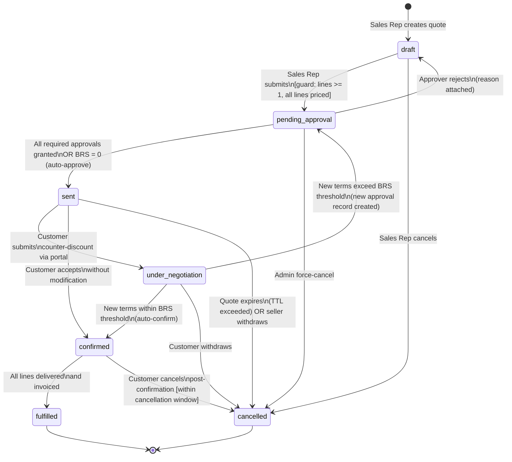
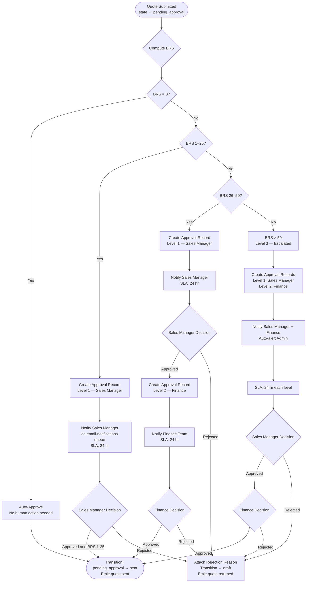
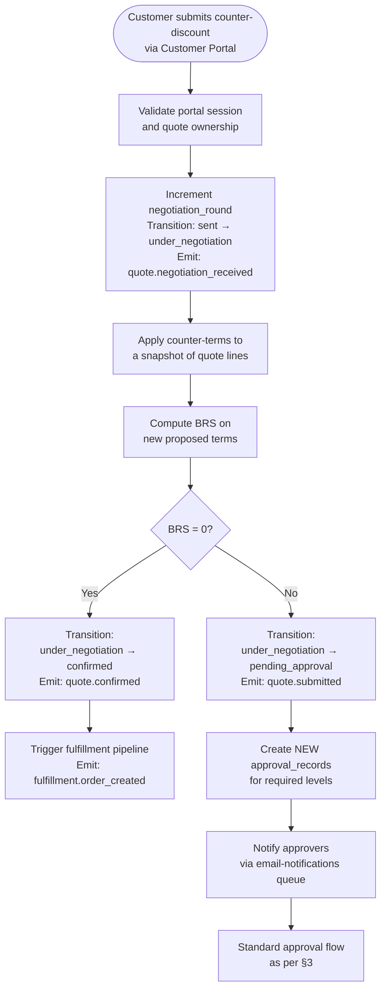

# DealFlow360 — Quotation Lifecycle & Governance Specification

**Document ID:** DF360-SPEC-005  
**Version:** 1.0.0  
**Status:** Approved  
**Owner:** Platform Architecture Team  
**Last Updated:** 2026-09-05  

---

## Table of Contents

1. [Quote Status State Machine](#1-quote-status-state-machine)  
2. [Blended Risk Score (BRS) Algorithm](#2-blended-risk-score-brs-algorithm)  
3. [Approval Routing Rules](#3-approval-routing-rules)  
4. [Customer Negotiation Re-Approval](#4-customer-negotiation-re-approval)  
5. [Audit Log Specification](#5-audit-log-specification)  
6. [Governance Rules Summary Table](#6-governance-rules-summary-table)  

---

## 1. Quote Status State Machine

### 1.1 Formal State Definitions

| State | Code | Description | Terminal? |
|---|---|---|---|
| Draft | `draft` | Quote is being authored by a Sales Rep. Lines may be added, edited, or removed. No external visibility. | No |
| Pending Approval | `pending_approval` | Quote has been submitted for internal discount approval. Locked to edits. | No |
| Sent | `sent` | Quote has been dispatched to the customer for review. | No |
| Under Negotiation | `under_negotiation` | Customer has submitted counter-terms via the portal. | No |
| Confirmed | `confirmed` | All parties have agreed to the final terms. Triggers fulfillment pipeline. | No |
| Fulfilled | `fulfilled` | All line items have been delivered/invoiced. | **Yes** |
| Cancelled | `cancelled` | Quote was withdrawn by the seller or expired. | **Yes** |
| Rejected | `rejected` | Internal approvers declined the submitted quote. Quote is returned to `draft` for revision. | No (see §1.4) |

> **Note:** `rejected` is a transient holding state. The system immediately queues a `quote.returned` event and transitions the quote back to `draft` with an attached rejection reason, making the `draft` state the effective recovery point.

---

### 1.2 State Diagram



---

### 1.3 Transition Table

| # | From State | To State | Trigger | Actor | Guard Conditions | Kafka Event Published |
|---|---|---|---|---|---|---|
| T-01 | _(new)_ | `draft` | Sales Rep creates quote | `sales_rep` | Authenticated user has `quote:create` permission | `quote.created` |
| T-02 | `draft` | `pending_approval` | Sales Rep submits quote | `sales_rep` | ① ≥ 1 line item exists; ② All lines have unit price > 0; ③ Customer is linked; ④ Quote has valid expiry date | `quote.submitted` |
| T-03 | `draft` | `cancelled` | Sales Rep explicitly cancels | `sales_rep` | Quote owner OR admin | `quote.cancelled` |
| T-04 | `pending_approval` | `draft` | Approver rejects with reason | `sales_manager` / `finance` | Rejection reason is non-empty string (≥ 10 chars) | `quote.returned` |
| T-05 | `pending_approval` | `sent` | All approvals cleared OR BRS = 0 | `system` / `approver` | All required `approval` records have status = `approved` | `quote.sent` |
| T-06 | `pending_approval` | `cancelled` | Admin force-cancels | `admin` | Quote has been pending > 72 hr OR business closure | `quote.cancelled` |
| T-07 | `sent` | `under_negotiation` | Customer submits counter via portal | `customer` | Customer portal session valid; counter has ≥ 1 modified line | `quote.negotiation_received` |
| T-08 | `sent` | `confirmed` | Customer accepts quote as-is | `customer` | Quote not expired (expiry_date ≥ today) | `quote.confirmed` |
| T-09 | `sent` | `cancelled` | TTL expiry OR seller withdrawal | `system` / `sales_rep` | For TTL: expiry_date < today; for withdrawal: seller explicit action | `quote.cancelled` |
| T-10 | `under_negotiation` | `pending_approval` | Counter-terms exceed BRS threshold | `system` | BRS(new terms) > 0; new `approval` record created atomically | `quote.submitted` |
| T-11 | `under_negotiation` | `confirmed` | Counter-terms within BRS threshold | `system` | BRS(new terms) = 0 | `quote.confirmed` |
| T-12 | `under_negotiation` | `cancelled` | Customer explicitly withdraws | `customer` | Customer portal session valid | `quote.cancelled` |
| T-13 | `confirmed` | `fulfilled` | All lines invoiced and delivery confirmed | `erp_integration` | `fulfilled_lines_count` = `total_lines_count`; ERP webhook received | `quote.fulfilled` |
| T-14 | `confirmed` | `cancelled` | Customer cancels within window | `customer` / `admin` | Cancellation within configured `cancellation_window_hours` (default: 24 hr) | `quote.cancelled` |

---

### 1.4 Guard Conditions — Detail

| Transition | Guard ID | Condition | Failure Response |
|---|---|---|---|
| T-02 | G-01 | `quote.lines.length >= 1` | HTTP 422: `"Quote must have at least one line item"` |
| T-02 | G-02 | All `line.unit_price > 0` | HTTP 422: `"All line items must have a positive unit price"` |
| T-02 | G-03 | `quote.customer_id IS NOT NULL` | HTTP 422: `"Quote must be linked to a customer"` |
| T-02 | G-04 | `quote.expiry_date >= CURRENT_DATE + INTERVAL '1 day'` | HTTP 422: `"Quote expiry must be at least tomorrow"` |
| T-04 | G-05 | `rejection_reason.length >= 10` | HTTP 422: `"Rejection reason too short"` |
| T-08 | G-06 | `quote.expiry_date >= CURRENT_DATE` | HTTP 410: `"Quote has expired"` |
| T-13 | G-07 | ERP webhook payload contains `delivery_confirmed: true` for all lines | Webhook rejected; fulfillment not marked |
| T-14 | G-08 | `NOW() <= confirmed_at + cancellation_window_hours * INTERVAL '1 hour'` | HTTP 403: `"Cancellation window has closed"` |

---

## 2. Blended Risk Score (BRS) Algorithm

### 2.1 Conceptual Overview

The Blended Risk Score quantifies the aggregate discount risk of a quote by measuring how far each line item's applied discount exceeds its permitted ceiling, then blending those violations by their proportional contribution to the total order value. A score of `0` means the quote is fully compliant. Higher scores indicate greater deviation from pricing policy and route to progressively senior approvers.

---

### 2.2 Input Definitions

| Symbol | Type | Description |
|---|---|---|
| `appliedDiscount_i` | `number` (0–100) | Discount percentage applied to line item _i_ |
| `tierCeiling_i` | `number` (0–100) | Maximum permitted discount for the customer's pricing tier on SKU _i_. See §2.7 for ceiling resolution. |
| `lineTotal_i` | `number` (currency) | `quantity_i × unit_price_i × (1 − appliedDiscount_i / 100)` |
| `orderTotal` | `number` (currency) | `Σ lineTotal_i` across all _n_ lines |
| `n` | `integer` | Total number of line items |

---

### 2.3 Step-by-Step Algorithm

#### Step 1 — Per-Line Violation Score

For each line item _i_ (1 ≤ _i_ ≤ _n_):

```
lineViolation_i = max(0, (appliedDiscount_i - tierCeiling_i) / tierCeiling_i * 100)
```

**Interpretation:** A violation score of `25` means the applied discount is 25% higher than the permitted ceiling (relative, not absolute). A score of `0` means the line is fully compliant.

#### Step 2 — Line Weight

```
lineWeight_i = lineTotal_i / orderTotal
```

**Property:** All weights sum to 1: `Σ lineWeight_i = 1.0`

#### Step 3 — Weighted Blended Score

```
BRS = Σ (lineViolation_i × lineWeight_i)
```

#### Step 4 — Approval Level Determination

| BRS Range | Approval Level | Required Approvers | Auto-Alert |
|---|---|---|---|
| `BRS = 0` | **None** | — | None |
| `1 ≤ BRS ≤ 25` | **Level 1** | Sales Manager | None |
| `26 ≤ BRS ≤ 50` | **Level 2** | Sales Manager **+** Finance | None |
| `BRS > 50` | **Level 3 (Escalated)** | Sales Manager **+** Finance | Admin auto-alert email |

---

### 2.4 Worked Example

**Scenario:** A quote for three line items, customer on "Silver" tier.

| Line | SKU | Unit Price | Qty | Tier Ceiling | Applied Discount | Line Total (post-discount) |
|---|---|---|---|---|---|---|
| 1 | `SKU-001` | $200.00 | 10 | 15% | 20% | $1,600.00 |
| 2 | `SKU-002` | $500.00 | 5 | 10% | 10% | $2,250.00 |
| 3 | `SKU-003` | $150.00 | 20 | 20% | 35% | $1,950.00 |

**Order Total:** $1,600 + $2,250 + $1,950 = **$5,800.00**

---

**Step 1 — Per-Line Violation Scores:**

```
lineViolation_1 = max(0, (20 - 15) / 15 × 100) = max(0, 33.33) = 33.33
lineViolation_2 = max(0, (10 - 10) / 10 × 100) = max(0, 0)     = 0
lineViolation_3 = max(0, (35 - 20) / 20 × 100) = max(0, 75)    = 75.00
```

**Step 2 — Line Weights:**

```
lineWeight_1 = 1600 / 5800 = 0.2759
lineWeight_2 = 2250 / 5800 = 0.3879
lineWeight_3 = 1950 / 5800 = 0.3362
```

**Step 3 — BRS:**

```
BRS = (33.33 × 0.2759) + (0 × 0.3879) + (75 × 0.3362)
BRS = 9.196 + 0 + 25.215
BRS = 34.41
```

**Step 4 — Approval Level:**

BRS = **34.41** falls in the range `26–50` → **Level 2: Sales Manager + Finance approval required.**

---

### 2.5 TypeScript Pseudocode — BRS Engine

```typescript
// ─────────────────────────────────────────────────────────────────
// File: src/quotes/brs-engine.ts
// Blended Risk Score computation engine
// ─────────────────────────────────────────────────────────────────

export enum ApprovalLevel {
  NONE = 0,
  SALES_MANAGER = 1,
  SALES_MANAGER_AND_FINANCE = 2,
  ESCALATED_WITH_ADMIN_ALERT = 3,
}

export interface QuoteLine {
  id: string;
  skuId: string;
  unitPrice: number;              // in cents to avoid floating-point drift
  quantity: number;
  appliedDiscountPct: number;     // e.g. 20 for 20%
  resolvedTierCeilingPct: number; // after ceiling resolution (§2.7)
}

export interface BrsResult {
  brs: number;
  approvalLevel: ApprovalLevel;
  lineViolations: LineViolationDetail[];
  orderTotal: number;
}

export interface LineViolationDetail {
  lineId: string;
  appliedDiscountPct: number;
  tierCeilingPct: number;
  violationScore: number;
  lineTotal: number;
  lineWeight: number;
  weightedContribution: number;
}

/**
 * Computes the Blended Risk Score for a quote.
 *
 * @param lines - Resolved quote lines with tier ceilings applied
 * @returns BrsResult containing the BRS, approval level, and per-line details
 * @throws {BrsEngineError} if any line has an unresolvable ceiling (see §2.6)
 */
export function computeBrs(lines: QuoteLine[]): BrsResult {
  if (lines.length === 0) {
    throw new BrsEngineError('BRS cannot be computed on a quote with no lines');
  }

  // ── Step 1 & 2: Compute line totals ────────────────────────────
  const lineTotals: number[] = lines.map((line) => {
    const grossTotal = line.unitPrice * line.quantity;
    const discountMultiplier = 1 - line.appliedDiscountPct / 100;
    return grossTotal * discountMultiplier;
  });

  const orderTotal = lineTotals.reduce((sum, t) => sum + t, 0);

  if (orderTotal <= 0) {
    throw new BrsEngineError(
      'Order total must be positive to compute BRS weights'
    );
  }

  // ── Step 1: Per-line violation scores ──────────────────────────
  const lineDetails: LineViolationDetail[] = lines.map((line, idx) => {
    const ceiling = line.resolvedTierCeilingPct;

    // Edge case §2.6: ceiling === 0 means no discount is permitted at all.
    // Any applied discount > 0 is a maximum violation (score capped at 100).
    let violationScore: number;
    if (ceiling === 0) {
      violationScore = line.appliedDiscountPct > 0 ? 100 : 0;
    } else {
      violationScore = Math.max(
        0,
        ((line.appliedDiscountPct - ceiling) / ceiling) * 100
      );
    }

    const lineTotal = lineTotals[idx];
    const lineWeight = lineTotal / orderTotal;
    const weightedContribution = violationScore * lineWeight;

    return {
      lineId: line.id,
      appliedDiscountPct: line.appliedDiscountPct,
      tierCeilingPct: ceiling,
      violationScore,
      lineTotal,
      lineWeight,
      weightedContribution,
    };
  });

  // ── Step 3: Weighted blended score ─────────────────────────────
  const brs = lineDetails.reduce(
    (sum, detail) => sum + detail.weightedContribution,
    0
  );

  // ── Step 4: Approval level determination ───────────────────────
  const approvalLevel = resolveApprovalLevel(brs);

  return { brs, approvalLevel, lineViolations: lineDetails, orderTotal };
}

function resolveApprovalLevel(brs: number): ApprovalLevel {
  if (brs === 0) return ApprovalLevel.NONE;
  if (brs <= 25) return ApprovalLevel.SALES_MANAGER;
  if (brs <= 50) return ApprovalLevel.SALES_MANAGER_AND_FINANCE;
  return ApprovalLevel.ESCALATED_WITH_ADMIN_ALERT;
}

export class BrsEngineError extends Error {
  constructor(message: string) {
    super(message);
    this.name = 'BrsEngineError';
  }
}
```

---

### 2.6 Edge Cases

#### Edge Case 1: Tier Ceiling Is Zero (`tierCeiling_i = 0`)

A ceiling of `0%` indicates that **no discount whatsoever is permitted** for this SKU at this customer tier (e.g., newly launched products, fixed-price government contracts).

**Resolution:** Division by zero is avoided by treating any `appliedDiscount > 0` as a full maximum violation score of `100`. If `appliedDiscount = 0`, violation is `0`.

```
if (tierCeiling_i === 0):
    lineViolation_i = appliedDiscount_i > 0 ? 100 : 0
```

#### Edge Case 2: No Category Ceiling Configured

If no category-specific or tier-specific ceiling has been configured for a SKU, the system **must not silently default to 0** (which would block all discounts). Instead:

1. Look up the global default ceiling from `pricing_policy.global_default_ceiling_pct` (platform-wide fallback, default: `10%`).
2. Log a `WARN`-level entry: `"No ceiling configured for SKU {id} on tier {tier}; falling back to global default {x}%"`.
3. Emit a `pricing.policy_gap_detected` Kafka event for the pricing ops team.

```typescript
async function resolveCeiling(
  skuId: string,
  tierCode: string,
  categoryId: string,
  db: DatabaseClient
): Promise<number> {
  // Priority 1: SKU-specific override
  const skuOverride = await db.query(
    'SELECT ceiling_pct FROM pricing_overrides WHERE sku_id = $1 AND tier_code = $2',
    [skuId, tierCode]
  );
  if (skuOverride.rows.length > 0) return skuOverride.rows[0].ceiling_pct;

  // Priority 2: Category ceiling
  const categoryCeiling = await db.query(
    'SELECT ceiling_pct FROM category_ceilings WHERE category_id = $1 AND tier_code = $2',
    [categoryId, tierCode]
  );
  if (categoryCeiling.rows.length > 0) return categoryCeiling.rows[0].ceiling_pct;

  // Priority 3: Tier default ceiling
  const tierDefault = await db.query(
    'SELECT default_ceiling_pct FROM pricing_tiers WHERE tier_code = $1',
    [tierCode]
  );
  if (tierDefault.rows.length > 0) return tierDefault.rows[0].default_ceiling_pct;

  // Priority 4: Global default fallback
  const globalDefault = await db.query(
    'SELECT global_default_ceiling_pct FROM pricing_policy LIMIT 1'
  );
  await emitPricingGapEvent(skuId, tierCode);
  return globalDefault.rows[0]?.global_default_ceiling_pct ?? 10;
}
```

---

### 2.7 Ceiling Resolution — Most Restrictive Wins

When multiple ceiling sources exist, the **most restrictive (lowest) ceiling always applies**. This prevents a SKU from inheriting a more permissive category ceiling when a tighter tier-level or SKU-level rule exists.

**Resolution Priority (highest to lowest):**

```
SKU-specific override  →  Category ceiling  →  Tier default  →  Global default
```

**Most Restrictive Rule:** After resolving all applicable ceilings, take `MIN(all applicable ceilings)`.

```typescript
function selectMostRestrictiveCeiling(candidates: number[]): number {
  if (candidates.length === 0) {
    throw new BrsEngineError('No ceiling candidates available');
  }
  return Math.min(...candidates);
}
```

**Example:** SKU `PRD-99` belongs to Category `CAT-Electronics`. Customer is on "Gold" tier.

| Source | Ceiling |
|---|---|
| SKU-specific override (Gold tier) | 18% |
| Category ceiling (CAT-Electronics, Gold) | 25% |
| Tier default (Gold) | 30% |

**Resolved ceiling = `MIN(18, 25, 30) = 18%`** ← SKU-specific override wins.

---

## 3. Approval Routing Rules

### 3.1 Multi-Tier Escalation Flowchart



---

### 3.2 Notification Rules

#### Sales Manager Notification

Triggered when `ApprovalLevel >= SALES_MANAGER` (BRS ≥ 1).

**BullMQ Job Payload:**

```typescript
interface ApprovalNotificationJob {
  type: 'approval_request';
  quoteId: string;
  approvalRecordId: string;
  approverRole: 'sales_manager' | 'finance' | 'admin';
  approverUserId: string;         // Resolved from team assignment rules
  brs: number;
  approvalLevel: 1 | 2 | 3;
  slaDeadlineUtc: string;         // ISO-8601: submittedAt + 24h
  escalationDeadlineUtc: string;  // ISO-8601: submittedAt + 48h
  quoteReference: string;         // Human-readable quote number
  customerName: string;
  orderTotalCents: number;
}
```

Email template key: `approval_request_sales_manager`

#### Finance Notification

Triggered when `ApprovalLevel >= SALES_MANAGER_AND_FINANCE` (BRS ≥ 26).

Email template key: `approval_request_finance`

Finance is only contacted **after** Sales Manager approves at Level 1 (sequential escalation). Exception: BRS > 50 triggers **parallel** notification to both Sales Manager and Finance simultaneously, with the Admin alert emitted independently.

#### Admin Auto-Alert (BRS > 50)

A separate job of type `admin_escalation_alert` is enqueued to the `email-notifications` BullMQ queue immediately upon quote submission. This is informational only — the Admin does not have a blocking vote, but is kept aware of high-risk quotes.

---

### 3.3 SLA Timers

| SLA | Duration | Action on Breach |
|---|---|---|
| **Approval SLA** | 24 hours from notification sent | Reminder email sent to approver (job type: `approval_reminder`) |
| **Auto-Escalation SLA** | 48 hours from notification sent | If Level 1 approver has not acted: auto-escalate to their manager; emit `quote.approval_escalated` Kafka event; create `audit_logs` entry with action `escalated` |
| **Auto-Rejection SLA** | 72 hours from notification sent | If no action after 72 hr: auto-reject with reason `"Approval SLA exceeded — no response"` |

**SLA Timer Implementation:** A BullMQ delayed job (`approval_sla_check`) is enqueued with a delay of exactly `24 * 3600 * 1000` ms at the time the approval notification is sent. A second job (`approval_auto_escalate`) is enqueued with `48 * 3600 * 1000` ms delay. Both jobs are keyed by `approvalRecordId` and are removed via `job.remove()` if the approver acts before the timer fires.

---

### 3.4 Rejection Behavior

When any approver rejects a quote:

1. The `approval` record is updated: `status = 'rejected'`, `decided_at = NOW()`, `rejection_reason = <text>`.
2. **All pending approval records** for this quote (at higher levels) are immediately cancelled: `status = 'cancelled'`.
3. Quote state machine transitions: `pending_approval → draft` (transition T-04).
4. Kafka event `quote.returned` is emitted with payload including `rejection_reason` and `rejected_by_role`.
5. An entry is written to `audit_logs` with `action = 'returned'`.
6. The Sales Rep receives an email (template: `quote_returned_to_draft`) containing the rejection reason.
7. SLA timer jobs for all cancelled approvals are removed from the BullMQ queue.

> **Warning:** The quote's `negotiation_round` counter is **not** reset on rejection. If a quote was on negotiation round 3 and rejected, it re-enters `draft` still on round 3, and the next submission will be round 4.

---

### 3.5 Partial Approval State (Level 1 Approved, Level 2 Pending)

When the Sales Manager approves a Level 2 quote (BRS 26–50):

1. `approval_records` record for Level 1 is updated to `approved`.
2. A new `approval_records` record is created for Level 2 (Finance).
3. Quote **remains in `pending_approval` state** — it does not transition to `sent` yet.
4. Kafka event `quote.approval_partial` is emitted:

```json
{
  "eventType": "quote.approval_partial",
  "quoteId": "q_01J8XXXXX",
  "approvedLevel": 1,
  "pendingLevel": 2,
  "approvedBy": "usr_salesmanager_01",
  "approvedAt": "2026-09-05T08:30:00Z"
}
```

5. Finance notification is enqueued in `email-notifications` BullMQ queue.
6. Audit log entry written: `action = 'approved'`, `old_value = {"level": 1, "status": "pending"}`, `new_value = {"level": 1, "status": "approved"}`.

---

## 4. Customer Negotiation Re-Approval

### 4.1 Negotiation Round Tracking

Each quote carries a `negotiation_round` integer column (default: `0`). It is incremented atomically each time a customer submits counter-terms via the portal.

```sql
UPDATE quotes
SET negotiation_round = negotiation_round + 1,
    status = 'under_negotiation',
    updated_at = NOW()
WHERE id = $1
  AND status = 'sent';
```

The `negotiation_round` is included in all Kafka event payloads and audit log entries related to negotiation.

---

### 4.2 Counter-Discount Processing Flow

When a customer submits counter-terms:



---

### 4.3 Negotiation State Rules

| Rule | Detail |
|---|---|
| **Counter-terms are stored as a snapshot** | The `quote_negotiation_rounds` table stores the full set of proposed line values per round. The base quote lines are not mutated until the negotiation is accepted. |
| **BRS is computed on proposed terms** | The BRS engine receives the proposed line values (not the original). |
| **New approval records are created** | Each re-submission into `pending_approval` creates fresh `approval_records` rows linked to `negotiation_round`. Previously approved records are not reused. |
| **Approval chain re-runs fully** | Even if the previous BRS was Level 2 and the new BRS is Level 1, a fresh Level 1 approval record is created. No partial carry-forward of approvals. |
| **`negotiation_round` included in audit** | Every audit log entry during negotiation includes `negotiation_round` in its `context` JSONB field. |

---

### 4.4 Kafka Events for Negotiation

```typescript
// quote.negotiation_received
{
  eventType: 'quote.negotiation_received',
  quoteId: 'q_01J8XXXXX',
  negotiationRound: 2,
  customerId: 'cust_XYZ',
  proposedLines: [
    { lineId: 'ln_001', proposedDiscountPct: 18, originalDiscountPct: 20 },
    // ...
  ],
  brsOnProposedTerms: 12.5,
  requiresApproval: true,
  occurredAt: '2026-09-05T09:45:00Z',
}

// quote.confirmed (when BRS = 0 on counter-terms)
{
  eventType: 'quote.confirmed',
  quoteId: 'q_01J8XXXXX',
  negotiationRound: 2,
  confirmedBy: 'customer',
  confirmedAt: '2026-09-05T09:45:10Z',
  finalOrderTotalCents: 580000,
}
```

---

## 5. Audit Log Specification

### 5.1 Schema Definition

```sql
-- ────────────────────────────────────────────────────────────────
-- Table: audit_logs
-- Immutable append-only log of all quote and approval lifecycle events.
-- No UPDATE or DELETE is permitted by design (enforced at DB and app layers).
-- ────────────────────────────────────────────────────────────────

CREATE TABLE audit_logs (
    id                UUID            NOT NULL DEFAULT gen_random_uuid(),
    entity_type       TEXT            NOT NULL CHECK (entity_type IN ('quote', 'approval')),
    entity_id         UUID            NOT NULL,
    action            TEXT            NOT NULL CHECK (action IN (
                                          'created',
                                          'line_added',
                                          'line_updated',
                                          'line_removed',
                                          'submitted',
                                          'approved',
                                          'rejected',
                                          'returned',
                                          'escalated',
                                          'sent',
                                          'negotiation_received',
                                          'confirmed',
                                          'fulfilled',
                                          'cancelled'
                                      )),
    actor_id          UUID            NOT NULL,
    actor_role        TEXT            NOT NULL,
    old_value         JSONB,
    new_value         JSONB           NOT NULL,
    context           JSONB,
    ip_address        INET,
    occurred_at       TIMESTAMPTZ     NOT NULL DEFAULT NOW(),

    CONSTRAINT audit_logs_pkey PRIMARY KEY (id)
);

-- ── Indexes ──────────────────────────────────────────────────────
CREATE INDEX idx_audit_logs_entity     ON audit_logs (entity_type, entity_id);
CREATE INDEX idx_audit_logs_actor      ON audit_logs (actor_id);
CREATE INDEX idx_audit_logs_occurred   ON audit_logs (occurred_at DESC);
CREATE INDEX idx_audit_logs_action     ON audit_logs (action);
```

---

### 5.2 Immutability Enforcement

#### Layer 1 — PostgreSQL Role-Level Permissions

```sql
-- application_role has INSERT only; no UPDATE or DELETE on audit_logs.
REVOKE UPDATE, DELETE, TRUNCATE ON audit_logs FROM application_role;
GRANT INSERT, SELECT ON audit_logs TO application_role;

-- dba_role may SELECT only.
REVOKE UPDATE, DELETE ON audit_logs FROM dba_role;
```

#### Layer 2 — Trigger-Based Hard Guard

Even if application code or a rogue migration attempts an UPDATE or DELETE, a trigger will block it at the database level:

```sql
CREATE OR REPLACE FUNCTION audit_logs_immutability_guard()
RETURNS TRIGGER AS $$
BEGIN
    RAISE EXCEPTION
        'audit_logs is append-only. UPDATE and DELETE are prohibited. '
        'Attempted action: %, on row id: %',
        TG_OP, OLD.id
        USING ERRCODE = 'insufficient_privilege';
END;
$$ LANGUAGE plpgsql SECURITY DEFINER;

CREATE TRIGGER trg_audit_logs_no_update
    BEFORE UPDATE ON audit_logs
    FOR EACH ROW EXECUTE FUNCTION audit_logs_immutability_guard();

CREATE TRIGGER trg_audit_logs_no_delete
    BEFORE DELETE ON audit_logs
    FOR EACH ROW EXECUTE FUNCTION audit_logs_immutability_guard();
```

#### Layer 3 — Application-Level ORM Guard

```typescript
// In the Audit Log repository, only `insert` methods are exposed.
// No `update`, `save` (for existing entities), or `delete` methods exist.
export class AuditLogRepository {
  constructor(private readonly db: DatabaseClient) {}

  async insert(entry: NewAuditLogEntry): Promise<AuditLog> {
    const result = await this.db.query(
      `INSERT INTO audit_logs
         (entity_type, entity_id, action, actor_id, actor_role,
          old_value, new_value, context, ip_address)
       VALUES ($1,$2,$3,$4,$5,$6,$7,$8,$9)
       RETURNING *`,
      [
        entry.entityType, entry.entityId, entry.action,
        entry.actorId, entry.actorRole, entry.oldValue,
        entry.newValue, entry.context, entry.ipAddress ?? null,
      ]
    );
    return result.rows[0];
  }

  // ── Deliberately absent: update(), delete(), upsert() ──────────
}
```

---

### 5.3 Action Definitions & Record Templates

#### `created` — Quote Created

```json
{
  "entity_type": "quote",
  "entity_id": "q_01J8XXXXX",
  "action": "created",
  "actor_id": "usr_salesrep_01",
  "actor_role": "sales_rep",
  "old_value": null,
  "new_value": {
    "status": "draft",
    "customer_id": "cust_ABC",
    "created_at": "2026-09-05T07:00:00Z",
    "expiry_date": "2026-09-30",
    "negotiation_round": 0
  },
  "context": null,
  "occurred_at": "2026-09-05T07:00:00Z"
}
```

#### `line_added` — Line Item Added to Draft

```json
{
  "entity_type": "quote",
  "entity_id": "q_01J8XXXXX",
  "action": "line_added",
  "actor_id": "usr_salesrep_01",
  "actor_role": "sales_rep",
  "old_value": { "line_count": 2 },
  "new_value": {
    "line_count": 3,
    "added_line": {
      "line_id": "ln_003",
      "sku_id": "SKU-003",
      "unit_price_cents": 15000,
      "quantity": 20,
      "applied_discount_pct": 35
    }
  },
  "context": null,
  "occurred_at": "2026-09-05T07:05:00Z"
}
```

#### `submitted` — Quote Submitted for Approval

```json
{
  "entity_type": "quote",
  "entity_id": "q_01J8XXXXX",
  "action": "submitted",
  "actor_id": "usr_salesrep_01",
  "actor_role": "sales_rep",
  "old_value": { "status": "draft" },
  "new_value": { "status": "pending_approval" },
  "context": {
    "brs": 34.41,
    "approval_level": 2,
    "negotiation_round": 0,
    "approval_record_ids": ["apr_001", "apr_002"]
  },
  "occurred_at": "2026-09-05T07:10:00Z"
}
```

#### `approved` — Approval Record Approved

```json
{
  "entity_type": "approval",
  "entity_id": "apr_001",
  "action": "approved",
  "actor_id": "usr_salesmanager_01",
  "actor_role": "sales_manager",
  "old_value": { "status": "pending", "level": 1 },
  "new_value": { "status": "approved", "level": 1, "decided_at": "2026-09-05T09:00:00Z" },
  "context": {
    "quote_id": "q_01J8XXXXX",
    "brs": 34.41,
    "negotiation_round": 0
  },
  "occurred_at": "2026-09-05T09:00:00Z"
}
```

#### `rejected` — Approval Record Rejected

```json
{
  "entity_type": "approval",
  "entity_id": "apr_001",
  "action": "rejected",
  "actor_id": "usr_salesmanager_01",
  "actor_role": "sales_manager",
  "old_value": { "status": "pending", "level": 1 },
  "new_value": {
    "status": "rejected",
    "level": 1,
    "decided_at": "2026-09-05T09:00:00Z",
    "rejection_reason": "Discount on SKU-003 exceeds permitted policy for Silver tier. Reduce to max 25%."
  },
  "context": { "quote_id": "q_01J8XXXXX", "brs": 34.41 },
  "occurred_at": "2026-09-05T09:00:00Z"
}
```

#### `returned` — Quote Returned to Draft After Rejection

```json
{
  "entity_type": "quote",
  "entity_id": "q_01J8XXXXX",
  "action": "returned",
  "actor_id": "system",
  "actor_role": "system",
  "old_value": { "status": "pending_approval" },
  "new_value": { "status": "draft" },
  "context": {
    "rejection_reason": "Discount on SKU-003 exceeds permitted policy for Silver tier. Reduce to max 25%.",
    "rejected_by": "usr_salesmanager_01",
    "rejected_by_role": "sales_manager",
    "approval_record_id": "apr_001"
  },
  "occurred_at": "2026-09-05T09:00:05Z"
}
```

#### `sent` — Quote Sent to Customer

```json
{
  "entity_type": "quote",
  "entity_id": "q_01J8XXXXX",
  "action": "sent",
  "actor_id": "system",
  "actor_role": "system",
  "old_value": { "status": "pending_approval" },
  "new_value": { "status": "sent", "sent_at": "2026-09-05T10:00:00Z" },
  "context": {
    "delivery_method": "email",
    "recipient_email": "procurement@customer.com",
    "brs": 34.41,
    "final_approval_record_id": "apr_002"
  },
  "occurred_at": "2026-09-05T10:00:00Z"
}
```

#### `negotiation_received` — Customer Counter-Terms Received

```json
{
  "entity_type": "quote",
  "entity_id": "q_01J8XXXXX",
  "action": "negotiation_received",
  "actor_id": "cust_portal_usr_XYZ",
  "actor_role": "customer",
  "old_value": { "status": "sent", "negotiation_round": 0 },
  "new_value": { "status": "under_negotiation", "negotiation_round": 1 },
  "context": {
    "proposed_lines": [
      { "line_id": "ln_001", "proposed_discount_pct": 18 },
      { "line_id": "ln_003", "proposed_discount_pct": 28 }
    ],
    "brs_on_proposed_terms": 22.7
  },
  "occurred_at": "2026-09-05T14:00:00Z"
}
```

#### `confirmed` — Quote Confirmed

```json
{
  "entity_type": "quote",
  "entity_id": "q_01J8XXXXX",
  "action": "confirmed",
  "actor_id": "cust_portal_usr_XYZ",
  "actor_role": "customer",
  "old_value": { "status": "under_negotiation" },
  "new_value": { "status": "confirmed", "confirmed_at": "2026-09-05T14:00:05Z" },
  "context": {
    "negotiation_round": 1,
    "final_order_total_cents": 541000,
    "brs_final": 0
  },
  "occurred_at": "2026-09-05T14:00:05Z"
}
```

#### `fulfilled` — Quote Fulfilled

```json
{
  "entity_type": "quote",
  "entity_id": "q_01J8XXXXX",
  "action": "fulfilled",
  "actor_id": "system",
  "actor_role": "system",
  "old_value": { "status": "confirmed" },
  "new_value": {
    "status": "fulfilled",
    "fulfilled_at": "2026-09-10T12:00:00Z",
    "invoice_ids": ["inv_001", "inv_002"]
  },
  "context": {
    "erp_order_id": "erp_ORD_99812",
    "fulfilled_lines_count": 3,
    "total_lines_count": 3
  },
  "occurred_at": "2026-09-10T12:00:00Z"
}
```

#### `cancelled` — Quote Cancelled

```json
{
  "entity_type": "quote",
  "entity_id": "q_01J8XXXXX",
  "action": "cancelled",
  "actor_id": "usr_salesrep_01",
  "actor_role": "sales_rep",
  "old_value": { "status": "draft" },
  "new_value": { "status": "cancelled", "cancelled_at": "2026-09-05T07:30:00Z" },
  "context": {
    "cancellation_reason": "Customer requested removal — wrong product line",
    "cancelled_by_role": "sales_rep"
  },
  "occurred_at": "2026-09-05T07:30:00Z"
}
```

---

### 5.4 Audit Log Querying

```sql
-- Retrieve full lifecycle history for a quote, including approval sub-events
SELECT
    al.occurred_at,
    al.entity_type,
    al.action,
    al.actor_role,
    al.old_value,
    al.new_value,
    al.context
FROM audit_logs al
WHERE al.entity_id = 'q_01J8XXXXX'
   OR (al.entity_type = 'approval'
       AND (al.context->>'quote_id') = 'q_01J8XXXXX')
ORDER BY al.occurred_at ASC;
```

---

## 6. Governance Rules Summary Table

| # | Rule | Condition | Action | Actor | Kafka Event | SLA |
|---|---|---|---|---|---|---|
| GR-01 | **Minimum Line Requirement** | Quote submitted with zero line items | Reject T-02; HTTP 422 | System | None | Immediate |
| GR-02 | **Positive Unit Price** | Any line has `unit_price <= 0` | Reject T-02; HTTP 422 | System | None | Immediate |
| GR-03 | **Customer Linkage** | Quote has no linked `customer_id` | Reject T-02; HTTP 422 | System | None | Immediate |
| GR-04 | **Valid Expiry Date** | `expiry_date < CURRENT_DATE + 1 day` | Reject T-02; HTTP 422 | System | None | Immediate |
| GR-05 | **BRS Auto-Approve** | `BRS = 0` on submission | Skip approval; transition directly to `sent` | System | `quote.sent` | Immediate |
| GR-06 | **Level 1 Approval** | `1 <= BRS <= 25` | Route to Sales Manager | System | `quote.submitted` | 24 hr |
| GR-07 | **Level 2 Approval** | `26 <= BRS <= 50` | Route to Sales Manager then Finance (sequential) | System | `quote.submitted`, `quote.approval_partial` | 24 hr per level |
| GR-08 | **Level 3 Escalation** | `BRS > 50` | Route to Sales Manager + Finance (parallel); alert Admin | System | `quote.submitted` | 24 hr per level |
| GR-09 | **Zero-Ceiling SKU** | `tierCeiling_i = 0` and `appliedDiscount_i > 0` | Line violation score = 100 (max) | System (BRS engine) | — | Immediate |
| GR-10 | **Missing Ceiling Fallback** | No tier/category/SKU ceiling configured | Use global default ceiling; emit `pricing.policy_gap_detected` | System | `pricing.policy_gap_detected` | Immediate |
| GR-11 | **Most Restrictive Ceiling** | Multiple ceilings applicable | Apply `MIN(all applicable ceilings)` | System (ceiling resolver) | None | Immediate |
| GR-12 | **Approval Reminder** | Approver has not acted within 24 hr | Send reminder email via `email-notifications` queue | System | None | 24 hr |
| GR-13 | **Auto-Escalation** | Approver has not acted within 48 hr | Escalate to approver's manager; emit `quote.approval_escalated` | System | `quote.approval_escalated` | 48 hr |
| GR-14 | **Auto-Rejection on SLA Breach** | Approver has not acted within 72 hr | Auto-reject with reason `"SLA exceeded"`; return to `draft` | System | `quote.returned` | 72 hr |
| GR-15 | **Rejection Reason Minimum Length** | Rejection reason `< 10 characters` | Reject approver action; HTTP 422 | System | None | Immediate |
| GR-16 | **Cascade Cancel Pending Approvals** | Any approver rejects | Cancel all other pending approval records for this quote | System | None | Immediate |
| GR-17 | **Negotiation Round Increment** | Customer submits counter-terms | Increment `negotiation_round`; transition to `under_negotiation` | System | `quote.negotiation_received` | Immediate |
| GR-18 | **Counter-Terms Re-Approval** | `BRS(counter-terms) > 0` | Create new approval records; re-enter `pending_approval` | System | `quote.submitted` | Per GR-06/07/08 |
| GR-19 | **Counter-Terms Auto-Confirm** | `BRS(counter-terms) = 0` | Transition to `confirmed`; trigger fulfillment | System | `quote.confirmed` | Immediate |
| GR-20 | **Approvals Not Carried Forward** | New negotiation round triggers re-approval | Entirely new approval records created; prior approvals not reused | System | None | Immediate |
| GR-21 | **Audit Log Immutability** | Any UPDATE or DELETE attempted on `audit_logs` | DB trigger raises exception `insufficient_privilege` | PostgreSQL | None | Immediate |
| GR-22 | **All Transitions Logged** | Any state transition or approval action | Append-only write to `audit_logs` before Kafka event emission | System | (transition-specific) | Immediate |
| GR-23 | **Kafka Event on Every Transition** | Any valid state transition completes | Emit corresponding Kafka event with full payload | System | (transition-specific) | Immediate |
| GR-24 | **Quote Expiry Enforcement** | Customer attempts to accept an expired quote | Reject confirmation; HTTP 410 `"Quote has expired"` | System | None | Immediate |
| GR-25 | **Post-Confirmation Cancellation Window** | Customer/admin cancels after confirmation | Only permitted within `cancellation_window_hours` (default: 24 hr) of `confirmed_at` | System | `quote.cancelled` | Within 24 hr of confirmation |

---

## Appendix A — Kafka Event Payloads Reference

| Kafka Topic | Event Type | Published On |
|---|---|---|
| `quotes` | `quote.created` | T-01 |
| `quotes` | `quote.submitted` | T-02, T-10 |
| `quotes` | `quote.cancelled` | T-03, T-06, T-09, T-12, T-14 |
| `quotes` | `quote.returned` | T-04 |
| `quotes` | `quote.sent` | T-05 |
| `quotes` | `quote.approval_partial` | After Level 1 approval when Level 2 required |
| `quotes` | `quote.approval_escalated` | GR-13 SLA breach |
| `quotes` | `quote.negotiation_received` | T-07 |
| `quotes` | `quote.confirmed` | T-08, T-11 |
| `quotes` | `quote.fulfilled` | T-13 |
| `pricing` | `pricing.policy_gap_detected` | GR-10 missing ceiling |

All events include base fields: `eventId` (UUID v4), `eventType`, `quoteId`, `occurredAt` (ISO-8601 UTC), `schemaVersion` (`"1.0"`).

---

## Appendix B — Database Columns Reference

```sql
-- quotes table (relevant columns)
ALTER TABLE quotes ADD COLUMN status              TEXT        NOT NULL DEFAULT 'draft';
ALTER TABLE quotes ADD COLUMN negotiation_round   INTEGER     NOT NULL DEFAULT 0;
ALTER TABLE quotes ADD COLUMN brs                 NUMERIC(8,4);
ALTER TABLE quotes ADD COLUMN approval_level      SMALLINT;
ALTER TABLE quotes ADD COLUMN submitted_at        TIMESTAMPTZ;
ALTER TABLE quotes ADD COLUMN sent_at             TIMESTAMPTZ;
ALTER TABLE quotes ADD COLUMN confirmed_at        TIMESTAMPTZ;
ALTER TABLE quotes ADD COLUMN fulfilled_at        TIMESTAMPTZ;
ALTER TABLE quotes ADD COLUMN cancelled_at        TIMESTAMPTZ;
ALTER TABLE quotes ADD COLUMN expiry_date         DATE        NOT NULL;

-- approval_records table
CREATE TABLE approval_records (
    id               UUID         NOT NULL DEFAULT gen_random_uuid() PRIMARY KEY,
    quote_id         UUID         NOT NULL REFERENCES quotes(id),
    level            SMALLINT     NOT NULL CHECK (level IN (1, 2)),
    approver_role    TEXT         NOT NULL CHECK (approver_role IN ('sales_manager', 'finance')),
    approver_id      UUID         NOT NULL REFERENCES users(id),
    status           TEXT         NOT NULL DEFAULT 'pending'
                                  CHECK (status IN ('pending', 'approved', 'rejected', 'cancelled')),
    negotiation_round INTEGER     NOT NULL DEFAULT 0,
    sla_deadline_at  TIMESTAMPTZ  NOT NULL,
    decided_at       TIMESTAMPTZ,
    rejection_reason TEXT,
    created_at       TIMESTAMPTZ  NOT NULL DEFAULT NOW()
);

-- quote_negotiation_rounds table
CREATE TABLE quote_negotiation_rounds (
    id              UUID         NOT NULL DEFAULT gen_random_uuid() PRIMARY KEY,
    quote_id        UUID         NOT NULL REFERENCES quotes(id),
    round_number    INTEGER      NOT NULL,
    proposed_lines  JSONB        NOT NULL,
    brs             NUMERIC(8,4) NOT NULL,
    submitted_at    TIMESTAMPTZ  NOT NULL DEFAULT NOW(),
    outcome         TEXT         CHECK (outcome IN ('approved', 'rejected', 'pending'))
);
```

---

*End of Document — DF360-SPEC-005 v1.0.0*
