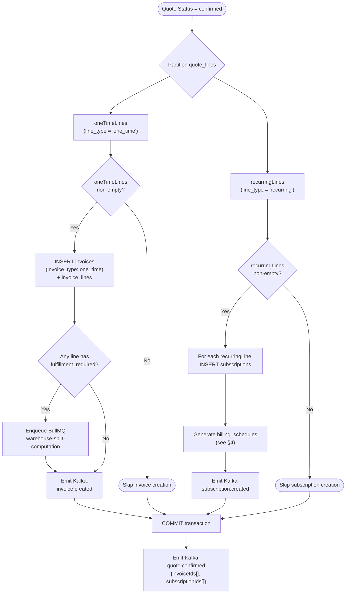
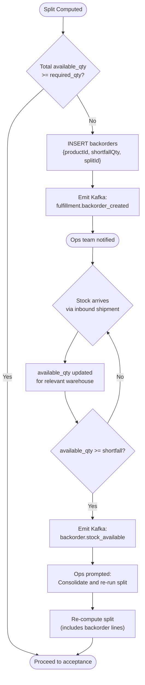
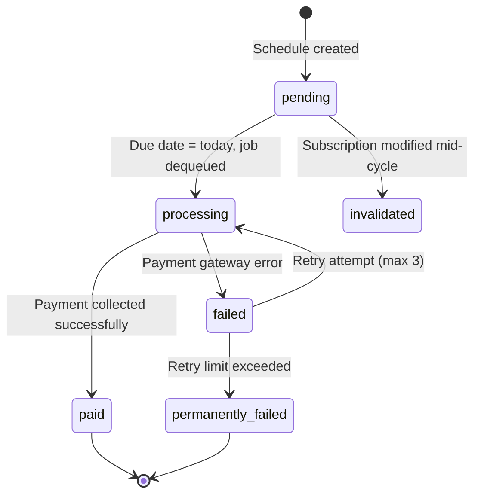
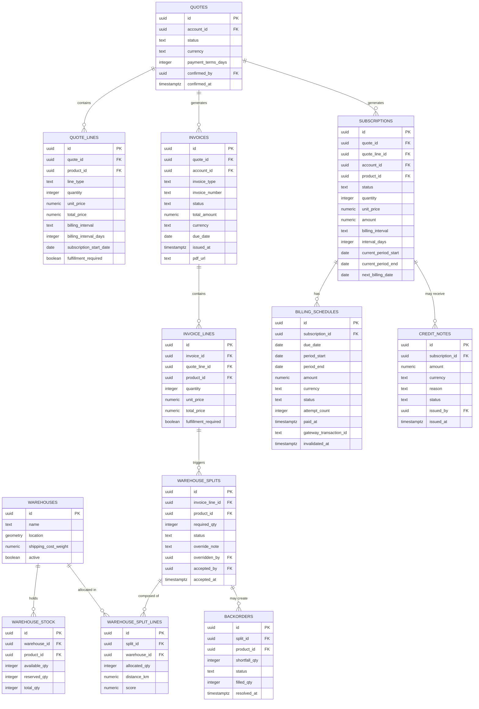

# DealFlow360 — Hybrid Billing & Spatial Fulfillment Specification

**Document ID:** `DF360-SPEC-006`  
**Version:** `1.0.0`  
**Status:** `APPROVED`  
**Last Updated:** 2026-09-05  
**Owner:** Platform Engineering  
**Reviewers:** Finance Engineering, Fulfillment Ops, Revenue Operations

---

## Table of Contents

1. [Overview](#overview)
2. [Hybrid Order Engine](#1-hybrid-order-engine)
3. [Spatial Warehouse Split Algorithm](#2-spatial-warehouse-split-algorithm)
4. [Proration & Mid-Cycle Modification Engine](#3-proration--mid-cycle-modification-engine)
5. [Billing Schedule Generation](#4-billing-schedule-generation)
6. [Invoice Generation](#5-invoice-generation)
7. [Fulfillment State Transitions](#6-fulfillment-state-transitions)
8. [BullMQ Queue Reference](#7-bullmq-queue-reference)
9. [Kafka Event Catalogue](#8-kafka-event-catalogue)
10. [Database Schema Reference](#9-database-schema-reference)
11. [Error Handling & Idempotency](#10-error-handling--idempotency)

---

## Overview

DealFlow360 supports **hybrid orders** — a single sales quote may contain a mix of one-time product lines (physical goods, professional services, setup fees) and recurring subscription lines (SaaS seats, managed services, maintenance contracts). At the moment a quote is confirmed, the platform **bifurcates** the order into two independent financial tracks:

| Track | Trigger | Destination |
|---|---|---|
| **One-Time** | Quote confirmation | `invoices` table, `invoice_type: one_time`, immediately payable |
| **Recurring** | Quote confirmation | `subscriptions` table + forward `billing_schedules` entries |

Physical fulfillment uses a **spatial warehouse split algorithm** powered by PostGIS `ST_DistanceSpheroid` to allocate stock across multiple warehouses, scoring candidates by a composite of geographic distance and shipping cost before executing a greedy multi-warehouse allocation.

---

## 1. Hybrid Order Engine

### 1.1 Quote Line Model

A confirmed quote may contain zero or more lines of each type. Both types coexist in the `quote_lines` table and are disambiguated by the `line_type` discriminator column.

```sql
-- quote_lines table (relevant columns)
CREATE TABLE quote_lines (
  id              UUID PRIMARY KEY DEFAULT gen_random_uuid(),
  quote_id        UUID NOT NULL REFERENCES quotes(id),
  product_id      UUID NOT NULL REFERENCES products(id),
  line_type       TEXT NOT NULL CHECK (line_type IN ('one_time', 'recurring')),
  description     TEXT,
  quantity        INTEGER NOT NULL DEFAULT 1,
  unit_price      NUMERIC(12,4) NOT NULL,
  total_price     NUMERIC(12,4) GENERATED ALWAYS AS (quantity * unit_price) STORED,

  -- Recurring-only fields (NULL for one_time lines)
  billing_interval        TEXT   CHECK (billing_interval IN ('monthly', 'quarterly', 'yearly')),
  billing_interval_days   INTEGER,            -- 30 | 91 | 365
  subscription_start_date DATE,

  -- One-time-only fields (NULL for recurring lines)
  fulfillment_required    BOOLEAN DEFAULT FALSE,
  warehouse_split_id      UUID,               -- populated after split computation

  created_at TIMESTAMPTZ NOT NULL DEFAULT NOW(),
  updated_at TIMESTAMPTZ NOT NULL DEFAULT NOW()
);
```

**Validation rules enforced at the application layer:**

| Rule | One-Time | Recurring |
|---|---|---|
| `billing_interval` required | ✗ | ✔ |
| `subscription_start_date` required | ✗ | ✔ |
| `fulfillment_required` applicable | ✔ | ✗ |
| `unit_price` ≥ 0 | ✔ | ✔ |
| `quantity` ≥ 1 | ✔ | ✔ |

---

### 1.2 Order Confirmation Split Logic

When a rep confirms a quote (status: `draft → confirmed`), the **Order Confirmation Service** executes the following atomic split procedure:

#### Rules

1. **Partition lines** — separate `quote_lines` into two sets: `oneTimeLines` and `recurringLines`.
2. **One-time path** — aggregate `oneTimeLines` into a single `invoice` record (`invoice_type: one_time`) containing one `invoice_line` per quote line. Emit `invoice.created` Kafka event. If any line has `fulfillment_required = TRUE`, enqueue a `warehouse-split-computation` BullMQ job.
3. **Recurring path** — for each `recurringLine`, create one `subscription` record and forward-generate `billing_schedules` entries (see §4). Emit `subscription.created` Kafka event.
4. The entire database transaction is wrapped in a single `BEGIN … COMMIT`. If any step fails, the quote remains `draft` and no partial records are committed.
5. A `quote.confirmed` Kafka event is emitted **after** the transaction commits, referencing both the invoice ID(s) and subscription ID(s) created.

#### Flowchart



---

### 1.3 Kafka Events Emitted at Confirmation

| Event Topic | Trigger | Payload Fields |
|---|---|---|
| `quote.confirmed` | After full transaction commit | `quoteId`, `accountId`, `invoiceIds[]`, `subscriptionIds[]`, `confirmedAt` |
| `invoice.created` | One-time invoice inserted | `invoiceId`, `quoteId`, `invoiceType: "one_time"`, `totalAmount`, `currency`, `dueDate` |
| `subscription.created` | Each recurring subscription inserted | `subscriptionId`, `quoteId`, `productId`, `billingInterval`, `amount`, `startDate`, `nextBillingDate` |
| `fulfillment.split_requested` | `fulfillment_required` line found | `invoiceId`, `invoiceLineId`, `productId`, `quantity`, `customerId`, `shippingAddress` |

All events follow the DealFlow360 CloudEvents schema (`specversion: 1.0`, `source: /dealflow360/order-confirmation-service`).

---

### 1.4 TypeScript — Order Confirmation Service (Pseudocode)

```typescript
// services/order-confirmation/confirmQuote.ts

import { db } from '@/db';
import { quoteLines, invoices, invoiceLines, subscriptions } from '@/db/schema';
import { kafka } from '@/lib/kafka';
import { bullmqQueues } from '@/lib/queues';
import { generateInvoiceNumber } from '@/lib/invoiceNumbering';
import { generateBillingSchedules } from '@/services/billing/scheduleGenerator';
import { eq, inArray } from 'drizzle-orm';

export async function confirmQuote(quoteId: string, confirmedBy: string): Promise<ConfirmationResult> {
  return db.transaction(async (tx) => {

    // 1. Lock the quote row to prevent concurrent confirmation
    const quote = await tx.query.quotes.findFirst({
      where: eq(quotes.id, quoteId),
      // FOR UPDATE lock
    });

    if (!quote || quote.status !== 'draft') {
      throw new QuoteStateError(`Quote ${quoteId} is not in draft state`);
    }

    // 2. Fetch and partition all quote lines
    const lines = await tx.query.quoteLines.findMany({
      where: eq(quoteLines.quoteId, quoteId),
    });

    const oneTimeLines  = lines.filter(l => l.lineType === 'one_time');
    const recurringLines = lines.filter(l => l.lineType === 'recurring');

    const createdInvoiceIds:      string[] = [];
    const createdSubscriptionIds: string[] = [];

    // ── ONE-TIME PATH ──────────────────────────────────────────────────────
    if (oneTimeLines.length > 0) {
      const invoiceId = crypto.randomUUID();
      const invoiceNumber = await generateInvoiceNumber(tx);          // INV-2026-000123
      const totalAmount = oneTimeLines.reduce((sum, l) => sum + Number(l.totalPrice), 0);

      await tx.insert(invoices).values({
        id:           invoiceId,
        quoteId,
        accountId:    quote.accountId,
        invoiceType:  'one_time',
        invoiceNumber,
        status:       'pending',
        totalAmount,
        currency:     quote.currency,
        dueDate:      addDays(new Date(), quote.paymentTermsDays ?? 30),
        issuedAt:     new Date(),
      });

      await tx.insert(invoiceLines).values(
        oneTimeLines.map(line => ({
          id:          crypto.randomUUID(),
          invoiceId,
          quoteLineId: line.id,
          productId:   line.productId,
          description: line.description,
          quantity:    line.quantity,
          unitPrice:   line.unitPrice,
          totalPrice:  line.totalPrice,
          fulfillmentRequired: line.fulfillmentRequired,
        }))
      );

      createdInvoiceIds.push(invoiceId);
    }

    // ── RECURRING PATH ─────────────────────────────────────────────────────
    for (const line of recurringLines) {
      const subscriptionId = crypto.randomUUID();

      await tx.insert(subscriptions).values({
        id:              subscriptionId,
        quoteId,
        quoteLineId:     line.id,
        accountId:       quote.accountId,
        productId:       line.productId,
        status:          'active',
        quantity:        line.quantity,
        unitPrice:       line.unitPrice,
        amount:          line.totalPrice,
        currency:        quote.currency,
        billingInterval: line.billingInterval,          // 'monthly' | 'quarterly' | 'yearly'
        intervalDays:    line.billingIntervalDays,       // 30 | 91 | 365
        currentPeriodStart: line.subscriptionStartDate,
        currentPeriodEnd:   addDays(line.subscriptionStartDate, line.billingIntervalDays),
        nextBillingDate:    line.subscriptionStartDate,
      });

      // Generate forward billing schedules within the same transaction
      await generateBillingSchedules(tx, subscriptionId);

      createdSubscriptionIds.push(subscriptionId);
    }

    // 3. Advance quote status
    await tx.update(quotes)
      .set({ status: 'confirmed', confirmedBy, confirmedAt: new Date() })
      .where(eq(quotes.id, quoteId));

    // 4. Post-commit side effects (emitted AFTER tx.commit())
    return {
      quoteId,
      invoiceIds:      createdInvoiceIds,
      subscriptionIds: createdSubscriptionIds,
      oneTimeLines,
      recurringLines,
    };
  })
  .then(async (result) => {
    // Kafka events — after commit
    await kafka.emit('quote.confirmed', {
      quoteId:         result.quoteId,
      invoiceIds:      result.invoiceIds,
      subscriptionIds: result.subscriptionIds,
      confirmedAt:     new Date().toISOString(),
    });

    for (const invoiceId of result.invoiceIds) {
      await kafka.emit('invoice.created', { invoiceId, quoteId, invoiceType: 'one_time' });
    }

    for (const subscriptionId of result.subscriptionIds) {
      await kafka.emit('subscription.created', { subscriptionId, quoteId });
    }

    // Enqueue warehouse splits for fulfillable lines
    const fulfillableLines = result.oneTimeLines.filter(l => l.fulfillmentRequired);
    for (const line of fulfillableLines) {
      await bullmqQueues.warehouseSplitComputation.add('compute-split', {
        invoiceLineId: line.id,
        productId:     line.productId,
        quantity:      line.quantity,
        customerId:    result.quoteId,  // resolved from quote.accountId → shipping address
      });
    }

    return result;
  });
}
```

---

## 2. Spatial Warehouse Split Algorithm

The warehouse split algorithm determines the optimal allocation of a product quantity across one or more physical warehouses. It minimises a composite **allocation score** that weighs geographic proximity and per-warehouse shipping costs against available stock.

### 2.1 Allocation Score Formula

$$\text{allocationScore} = \frac{\text{distance\_km} \times \text{shipping\_cost\_weight}}{\text{available\_qty}}$$

> **Lower score = more preferred warehouse.** A warehouse that is close and cheap to ship from but holds more stock scores lower. A warehouse that is far, expensive, or nearly depleted scores higher.

| Variable | Source | Unit |
|---|---|---|
| `distance_km` | PostGIS `ST_DistanceSpheroid` ÷ 1000 | km |
| `shipping_cost_weight` | `warehouses.shipping_cost_weight` | dimensionless float (e.g. 1.0 = standard, 0.5 = subsidised zone) |
| `available_qty` | `warehouse_stock.available_qty` | units |

---

### 2.2 Step 1 — Gather Candidate Warehouses (SQL)

```sql
-- Parameterised query executed by the warehouse-split-computation worker
-- :product_id   UUID
-- :customer_lat FLOAT8
-- :customer_lng FLOAT8

SELECT
  w.id                        AS warehouse_id,
  w.name                      AS warehouse_name,
  w.shipping_cost_weight,
  ws.available_qty,
  ST_DistanceSpheroid(
    w.location,
    ST_SetSRID(ST_MakePoint(:customer_lng, :customer_lat), 4326),
    'SPHEROID["WGS 84",6378137,298.257223563]'
  ) / 1000.0                  AS distance_km
FROM warehouses w
JOIN warehouse_stock ws
  ON ws.warehouse_id = w.id
WHERE ws.product_id  = :product_id
  AND ws.available_qty > 0
  AND w.active = TRUE
ORDER BY distance_km;
```

> **Spatial Index (GIST):** This query depends on a GIST index on `warehouses.location`. Without it, the `ST_DistanceSpheroid` scan degrades to O(n) on every call.

```sql
-- Migration: create spatial index
CREATE INDEX CONCURRENTLY idx_warehouses_location_gist
  ON warehouses
  USING GIST (location);

-- Verify
SELECT indexname, indexdef
FROM pg_indexes
WHERE tablename = 'warehouses' AND indexname = 'idx_warehouses_location_gist';
```

**Drizzle ORM schema for the spatial column:**

```typescript
// db/schema/warehouses.ts
import { pgTable, uuid, text, numeric, boolean, customType } from 'drizzle-orm/pg-core';

// Drizzle does not natively wrap PostGIS types; use customType
const geometry = customType<{ data: string }>({
  dataType() { return 'geometry(Point, 4326)'; },
});

export const warehouses = pgTable('warehouses', {
  id:                  uuid('id').primaryKey().defaultRandom(),
  name:                text('name').notNull(),
  location:            geometry('location').notNull(),           // PostGIS POINT
  shippingCostWeight:  numeric('shipping_cost_weight', { precision: 6, scale: 4 }).notNull().default('1.0'),
  active:              boolean('active').notNull().default(true),
  createdAt:           timestamp('created_at').notNull().defaultNow(),
});

export const warehouseStock = pgTable('warehouse_stock', {
  id:            uuid('id').primaryKey().defaultRandom(),
  warehouseId:   uuid('warehouse_id').notNull().references(() => warehouses.id),
  productId:     uuid('product_id').notNull().references(() => products.id),
  availableQty:  integer('available_qty').notNull().default(0),
  reservedQty:   integer('reserved_qty').notNull().default(0),
  totalQty:      integer('total_qty').notNull().default(0),
  updatedAt:     timestamp('updated_at').notNull().defaultNow(),
});
```

**Drizzle ORM spatial query (raw SQL via `sql` tag):**

```typescript
// services/fulfillment/gatherCandidates.ts
import { db } from '@/db';
import { sql } from 'drizzle-orm';

interface CandidateWarehouse {
  warehouseId:        string;
  warehouseName:      string;
  shippingCostWeight: number;
  availableQty:       number;
  distanceKm:         number;
}

export async function gatherCandidateWarehouses(
  productId:   string,
  customerLat: number,
  customerLng: number,
): Promise<CandidateWarehouse[]> {
  const rows = await db.execute(sql`
    SELECT
      w.id                  AS warehouse_id,
      w.name                AS warehouse_name,
      w.shipping_cost_weight::float AS shipping_cost_weight,
      ws.available_qty,
      ST_DistanceSpheroid(
        w.location,
        ST_SetSRID(ST_MakePoint(${customerLng}, ${customerLat}), 4326),
        'SPHEROID["WGS 84",6378137,298.257223563]'
      ) / 1000.0            AS distance_km
    FROM warehouses w
    JOIN warehouse_stock ws ON ws.warehouse_id = w.id
    WHERE ws.product_id = ${productId}
      AND ws.available_qty > 0
      AND w.active = TRUE
    ORDER BY distance_km
  `);

  return rows.rows as CandidateWarehouse[];
}
```

---

### 2.3 Step 2 — Score Each Warehouse

After gathering candidates, each warehouse receives an **allocation score**:

```typescript
function scoreWarehouse(w: CandidateWarehouse): number {
  if (w.availableQty === 0) return Infinity;  // guard against division by zero
  return (w.distanceKm * w.shippingCostWeight) / w.availableQty;
}
```

---

### 2.4 Step 3 — Greedy Allocation Algorithm

Warehouses are sorted by ascending score. The algorithm fulfils as much as possible from the best-scoring warehouse before spilling the remainder to the next.

```typescript
// services/fulfillment/greedyAllocate.ts

export interface AllocationLine {
  warehouseId:   string;
  warehouseName: string;
  allocatedQty:  number;
  distanceKm:    number;
  score:         number;
}

export interface AllocationResult {
  lines:            AllocationLine[];
  backorderQty:     number;           // > 0 means stock was insufficient
  isFullyFulfilled: boolean;
}

export function greedyAllocate(
  candidates:  CandidateWarehouse[],
  requiredQty: number,
): AllocationResult {
  // Sort by allocation score ascending (lowest score = best)
  const scored = candidates
    .map(w => ({ ...w, score: scoreWarehouse(w) }))
    .sort((a, b) => a.score - b.score);

  const lines: AllocationLine[] = [];
  let remaining = requiredQty;

  for (const warehouse of scored) {
    if (remaining <= 0) break;

    const allocate = Math.min(warehouse.availableQty, remaining);

    lines.push({
      warehouseId:   warehouse.warehouseId,
      warehouseName: warehouse.warehouseName,
      allocatedQty:  allocate,
      distanceKm:    warehouse.distanceKm,
      score:         warehouse.score,
    });

    remaining -= allocate;
  }

  const backorderQty = Math.max(0, remaining);

  return {
    lines,
    backorderQty,
    isFullyFulfilled: backorderQty === 0,
  };
}
```

---

### 2.5 Worked Example

**Scenario:** Customer orders **100 units** of product `P-001`.

| Warehouse | Available Qty | Distance (km) | Shipping Cost Weight |
|---|---|---|---|
| Warehouse A | 70 | 15 | 1.0 |
| Warehouse B | 50 | 30 | 1.0 |

**Step 1 — Score calculation:**

$$\text{Score}_A = \frac{15 \times 1.0}{70} = 0.2143$$

$$\text{Score}_B = \frac{30 \times 1.0}{50} = 0.6000$$

**Step 2 — Sort by score:** A (0.214) → B (0.600)

**Step 3 — Greedy allocation:**

| Round | Warehouse | Available | Allocate | Remaining After |
|---|---|---|---|---|
| 1 | A | 70 | **70** | 30 |
| 2 | B | 50 | **30** | 0 |

**Result:** Fully fulfilled across 2 warehouses. No backorder.

```
AllocationResult {
  lines: [
    { warehouseId: 'wh-A', allocatedQty: 70, distanceKm: 15, score: 0.2143 },
    { warehouseId: 'wh-B', allocatedQty: 30, distanceKm: 30, score: 0.6000 },
  ],
  backorderQty: 0,
  isFullyFulfilled: true
}
```

**Backorder scenario (only 90 total available):** If Warehouse B had only 20 units → `backorderQty = 10`. The system inserts a `backorders` record and notifies the operations team.

---

### 2.6 Step 4 — Persisting the Split

The computed split is written to the `warehouse_splits` and `warehouse_split_lines` tables **in a draft state** before Finance acceptance.

```sql
-- warehouse_splits table
CREATE TABLE warehouse_splits (
  id              UUID PRIMARY KEY DEFAULT gen_random_uuid(),
  invoice_line_id UUID NOT NULL REFERENCES invoice_lines(id),
  product_id      UUID NOT NULL REFERENCES products(id),
  required_qty    INTEGER NOT NULL,
  status          TEXT NOT NULL DEFAULT 'pending_acceptance'
                  CHECK (status IN ('pending_acceptance','accepted','rejected','stock_reserved','shipped','completed','backorder_created')),
  override_note   TEXT,
  overridden_by   UUID REFERENCES users(id),
  overridden_at   TIMESTAMPTZ,
  accepted_by     UUID REFERENCES users(id),
  accepted_at     TIMESTAMPTZ,
  created_at      TIMESTAMPTZ NOT NULL DEFAULT NOW(),
  updated_at      TIMESTAMPTZ NOT NULL DEFAULT NOW()
);

-- warehouse_split_lines table
CREATE TABLE warehouse_split_lines (
  id             UUID PRIMARY KEY DEFAULT gen_random_uuid(),
  split_id       UUID NOT NULL REFERENCES warehouse_splits(id),
  warehouse_id   UUID NOT NULL REFERENCES warehouses(id),
  allocated_qty  INTEGER NOT NULL,
  distance_km    NUMERIC(10,4) NOT NULL,
  score          NUMERIC(12,6) NOT NULL,
  created_at     TIMESTAMPTZ NOT NULL DEFAULT NOW()
);
```

---

### 2.7 Manual Override Rules

Finance and Operations users with the `fulfillment:override` permission may adjust any split **before acceptance**.

| Rule | Detail |
|---|---|
| **Who can override** | Users with role `finance_manager` or `ops_manager`, or any user with permission `fulfillment:override` |
| **What can be changed** | Allocated quantity per warehouse line; warehouse source (swap to different warehouse) |
| **Audit trail** | `warehouse_splits.overridden_by` + `overridden_at` + `override_note` are set; original split lines are soft-deleted (with `superseded_at` timestamp) |
| **Validation** | Sum of all `allocated_qty` across lines must equal `required_qty`. Overriding cannot exceed a warehouse's `available_qty` at the time of override |
| **Re-scoring** | After override, the system does **not** recompute scores — override is authoritative |
| **Deadline** | Override window closes when the split is `accepted` |

---

### 2.8 Stock Reservation (On Split Acceptance)

When Finance/Ops accepts the split, the following atomic procedure executes:

```typescript
// services/fulfillment/acceptSplit.ts

export async function acceptSplit(
  splitId:    string,
  acceptedBy: string,
): Promise<void> {
  await db.transaction(async (tx) => {

    // 1. Lock the split row
    const split = await tx.query.warehouseSplits.findFirst({
      where: eq(warehouseSplits.id, splitId),
    });

    if (split?.status !== 'pending_acceptance') {
      throw new InvalidStateError('Split is not pending acceptance');
    }

    // 2. For each split line, atomically decrement available_qty and increment reserved_qty
    const splitLines = await tx.query.warehouseSplitLines.findMany({
      where: eq(warehouseSplitLines.splitId, splitId),
    });

    for (const line of splitLines) {
      const updated = await tx
        .update(warehouseStock)
        .set({
          availableQty: sql`available_qty - ${line.allocatedQty}`,
          reservedQty:  sql`reserved_qty  + ${line.allocatedQty}`,
          updatedAt:    new Date(),
        })
        .where(
          and(
            eq(warehouseStock.warehouseId, line.warehouseId),
            eq(warehouseStock.productId,   split.productId),
            gte(warehouseStock.availableQty, line.allocatedQty),  // optimistic lock
          )
        )
        .returning({ id: warehouseStock.id });

      if (updated.length === 0) {
        throw new InsufficientStockError(
          `Warehouse ${line.warehouseId} no longer has ${line.allocatedQty} units available`
        );
      }
    }

    // 3. Advance split status
    await tx.update(warehouseSplits)
      .set({
        status:     'stock_reserved',
        acceptedBy,
        acceptedAt: new Date(),
      })
      .where(eq(warehouseSplits.id, splitId));
  });

  await kafka.emit('fulfillment.stock_reserved', { splitId, acceptedBy, reservedAt: new Date().toISOString() });
}
```

**Stock constraint:** The `WHERE available_qty >= allocatedQty` clause acts as an optimistic concurrency lock. If another transaction has reduced stock below the required quantity between split computation and acceptance, this update returns 0 rows and the transaction aborts, triggering a re-computation prompt.

---

### 2.9 Backorder Flow



**Backorder table:**

```sql
CREATE TABLE backorders (
  id            UUID PRIMARY KEY DEFAULT gen_random_uuid(),
  split_id      UUID NOT NULL REFERENCES warehouse_splits(id),
  product_id    UUID NOT NULL REFERENCES products(id),
  shortfall_qty INTEGER NOT NULL,
  status        TEXT NOT NULL DEFAULT 'open'
                CHECK (status IN ('open','partially_filled','filled','cancelled')),
  filled_qty    INTEGER NOT NULL DEFAULT 0,
  created_at    TIMESTAMPTZ NOT NULL DEFAULT NOW(),
  resolved_at   TIMESTAMPTZ
);
```

---

## 3. Proration & Mid-Cycle Modification Engine

When a subscription is modified mid-cycle (seat upgrade, downgrade, or cancellation), the engine computes a proration credit or upcharge for the current billing period.

### 3.1 Core Proration Formulae

**Variables:**

| Variable | Definition |
|---|---|
| `today` | Date of modification (UTC midnight) |
| `currentPeriodStart` | Start date of active billing period |
| `currentPeriodEnd` | End date of active billing period |
| `daysRemaining` | `currentPeriodEnd - today` (in whole days) |
| `daysInCycle` | `currentPeriodEnd - currentPeriodStart` |
| `subscriptionAmount` | Full-period charge for the subscription |

**Credit on cancellation / downgrade:**

$$\text{credit} = \frac{\text{daysRemaining}}{\text{daysInCycle}} \times \text{oldAmount}$$

**Upcharge on upgrade:**

$$\text{proratedUpcharge} = (\text{newAmount} - \text{oldAmount}) \times \frac{\text{daysRemaining}}{\text{daysInCycle}}$$

---

### 3.2 Worked Example — Cancellation Credit

> **Subscription:** \$300/month, billed monthly (30-day cycle)  
> **Period:** Day 1 to Day 30  
> **Cancelled on:** Day 10

$$\text{daysRemaining} = 30 - 10 = 20$$
$$\text{daysInCycle} = 30$$
$$\text{credit} = \frac{20}{30} \times 300 = \$200.00$$

A credit note for **\$200.00** is generated and applied to the account balance.

---

### 3.3 Worked Example — Seat Upgrade Upcharge

> **Subscription:** 5 seats × \$50/seat = \$250/month, billed monthly (30-day cycle)  
> **Upgraded to:** 8 seats on Day 15

$$\text{oldAmount} = 5 \times \$50 = \$250$$
$$\text{newAmount} = 8 \times \$50 = \$400$$
$$\text{daysRemaining} = 30 - 15 = 15$$
$$\text{daysInCycle} = 30$$
$$\text{proratedUpcharge} = (\$400 - \$250) \times \frac{15}{30} = \$150 \times 0.5 = \$75.00$$

An invoice for **\$75.00** is generated immediately. From the next billing cycle, the full \$400/month applies.

---

### 3.4 TypeScript — Proration Engine (Pseudocode)

```typescript
// services/billing/prorationEngine.ts

import { differenceInDays, startOfDay } from 'date-fns';

export type ModificationType = 'upgrade' | 'downgrade' | 'cancellation';

export interface ProrationInput {
  subscriptionId:      string;
  modificationType:    ModificationType;
  oldQuantity:         number;
  newQuantity:         number;  // ignored for 'cancellation'
  unitPrice:           number;
  currentPeriodStart:  Date;
  currentPeriodEnd:    Date;
  modificationDate:    Date;    // today
}

export interface ProrationResult {
  daysInCycle:         number;
  daysRemaining:       number;
  prorationFactor:     number;
  oldAmount:           number;
  newAmount:           number;
  creditAmount:        number;   // > 0 means customer gets credit
  chargeAmount:        number;   // > 0 means customer is charged
  creditNoteRequired:  boolean;  // credit > MINIMUM_CREDIT_THRESHOLD
  invoiceRequired:     boolean;  // charge > 0
}

const MINIMUM_CREDIT_THRESHOLD = 1.00;  // $1.00 — do not issue credit notes below this

export function computeProration(input: ProrationInput): ProrationResult {
  const today          = startOfDay(input.modificationDate);
  const periodStart    = startOfDay(input.currentPeriodStart);
  const periodEnd      = startOfDay(input.currentPeriodEnd);

  const daysInCycle    = differenceInDays(periodEnd, periodStart);
  const daysRemaining  = differenceInDays(periodEnd, today);

  if (daysRemaining < 0) {
    throw new ProrationError('Modification date is after period end');
  }

  const prorationFactor = daysRemaining / daysInCycle;
  const oldAmount       = input.oldQuantity * input.unitPrice;
  const newAmount       = input.modificationType === 'cancellation'
    ? 0
    : input.newQuantity * input.unitPrice;

  let creditAmount = 0;
  let chargeAmount = 0;

  switch (input.modificationType) {
    case 'cancellation':
      creditAmount = oldAmount * prorationFactor;
      break;

    case 'downgrade':
      // Credit is only the delta between old and new amounts
      creditAmount = (oldAmount - newAmount) * prorationFactor;
      break;

    case 'upgrade':
      chargeAmount = (newAmount - oldAmount) * prorationFactor;
      break;
  }

  // Round to 2 decimal places (currency)
  creditAmount = Math.round(creditAmount * 100) / 100;
  chargeAmount = Math.round(chargeAmount * 100) / 100;

  return {
    daysInCycle,
    daysRemaining,
    prorationFactor,
    oldAmount,
    newAmount,
    creditAmount,
    chargeAmount,
    creditNoteRequired: creditAmount > MINIMUM_CREDIT_THRESHOLD,
    invoiceRequired:    chargeAmount > 0,
  };
}
```

---

### 3.5 Credit Note Generation

When `creditAmount > $1.00`, a credit note is generated:

```typescript
// services/billing/creditNoteService.ts

export async function processCreditNote(
  subscriptionId: string,
  result:         ProrationResult,
  modifiedBy:     string,
): Promise<void> {
  if (!result.creditNoteRequired) {
    // Credit below $1.00 minimum — no credit note issued; log for audit
    await auditLog.record({
      event:   'proration.credit_below_threshold',
      amount:  result.creditAmount,
      note:    'No credit note issued — below $1.00 minimum floor',
    });
    return;
  }

  const creditNoteId = crypto.randomUUID();
  await db.insert(creditNotes).values({
    id:             creditNoteId,
    subscriptionId,
    amount:         result.creditAmount,
    currency:       'USD',
    reason:         'mid_cycle_modification',
    status:         'issued',
    issuedBy:       modifiedBy,
    issuedAt:       new Date(),
  });

  // Kafka event for downstream accounting / ERP sync
  await kafka.emit('credit_note.issued', {
    creditNoteId,
    subscriptionId,
    amount:      result.creditAmount,
    currency:    'USD',
    issuedAt:    new Date().toISOString(),
    reason:      'mid_cycle_modification',
  });
}
```

**Minimum charge floor:**

| Credit Amount | Action |
|---|---|
| `< $0.00` | Invalid — throw `ProrationError` |
| `$0.00 – $1.00` | Log to audit trail; no credit note issued; no Kafka event |
| `> $1.00` | Issue credit note, emit `credit_note.issued` Kafka event |

---

### 3.6 Billing Schedule Regeneration on Modification

After any mid-cycle modification, future billing schedules for the subscription are invalidated and regenerated:

```typescript
// services/billing/scheduleGenerator.ts

export async function regenerateSchedulesOnModification(
  tx:             DbTransaction,
  subscriptionId: string,
  effectiveDate:  Date,
): Promise<void> {
  // 1. Soft-delete all FUTURE pending schedules (retain paid/failed for audit)
  await tx.update(billingSchedules)
    .set({ status: 'invalidated', invalidatedAt: new Date() })
    .where(
      and(
        eq(billingSchedules.subscriptionId, subscriptionId),
        eq(billingSchedules.status, 'pending'),
        gte(billingSchedules.dueDate, effectiveDate),
      )
    );

  // 2. Fetch updated subscription data
  const subscription = await tx.query.subscriptions.findFirst({
    where: eq(subscriptions.id, subscriptionId),
  });

  // 3. Re-generate from next billing cycle
  await generateBillingSchedules(tx, subscriptionId, {
    startFrom: subscription!.nextBillingDate,
  });
}
```

---

## 4. Billing Schedule Generation

### 4.1 Schedule Generation on Subscription Creation

When a subscription is created (triggered by the recurring path of quote confirmation), the **Billing Schedule Generator** produces forward-dated entries for the subscription lifetime.

| Billing Interval | Entries Generated | Interval Days |
|---|---|---|
| `monthly` | 12 entries (12 months forward) | 30 |
| `quarterly` | 4 entries (12 months forward) | 91 |
| `yearly` | 1 entry | 365 |

```typescript
// services/billing/scheduleGenerator.ts

export interface GenerateSchedulesOptions {
  startFrom?: Date;   // defaults to subscription.currentPeriodStart
}

export async function generateBillingSchedules(
  tx:             DbTransaction,
  subscriptionId: string,
  options:        GenerateSchedulesOptions = {},
): Promise<void> {
  const sub = await tx.query.subscriptions.findFirst({
    where: eq(subscriptions.id, subscriptionId),
  });
  if (!sub) throw new Error(`Subscription ${subscriptionId} not found`);

  const intervalDays  = sub.intervalDays;                   // 30 | 91 | 365
  const totalCycles   = Math.round(365 / intervalDays);     // 12 | 4 | 1
  const startDate     = options.startFrom ?? sub.currentPeriodStart;

  const scheduleEntries = Array.from({ length: totalCycles }, (_, n) => {
    const dueDate       = addDays(startDate, n * intervalDays);
    const periodStart   = dueDate;
    const periodEnd     = addDays(dueDate, intervalDays);

    return {
      id:             crypto.randomUUID(),
      subscriptionId,
      dueDate,
      periodStart,
      periodEnd,
      amount:         sub.amount,
      currency:       sub.currency,
      status:         'pending' as const,
      attemptCount:   0,
      createdAt:      new Date(),
    };
  });

  await tx.insert(billingSchedules).values(scheduleEntries);
}
```

**Due date formula:**

$$\text{billingDate}_n = \text{currentPeriodStart} + (n \times \text{intervalDays}), \quad n \in \{0, 1, \ldots, \text{totalCycles}-1\}$$

---

### 4.2 Status Transitions



### 4.3 Payment Retry Policy

Retries are managed by the `payment-webhook-processor` BullMQ queue:

| Attempt | Delay After Previous Failure | Action on Success | Action on Final Failure |
|---|---|---|---|
| 1 (initial) | — | Mark `paid` | Schedule attempt 2 |
| 2 | 24 hours | Mark `paid` | Schedule attempt 3 |
| 3 | 72 hours | Mark `paid` | Mark `permanently_failed`, emit `billing.payment_failed` Kafka event |

```typescript
// workers/paymentWebhookProcessor.ts

const paymentWebhookProcessor = new Worker(
  'payment-webhook-processor',
  async (job: Job<PaymentJob>) => {
    const { billingScheduleId, subscriptionId, attempt } = job.data;

    const schedule = await db.query.billingSchedules.findFirst({
      where: eq(billingSchedules.id, billingScheduleId),
    });

    if (!schedule || schedule.status === 'paid') return; // idempotency guard

    try {
      const result = await paymentGateway.charge({
        customerId: schedule.customerId,
        amount:     schedule.amount,
        currency:   schedule.currency,
        metadata:   { billingScheduleId, subscriptionId },
      });

      await db.update(billingSchedules)
        .set({ status: 'paid', paidAt: new Date(), gatewayTransactionId: result.transactionId })
        .where(eq(billingSchedules.id, billingScheduleId));

      await kafka.emit('billing.payment_collected', {
        billingScheduleId,
        subscriptionId,
        amount: schedule.amount,
      });

    } catch (err) {
      const nextAttempt = attempt + 1;
      const MAX_ATTEMPTS = 3;

      if (nextAttempt > MAX_ATTEMPTS) {
        await db.update(billingSchedules)
          .set({ status: 'permanently_failed', attemptCount: attempt })
          .where(eq(billingSchedules.id, billingScheduleId));

        await kafka.emit('billing.payment_failed', {
          billingScheduleId,
          subscriptionId,
          finalAttempt: attempt,
          error: (err as Error).message,
        });
      } else {
        const delayMs = nextAttempt === 2
          ? 24 * 60 * 60 * 1000   // 24h
          : 72 * 60 * 60 * 1000;  // 72h

        await job.moveToDelayed(Date.now() + delayMs);

        await db.update(billingSchedules)
          .set({ status: 'failed', attemptCount: nextAttempt })
          .where(eq(billingSchedules.id, billingScheduleId));
      }
    }
  },
  { connection: redis, concurrency: 10 }
);
```

---

## 5. Invoice Generation

### 5.1 One-Time Invoices

Generated synchronously during quote confirmation (see §1.2). The invoice record is inserted in the same database transaction that confirms the quote.

### 5.2 Recurring Invoices

A cron-driven worker queries `billing_schedules` for entries where `due_date = today AND status = 'pending'` and generates invoices for each:

```typescript
// workers/billingScheduleRunner.ts — runs daily at 00:05 UTC

const today = startOfDay(new Date());

const dueSchedules = await db.query.billingSchedules.findMany({
  where: and(
    eq(billingSchedules.dueDate, today),
    eq(billingSchedules.status, 'pending'),
  ),
  with: { subscription: true },
});

for (const schedule of dueSchedules) {
  await bullmqQueues.invoiceGeneration.add('generate-invoice', {
    billingScheduleId: schedule.id,
    subscriptionId:    schedule.subscriptionId,
    accountId:         schedule.subscription.accountId,
    amount:            schedule.amount,
    currency:          schedule.currency,
    periodStart:       schedule.periodStart,
    periodEnd:         schedule.periodEnd,
  });
}
```

### 5.3 Invoice Numbering Scheme

All invoices — whether one-time or recurring — share a single global counter producing sequential, collision-free numbers.

**Format:** `INV-YYYY-NNNNNN`

| Segment | Description | Example |
|---|---|---|
| `INV` | Fixed literal prefix | `INV` |
| `YYYY` | 4-digit year (UTC) | `2026` |
| `NNNNNN` | 6-digit zero-padded sequence, resets annually | `000123` |

**Implementation (PostgreSQL sequence per year):**

```sql
-- Created per-year at first invoice generation of that year
-- e.g. for 2026:
CREATE SEQUENCE IF NOT EXISTS invoice_seq_2026 START 1;

-- Usage:
SELECT 'INV-' || TO_CHAR(NOW(), 'YYYY') || '-' ||
       LPAD(nextval('invoice_seq_' || TO_CHAR(NOW(), 'YYYY'))::TEXT, 6, '0');
-- Result: 'INV-2026-000001'
```

```typescript
// lib/invoiceNumbering.ts

export async function generateInvoiceNumber(tx: DbTransaction): Promise<string> {
  const year = new Date().getUTCFullYear();
  const seqName = `invoice_seq_${year}`;

  // Ensure this year's sequence exists (idempotent DDL)
  await tx.execute(sql`CREATE SEQUENCE IF NOT EXISTS ${sql.identifier(seqName)} START 1`);

  const [{ nextval }] = await tx.execute(sql`SELECT nextval(${seqName})`);
  const paddedSeq = String(nextval).padStart(6, '0');

  return `INV-${year}-${paddedSeq}`;
}
```

### 5.4 PDF Generation

After an invoice record is inserted, a job is enqueued on the `invoice-generation` BullMQ queue:

```typescript
// workers/invoiceGenerationWorker.ts

const invoiceGenerationWorker = new Worker(
  'invoice-generation',
  async (job: Job<InvoiceGenerationJob>) => {
    const { invoiceId } = job.data;

    const invoice = await db.query.invoices.findFirst({
      where: eq(invoices.id, invoiceId),
      with: {
        lines:   true,
        account: { with: { billingAddress: true } },
      },
    });

    if (!invoice) throw new Error(`Invoice ${invoiceId} not found`);

    // Render PDF via Puppeteer / headless Chrome
    const pdfBuffer = await renderInvoicePDF(invoice);

    // Upload to object storage (S3-compatible)
    const pdfKey = `invoices/${invoice.invoiceNumber}.pdf`;
    await objectStorage.put(pdfKey, pdfBuffer, { contentType: 'application/pdf' });

    // Store reference on invoice record
    await db.update(invoices)
      .set({ pdfUrl: pdfKey, pdfGeneratedAt: new Date() })
      .where(eq(invoices.id, invoiceId));

    // Emit event for email delivery
    await kafka.emit('invoice.pdf_ready', {
      invoiceId,
      invoiceNumber: invoice.invoiceNumber,
      pdfUrl:        pdfKey,
      accountId:     invoice.accountId,
    });
  },
  { connection: redis, concurrency: 5 }
);
```

---

## 6. Fulfillment State Transitions

### 6.1 State Diagram

```mermaid
stateDiagram-v2
    [*] --> pending : fulfillment_required line confirmed

    pending --> split_computed : warehouse-split-computation\nBullMQ job completes

    split_computed --> split_accepted : Finance/Ops accepts split\n(or auto-accepted if no override needed)
    split_computed --> split_computed : Finance/Ops applies manual override

    split_accepted --> stock_reserved : acceptSplit() executes;\navailable_qty decremented,\nreserved_qty incremented

    stock_reserved --> shipped : Warehouse dispatches shipment;\ntracking number recorded

    shipped --> completed : Delivery confirmed\n(webhook or manual)

    split_computed --> backorder_created : Total available_qty < required_qty

    backorder_created --> split_computed : Inbound stock arrives;\nbackorder.stock_available event;\nOps consolidates and re-runs split

    completed --> [*]
```

### 6.2 State Definitions

| State | Description | Owner |
|---|---|---|
| `pending` | Line confirmed, awaiting split computation | System |
| `split_computed` | Warehouse allocation calculated, awaiting Finance/Ops acceptance | Finance / Ops |
| `split_accepted` | Split approved, stock reservation in progress | System |
| `stock_reserved` | Inventory locked; awaiting physical pick/pack/ship | Warehouse |
| `shipped` | Carrier has taken custody; tracking number assigned | Warehouse |
| `completed` | Customer confirmed delivery or delivery event received | System |
| `backorder_created` | Insufficient stock; awaiting inbound replenishment | Ops |

### 6.3 State Transition Events (Kafka)

| From State | To State | Kafka Event Emitted |
|---|---|---|
| `pending` | `split_computed` | `fulfillment.split_computed` |
| `split_computed` | `split_accepted` | `fulfillment.split_accepted` |
| `split_accepted` | `stock_reserved` | `fulfillment.stock_reserved` |
| `stock_reserved` | `shipped` | `fulfillment.shipped` |
| `shipped` | `completed` | `fulfillment.completed` |
| `split_computed` | `backorder_created` | `fulfillment.backorder_created` |
| `backorder_created` | `split_computed` | `backorder.stock_available` |

---

## 7. BullMQ Queue Reference

| Queue Name | Worker File | Concurrency | Retry Policy | Description |
|---|---|---|---|---|
| `warehouse-split-computation` | `workers/warehouseSplitWorker.ts` | 20 | 3 attempts, exponential backoff | Runs PostGIS distance query + greedy allocation algorithm for each fulfillable invoice line |
| `billing-schedule-generation` | `workers/billingScheduleWorker.ts` | 10 | 3 attempts, 5s backoff | Generates 12-month forward billing schedules on subscription creation or modification |
| `proration-calculation` | `workers/prorationWorker.ts` | 10 | 3 attempts, 5s backoff | Computes proration credit/charge on mid-cycle modification; triggers credit note or invoice |
| `invoice-generation` | `workers/invoiceGenerationWorker.ts` | 5 | 3 attempts, 30s backoff | Renders PDF, uploads to object storage, emits `invoice.pdf_ready` |
| `payment-webhook-processor` | `workers/paymentWebhookProcessor.ts` | 10 | 3 attempts: 0h / 24h / 72h delays | Processes payment collection for billing schedule entries; handles retries |

**Queue configuration (shared):**

```typescript
// lib/queues.ts
import { Queue } from 'bullmq';
import { redis } from '@/lib/redis';

const defaultJobOptions = {
  attempts: 3,
  backoff: {
    type:  'exponential',
    delay: 5000,   // 5s initial, 10s, 20s
  },
  removeOnComplete: { age: 7 * 24 * 60 * 60 },   // keep 7 days
  removeOnFail:     { age: 30 * 24 * 60 * 60 },  // keep 30 days
};

export const bullmqQueues = {
  warehouseSplitComputation: new Queue('warehouse-split-computation',   { connection: redis, defaultJobOptions }),
  billingScheduleGeneration: new Queue('billing-schedule-generation',   { connection: redis, defaultJobOptions }),
  prorationCalculation:      new Queue('proration-calculation',         { connection: redis, defaultJobOptions }),
  invoiceGeneration:         new Queue('invoice-generation',            { connection: redis, defaultJobOptions }),
  paymentWebhookProcessor:   new Queue('payment-webhook-processor',     { connection: redis, defaultJobOptions }),
};
```

---

## 8. Kafka Event Catalogue

All events use CloudEvents 1.0 envelope format. The `data` field contains the event-specific payload.

| Event Topic | Source Service | Consumers | Description |
|---|---|---|---|
| `quote.confirmed` | Order Confirmation | CRM, Finance, Fulfillment | Quote confirmed; invoices and subscriptions created |
| `invoice.created` | Order Confirmation | PDF Worker, AR System | One-time invoice created |
| `invoice.pdf_ready` | Invoice Generation Worker | Email Service, Customer Portal | PDF generated and stored |
| `subscription.created` | Order Confirmation | Billing Scheduler, CRM | Recurring subscription created |
| `subscription.modified` | Subscription Service | Billing Scheduler, Proration Worker | Subscription modified mid-cycle |
| `subscription.cancelled` | Subscription Service | Billing Scheduler, Proration Worker | Subscription cancelled |
| `credit_note.issued` | Proration Engine | AR System, Email Service | Credit note issued for proration credit |
| `billing.payment_collected` | Payment Worker | AR System, CRM | Payment successfully collected |
| `billing.payment_failed` | Payment Worker | Finance Alerts, CRM | Payment failed after all retries |
| `fulfillment.split_requested` | Order Confirmation | Warehouse Split Worker | Fulfillment split computation requested |
| `fulfillment.split_computed` | Warehouse Split Worker | Finance / Ops Dashboard | Split computed, awaiting acceptance |
| `fulfillment.split_accepted` | Fulfillment Service | Stock Reservation Worker | Split accepted by Finance/Ops |
| `fulfillment.stock_reserved` | Fulfillment Service | Warehouse WMS | Stock reserved in warehouse system |
| `fulfillment.shipped` | Warehouse WMS / Manual | CRM, Customer Portal | Shipment dispatched |
| `fulfillment.completed` | Delivery Webhook / Manual | CRM, Finance | Delivery confirmed |
| `fulfillment.backorder_created` | Warehouse Split Worker | Ops Dashboard, Procurement | Insufficient stock; backorder opened |
| `backorder.stock_available` | Inventory Service | Ops Dashboard | Backorder stock replenished |

---

## 9. Database Schema Reference

### 9.1 Entity Relationship Diagram



---

## 10. Error Handling & Idempotency

### 10.1 Idempotency Keys

All BullMQ jobs and Kafka consumers must be idempotent. The following patterns are enforced:

| Component | Idempotency Strategy |
|---|---|
| `confirmQuote` | Quote status check (`status !== 'draft'` aborts) + DB unique constraint on `quote_id` per `invoice_type` |
| `acceptSplit` | Split status check (`status !== 'pending_acceptance'` aborts) |
| `generateBillingSchedules` | Before insert, soft-delete existing `pending` schedules for same subscription + period window |
| `paymentWebhookProcessor` | Check `billing_schedule.status === 'paid'` before attempting charge |
| `invoiceGenerationWorker` | Check `invoice.pdf_url IS NOT NULL` before rendering |
| Kafka consumers | All consumers maintain an `idempotency_keys` Redis SET keyed by `{topic}:{eventId}` with 24h TTL |

### 10.2 Error Classification

| Error Class | Handling | Retry |
|---|---|---|
| `QuoteStateError` | 4xx; do not retry | No |
| `InvalidStateError` | 4xx; do not retry | No |
| `InsufficientStockError` | 409; re-trigger split computation | No (manual intervention) |
| `ProrationError` | 4xx; alert Finance | No |
| `PaymentGatewayError` | 5xx; schedule retry | Yes (per retry policy) |
| `DatabaseConnectionError` | 503; exponential backoff | Yes (up to 5 times) |
| `ObjectStorageError` | 503; exponential backoff | Yes (up to 3 times) |

### 10.3 Distributed Transaction Considerations

The quote confirmation procedure uses a **single PostgreSQL transaction** for all database writes. Kafka events are emitted **after** the transaction commits. This means:

- If the transaction fails, no Kafka events are emitted and no partial records exist.
- If the transaction commits but Kafka emission fails, a **Kafka outbox table** (`kafka_outbox`) captures pending events. A separate outbox poller (`workers/kafkaOutboxPoller.ts`) retries emission with at-least-once delivery semantics.
- Consumers deduplicate via idempotency keys (see §10.1).

```sql
-- Kafka outbox table
CREATE TABLE kafka_outbox (
  id           UUID PRIMARY KEY DEFAULT gen_random_uuid(),
  topic        TEXT NOT NULL,
  payload      JSONB NOT NULL,
  created_at   TIMESTAMPTZ NOT NULL DEFAULT NOW(),
  published_at TIMESTAMPTZ,
  status       TEXT NOT NULL DEFAULT 'pending'
               CHECK (status IN ('pending','published','failed'))
);

CREATE INDEX idx_kafka_outbox_pending
  ON kafka_outbox (status, created_at)
  WHERE status = 'pending';
```

---

*End of Document — DealFlow360 Hybrid Billing & Spatial Fulfillment Specification v1.0.0*
