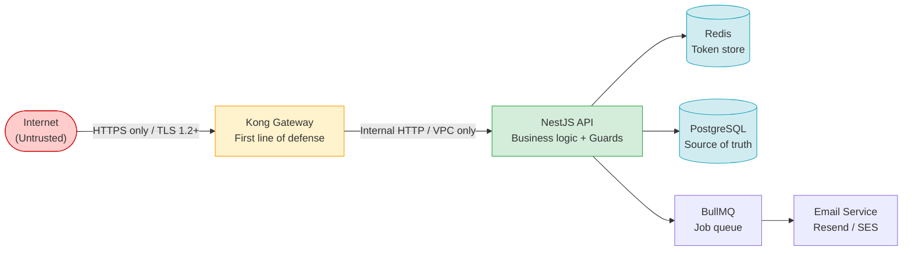

# 07 — Authentication, Security & RBAC Matrix

**Document:** DealFlow360 Technical Specification  
**Version:** 1.0.0  
**Date:** 2026-09-05  
**Status:** Approved  
**Owner:** Platform Security Team

---

## Table of Contents

1. [RBAC Permission Matrix](#1-rbac-permission-matrix)
2. [Internal User Authentication Flow](#2-internal-user-authentication-flow)
3. [Customer Portal Magic Link Flow](#3-customer-portal-magic-link-flow)
4. [NestJS Route Guards](#4-nestjs-route-guards)
5. [Kong Gateway Configuration](#5-kong-gateway-configuration)
6. [Security Headers & Best Practices](#6-security-headers--best-practices)
7. [Security Threat Model](#7-security-threat-model)

---

## 1. RBAC Permission Matrix

### 1.1 Role Definitions

| Role | Scope | Description |
|---|---|---|
| **Admin** | Global | Full platform access; manages users, config, and all resources |
| **Sales Rep** | Own Records | Creates and manages their own quotes; read-only on shared resources |
| **Sales Manager** | Team-wide | All Sales Rep capabilities plus approval authority over team quotes |
| **Finance** | Financial Records | Read/write on invoicing, credit notes, and financial analytics; no quote edit |
| **Portal Customer** | Assigned Quote | Stateless external user; can only view, counter, and confirm their assigned quote |

### 1.2 Permission Values

| Symbol | Meaning |
|---|---|
| ✅ Full | Create, Read, Update, Delete |
| 🔒 Own Only | Full CRUD scoped to records they own or are assigned to |
| 👁️ Read Only | GET operations only; no mutations |
| ❌ No Access | Route returns `403 Forbidden` |

### 1.3 Full Permission Matrix

| Feature / Endpoint Group | Admin | Sales Rep | Sales Manager | Finance | Portal Customer |
|---|:---:|:---:|:---:|:---:|:---:|
| **Auth & Session** | | | | | |
| Auth / Login (`POST /internal/auth/login`) | ✅ Full | ✅ Full | ✅ Full | ✅ Full | ❌ No Access |
| Auth / Logout (`POST /internal/auth/logout`) | ✅ Full | ✅ Full | ✅ Full | ✅ Full | ❌ No Access |
| Auth / Token Refresh (`POST /internal/auth/refresh`) | ✅ Full | ✅ Full | ✅ Full | ✅ Full | ❌ No Access |
| **Product Catalogue** | | | | | |
| Products CRUD (`/products`) | ✅ Full | 👁️ Read Only | 👁️ Read Only | 👁️ Read Only | ❌ No Access |
| Price Lists CRUD (`/price-lists`) | ✅ Full | 👁️ Read Only | 👁️ Read Only | ✅ Full | ❌ No Access |
| Discount Tier Config (`/discount-tiers`) | ✅ Full | ❌ No Access | 👁️ Read Only | 👁️ Read Only | ❌ No Access |
| **Approval Workflow** | | | | | |
| Approval Chain Config (`/approval-chains`) | ✅ Full | ❌ No Access | 👁️ Read Only | ❌ No Access | ❌ No Access |
| **Quote Management** | | | | | |
| Create Quote (`POST /quotes`) | ✅ Full | 🔒 Own Only | ✅ Full | ❌ No Access | ❌ No Access |
| View Own Quotes (`GET /quotes?owner=me`) | ✅ Full | 🔒 Own Only | ✅ Full | ❌ No Access | ❌ No Access |
| View All Quotes (`GET /quotes`) | ✅ Full | ❌ No Access | ✅ Full | 👁️ Read Only | ❌ No Access |
| Edit Quote — Draft (`PATCH /quotes/:id`) | ✅ Full | 🔒 Own Only | ✅ Full | ❌ No Access | ❌ No Access |
| Submit Quote (`POST /quotes/:id/submit`) | ✅ Full | 🔒 Own Only | ✅ Full | ❌ No Access | ❌ No Access |
| Approve / Reject Quote (`POST /quotes/:id/approve`) | ✅ Full | ❌ No Access | ✅ Full | ❌ No Access | ❌ No Access |
| **Audit & Compliance** | | | | | |
| View Audit Logs (`GET /audit-logs`) | ✅ Full | ❌ No Access | 👁️ Read Only | 👁️ Read Only | ❌ No Access |
| **Warehouse & Inventory** | | | | | |
| Warehouse CRUD (`/warehouses`) | ✅ Full | ❌ No Access | ❌ No Access | ❌ No Access | ❌ No Access |
| Stock Management (`/warehouses/:id/stock`) | ✅ Full | ❌ No Access | ❌ No Access | ❌ No Access | ❌ No Access |
| View Fulfillment Split (`GET /quotes/:id/fulfillment`) | ✅ Full | 🔒 Own Only | ✅ Full | 👁️ Read Only | ❌ No Access |
| Override Fulfillment Split (`PATCH /quotes/:id/fulfillment`) | ✅ Full | ❌ No Access | ✅ Full | ❌ No Access | ❌ No Access |
| Accept Fulfillment Split (`POST /quotes/:id/fulfillment/accept`) | ✅ Full | 🔒 Own Only | ✅ Full | ❌ No Access | ❌ No Access |
| **Subscriptions** | | | | | |
| Subscription Management (`/subscriptions`) | ✅ Full | 👁️ Read Only | 👁️ Read Only | ✅ Full | ❌ No Access |
| Cancel Subscription (`POST /subscriptions/:id/cancel`) | ✅ Full | ❌ No Access | ❌ No Access | ✅ Full | ❌ No Access |
| **Finance & Billing** | | | | | |
| View Invoices (`GET /invoices`) | ✅ Full | 🔒 Own Only | ✅ Full | ✅ Full | ❌ No Access |
| Void Invoice (`POST /invoices/:id/void`) | ✅ Full | ❌ No Access | ❌ No Access | ✅ Full | ❌ No Access |
| Issue Credit Note (`POST /invoices/:id/credit-note`) | ✅ Full | ❌ No Access | ❌ No Access | ✅ Full | ❌ No Access |
| **Analytics & Reporting** | | | | | |
| Analytics Dashboard (`GET /analytics/dashboard`) | ✅ Full | 🔒 Own Only | ✅ Full | ✅ Full | ❌ No Access |
| Discount Anomaly Alerts (`GET /analytics/discount-anomalies`) | ✅ Full | ❌ No Access | ✅ Full | ✅ Full | ❌ No Access |
| Deal Health Dashboard (`GET /analytics/deal-health`) | ✅ Full | 🔒 Own Only | ✅ Full | 👁️ Read Only | ❌ No Access |
| Export Reports (`POST /analytics/export`) | ✅ Full | 🔒 Own Only | ✅ Full | ✅ Full | ❌ No Access |
| **Customer Portal** | | | | | |
| Portal: View Quote (`GET /portal/quotes/:id`) | ❌ No Access | ❌ No Access | ❌ No Access | ❌ No Access | ✅ Full |
| Portal: Submit Counter-Offer (`POST /portal/quotes/:id/counter`) | ❌ No Access | ❌ No Access | ❌ No Access | ❌ No Access | ✅ Full |
| Portal: Confirm Quote (`POST /portal/quotes/:id/confirm`) | ❌ No Access | ❌ No Access | ❌ No Access | ❌ No Access | ✅ Full |

> [!IMPORTANT]
> **Own Only** enforcement is implemented at the application layer via `ResourceOwnerGuard`. Kong gateway cannot distinguish record ownership — that check happens inside the NestJS service after JWT validation.

---

## 2. Internal User Authentication Flow

### 2.1 Token Strategy

| Token | Type | Transport | Expiry | Storage |
|---|---|---|---|---|
| `access_token` | JWT (RS256) | HttpOnly Cookie (`df360_access`) | 15 minutes | Client cookie only |
| `refresh_token` | JWT (RS256) | HttpOnly Cookie (`df360_refresh`) | 7 days | Client cookie + Redis |

**Redis key schema for refresh tokens:**

```
refresh:<userId>:<tokenId>
TTL: 604800 seconds (7 days)
Value: { issuedAt: ISO8601, userAgent: string, ip: string }
```

**Access token JWT payload:**

```json
{
  "sub": "usr_01J8XKQP9F3M7N4BZ2VW6RTCHD",
  "role": "sales_rep",
  "email": "alice@dealflow360.com",
  "iat": 1757052217,
  "exp": 1757053117
}
```

### 2.2 Endpoint Reference

| Method | Path | Auth Required | Description |
|---|---|---|---|
| `POST` | `/api/v1/internal/auth/login` | No | Credential login, issues token pair |
| `POST` | `/api/v1/internal/auth/refresh` | Refresh cookie | Rotates access + refresh tokens |
| `POST` | `/api/v1/internal/auth/logout` | Access cookie | Revokes refresh token from Redis |
| `GET` | `/api/v1/internal/auth/me` | Access cookie | Returns current user profile |

### 2.3 Full Authentication Lifecycle — Sequence Diagram

```mermaid
sequenceDiagram
    autonumber
    actor User
    participant Browser
    participant Kong as Kong Gateway
    participant NestJS as NestJS API
    participant BetterAuth as Better Auth
    participant Redis
    participant DB as PostgreSQL

    rect rgb(220, 240, 255)
        note over Browser,Redis: LOGIN FLOW
        User->>Browser: Enter email + password
        Browser->>Kong: POST /api/v1/internal/auth/login<br/>{email, password}
        Kong->>NestJS: Forward (rate-limit: 500/min, adds X-Correlation-ID)
        NestJS->>BetterAuth: validateCredentials(email, password)
        BetterAuth->>DB: SELECT user WHERE email = $1
        DB-->>BetterAuth: User row (passwordHash, role, id)
        BetterAuth->>BetterAuth: bcrypt.compare(password, hash, rounds=12)
        BetterAuth-->>NestJS: { userId, role, email }
        NestJS->>NestJS: signAccessToken(payload, exp=15m)
        NestJS->>NestJS: signRefreshToken(payload, exp=7d, tokenId=uuid())
        NestJS->>Redis: SET refresh:<userId>:<tokenId><br/>{ issuedAt, ip, userAgent }<br/>EX 604800
        Redis-->>NestJS: OK
        NestJS-->>Browser: 200 OK<br/>Set-Cookie: df360_access=<JWT>; HttpOnly; Secure; SameSite=Strict; Max-Age=900<br/>Set-Cookie: df360_refresh=<JWT>; HttpOnly; Secure; SameSite=Strict; Path=/api/v1/internal/auth/refresh; Max-Age=604800
    end

    rect rgb(220, 255, 230)
        note over Browser,Redis: AUTHENTICATED REQUEST
        Browser->>Kong: GET /api/v1/internal/quotes<br/>Cookie: df360_access=<JWT>
        Kong->>NestJS: Forward request
        NestJS->>NestJS: JwtAuthGuard: verify access_token signature + expiry
        NestJS->>NestJS: RolesGuard: check role claim vs @Roles() decorator
        NestJS->>DB: SELECT quotes WHERE ...
        DB-->>NestJS: Quote data
        NestJS-->>Browser: 200 OK { data: [...] }
    end

    rect rgb(255, 245, 220)
        note over Browser,Redis: TOKEN REFRESH FLOW
        Browser->>Kong: POST /api/v1/internal/auth/refresh<br/>Cookie: df360_refresh=<JWT>
        Kong->>NestJS: Forward request
        NestJS->>NestJS: Decode refresh_token (unverified), extract userId + tokenId
        NestJS->>Redis: EXISTS refresh:<userId>:<tokenId>
        Redis-->>NestJS: 1 (exists)
        NestJS->>NestJS: Verify refresh_token signature + expiry
        NestJS->>NestJS: signAccessToken(new payload, exp=15m)
        NestJS->>NestJS: signRefreshToken(new payload, exp=7d, newTokenId=uuid())
        NestJS->>Redis: DEL refresh:<userId>:<oldTokenId>
        NestJS->>Redis: SET refresh:<userId>:<newTokenId> EX 604800
        Redis-->>NestJS: OK
        NestJS-->>Browser: 200 OK<br/>Set-Cookie: df360_access=<newJWT>; HttpOnly; ...<br/>Set-Cookie: df360_refresh=<newJWT>; HttpOnly; ...
    end

    rect rgb(255, 220, 220)
        note over Browser,Redis: LOGOUT FLOW
        User->>Browser: Click logout
        Browser->>Kong: POST /api/v1/internal/auth/logout<br/>Cookie: df360_access=<JWT>; df360_refresh=<JWT>
        Kong->>NestJS: Forward request
        NestJS->>NestJS: Decode refresh_token, extract userId + tokenId
        NestJS->>Redis: DEL refresh:<userId>:<tokenId>
        Redis-->>NestJS: 1 (deleted)
        NestJS-->>Browser: 200 OK<br/>Set-Cookie: df360_access=; Max-Age=0<br/>Set-Cookie: df360_refresh=; Max-Age=0
        Browser->>Browser: Cookies cleared, redirect to /login
    end
```

### 2.4 Better Auth Integration

```typescript
// src/auth/better-auth.config.ts
import { betterAuth } from 'better-auth';
import { drizzleAdapter } from 'better-auth/adapters/drizzle';
import { db } from '@/database/connection';
import { users } from '@/database/schema';

export const auth = betterAuth({
  database: drizzleAdapter(db, {
    provider: 'pg',
    schema: { users },
  }),
  session: {
    // Better Auth session management disabled — we handle JWTs manually
    expiresIn: 0,
  },
  emailAndPassword: {
    enabled: true,
    // Password validation delegated to Zod before reaching Better Auth
    minPasswordLength: 12,
  },
  advanced: {
    // Disable built-in cookie handling — NestJS issues cookies directly
    disableCookies: true,
  },
});
```

---

## 3. Customer Portal Magic Link Flow

### 3.1 Design Rationale

The portal is **stateless and invitation-only**. No customer account is created. A magic link scopes access to exactly one quote for 24 hours. The token is single-use: consumption atomically deletes it from Redis, preventing replay attacks.

### 3.2 Token Schema

| Parameter | Value |
|---|---|
| Token entropy | 32 bytes, CSPRNG, hex-encoded (64 characters) |
| Redis key | `magic:<token>` |
| Redis value | `{ customerId: string, quoteId: string, email: string }` |
| Redis TTL | 86400 seconds (24 hours) |
| Portal JWT expiry | 24 hours |
| Portal JWT claim | `type: "portal"` — prevents internal JWTs from being used on portal routes |

**Portal JWT payload:**

```json
{
  "sub": "cust_01J8XKQP9F3M7N4BZ2VW6RTCHD",
  "type": "portal",
  "quoteId": "qte_01J8XKQP9F3M7N4BZ2VW6RTCHD",
  "email": "buyer@acmecorp.com",
  "iat": 1757052217,
  "exp": 1757138617
}
```

### 3.3 Endpoint Reference

| Method | Path | Auth Required | Description |
|---|---|---|---|
| `POST` | `/api/v1/portal/auth/magic-link/request` | No | Sends magic link email |
| `POST` | `/api/v1/portal/auth/magic-link/verify` | No | Verifies token, issues portal JWT |
| `POST` | `/api/v1/portal/auth/logout` | Portal cookie | Clears portal JWT cookie |
| `GET` | `/api/v1/portal/quotes/:id` | Portal cookie | View quote (quoteId must match JWT claim) |
| `POST` | `/api/v1/portal/quotes/:id/counter` | Portal cookie | Submit counter-offer |
| `POST` | `/api/v1/portal/quotes/:id/confirm` | Portal cookie | Confirm and accept quote |

### 3.4 Magic Link Flow — Sequence Diagram

```mermaid
sequenceDiagram
    autonumber
    actor Customer
    participant Browser
    participant Kong as Kong Gateway
    participant NestJS as NestJS API
    participant Redis
    participant BullMQ as "BullMQ Queue (email-notifications)"
    participant Email as "Email Service (Resend / SES)"
    participant InternalApp as "Internal App (Sales Rep)"

    rect rgb(220, 240, 255)
        note over InternalApp,BullMQ: PREREQUISITE: Sales Rep sends quote to customer
        InternalApp->>NestJS: POST /api/v1/internal/quotes/:id/send<br/>Cookie: df360_access=<JWT>
        NestJS->>NestJS: Verify JWT, check role (sales_rep/manager), check ownership
        NestJS->>BullMQ: Enqueue magic-link-request job<br/>{ quoteId, customerId, email }
    end

    rect rgb(220, 255, 230)
        note over Browser,Email: MAGIC LINK REQUEST
        BullMQ->>NestJS: Worker picks up job
        NestJS->>NestJS: crypto.randomBytes(32).toString('hex') => token
        NestJS->>Redis: SET magic:<token><br/>{ customerId, quoteId, email }<br/>EX 86400
        Redis-->>NestJS: OK
        NestJS->>BullMQ: Enqueue send-email job<br/>{ to: email, template: magic-link,<br/>  url: PORTAL_URL/auth/verify?token=TOKEN }
        BullMQ->>Email: Send transactional email
        Email-->>Customer: Email: "View your quote — click to open"
    end

    rect rgb(255, 245, 220)
        note over Browser,Redis: MAGIC LINK VERIFICATION
        Customer->>Browser: Click link in email
        Browser->>Kong: POST /api/v1/portal/auth/magic-link/verify<br/>{ token: "<hex-token>" }
        Kong->>NestJS: Forward (rate-limit: 100/min)
        NestJS->>Redis: GET magic:<token>
        Redis-->>NestJS: { customerId, quoteId, email }
        NestJS->>Redis: DEL magic:<token>  (one-time use, atomic)
        Redis-->>NestJS: 1 (deleted)
        NestJS->>NestJS: signPortalJwt({ sub: customerId, type: portal,<br/>  quoteId, email }, exp=24h)
        NestJS-->>Browser: 200 OK<br/>Set-Cookie: df360_portal=<JWT>; HttpOnly; Secure; SameSite=Strict; Max-Age=86400
        Browser->>Browser: Redirect to /portal/quotes/<quoteId>
    end

    rect rgb(255, 220, 220)
        note over Browser,NestJS: TOKEN NOT FOUND / EXPIRED PATH
        Browser->>Kong: POST /api/v1/portal/auth/magic-link/verify<br/>{ token: "<expired-or-used-token>" }
        Kong->>NestJS: Forward
        NestJS->>Redis: GET magic:<token>
        Redis-->>NestJS: nil
        NestJS-->>Browser: 401 Unauthorized<br/>{ error: "TOKEN_EXPIRED",<br/>  message: "This link has expired or already been used." }
    end

    rect rgb(240, 220, 255)
        note over Browser,NestJS: AUTHENTICATED PORTAL REQUEST
        Browser->>Kong: GET /api/v1/portal/quotes/qte_01J8...<br/>Cookie: df360_portal=<JWT>
        Kong->>NestJS: Forward
        NestJS->>NestJS: PortalAuthGuard: verify JWT type === portal
        NestJS->>NestJS: PortalAuthGuard: verify JWT quoteId === route param :id
        NestJS->>DB: SELECT quote WHERE id = $1 AND customerId = $2
        DB-->>NestJS: Quote data (customer-safe projection)
        NestJS-->>Browser: 200 OK { quote: { ... } }
    end
```

### 3.5 Magic Link Service Implementation

```typescript
// src/portal/auth/portal-auth.service.ts
import { Injectable, UnauthorizedException } from '@nestjs/common';
import { InjectRedis } from '@nestjs-modules/ioredis';
import { Redis } from 'ioredis';
import { JwtService } from '@nestjs/jwt';
import { InjectQueue } from '@nestjs/bullmq';
import { Queue } from 'bullmq';
import * as crypto from 'crypto';
import { ConfigService } from '@nestjs/config';

interface MagicLinkPayload {
  customerId: string;
  quoteId: string;
  email: string;
}

interface PortalJwtPayload {
  sub: string;
  type: 'portal';
  quoteId: string;
  email: string;
}

@Injectable()
export class PortalAuthService {
  private readonly MAGIC_LINK_TTL_SECONDS = 86400; // 24 hours

  constructor(
    @InjectRedis() private readonly redis: Redis,
    private readonly jwtService: JwtService,
    private readonly configService: ConfigService,
    @InjectQueue('email-notifications') private readonly emailQueue: Queue,
  ) {}

  /**
   * Generates and stores a magic link token, then dispatches the email job.
   * Called internally when a Sales Rep sends a quote to a customer.
   */
  async requestMagicLink(
    customerId: string,
    quoteId: string,
    email: string,
  ): Promise<void> {
    const token = crypto.randomBytes(32).toString('hex');
    const redisKey = `magic:${token}`;
    const payload: MagicLinkPayload = { customerId, quoteId, email };

    await this.redis.set(
      redisKey,
      JSON.stringify(payload),
      'EX',
      this.MAGIC_LINK_TTL_SECONDS,
    );

    const portalUrl = this.configService.getOrThrow<string>('PORTAL_URL');
    const magicLinkUrl = `${portalUrl}/auth/verify?token=${token}&quoteId=${quoteId}`;

    await this.emailQueue.add(
      'send-magic-link',
      {
        to: email,
        template: 'magic-link',
        variables: {
          magicLinkUrl,
          quoteId,
          expiresInHours: 24,
        },
      },
      {
        attempts: 3,
        backoff: { type: 'exponential', delay: 5000 },
        removeOnComplete: true,
      },
    );
  }

  /**
   * Verifies a magic link token (single-use: atomically deleted on first use).
   * Uses Redis MULTI/EXEC to prevent race conditions on concurrent requests
   * with the same token.
   */
  async verifyMagicLink(token: string): Promise<string> {
    const redisKey = `magic:${token}`;

    // Atomic GET then DEL — prevents replay on concurrent requests
    const results = await this.redis
      .multi()
      .get(redisKey)
      .del(redisKey)
      .exec();

    const payloadStr = results?.[0]?.[1] as string | null;

    if (!payloadStr) {
      throw new UnauthorizedException({
        error: 'TOKEN_EXPIRED',
        message:
          'This link has expired or already been used. Request a new one.',
      });
    }

    const { customerId, quoteId, email }: MagicLinkPayload =
      JSON.parse(payloadStr);

    const jwtPayload: PortalJwtPayload = {
      sub: customerId,
      type: 'portal',
      quoteId,
      email,
    };

    return this.jwtService.sign(jwtPayload, {
      expiresIn: '24h',
      secret: this.configService.getOrThrow<string>('PORTAL_JWT_SECRET'),
    });
  }
}
```

---

## 4. NestJS Route Guards

### 4.1 Guard Hierarchy

```
Request
  │
  ├─ Kong (rate-limiting, CORS, IP whitelist, X-Correlation-ID injection)
  │
  └─ NestJS Guard Chain (applied in order via @UseGuards())
       │
       ├─ 1. JwtAuthGuard       (internal routes) ── validates access_token
       │   └─ PortalAuthGuard   (portal routes)   ── validates portal JWT + quoteId claim
       │
       ├─ 2. RolesGuard         ── checks role claim vs @Roles() metadata
       │
       └─ 3. ResourceOwnerGuard ── scopes Sales Rep to their own records
```

### 4.2 `JwtAuthGuard`

Validates the `df360_access` HttpOnly cookie for all internal API routes.

```typescript
// src/auth/guards/jwt-auth.guard.ts
import {
  Injectable,
  CanActivate,
  ExecutionContext,
  UnauthorizedException,
} from '@nestjs/common';
import { JwtService } from '@nestjs/jwt';
import { Reflector } from '@nestjs/core';
import { ConfigService } from '@nestjs/config';
import { Request } from 'express';
import { IS_PUBLIC_KEY } from '../decorators/public.decorator';

@Injectable()
export class JwtAuthGuard implements CanActivate {
  constructor(
    private readonly jwtService: JwtService,
    private readonly reflector: Reflector,
    private readonly configService: ConfigService,
  ) {}

  async canActivate(context: ExecutionContext): Promise<boolean> {
    // Allow routes decorated with @Public()
    const isPublic = this.reflector.getAllAndOverride<boolean>(IS_PUBLIC_KEY, [
      context.getHandler(),
      context.getClass(),
    ]);
    if (isPublic) return true;

    const request = context.switchToHttp().getRequest<Request>();
    const token = request.cookies?.['df360_access'];

    if (!token) {
      throw new UnauthorizedException({
        error: 'MISSING_TOKEN',
        message: 'Access token is required.',
      });
    }

    try {
      const payload = await this.jwtService.verifyAsync(token, {
        secret: this.configService.getOrThrow<string>('JWT_ACCESS_SECRET'),
      });

      // Attach decoded user to request for downstream guards and controllers
      request['user'] = payload;
      return true;
    } catch {
      throw new UnauthorizedException({
        error: 'INVALID_TOKEN',
        message: 'Access token is invalid or expired.',
      });
    }
  }
}
```

### 4.3 `PortalAuthGuard`

Validates the portal JWT **and** enforces that the `quoteId` claim in the token matches the `:id` route parameter, preventing horizontal privilege escalation between quotes.

```typescript
// src/auth/guards/portal-auth.guard.ts
import {
  Injectable,
  CanActivate,
  ExecutionContext,
  UnauthorizedException,
  ForbiddenException,
} from '@nestjs/common';
import { JwtService } from '@nestjs/jwt';
import { ConfigService } from '@nestjs/config';
import { Request } from 'express';

interface PortalJwtPayload {
  sub: string;
  type: string;
  quoteId: string;
  email: string;
  iat: number;
  exp: number;
}

@Injectable()
export class PortalAuthGuard implements CanActivate {
  constructor(
    private readonly jwtService: JwtService,
    private readonly configService: ConfigService,
  ) {}

  async canActivate(context: ExecutionContext): Promise<boolean> {
    const request = context.switchToHttp().getRequest<Request>();
    const token = request.cookies?.['df360_portal'];

    if (!token) {
      throw new UnauthorizedException({
        error: 'MISSING_PORTAL_TOKEN',
        message: 'Portal session not found. Please use your magic link.',
      });
    }

    let payload: PortalJwtPayload;

    try {
      payload = await this.jwtService.verifyAsync<PortalJwtPayload>(token, {
        secret: this.configService.getOrThrow<string>('PORTAL_JWT_SECRET'),
      });
    } catch {
      throw new UnauthorizedException({
        error: 'INVALID_PORTAL_TOKEN',
        message: 'Your portal session has expired. Please request a new link.',
      });
    }

    // Enforce type === "portal" — blocks internal JWTs from accessing portal routes
    if (payload.type !== 'portal') {
      throw new ForbiddenException({
        error: 'INVALID_TOKEN_TYPE',
        message: 'This token type is not permitted on portal routes.',
      });
    }

    // Enforce quoteId claim matches route param :id (horizontal escalation prevention)
    const routeQuoteId = request.params?.id;
    if (routeQuoteId && payload.quoteId !== routeQuoteId) {
      throw new ForbiddenException({
        error: 'QUOTE_ID_MISMATCH',
        message: 'You are not authorized to access this quote.',
      });
    }

    request['portalUser'] = payload;
    return true;
  }
}
```

### 4.4 `RolesGuard`

Enforces role-based access control using the `@Roles()` decorator metadata.

```typescript
// src/auth/guards/roles.guard.ts
import {
  Injectable,
  CanActivate,
  ExecutionContext,
  ForbiddenException,
} from '@nestjs/common';
import { Reflector } from '@nestjs/core';
import { ROLES_KEY } from '../decorators/roles.decorator';
import { UserRole } from '../enums/user-role.enum';

@Injectable()
export class RolesGuard implements CanActivate {
  constructor(private readonly reflector: Reflector) {}

  canActivate(context: ExecutionContext): boolean {
    const requiredRoles = this.reflector.getAllAndOverride<UserRole[]>(
      ROLES_KEY,
      [context.getHandler(), context.getClass()],
    );

    // No @Roles() decorator = accessible to any authenticated user
    if (!requiredRoles || requiredRoles.length === 0) return true;

    const { user } = context.switchToHttp().getRequest();

    if (!user?.role || !requiredRoles.includes(user.role as UserRole)) {
      throw new ForbiddenException({
        error: 'INSUFFICIENT_PERMISSIONS',
        message: `This action requires one of the following roles: ${requiredRoles.join(', ')}.`,
      });
    }

    return true;
  }
}

// ─── src/auth/decorators/roles.decorator.ts ──────────────────────────────────
import { SetMetadata } from '@nestjs/common';
import { UserRole } from '../enums/user-role.enum';

export const ROLES_KEY = 'roles';
export const Roles = (...roles: UserRole[]) => SetMetadata(ROLES_KEY, roles);

// ─── src/auth/enums/user-role.enum.ts ────────────────────────────────────────
export enum UserRole {
  ADMIN          = 'admin',
  SALES_REP      = 'sales_rep',
  SALES_MANAGER  = 'sales_manager',
  FINANCE        = 'finance',
}
```

**Usage example on a controller:**

```typescript
// src/quotes/quotes.controller.ts (excerpt)
import { Controller, Get, Post, Patch, Param, UseGuards } from '@nestjs/common';
import { JwtAuthGuard } from '@/auth/guards/jwt-auth.guard';
import { RolesGuard } from '@/auth/guards/roles.guard';
import { ResourceOwnerGuard } from '@/auth/guards/resource-owner.guard';
import { Roles } from '@/auth/decorators/roles.decorator';
import { UserRole } from '@/auth/enums/user-role.enum';

@Controller('api/v1/internal/quotes')
@UseGuards(JwtAuthGuard, RolesGuard)
export class QuotesController {
  // Any authenticated internal user can list (ResourceOwnerGuard scopes the DB query)
  @Get()
  @Roles(UserRole.ADMIN, UserRole.SALES_REP, UserRole.SALES_MANAGER, UserRole.FINANCE)
  findAll() { /* service filters by ownerId for SALES_REP */ }

  // Only Sales Managers and Admins can approve quotes
  @Post(':id/approve')
  @Roles(UserRole.ADMIN, UserRole.SALES_MANAGER)
  approve(@Param('id') id: string) { /* ... */ }

  // Sales Rep can edit their own drafts; ResourceOwnerGuard enforces ownership
  @Patch(':id')
  @Roles(UserRole.ADMIN, UserRole.SALES_REP, UserRole.SALES_MANAGER)
  @UseGuards(ResourceOwnerGuard)
  update(@Param('id') id: string) { /* ... */ }
}
```

### 4.5 `ResourceOwnerGuard`

Ensures that a `sales_rep` can only mutate records they own. Admins and Sales Managers bypass this check entirely.

```typescript
// src/auth/guards/resource-owner.guard.ts
import {
  Injectable,
  CanActivate,
  ExecutionContext,
  ForbiddenException,
  NotFoundException,
} from '@nestjs/common';
import { QuotesRepository } from '@/quotes/quotes.repository';
import { UserRole } from '../enums/user-role.enum';

@Injectable()
export class ResourceOwnerGuard implements CanActivate {
  constructor(private readonly quotesRepository: QuotesRepository) {}

  async canActivate(context: ExecutionContext): Promise<boolean> {
    const request = context.switchToHttp().getRequest();
    const user = request['user'];
    const quoteId = request.params?.id;

    // Admins and Sales Managers bypass ownership check
    if (
      user.role === UserRole.ADMIN ||
      user.role === UserRole.SALES_MANAGER
    ) {
      return true;
    }

    if (!quoteId) return true; // Non-resource routes pass through

    const quote = await this.quotesRepository.findById(quoteId);

    if (!quote) {
      throw new NotFoundException({
        error: 'QUOTE_NOT_FOUND',
        message: `Quote ${quoteId} does not exist.`,
      });
    }

    if (quote.ownerId !== user.sub) {
      throw new ForbiddenException({
        error: 'NOT_RESOURCE_OWNER',
        message: 'You can only modify quotes that you created.',
      });
    }

    return true;
  }
}
```

---

## 5. Kong Gateway Configuration

### 5.1 Architecture Overview

```
Internet
    │
    ▼
┌─────────────────────────────────┐
│        Kong API Gateway          │
│  rate-limit · CORS · IP restrict │
│  request-id · response-transform │
└──────────┬──────────────────────┘
           │
    ┌──────┴──────────┐
    ▼                 ▼
Internal API       Portal API
(NestJS :3000)    (NestJS :3001)
```

### 5.2 Complete Kong Declarative Configuration

```yaml
# kong/kong.declarative.yaml
# Deploy via: deck sync --state kong/kong.declarative.yaml

_format_version: "3.0"
_transform: true

services:
  - name: internal-api-service
    url: http://dealflow360-api:3000
    connect_timeout: 5000
    read_timeout: 30000
    write_timeout: 30000
    retries: 2

  - name: portal-api-service
    url: http://dealflow360-api:3001
    connect_timeout: 5000
    read_timeout: 30000
    write_timeout: 30000
    retries: 2

routes:
  # ─────────────────────────────────────────────────────────────────────────
  # ADMIN ROUTES — IP-whitelisted, 60 req/min, fault_tolerant: false
  # Declared BEFORE internal-api to take Kong route priority
  # ─────────────────────────────────────────────────────────────────────────
  - name: admin-api
    service: internal-api-service
    paths:
      - /api/v1/internal/admin
    strip_path: false
    plugins:
      - name: ip-restriction
        config:
          allow:
            - "10.0.0.0/8"       # RFC1918 — internal VPC
            - "172.16.0.0/12"    # RFC1918 — Docker / k8s pod CIDR
            - "192.168.0.0/16"   # RFC1918 — on-premise VPN
          status: 403
          message: "Access denied: your IP is not permitted to access admin routes."

      - name: rate-limiting
        config:
          minute: 60
          policy: redis
          redis_host: redis
          redis_port: 6379
          redis_database: 1
          fault_tolerant: false      # Block all requests if Redis unavailable
          hide_client_headers: false
          error_code: 429
          error_message: "Admin API rate limit exceeded."

      - name: request-id
        config:
          header_name: X-Correlation-ID
          generator: uuid
          echo_downstream: true

  # ─────────────────────────────────────────────────────────────────────────
  # INTERNAL API — authenticated staff, 500 req/min
  # ─────────────────────────────────────────────────────────────────────────
  - name: internal-api
    service: internal-api-service
    paths:
      - /api/v1/internal
    strip_path: false
    plugins:
      - name: rate-limiting
        config:
          minute: 500
          policy: redis
          redis_host: redis
          redis_port: 6379
          redis_database: 1
          fault_tolerant: true
          hide_client_headers: false
          error_code: 429
          error_message: "Internal API rate limit exceeded. Please slow down."

      - name: cors
        config:
          origins:
            - "https://app.dealflow360.com"
          methods:
            - GET
            - POST
            - PATCH
            - DELETE
            - OPTIONS
          headers:
            - Authorization
            - Content-Type
            - X-Correlation-ID
            - X-Request-ID
          exposed_headers:
            - X-Correlation-ID
            - X-RateLimit-Limit-Minute
            - X-RateLimit-Remaining-Minute
          credentials: true
          max_age: 3600
          preflight_continue: false

      - name: request-id
        config:
          header_name: X-Correlation-ID
          generator: uuid
          echo_downstream: true

      - name: response-transformer
        config:
          remove:
            headers:
              - X-Powered-By
              - Server
          add:
            headers:
              - "X-Frame-Options: DENY"
              - "X-Content-Type-Options: nosniff"

  # ─────────────────────────────────────────────────────────────────────────
  # PORTAL API — external customers, 100 req/min, separate origin
  # ─────────────────────────────────────────────────────────────────────────
  - name: portal-api
    service: portal-api-service
    paths:
      - /api/v1/portal
    strip_path: false
    plugins:
      - name: rate-limiting
        config:
          minute: 100
          policy: redis
          redis_host: redis
          redis_port: 6379
          redis_database: 2
          limit_by: ip
          fault_tolerant: true
          hide_client_headers: false
          error_code: 429
          error_message: "Too many requests. Please wait before trying again."

      - name: cors
        config:
          origins:
            - "https://portal.dealflow360.com"
          methods:
            - GET
            - POST
            - OPTIONS
          headers:
            - Content-Type
            - X-Correlation-ID
          exposed_headers:
            - X-Correlation-ID
            - X-RateLimit-Limit-Minute
            - X-RateLimit-Remaining-Minute
          credentials: true
          max_age: 3600
          preflight_continue: false

      - name: request-id
        config:
          header_name: X-Correlation-ID
          generator: uuid
          echo_downstream: true

      - name: response-transformer
        config:
          remove:
            headers:
              - X-Powered-By
              - Server
          add:
            headers:
              - "X-Frame-Options: DENY"
              - "X-Content-Type-Options: nosniff"
```

### 5.3 Kong Plugin Reference

| Plugin | Routes Applied | Purpose |
|---|---|---|
| `rate-limiting` | All routes | Throttles by IP; Redis-backed for distributed counting across Kong nodes |
| `cors` | All routes | Validates `Origin` header; sets `Access-Control-Allow-*` response headers |
| `ip-restriction` | `admin-api` only | Blocks all non-whitelisted IPs at the gateway before hitting NestJS |
| `request-id` | All routes | Generates `X-Correlation-ID` UUID if absent; echoes to downstream for distributed tracing |
| `response-transformer` | Internal + Portal | Strips `Server` and `X-Powered-By`; injects `X-Frame-Options` and `X-Content-Type-Options` |

### 5.4 Rate Limiting Behaviour

| Route Group | Limit | Window | Policy | On Redis Failure |
|---|---|---|---|---|
| Admin API | 60 req/min | Rolling 60s | Redis (centralized) | **Hard block** (`fault_tolerant: false`) |
| Internal API | 500 req/min | Rolling 60s | Redis (centralized) | Soft pass |
| Portal API | 100 req/min per IP | Rolling 60s | Redis per-IP | Soft pass |

> [!WARNING]
> Admin rate limiting uses `fault_tolerant: false`. If Redis is unreachable, admin routes will **reject all requests** rather than silently bypass limits. Availability of admin routes is secondary to preventing unenforced access during an infrastructure incident.

---

## 6. Security Headers & Best Practices

### 6.1 Helmet Configuration (NestJS Bootstrap)

```typescript
// src/main.ts
import { NestFactory } from '@nestjs/core';
import { AppModule } from './app.module';
import helmet from 'helmet';
import cookieParser from 'cookie-parser';

async function bootstrap() {
  const app = await NestFactory.create(AppModule);

  // Required for HttpOnly cookie reading in guards
  app.use(cookieParser());

  app.use(
    helmet({
      // Content-Security-Policy: restrict resource loading origins
      contentSecurityPolicy: {
        directives: {
          defaultSrc:    ["'self'"],
          scriptSrc:     ["'self'"],
          styleSrc:      ["'self'", "'unsafe-inline'"],
          imgSrc:        ["'self'", 'data:', 'https:'],
          fontSrc:       ["'self'"],
          connectSrc:    ["'self'", 'https://api.dealflow360.com'],
          frameSrc:      ["'none'"],
          objectSrc:     ["'none'"],
          upgradeInsecureRequests: [],
        },
      },

      // HTTP Strict Transport Security: force HTTPS for 1 year, include subdomains
      hsts: {
        maxAge:            31536000,
        includeSubDomains: true,
        preload:           true,
      },

      // Prevent clickjacking via iframe embedding
      frameguard: { action: 'deny' },

      // Prevent MIME type sniffing
      noSniff: true,

      // Disable browser DNS prefetch (reduces passive data leakage)
      dnsPrefetchControl: { allow: false },

      // Only send origin as Referer on same-origin requests
      referrerPolicy: { policy: 'same-origin' },

      // Cross-Origin isolation headers
      crossOriginOpenerPolicy:   { policy: 'same-origin' },
      crossOriginResourcePolicy: { policy: 'same-origin' },

      // Remove X-Powered-By (also stripped at Kong layer — defence in depth)
      hidePoweredBy: true,

      // IE: restrict to declared content type
      ieNoOpen: true,

      // Deny Adobe Flash/PDF cross-domain reads
      permittedCrossDomainPolicies: { permittedPolicies: 'none' },

      // XSS filter (legacy header, belt-and-suspenders)
      xssFilter: true,
    }),
  );

  await app.listen(3000);
}

bootstrap();
```

### 6.2 Password Hashing

All passwords are hashed using **bcrypt** with a cost factor of **12 rounds**, providing approximately 250ms per hash on modern hardware — sufficient resistance against brute force while maintaining acceptable login latency.

```typescript
// src/auth/crypto/password.service.ts
import { Injectable } from '@nestjs/common';
import * as bcrypt from 'bcrypt';

@Injectable()
export class PasswordService {
  private readonly SALT_ROUNDS = 12;

  /**
   * Hash a plaintext password before storage.
   * Never log or store the plaintext value.
   */
  async hash(plaintext: string): Promise<string> {
    return bcrypt.hash(plaintext, this.SALT_ROUNDS);
  }

  /**
   * Constant-time comparison via bcrypt.compare — prevents timing attacks.
   */
  async verify(plaintext: string, hash: string): Promise<boolean> {
    return bcrypt.compare(plaintext, hash);
  }
}
```

**Zod password policy enforced before reaching the service:**

```typescript
// src/auth/dto/login.dto.ts
import { z } from 'zod';

export const LoginSchema = z.object({
  email: z
    .string()
    .email('Invalid email format.')
    .toLowerCase()
    .trim(),
  password: z
    .string()
    .min(12, 'Password must be at least 12 characters.')
    .max(128, 'Password must not exceed 128 characters.'),
});

export type LoginDto = z.infer<typeof LoginSchema>;
```

### 6.3 SQL Injection Protection (Drizzle ORM)

All database queries use **Drizzle ORM parameterized queries**. Raw string interpolation into SQL is prohibited.

```typescript
// ✅ CORRECT — Drizzle parameterizes all values as $1, $2, etc.
const quote = await db
  .select()
  .from(quotes)
  .where(
    and(
      eq(quotes.id, quoteId),       // parameterized as $1
      eq(quotes.ownerId, userId),   // parameterized as $2
    ),
  )
  .limit(1);

// ❌ FORBIDDEN — never interpolate user input into raw SQL strings
// await db.execute(sql`SELECT * FROM quotes WHERE id = '${quoteId}'`);
// ESLint rule `no-raw-sql-interpolation` enforces this at lint time.
```

### 6.4 Input Validation — Global Zod Pipe

Every request body and query string is validated by a **global Zod validation pipe** before reaching any controller method. Invalid requests are rejected with structured `400` errors before business logic executes.

```typescript
// src/common/pipes/zod-validation.pipe.ts
import {
  PipeTransform,
  ArgumentMetadata,
  BadRequestException,
} from '@nestjs/common';
import { ZodSchema, ZodError } from 'zod';

export class ZodValidationPipe implements PipeTransform {
  constructor(private readonly schema: ZodSchema) {}

  transform(value: unknown, _metadata: ArgumentMetadata) {
    const result = this.schema.safeParse(value);

    if (!result.success) {
      const formatted = (result.error as ZodError).errors.map((e) => ({
        field:   e.path.join('.'),
        message: e.message,
      }));

      throw new BadRequestException({
        error:   'VALIDATION_ERROR',
        details: formatted,
      });
    }

    return result.data;
  }
}
```

### 6.5 X-Correlation-ID Propagation

Kong injects `X-Correlation-ID` on every inbound request. NestJS propagates it through all service calls and includes it in every structured log entry, enabling full distributed trace reconstruction.

```typescript
// src/common/middleware/correlation-id.middleware.ts
import { Injectable, NestMiddleware } from '@nestjs/common';
import { Request, Response, NextFunction } from 'express';

@Injectable()
export class CorrelationIdMiddleware implements NestMiddleware {
  use(req: Request, res: Response, next: NextFunction): void {
    const correlationId =
      (req.headers['x-correlation-id'] as string) ?? crypto.randomUUID();

    // Attach to request object for use in controllers, services, and guards
    req['correlationId'] = correlationId;

    // Ensure the ID is echoed back in the response
    res.setHeader('X-Correlation-ID', correlationId);

    next();
  }
}
```

### 6.6 Sensitive Data Logging Policy

| Data Type | Logging Rule |
|---|---|
| Passwords (plaintext) | ❌ **Never** log under any circumstances |
| JWT tokens (full value) | ❌ **Never** log — log `sub` and `role` claims only |
| Magic link tokens | ❌ **Never** log — log `quoteId` and `customerId` only |
| Email addresses | ⚠️ `DEBUG` level only; redacted before shipping to log aggregators |
| Redis keys | ✅ Safe to log (keys contain IDs, not secrets) |
| IP addresses | ✅ Log for security audit; subject to GDPR data retention policy |
| X-Correlation-ID | ✅ Always log — primary distributed trace identifier |

```typescript
// ✅ Correct structured log entry
this.logger.log({
  event:         'USER_LOGIN_SUCCESS',
  userId:        user.id,
  role:          user.role,
  correlationId: req.correlationId,
  // ❌ Never add: password, rawToken, email (in production)
});
```

---

## 7. Security Threat Model

### 7.1 Threat Surface Diagram



### 7.2 Threat Mitigations

| # | Threat | Attack Vector | Mitigation |
|---|---|---|---|
| T-01 | **CSRF** | Attacker tricks authenticated browser into making unauthorized state-changing requests | `SameSite=Strict` on all cookies blocks cross-origin cookie inclusion. No Bearer token in `Authorization` header prevents CSRF via fetch/XHR from attacker-controlled origins. |
| T-02 | **XSS (Stored / Reflected)** | Malicious script injected into UI reads tokens or impersonates user | Tokens stored in `HttpOnly` cookies — inaccessible to JavaScript. Helmet CSP restricts inline scripts and untrusted origins. Zod validates all user-supplied strings server-side. React auto-escapes rendered output. |
| T-03 | **SQL Injection** | Crafted input alters SQL query structure to exfiltrate or corrupt data | Drizzle ORM uses **parameterized queries** for all operations. Raw SQL string interpolation is prohibited by ESLint rule and code review policy. |
| T-04 | **Access Token Theft** | MITM or XSS exfiltrates the `access_token` cookie | 15-minute expiry limits the blast radius to one refresh cycle. `HttpOnly` prevents JavaScript access. HSTS and Kong TLS termination prevent MITM on transit. |
| T-05 | **Refresh Token Theft** | Stolen refresh token used to indefinitely maintain access | Refresh tokens are **rotated on every use** — old token deleted from Redis atomically. Reuse of a consumed token triggers full session revocation for that user (`DEL refresh:<userId>:*`). |
| T-06 | **Magic Link Replay** | Attacker intercepts or reuses a magic link URL | Tokens are **single-use**: Redis `MULTI/EXEC` atomically reads and deletes on first use. 64-character hex token provides 256 bits of entropy. 24-hour TTL limits exposure window. |
| T-07 | **Brute Force / Credential Stuffing** | Automated dictionary or credential stuffing attacks against `/auth/login` | Kong rate-limits the login route. bcrypt with 12 rounds makes each attempt ~250ms. Better Auth enforces account lockout after 10 consecutive failures. |
| T-08 | **Horizontal Privilege Escalation** | Sales Rep accesses another rep's quotes by guessing a resource ID | `ResourceOwnerGuard` enforces `ownerId === user.sub` before any mutation. `PortalAuthGuard` enforces `quoteId` JWT claim === route param `:id`. |
| T-09 | **Vertical Privilege Escalation** | User manipulates client-side role claim to impersonate Admin | Role claim is embedded in a cryptographically signed JWT. No client-supplied role parameter is accepted. Role is re-read from the database on every token refresh, preventing stale elevation. |
| T-10 | **Data Exfiltration** | Bulk export of quotes, customers, or PII by unauthorized users | Export endpoints require `Finance` or `Admin` role (RBAC matrix). Admin routes are IP-whitelisted at Kong. All export events are written to the audit log. Discount anomaly detection flags abnormal bulk reads. |
| T-11 | **Insecure Direct Object Reference (IDOR)** | Guessing a resource UUID to access unauthorized records | Resource IDs use ULID format (cryptographically unpredictable prefix). `ResourceOwnerGuard` validates ownership. Non-existent resources return `404`, not `403`, to avoid confirming existence to unauthorized callers. |
| T-12 | **Sensitive Data Exposure in Logs** | Tokens, passwords, or PII captured in log streams and shipped to aggregators | Logging policy (§6.6) explicitly prohibits sensitive fields. PII is redacted before log shipping. Log verbosity levels are gated by environment — `DEBUG` is disabled in production. |
| T-13 | **Supply Chain Attack** | Compromised npm dependency introduces malicious code | `npm audit` runs in every CI pipeline build. Dependabot raises auto-PRs for patch versions. `package-lock.json` is committed and its integrity verified during Docker image build. |
| T-14 | **Session Fixation** | Attacker pre-sets a session identifier and waits for a victim to authenticate using it | Every login generates a **new** `tokenId` (UUID v4) for the refresh token. No prior session is reused. The Redis key is bound to the new `tokenId`, not a persistent identifier. |

> [!CAUTION]
> **T-05 — Refresh Token Reuse Detection:** When a rotation detects that a refresh token has already been consumed (Redis returns `nil` on lookup of a token that should exist), this indicates a possible token theft and replay. The server MUST immediately revoke all sessions for that `userId` by scanning and deleting all `refresh:<userId>:*` keys in Redis, then return `401` and force full re-authentication. Log the event as a `SECURITY_ALERT` with the associated `userId`, IP address, and `X-Correlation-ID`.

---

## Appendix A — Environment Variables

| Variable | Description | Example Value |
|---|---|---|
| `JWT_ACCESS_SECRET` | HMAC/RSA secret for signing access tokens | 512-byte random hex or RSA PEM |
| `JWT_REFRESH_SECRET` | HMAC/RSA secret for signing refresh tokens | 512-byte random hex or RSA PEM |
| `PORTAL_JWT_SECRET` | Separate secret for portal-scoped JWTs | 512-byte random hex |
| `REDIS_URL` | Redis connection string | `redis://:password@redis:6379/0` |
| `PORTAL_URL` | Base URL of the customer portal | `https://portal.dealflow360.com` |
| `BETTER_AUTH_SECRET` | Internal secret for Better Auth | 64-char hex string |
| `BCRYPT_ROUNDS` | bcrypt cost factor (default: 12) | `12` |
| `COOKIE_DOMAIN` | Shared domain for subdomain cookie scoping | `.dealflow360.com` |

> [!NOTE]
> All secrets must be sourced from a secrets manager (AWS Secrets Manager, HashiCorp Vault, etc.) and injected at runtime via environment variables. **Never commit secret values to source control.** Maintain a `.env.example` file with documented placeholder values for local development onboarding.

---

## Appendix B — Cookie Configuration Summary

| Cookie Name | Route Scope (`Path`) | HttpOnly | Secure | SameSite | Max-Age |
|---|---|:---:|:---:|---|---|
| `df360_access` | `/api/v1/internal` | ✅ | ✅ | `Strict` | 900s (15 min) |
| `df360_refresh` | `/api/v1/internal/auth/refresh` | ✅ | ✅ | `Strict` | 604800s (7 days) |
| `df360_portal` | `/api/v1/portal` | ✅ | ✅ | `Strict` | 86400s (24 hours) |

> [!TIP]
> Scoping `df360_refresh` to `Path=/api/v1/internal/auth/refresh` means the browser sends this cookie **only** to the refresh endpoint, not to every API request. This significantly reduces the attack surface compared to a broad-path refresh cookie — a stolen request to any other endpoint cannot be used to trigger a refresh.
