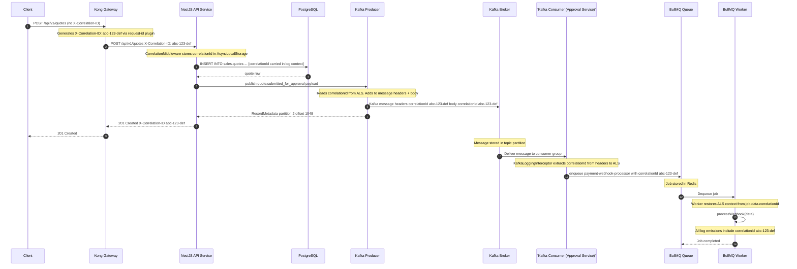
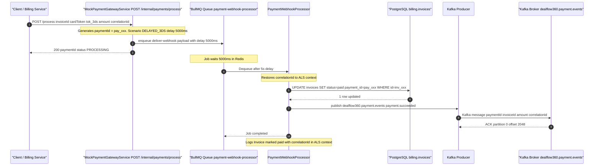

# DealFlow360 — Observability, Analytics & Mock Services Specification

**Document:** `08-OBSERVABILITY_ANALYTICS_MOCKS.md`  
**Version:** 1.0.0  
**Status:** Approved  
**Last Updated:** 2026-09-05  
**Audience:** Platform engineers, backend engineers, SRE team

---

## Table of Contents

1. [Structured JSON Logging Standard](#1-structured-json-logging-standard)
2. [Correlation ID Propagation](#2-correlation-id-propagation)
3. [TimescaleDB Analytics Queries](#3-timescaledb-analytics-queries)
4. [Grafana Dashboard Specifications](#4-grafana-dashboard-specifications)
5. [Mock Payment Gateway Specification](#5-mock-payment-gateway-specification)
6. [Health Check Endpoints](#6-health-check-endpoints)

---

## 1. Structured JSON Logging Standard

Every NestJS microservice in the DealFlow360 platform **must** emit logs exclusively in structured JSON format. Human-readable plain-text logs are **prohibited** in all environments. Logs are shipped via stdout to a Fluent Bit sidecar, then forwarded to Loki (or an equivalent log aggregation backend).

### 1.1 Canonical Log Envelope

Every log line — regardless of service, module, or severity — must conform to the following envelope:

```json
{
  "timestamp": "2024-01-01T10:00:00.000Z",
  "level": "info",
  "service": "dealflow360-api",
  "module": "QuotesModule",
  "correlationId": "abc-123-def",
  "userId": "uuid",
  "traceId": "trace-id",
  "message": "Quote submitted for approval",
  "context": {
    "quoteId": "uuid",
    "brs": 32.5,
    "approvalLevel": "sales_manager"
  },
  "duration_ms": 45
}
```

#### Field Reference

| Field | Type | Required | Description |
|---|---|---|---|
| `timestamp` | `string` (ISO 8601 UTC) | ✅ | Log emission time in UTC with millisecond precision |
| `level` | `enum` | ✅ | One of: `error`, `warn`, `info`, `http`, `debug` |
| `service` | `string` | ✅ | Canonical service name from env var `SERVICE_NAME` |
| `module` | `string` | ✅ | NestJS module name emitting the log (e.g., `QuotesModule`) |
| `correlationId` | `string` (UUID v4) | ✅ | Propagated from Kong `X-Correlation-ID` header via AsyncLocalStorage |
| `userId` | `string` (UUID v4) | Conditional | Authenticated user UUID. Omitted for system/background operations |
| `traceId` | `string` | Conditional | OpenTelemetry trace ID. Omitted when no active trace span |
| `message` | `string` | ✅ | Human-readable event description. Must be static; no interpolated secrets |
| `context` | `object` | Optional | Domain-specific structured key/value data. All values must be serialisable |
| `duration_ms` | `number` | Conditional | Wall-clock duration of the operation in milliseconds |
| `error` | `object` | Conditional | Present only for `error` level: `{ name, message, stack }` |
| `httpMethod` | `string` | Conditional | HTTP method for `http`-level request/response logs |
| `httpPath` | `string` | Conditional | URL path (no query string) for `http`-level logs |
| `httpStatus` | `number` | Conditional | HTTP status code for `http`-level response logs |
| `kafkaTopic` | `string` | Conditional | Kafka topic name for event publish/consume logs |
| `kafkaPartition` | `number` | Conditional | Kafka partition number |
| `kafkaOffset` | `string` | Conditional | Kafka message offset |
| `jobId` | `string` | Conditional | BullMQ job ID for worker logs |
| `queueName` | `string` | Conditional | BullMQ queue name for worker logs |

### 1.2 Log Levels — Usage Policy

#### `error` — System is in a degraded or failed state

Log at `error` when an operation **cannot be recovered** automatically and requires human intervention or causes user-visible failure.

```json
{
  "level": "error",
  "message": "Database connection lost",
  "context": { "attempt": 3, "maxRetries": 3 },
  "error": {
    "name": "ConnectionRefusedError",
    "message": "connect ECONNREFUSED 127.0.0.1:5432",
    "stack": "ConnectionRefusedError: connect ECONNREFUSED..."
  }
}
```

**Log at `error` for:**
- Unhandled exceptions escaping to global exception filters
- Database connection failures after all retries exhausted
- Kafka producer/consumer fatal errors
- Payment webhook signature verification failures
- Failed approval state machine transitions (invalid state)
- Circuit-breaker open events

#### `warn` — Degraded but recoverable conditions

```json
{
  "level": "warn",
  "message": "Discount anomaly detected — z-score exceeds threshold",
  "context": { "quoteId": "uuid", "repId": "uuid", "zScore": 3.14, "threshold": 2.0 }
}
```

**Log at `warn` for:**
- Discount anomaly detection triggers (z-score > 2σ)
- Stalled deal detection (inactive > 7 days)
- Retry attempt N of max retries (Kafka, DB, payment)
- Circuit-breaker half-open probe attempts
- JWT token approaching expiry
- Rate limit approaching threshold (> 80% of limit)
- BullMQ job retry due to transient failure

#### `info` — Normal operational events

```json
{
  "level": "info",
  "message": "Quote submitted for approval",
  "context": { "quoteId": "uuid", "brs": 32.5, "approvalLevel": "sales_manager" }
}
```

**Log at `info` for:**
- Service startup / shutdown with configuration summary
- HTTP request received (ingress) and HTTP response sent (egress)
- Every Kafka event published (with topic, partition, offset)
- Every Kafka event consumed (with topic, partition, offset, consumer group)
- BullMQ job enqueued, started, completed
- State machine transitions (e.g., `quote.draft` → `quote.pending_approval`)
- User authentication success
- Approval decisions recorded

#### `http` — HTTP request/response telemetry

```json
{
  "level": "http",
  "message": "POST /api/v1/quotes → 201",
  "httpMethod": "POST",
  "httpPath": "/api/v1/quotes",
  "httpStatus": 201,
  "duration_ms": 87,
  "userId": "uuid"
}
```

**Log at `http` for:**
- Incoming HTTP requests via NestJS middleware
- Outgoing HTTP calls to external services (inventory service, payment gateway)
- Webhook deliveries

#### `debug` — Verbose diagnostic information

```json
{
  "level": "debug",
  "message": "BRS calculation step completed",
  "context": { "quoteId": "uuid", "step": "margin_check", "intermediateScore": 18.5 }
}
```

**Log at `debug` for:**
- Intermediate computation steps (BRS sub-scores, discount calculations)
- Cache hit/miss events
- SQL query parameters (sanitised — no PII values)
- Feature flag evaluations
- Kafka consumer offset commits

> **Important:** `debug` logs **must be disabled** in production by default. Enable only during active incident investigation by setting `LOG_LEVEL=debug` on the affected pod.

---

### 1.3 Fields That Must NEVER Be Logged

The following data categories are **absolutely prohibited** in log output. Inclusion of any of these constitutes a P0 security incident.

| Category | Examples |
|---|---|
| Passwords & secrets | `password`, `secret`, `privateKey`, `clientSecret` |
| Authentication tokens | JWT access/refresh tokens, API keys, session tokens |
| Payment card data | Card numbers (PAN), CVV/CVC, expiry dates, full card tokens |
| Raw payment gateway tokens | `tok_success`, `tok_declined`, `tok_3ds` (log only masked alias) |
| Government identifiers | SSN, passport numbers, national ID |
| Health / medical data | Any PHI |
| Full credit application data | Income, bank account numbers |
| Raw request bodies containing any of the above | — |

**Masking rule:** When a field must appear in context (e.g., for debugging card processing), log only a masked form:

```typescript
// ✅ Correct
context: { cardToken: 'tok_****ds', last4: '4242' }

// ❌ Prohibited
context: { cardToken: 'tok_3ds', cardNumber: '4111111111111111' }
```

The `DealFlow360Logger` implementation (Section 1.4) applies an automatic field-name scrubber that removes any key matching a blocklist regex before serialisation.

---

### 1.4 NestJS Custom Logger Implementation

#### `libs/logging/src/dealflow360-logger.service.ts`

```typescript
import { Injectable, LoggerService, Scope } from '@nestjs/common';
import { AsyncLocalStorage } from 'async_hooks';
import { RequestContext } from './request-context.interface';

// ─── Blocklist: key names whose values must never be logged ─────────────────
const BLOCKED_KEYS = new Set([
  'password', 'passwd', 'secret', 'token', 'accessToken', 'refreshToken',
  'authorization', 'apiKey', 'api_key', 'cardNumber', 'cvv', 'cvc',
  'pan', 'cardToken', 'ssn', 'privateKey', 'clientSecret',
]);

function scrubObject(obj: Record<string, unknown>): Record<string, unknown> {
  if (!obj || typeof obj !== 'object') return obj;
  return Object.fromEntries(
    Object.entries(obj).map(([k, v]) => {
      if (BLOCKED_KEYS.has(k.toLowerCase())) return [k, '[REDACTED]'];
      if (v && typeof v === 'object') return [k, scrubObject(v as Record<string, unknown>)];
      return [k, v];
    }),
  );
}

export type LogLevel = 'error' | 'warn' | 'info' | 'http' | 'debug';

export interface LogEntry {
  timestamp: string;
  level: LogLevel;
  service: string;
  module: string;
  correlationId?: string;
  userId?: string;
  traceId?: string;
  message: string;
  context?: Record<string, unknown>;
  duration_ms?: number;
  error?: { name: string; message: string; stack?: string };
  [key: string]: unknown;
}

@Injectable({ scope: Scope.DEFAULT })
export class DealFlow360Logger implements LoggerService {
  private readonly serviceName: string;
  private readonly minLevel: LogLevel;

  private static readonly LEVEL_ORDER: Record<LogLevel, number> = {
    error: 0, warn: 1, info: 2, http: 3, debug: 4,
  };

  constructor(
    private readonly moduleName: string,
    private readonly als: AsyncLocalStorage<RequestContext>,
  ) {
    this.serviceName = process.env.SERVICE_NAME ?? 'dealflow360-unknown';
    this.minLevel = (process.env.LOG_LEVEL as LogLevel) ?? 'info';
  }

  // ─── Public logging methods ─────────────────────────────────────────────

  log(message: string, context?: Record<string, unknown>, duration_ms?: number): void {
    this.emit('info', message, context, duration_ms);
  }

  info(message: string, context?: Record<string, unknown>, duration_ms?: number): void {
    this.emit('info', message, context, duration_ms);
  }

  http(message: string, context?: Record<string, unknown>, duration_ms?: number): void {
    this.emit('http', message, context, duration_ms);
  }

  warn(message: string, context?: Record<string, unknown>): void {
    this.emit('warn', message, context);
  }

  debug(message: string, context?: Record<string, unknown>): void {
    this.emit('debug', message, context);
  }

  error(message: string, error?: Error, context?: Record<string, unknown>): void {
    const errorPayload = error
      ? { name: error.name, message: error.message, stack: error.stack }
      : undefined;
    this.emit('error', message, context, undefined, errorPayload);
  }

  // ─── NestJS LoggerService compatibility shims ────────────────────────────

  verbose(message: string): void { this.debug(message); }
  fatal(message: string, ...rest: unknown[]): void { this.error(message, rest[0] as Error); }

  // ─── Core emission ───────────────────────────────────────────────────────

  private emit(
    level: LogLevel,
    message: string,
    context?: Record<string, unknown>,
    duration_ms?: number,
    error?: LogEntry['error'],
  ): void {
    if (DealFlow360Logger.LEVEL_ORDER[level] > DealFlow360Logger.LEVEL_ORDER[this.minLevel]) {
      return;
    }

    const ctx = this.als.getStore();

    const entry: LogEntry = {
      timestamp: new Date().toISOString(),
      level,
      service: this.serviceName,
      module: this.moduleName,
      correlationId: ctx?.correlationId,
      userId: ctx?.userId,
      traceId: ctx?.traceId,
      message,
      ...(context ? { context: scrubObject(context) } : {}),
      ...(duration_ms !== undefined ? { duration_ms } : {}),
      ...(error ? { error } : {}),
    };

    // Write to stdout as a single JSON line
    process.stdout.write(JSON.stringify(entry) + '\n');
  }
}
```

#### `libs/logging/src/request-context.interface.ts`

```typescript
export interface RequestContext {
  correlationId: string;
  userId?: string;
  traceId?: string;
}
```

#### `libs/logging/src/logging.module.ts`

```typescript
import { Global, Module } from '@nestjs/common';
import { AsyncLocalStorage } from 'async_hooks';
import { RequestContext } from './request-context.interface';
import { DealFlow360Logger } from './dealflow360-logger.service';
import { CorrelationMiddleware } from './correlation.middleware';

export const REQUEST_CONTEXT_ALS = 'REQUEST_CONTEXT_ALS';

@Global()
@Module({
  providers: [
    {
      provide: REQUEST_CONTEXT_ALS,
      useValue: new AsyncLocalStorage<RequestContext>(),
    },
    DealFlow360Logger,
    CorrelationMiddleware,
  ],
  exports: [REQUEST_CONTEXT_ALS, DealFlow360Logger, CorrelationMiddleware],
})
export class LoggingModule {}
```

---

### 1.5 Kafka Event Logging

Every Kafka producer **publish** and consumer **receive** event must be logged at `info` level with the following fields:

#### Publish Log

```json
{
  "level": "info",
  "message": "Kafka event published",
  "context": {
    "kafkaTopic": "dealflow360.quote.events",
    "kafkaPartition": 2,
    "kafkaOffset": "1048",
    "eventType": "quote.submitted_for_approval",
    "correlationId": "abc-123-def"
  }
}
```

#### Consume Log

```json
{
  "level": "info",
  "message": "Kafka event consumed",
  "context": {
    "kafkaTopic": "dealflow360.quote.events",
    "kafkaPartition": 2,
    "kafkaOffset": "1048",
    "consumerGroup": "approval-service-cg",
    "eventType": "quote.submitted_for_approval",
    "correlationId": "abc-123-def",
    "lagMs": 120
  }
}
```

#### Kafka Logging Interceptor (TypeScript outline)

```typescript
import { KafkaContext } from '@nestjs/microservices';

@Injectable()
export class KafkaLoggingInterceptor implements NestInterceptor {
  constructor(private readonly logger: DealFlow360Logger) {}

  intercept(context: ExecutionContext, next: CallHandler): Observable<unknown> {
    const kafkaCtx = context.switchToRpc().getContext<KafkaContext>();
    const message = kafkaCtx.getMessage();
    const topic = kafkaCtx.getTopic();
    const partition = kafkaCtx.getPartition();
    const offset = message.offset;
    const correlationId = message.headers?.['correlationId']?.toString();

    const start = Date.now();

    this.logger.info('Kafka event consumed', {
      kafkaTopic: topic,
      kafkaPartition: partition,
      kafkaOffset: offset,
      correlationId,
    });

    return next.handle().pipe(
      tap(() => {
        this.logger.info('Kafka event processed', {
          kafkaTopic: topic,
          kafkaOffset: offset,
          duration_ms: Date.now() - start,
        });
      }),
      catchError((err) => {
        this.logger.error('Kafka event processing failed', err, {
          kafkaTopic: topic,
          kafkaOffset: offset,
        });
        return throwError(() => err);
      }),
    );
  }
}
```

---

## 2. Correlation ID Propagation

### 2.1 Architecture Overview

The `X-Correlation-ID` header is the single tracing identifier that links a user-initiated HTTP request to every downstream effect: database writes, Kafka events, BullMQ jobs, and outbound webhooks. It is generated exactly **once** per request by Kong and must never be regenerated by downstream services.

### 2.2 Kong `request-id` Plugin Configuration

```yaml
# kong/plugins/request-id.yaml
apiVersion: configuration.konghq.com/v1
kind: KongPlugin
metadata:
  name: request-id
plugin: request-id
config:
  header_name: X-Correlation-ID
  generator: uuid
  echo_downstream: true   # Include in response headers for client-side tracing
```

Kong generates a UUID v4 for every inbound request that does **not** already carry an `X-Correlation-ID` header. If the header is already present (e.g., from an internal service-to-service call), it is passed through unchanged.

---

### 2.3 NestJS Correlation Middleware

```typescript
// libs/logging/src/correlation.middleware.ts
import { Injectable, NestMiddleware } from '@nestjs/common';
import { Request, Response, NextFunction } from 'express';
import { AsyncLocalStorage } from 'async_hooks';
import { Inject } from '@nestjs/common';
import { RequestContext } from './request-context.interface';
import { REQUEST_CONTEXT_ALS } from './logging.module';

@Injectable()
export class CorrelationMiddleware implements NestMiddleware {
  constructor(
    @Inject(REQUEST_CONTEXT_ALS)
    private readonly als: AsyncLocalStorage<RequestContext>,
  ) {}

  use(req: Request, res: Response, next: NextFunction): void {
    const correlationId =
      (req.headers['x-correlation-id'] as string) ??
      crypto.randomUUID(); // Fallback if Kong plugin is disabled locally

    // Propagate correlationId on the response for API consumers
    res.setHeader('X-Correlation-ID', correlationId);

    // Extract userId from JWT claim if authentication has already run
    const userId: string | undefined = (req as any).user?.sub;

    this.als.run({ correlationId, userId }, () => next());
  }
}
```

**Registration in `AppModule`:**

```typescript
export class AppModule implements NestModule {
  configure(consumer: MiddlewareConsumer): void {
    consumer
      .apply(CorrelationMiddleware)
      .forRoutes('*'); // Global — applies before all controllers
  }
}
```

---

### 2.4 Kafka Event Propagation

The `correlationId` must be included in **every** Kafka message as both a message header and as a field in the event payload body.

```typescript
// libs/kafka/src/kafka-producer.service.ts
@Injectable()
export class KafkaProducerService {
  constructor(
    @Inject('KAFKA_PRODUCER') private readonly producer: Producer,
    @Inject(REQUEST_CONTEXT_ALS)
    private readonly als: AsyncLocalStorage<RequestContext>,
    private readonly logger: DealFlow360Logger,
  ) {}

  async publish<T>(topic: string, eventType: string, payload: T): Promise<RecordMetadata[]> {
    const ctx = this.als.getStore();
    const correlationId = ctx?.correlationId ?? 'no-correlation-id';

    const message: Message = {
      key: (payload as any).id ?? correlationId,
      value: JSON.stringify({ ...payload, correlationId }),
      headers: {
        'correlationId': correlationId,
        'eventType': eventType,
        'sourceService': process.env.SERVICE_NAME ?? 'unknown',
        'timestamp': new Date().toISOString(),
      },
    };

    const result = await this.producer.send({ topic, messages: [message] });

    this.logger.info('Kafka event published', {
      kafkaTopic: topic,
      kafkaPartition: result[0].partition,
      kafkaOffset: result[0].baseOffset,
      eventType,
      correlationId,
    });

    return result;
  }
}
```

---

### 2.5 BullMQ Job Propagation

Every BullMQ job payload **must** include `correlationId` as a top-level field. Workers restore the correlation context into AsyncLocalStorage before processing.

```typescript
// Enqueue with correlationId
async enqueuePaymentWebhook(data: PaymentWebhookJobData): Promise<void> {
  const ctx = this.als.getStore();
  await this.paymentWebhookQueue.add('process-webhook', {
    ...data,
    correlationId: ctx?.correlationId,
  });
}

// Worker restores context
@Processor('payment-webhook-processor')
export class PaymentWebhookProcessor {
  @Process('process-webhook')
  async handle(job: Job<PaymentWebhookJobData>): Promise<void> {
    const { correlationId, ...data } = job.data;

    // Restore correlation context for all logs emitted during this job
    await this.als.run({ correlationId }, () => this.processWebhook(data));
  }
}
```

---

### 2.6 Correlation ID Propagation Sequence Diagram



---

## 3. TimescaleDB Analytics Queries

All analytics tables reside in the `analytics` schema on the TimescaleDB instance. The `sales` schema tables are shared with the transactional PostgreSQL service. Cross-schema queries are executed by the analytics read replica to avoid OLTP contention.

### 3.1 Stalled Deal Detection

A quote is **stalled** if it has not been updated in more than 7 days (configurable via `STALLED_DEAL_THRESHOLD_DAYS` environment variable, default: 7) and is not in a terminal state.

**Terminal states excluded from stall detection:** `confirmed`, `fulfilled`, `cancelled`, `rejected`

```sql
-- analytics/queries/stalled_deals.sql
-- Returns all non-terminal quotes with no activity for > 7 days.
-- @param stall_interval: configurable threshold (default '7 days')

SELECT
  q.id                                             AS quote_id,
  q.rep_id,
  q.customer_id,
  q.status,
  q.updated_at,
  NOW() - q.updated_at                            AS time_since_update,
  EXTRACT(DAY FROM NOW() - q.updated_at)::INTEGER AS days_stalled,
  u.email                                          AS rep_email,
  c.name                                           AS customer_name
FROM sales.quotes q
JOIN auth.users     u ON u.id = q.rep_id
JOIN sales.customers c ON c.id = q.customer_id
WHERE q.status NOT IN ('confirmed', 'fulfilled', 'cancelled', 'rejected')
  AND q.updated_at < NOW() - INTERVAL '7 days'   -- Replace with $1 for parameterised form
ORDER BY days_stalled DESC;
```

**Parameterised form for use in NestJS TypeORM raw query:**

```typescript
const stalledDeals = await this.dataSource.query<StalledDealRow[]>(
  `SELECT q.id, q.rep_id, q.status, q.updated_at,
          EXTRACT(DAY FROM NOW() - q.updated_at)::INTEGER AS days_stalled
   FROM sales.quotes q
   WHERE q.status NOT IN ('confirmed','fulfilled','cancelled','rejected')
     AND q.updated_at < NOW() - $1::INTERVAL
   ORDER BY days_stalled DESC`,
  [`${stalledDaysThreshold} days`],
);
```

---

### 3.2 Discount Anomaly Detection (Statistical)

Anomalous discounts are identified using a **z-score** approach: a discount is flagged when it exceeds the rep's 90-day rolling mean by more than 2 standard deviations (configurable via `DISCOUNT_ANOMALY_Z_THRESHOLD`, default: 2.0).

**Formula:**

```
z = (d_current - μ_rep_90d) / σ_rep_90d
```

Where `d_current` is the current quote line discount, `μ` is the 90-day mean discount, and `σ` is the 90-day standard deviation. A quote line is flagged when `z > 2.0`.

```sql
-- analytics/queries/discount_anomaly_detection.sql
-- Identifies active quote lines with statistically anomalous discounts.
-- Threshold: discount > rep's 90-day mean + 2σ (z-score > 2.0)

WITH rep_stats AS (
  -- Step 1: Compute each rep's rolling 90-day discount statistics per product category
  SELECT
    rep_id,
    category,
    AVG(applied_discount_pct)    AS mean_discount,
    STDDEV(applied_discount_pct) AS sigma_discount,
    COUNT(*)                     AS sample_size
  FROM analytics.rep_discount_tracking
  WHERE time > NOW() - INTERVAL '90 days'
  GROUP BY rep_id, category
  HAVING COUNT(*) >= 5  -- Require minimum sample size for statistical validity
),
current_discounts AS (
  -- Step 2: Gather all active (non-terminal) quote lines awaiting action
  SELECT
    ql.quote_id,
    ql.id          AS line_id,
    q.rep_id,
    p.category,
    ql.discount_pct,
    ql.unit_price,
    ql.quantity,
    q.status
  FROM sales.quote_lines ql
  JOIN sales.quotes   q ON q.id  = ql.quote_id
  JOIN sales.products p ON p.id  = ql.product_id
  WHERE q.status IN ('draft', 'pending_approval')
)
SELECT
  cd.quote_id,
  cd.line_id,
  cd.rep_id,
  cd.category,
  cd.discount_pct,
  cd.status                                                                AS quote_status,
  rs.mean_discount,
  rs.sigma_discount,
  rs.sample_size,
  ROUND(
    (cd.discount_pct - rs.mean_discount) / NULLIF(rs.sigma_discount, 0),
    4
  )                                                                        AS z_score,
  CASE
    WHEN rs.sigma_discount IS NULL OR rs.sigma_discount = 0
      THEN 'INSUFFICIENT_VARIANCE'
    WHEN (cd.discount_pct - rs.mean_discount) / NULLIF(rs.sigma_discount, 0) > 3
      THEN 'CRITICAL'
    WHEN (cd.discount_pct - rs.mean_discount) / NULLIF(rs.sigma_discount, 0) > 2
      THEN 'WARNING'
    ELSE 'NORMAL'
  END                                                                      AS anomaly_severity
FROM current_discounts cd
JOIN rep_stats rs
  ON rs.rep_id   = cd.rep_id
 AND rs.category = cd.category
WHERE
  (cd.discount_pct - rs.mean_discount) / NULLIF(rs.sigma_discount, 0) > 2.0
ORDER BY z_score DESC;
```

---

### 3.3 Continuous Aggregate Views (TimescaleDB)

#### A. Rep Discount Stats — 30-Day Rolling Window

Refreshed every **15 minutes**. Provides pre-aggregated daily discount statistics per rep and product category, used by the anomaly detection query and Grafana dashboard.

```sql
-- analytics/migrations/001_create_rep_discount_stats_view.sql

CREATE MATERIALIZED VIEW analytics.rep_discount_stats_30d
WITH (timescaledb.continuous) AS
SELECT
  rep_id,
  category,
  time_bucket('1 day', time)           AS day,
  AVG(applied_discount_pct)            AS avg_discount,
  STDDEV(applied_discount_pct)         AS stddev_discount,
  MIN(applied_discount_pct)            AS min_discount,
  MAX(applied_discount_pct)            AS max_discount,
  PERCENTILE_CONT(0.95) WITHIN GROUP (ORDER BY applied_discount_pct)
                                       AS p95_discount,
  COUNT(*)                             AS line_count
FROM analytics.rep_discount_tracking
GROUP BY rep_id, category, time_bucket('1 day', time)
WITH NO DATA;

-- Attach the 15-minute refresh policy
SELECT add_continuous_aggregate_policy(
  'analytics.rep_discount_stats_30d',
  start_offset      => INTERVAL '30 days',
  end_offset        => INTERVAL '15 minutes',
  schedule_interval => INTERVAL '15 minutes'
);
```

#### B. Quote Events Velocity View — Hourly Buckets

```sql
-- analytics/migrations/002_create_quote_velocity_view.sql

CREATE MATERIALIZED VIEW analytics.quote_velocity_1h
WITH (timescaledb.continuous) AS
SELECT
  time_bucket('1 hour', time)                                           AS bucket,
  COUNT(*) FILTER (WHERE event_type = 'quote.created')                 AS created,
  COUNT(*) FILTER (WHERE event_type = 'quote.submitted_for_approval')  AS submitted,
  COUNT(*) FILTER (WHERE event_type = 'quote.approved')                AS approved,
  COUNT(*) FILTER (WHERE event_type = 'quote.confirmed')               AS confirmed,
  COUNT(*) FILTER (WHERE event_type = 'quote.rejected')                AS rejected,
  COUNT(*) FILTER (WHERE event_type = 'quote.cancelled')               AS cancelled,
  AVG(CASE WHEN event_type = 'quote.approved'
        THEN (metadata->>'approval_duration_ms')::NUMERIC END)         AS avg_approval_ms
FROM analytics.quote_events
GROUP BY time_bucket('1 hour', time)
WITH NO DATA;

SELECT add_continuous_aggregate_policy(
  'analytics.quote_velocity_1h',
  start_offset      => INTERVAL '7 days',
  end_offset        => INTERVAL '15 minutes',
  schedule_interval => INTERVAL '15 minutes'
);
```

#### C. Warehouse Stock Level View — 15-Minute Snapshots

```sql
-- analytics/migrations/003_create_stock_levels_view.sql

CREATE MATERIALIZED VIEW analytics.warehouse_stock_snapshots_15m
WITH (timescaledb.continuous) AS
SELECT
  time_bucket('15 minutes', time) AS bucket,
  warehouse_id,
  product_id,
  AVG(quantity_on_hand)           AS avg_stock,
  MIN(quantity_on_hand)           AS min_stock,
  MAX(quantity_on_hand)           AS max_stock,
  LAST(quantity_on_hand, time)    AS latest_stock  -- TimescaleDB-specific aggregate
FROM analytics.inventory_snapshots
GROUP BY time_bucket('15 minutes', time), warehouse_id, product_id
WITH NO DATA;

SELECT add_continuous_aggregate_policy(
  'analytics.warehouse_stock_snapshots_15m',
  start_offset      => INTERVAL '3 days',
  end_offset        => INTERVAL '15 minutes',
  schedule_interval => INTERVAL '15 minutes'
);
```

---

### 3.4 Quote Velocity Dashboard Query

Used by the Grafana "Quote Pipeline Velocity" panel (Panel 1). Returns daily counts for the past 30 days.

```sql
-- analytics/queries/quote_velocity_30d.sql
SELECT
  time_bucket('1 day', time)                                           AS day,
  COUNT(*) FILTER (WHERE event_type = 'quote.created')                 AS created,
  COUNT(*) FILTER (WHERE event_type = 'quote.confirmed')               AS confirmed,
  COUNT(*) FILTER (WHERE event_type = 'quote.rejected')                AS rejected,
  COUNT(*) FILTER (WHERE event_type = 'quote.submitted_for_approval')  AS submitted,
  COUNT(*) FILTER (WHERE event_type = 'quote.approved')                AS approved,
  ROUND(
    100.0 * COUNT(*) FILTER (WHERE event_type = 'quote.confirmed')
    / NULLIF(COUNT(*) FILTER (WHERE event_type = 'quote.created'), 0),
    2
  )                                                                     AS conversion_rate_pct
FROM analytics.quote_events
WHERE time > NOW() - INTERVAL '30 days'
GROUP BY time_bucket('1 day', time)
ORDER BY day;
```

---

### 3.5 Deal Health API Response

#### Endpoint

```
GET /api/v1/internal/analytics/deal-health
Authorization: Bearer <internal-service-token>
```

> **Note:** This is an **internal** endpoint (not exposed via Kong to external clients). It is called by the Grafana datasource proxy and the internal operations dashboard.

#### Response Shape

```typescript
// analytics/dto/deal-health-response.dto.ts

export interface DealHealthResponse {
  generatedAt: string;              // ISO 8601 UTC timestamp
  windowDays: number;               // Analysis window, default 30

  pipeline: {
    draft:             number;
    pendingApproval:   number;
    approved:          number;
    confirmed:         number;
    rejected:          number;
    cancelled:         number;
    totalActive:       number;
    conversionRatePct: number;      // confirmed / created × 100 (30d)
  };

  stalledDeals: {
    total:               number;
    stalledThresholdDays: number;
    byRep: Array<{
      repId:          string;
      repEmail:       string;
      stalledCount:   number;
      avgDaysStalled: number;
    }>;
    oldest: {
      quoteId:     string;
      repId:       string;
      customerId:  string;
      daysStalled: number;
      status:      string;
    } | null;
  };

  discountAnomalies: {
    total:         number;
    criticalCount: number;
    warningCount:  number;
    byRep: Array<{
      repId:        string;
      repEmail:     string;
      anomalyCount: number;
      maxZScore:    number;
    }>;
    flaggedLines: Array<{
      quoteId:       string;
      lineId:        string;
      repId:         string;
      category:      string;
      discountPct:   number;
      meanDiscount:  number;
      sigmaDiscount: number;
      zScore:        number;
      severity:      'WARNING' | 'CRITICAL' | 'INSUFFICIENT_VARIANCE';
    }>;
  };

  approvalSla: {
    withinSla:     number;
    breachedSla:   number;
    compliancePct: number;
    avgApprovalMs: number;
    p95ApprovalMs: number;
  };

  brsDistribution: {
    mean:    number;
    median:  number;
    p25:     number;
    p75:     number;
    p95:     number;
    min:     number;
    max:     number;
    buckets: Array<{
      rangeLabel: string;   // e.g. "0-10", "10-20"
      count:      number;
    }>;
  };

  warehouseStock: Array<{
    warehouseId:     string;
    warehouseName:   string;
    stockLevelPct:   number;
    lowStockCount:   number;
    outOfStockCount: number;
  }>;
}
```

#### Example Response Body

```json
{
  "generatedAt": "2026-09-05T07:33:00.000Z",
  "windowDays": 30,
  "pipeline": {
    "draft": 142,
    "pendingApproval": 38,
    "approved": 21,
    "confirmed": 204,
    "rejected": 17,
    "cancelled": 9,
    "totalActive": 201,
    "conversionRatePct": 57.8
  },
  "stalledDeals": {
    "total": 14,
    "stalledThresholdDays": 7,
    "byRep": [
      { "repId": "uuid-1", "repEmail": "j.doe@dealflow360.com", "stalledCount": 4, "avgDaysStalled": 11.2 }
    ],
    "oldest": {
      "quoteId": "quo_abc123",
      "repId": "uuid-1",
      "customerId": "cus_xyz789",
      "daysStalled": 23,
      "status": "pending_approval"
    }
  },
  "discountAnomalies": {
    "total": 3,
    "criticalCount": 1,
    "warningCount": 2,
    "byRep": [
      { "repId": "uuid-2", "repEmail": "a.smith@dealflow360.com", "anomalyCount": 2, "maxZScore": 3.41 }
    ],
    "flaggedLines": [
      {
        "quoteId": "quo_def456",
        "lineId": "ql_001",
        "repId": "uuid-2",
        "category": "enterprise-software",
        "discountPct": 42.0,
        "meanDiscount": 18.5,
        "sigmaDiscount": 7.0,
        "zScore": 3.41,
        "severity": "CRITICAL"
      }
    ]
  },
  "approvalSla": {
    "withinSla": 198,
    "breachedSla": 12,
    "compliancePct": 94.3,
    "avgApprovalMs": 18720000,
    "p95ApprovalMs": 82800000
  },
  "brsDistribution": {
    "mean": 28.4, "median": 30.0, "p25": 19.0, "p75": 38.5,
    "p95": 47.2, "min": 0.0, "max": 55.0,
    "buckets": [
      { "rangeLabel": "0-10",  "count": 8  },
      { "rangeLabel": "10-20", "count": 34 },
      { "rangeLabel": "20-30", "count": 87 },
      { "rangeLabel": "30-40", "count": 98 },
      { "rangeLabel": "40-50", "count": 56 },
      { "rangeLabel": "50+",   "count": 11 }
    ]
  },
  "warehouseStock": [
    { "warehouseId": "wh-east", "warehouseName": "East Coast Hub", "stockLevelPct": 73.2, "lowStockCount": 4,  "outOfStockCount": 0 },
    { "warehouseId": "wh-west", "warehouseName": "West Coast Hub", "stockLevelPct": 51.8, "lowStockCount": 11, "outOfStockCount": 2 }
  ]
}
```

---

## 4. Grafana Dashboard Specifications

**Dashboard UID:** `df360-deal-health`  
**Data sources:**
- `TimescaleDB` — PostgreSQL datasource pointed at the TimescaleDB analytics read replica on port 5432, database `dealflow360_analytics`
- `Prometheus` — Kafka JMX metrics exported via `jmx_exporter` sidecar and scraped by Prometheus

> **Tip:** Set the dashboard auto-refresh to **15 minutes** to align with TimescaleDB continuous aggregate refresh intervals. Shorter refresh intervals will read stale data from the pre-computed views.

---

### Panel 1 — Quote Pipeline Funnel (draft → confirmed)

| Property | Value |
|---|---|
| **Panel type** | Bar gauge / Stat (horizontal funnel layout) |
| **Data source** | TimescaleDB |
| **Refresh** | 15 min |
| **Title** | Quote Pipeline Funnel |

**Query (TimescaleDB):**

```sql
SELECT
  status,
  COUNT(*) AS quote_count
FROM sales.quotes
WHERE status NOT IN ('cancelled')
  AND created_at > NOW() - INTERVAL '${window_days}d'
GROUP BY status
ORDER BY
  CASE status
    WHEN 'draft'            THEN 1
    WHEN 'pending_approval' THEN 2
    WHEN 'approved'         THEN 3
    WHEN 'confirmed'        THEN 4
    WHEN 'fulfilled'        THEN 5
    WHEN 'rejected'         THEN 6
    ELSE 7
  END;
```

**Panel configuration:**
- X-axis: `status` (categorical)
- Y-axis: `quote_count`
- Colour scheme: Green gradient (draft → confirmed), Red for rejected
- Show conversion rate annotation: `(confirmed / draft) × 100` in panel description

---

### Panel 2 — BRS Distribution Histogram

| Property | Value |
|---|---|
| **Panel type** | Histogram |
| **Data source** | TimescaleDB |
| **Title** | BRS Score Distribution (30 days) |

**Query:**

```sql
SELECT
  brs_score
FROM sales.quotes
WHERE status NOT IN ('cancelled', 'draft')
  AND created_at > NOW() - INTERVAL '30 days'
  AND brs_score IS NOT NULL;
```

**Panel configuration:**
- Bucket size: `5` (BRS range 0–60, producing 12 buckets)
- Fill opacity: `80`
- Line width: `1`
- Add threshold lines: Red dashed at `score = 0` (reject threshold), Orange at `score = 15`, Green at `score = 30`
- Legend: Stats enabled (mean, min, max)

---

### Panel 3 — Stalled Deals Count (Time Series)

| Property | Value |
|---|---|
| **Panel type** | Time series |
| **Data source** | TimescaleDB |
| **Title** | Stalled Deals Over Time |

**Query:**

```sql
SELECT
  time_bucket('1 day', snapshot_time) AS time,
  COUNT(*)                            AS stalled_count
FROM analytics.stalled_deal_snapshots
WHERE snapshot_time > NOW() - INTERVAL '30 days'
GROUP BY time_bucket('1 day', snapshot_time)
ORDER BY time;
```

> **Note:** The `analytics.stalled_deal_snapshots` table is populated by a BullMQ cron job (`stalled-deal-scanner`) that runs daily at 02:00 UTC.

**Panel configuration:**
- Y-axis: `stalled_count` (integer, 0-based)
- Alert rule: Fire `warn` alert when `stalled_count > 20` for more than 1 day
- Colour: Orange for series line, 10% fill below line

---

### Panel 4 — Discount Anomalies Per Rep (Bar Chart)

| Property | Value |
|---|---|
| **Panel type** | Bar chart |
| **Data source** | TimescaleDB |
| **Title** | Discount Anomaly Flags by Rep (7 days) |

**Query:**

```sql
SELECT
  u.email          AS rep_email,
  COUNT(*)         AS anomaly_count,
  MAX(
    (ql.discount_pct - rs.avg_discount) / NULLIF(rs.stddev_discount, 0)
  )                AS max_z_score
FROM sales.quote_lines ql
JOIN sales.quotes       q  ON q.id  = ql.quote_id
JOIN auth.users         u  ON u.id  = q.rep_id
JOIN analytics.rep_discount_stats_30d rs
  ON rs.rep_id   = q.rep_id
 AND rs.category = (SELECT category FROM sales.products WHERE id = ql.product_id LIMIT 1)
 AND rs.day     >= NOW() - INTERVAL '90 days'
WHERE q.status IN ('draft', 'pending_approval')
  AND q.updated_at > NOW() - INTERVAL '7 days'
  AND (ql.discount_pct - rs.avg_discount) / NULLIF(rs.stddev_discount, 0) > 2
GROUP BY u.email
ORDER BY anomaly_count DESC
LIMIT 20;
```

**Panel configuration:**
- X-axis: `rep_email` (rotate labels 45°)
- Y-axis: `anomaly_count`; second Y-axis (right): `max_z_score` (overlay line)
- Colour: Red bars with intensity proportional to `max_z_score`

---

### Panel 5 — Approval SLA Compliance

| Property | Value |
|---|---|
| **Panel type** | Stat + Time series (combo) |
| **Data source** | TimescaleDB |
| **Title** | Approval SLA Compliance (% within 24h) |

**Stat query (current value):**

```sql
SELECT
  ROUND(
    100.0 * COUNT(*) FILTER (
      WHERE EXTRACT(EPOCH FROM (approved_at - submitted_at)) < 86400
    ) / NULLIF(COUNT(*), 0),
    1
  ) AS compliance_pct
FROM sales.quotes
WHERE approved_at IS NOT NULL
  AND submitted_at IS NOT NULL
  AND approved_at > NOW() - INTERVAL '30 days';
```

**Time series query (trend):**

```sql
SELECT
  time_bucket('1 day', approved_at) AS day,
  ROUND(
    100.0 * COUNT(*) FILTER (
      WHERE EXTRACT(EPOCH FROM (approved_at - submitted_at)) < 86400
    ) / NULLIF(COUNT(*), 0),
    1
  ) AS compliance_pct
FROM sales.quotes
WHERE approved_at IS NOT NULL
  AND approved_at > NOW() - INTERVAL '30 days'
GROUP BY time_bucket('1 day', approved_at)
ORDER BY day;
```

**Panel configuration:**
- Stat value: Big number with thresholds: Red < 85%, Orange 85–95%, Green ≥ 95%
- SLA target annotation: Dashed line at `y = 95%`

---

### Panel 6 — Warehouse Stock Levels (Gauge)

| Property | Value |
|---|---|
| **Panel type** | Gauge (one per warehouse, repeat variable) |
| **Data source** | TimescaleDB |
| **Title** | Stock Level — ${warehouse_name} |

**Query:**

```sql
SELECT
  w.name             AS warehouse_name,
  ROUND(
    100.0 * SUM(s.latest_stock) / NULLIF(SUM(w.max_capacity), 0),
    1
  )                  AS stock_level_pct
FROM analytics.warehouse_stock_snapshots_15m s
JOIN inventory.warehouses w ON w.id = s.warehouse_id
WHERE s.bucket = (
  SELECT MAX(bucket) FROM analytics.warehouse_stock_snapshots_15m
)
  AND s.warehouse_id = '${warehouse_id}'
GROUP BY w.name;
```

**Panel configuration:**
- Min: `0`, Max: `100`, Unit: `%`
- Thresholds: Red < 20%, Orange 20–40%, Yellow 40–60%, Green ≥ 60%
- Dashboard variable `warehouse_id`: query `SELECT id, name FROM inventory.warehouses ORDER BY name`

---

### Kafka Metrics via JMX/Prometheus

| Metric | Description |
|---|---|
| `kafka_consumer_group_lag` | Consumer group lag per topic/partition |
| `kafka_server_brokertopicmetrics_messagesinpersec` | Messages published per second |
| `kafka_network_requestmetrics_requestspersec` | Broker request rate |
| `kafka_log_logendoffset` | Log end offset per partition |
| `kafka_consumer_fetch_manager_metrics_records_consumed_rate` | Consumer throughput |

**Recommended alert:** Fire `critical` when `kafka_consumer_group_lag{group="approval-service-cg"} > 1000` for more than 5 minutes.

---

## 5. Mock Payment Gateway Specification

The `MockPaymentGatewayService` is an **internal** NestJS service deployed only in `development` and `staging` environments. It simulates a real payment gateway with realistic delays and webhook delivery patterns, enabling end-to-end testing of the invoice payment flow without requiring live payment processor credentials.

> **Caution:** The mock payment gateway must **never** be deployed to production. Guard all endpoints with an `ENABLE_MOCK_PAYMENT_GATEWAY=true` environment variable check. The NestJS module must be conditionally imported using `process.env.NODE_ENV !== 'production'`.

### 5.1 Card Token Mapping

| Token | Scenario | Webhook Event | Delay |
|---|---|---|---|
| `tok_success` | Successful payment | `PAYMENT_SUCCESS` | 0 ms (immediate) |
| `tok_declined` | Card declined — insufficient funds | `CARD_DECLINED` | 0 ms (immediate) |
| `tok_3ds` | 3D Secure authentication required | `PAYMENT_SUCCESS` (with `threeDsAuthenticated: true`) | 5000 ms |

### 5.2 Internal Endpoint

```
POST /api/v1/internal/payments/process
Content-Type: application/json
Authorization: Bearer <internal-service-token>
X-Correlation-ID: <propagated>
```

### 5.3 TypeScript Interfaces

```typescript
// payments/mock-gateway/dto/payment-request.dto.ts

export interface PaymentRequest {
  invoiceId:     string;   // UUID of the invoice being paid
  amount:        number;   // Decimal amount (e.g., 2500.00)
  currency:      string;   // ISO 4217 — always 'USD' in current scope
  cardToken:     string;   // 'tok_success' | 'tok_declined' | 'tok_3ds'
  customerId:    string;   // UUID of the customer
  correlationId: string;   // Propagated X-Correlation-ID
}

// payments/mock-gateway/dto/payment-init-response.dto.ts

export interface PaymentInitResponse {
  paymentId: string;                  // Generated UUID, e.g. 'pay_abc123'
  status:    'PROCESSING' | 'DECLINED';
  message:   string;
}

// payments/mock-gateway/dto/payment-webhook-event.dto.ts

export type PaymentWebhookEvent =
  | PaymentSuccessEvent
  | CardDeclinedEvent;

export interface PaymentSuccessEvent {
  event:                'PAYMENT_SUCCESS';
  paymentId:            string;
  invoiceId:            string;
  amount:               number;
  currency:             string;
  timestamp:            string;            // ISO 8601 UTC
  correlationId:        string;
  threeDsAuthenticated?: boolean;          // Present and true for tok_3ds
}

export interface CardDeclinedEvent {
  event:       'CARD_DECLINED';
  paymentId:   string;
  invoiceId:   string;
  declineCode: 'insufficient_funds' | 'card_expired' | 'do_not_honor' | 'generic_decline';
  message:     string;
  correlationId: string;
}
```

### 5.4 Webhook Payloads

#### PAYMENT_SUCCESS (tok_success, 0 ms delay)

```json
{
  "event": "PAYMENT_SUCCESS",
  "paymentId": "pay_a1b2c3d4-e5f6-7890-abcd-ef1234567890",
  "invoiceId": "inv_11223344-aabb-ccdd-eeff-001122334455",
  "amount": 2500.00,
  "currency": "USD",
  "timestamp": "2026-09-05T07:33:01.000Z",
  "correlationId": "abc-123-def-456-ghi"
}
```

#### CARD_DECLINED (tok_declined, 0 ms delay)

```json
{
  "event": "CARD_DECLINED",
  "paymentId": "pay_b2c3d4e5-f6a7-8901-bcde-f12345678901",
  "invoiceId": "inv_22334455-bbcc-ddee-ff00-112233445566",
  "declineCode": "insufficient_funds",
  "message": "Card was declined due to insufficient funds.",
  "correlationId": "def-456-ghi-789-jkl"
}
```

#### DELAYED_3DS (tok_3ds, 5000 ms delay)

```json
{
  "event": "PAYMENT_SUCCESS",
  "paymentId": "pay_c3d4e5f6-a7b8-9012-cdef-123456789012",
  "invoiceId": "inv_33445566-ccdd-eeff-0011-223344556677",
  "amount": 2500.00,
  "currency": "USD",
  "timestamp": "2026-09-05T07:33:06.000Z",
  "threeDsAuthenticated": true,
  "correlationId": "ghi-789-jkl-012-mno"
}
```

---

### 5.5 MockPaymentGatewayService — TypeScript Implementation

```typescript
// payments/mock-gateway/mock-payment-gateway.service.ts

import { Injectable } from '@nestjs/common';
import { InjectQueue } from '@nestjs/bullmq';
import { Queue } from 'bullmq';
import { randomUUID } from 'crypto';
import { DealFlow360Logger } from '@libs/logging';
import { PaymentRequest, PaymentInitResponse, PaymentWebhookEvent } from './dto';

// ─── Token → scenario configuration map ─────────────────────────────────────
const TOKEN_CONFIG: Record<
  string,
  { event: 'PAYMENT_SUCCESS' | 'CARD_DECLINED'; delayMs: number; threeDsAuthenticated?: boolean }
> = {
  tok_success:  { event: 'PAYMENT_SUCCESS', delayMs: 0 },
  tok_declined: { event: 'CARD_DECLINED',   delayMs: 0 },
  tok_3ds:      { event: 'PAYMENT_SUCCESS', delayMs: 5000, threeDsAuthenticated: true },
};

@Injectable()
export class MockPaymentGatewayService {
  constructor(
    @InjectQueue('payment-webhook-processor')
    private readonly webhookQueue: Queue,
    private readonly logger: DealFlow360Logger,
  ) {}

  async processPayment(req: PaymentRequest): Promise<PaymentInitResponse> {
    const scenario = TOKEN_CONFIG[req.cardToken];

    if (!scenario) {
      this.logger.warn('Unknown card token presented to mock gateway', {
        cardToken: `${req.cardToken.substring(0, 4)}****`,
        invoiceId: req.invoiceId,
      });
      return {
        paymentId: randomUUID(),
        status: 'DECLINED',
        message: 'Unknown card token — treated as generic decline.',
      };
    }

    const paymentId = `pay_${randomUUID()}`;
    const isDeclined = scenario.event === 'CARD_DECLINED';

    this.logger.info('Mock payment initiated', {
      paymentId,
      invoiceId: req.invoiceId,
      customerId: req.customerId,
      scenario: req.cardToken,
      delayMs: scenario.delayMs,
    });

    // ─── Build webhook payload ───────────────────────────────────────────────
    let webhookPayload: PaymentWebhookEvent;

    if (isDeclined) {
      webhookPayload = {
        event:       'CARD_DECLINED',
        paymentId,
        invoiceId:   req.invoiceId,
        declineCode: 'insufficient_funds',
        message:     'Card was declined due to insufficient funds.',
        correlationId: req.correlationId,
      };
    } else {
      webhookPayload = {
        event:     'PAYMENT_SUCCESS',
        paymentId,
        invoiceId: req.invoiceId,
        amount:    req.amount,
        currency:  req.currency,
        timestamp: new Date().toISOString(),
        correlationId: req.correlationId,
        ...(scenario.threeDsAuthenticated ? { threeDsAuthenticated: true } : {}),
      };
    }

    // ─── Enqueue webhook delivery via BullMQ ────────────────────────────────
    await this.webhookQueue.add(
      'deliver-webhook',
      {
        payload: webhookPayload,
        correlationId: req.correlationId,
      },
      {
        delay:           scenario.delayMs,
        attempts:        3,
        backoff:         { type: 'exponential', delay: 1000 },
        removeOnComplete: { age: 86400 },
        removeOnFail:     { age: 604800 },
      },
    );

    this.logger.info('Mock payment webhook enqueued', {
      paymentId,
      event:   scenario.event,
      delayMs: scenario.delayMs,
      correlationId: req.correlationId,
    });

    return {
      paymentId,
      status:  isDeclined ? 'DECLINED' : 'PROCESSING',
      message: isDeclined
        ? 'Payment declined. Please check your card details.'
        : 'Payment is processing. You will be notified via webhook.',
    };
  }
}
```

---

### 5.6 Webhook Receiver

#### Endpoint

```
POST /api/v1/internal/payments/webhook
Content-Type: application/json
X-Webhook-Signature: <HMAC-SHA256 hex of raw request body>
X-Correlation-ID: <propagated>
```

#### Signature Verification

The HMAC-SHA256 signature is computed over the **raw request body bytes** using the shared secret `MOCK_WEBHOOK_SECRET` (environment variable). The receiver rejects any request where the computed HMAC does not match the `X-Webhook-Signature` header value.

```typescript
// payments/webhook/webhook-signature.guard.ts
import { CanActivate, ExecutionContext, Injectable, UnauthorizedException } from '@nestjs/common';
import { createHmac, timingSafeEqual } from 'crypto';
import { Request } from 'express';

@Injectable()
export class WebhookSignatureGuard implements CanActivate {
  private readonly secret: Buffer;

  constructor() {
    const secret = process.env.MOCK_WEBHOOK_SECRET;
    if (!secret) throw new Error('MOCK_WEBHOOK_SECRET env var is required');
    this.secret = Buffer.from(secret, 'utf-8');
  }

  canActivate(ctx: ExecutionContext): boolean {
    const req = ctx.switchToHttp().getRequest<Request>();
    const signature = req.headers['x-webhook-signature'] as string;

    if (!signature) {
      throw new UnauthorizedException('Missing X-Webhook-Signature header');
    }

    // rawBody is populated by a NestJS body parser middleware configured with
    // verify: (req, res, buf) => { req.rawBody = buf; }
    const rawBody: Buffer = (req as any).rawBody;
    if (!rawBody) {
      throw new UnauthorizedException('Raw body unavailable for signature verification');
    }

    const expected = createHmac('sha256', this.secret)
      .update(rawBody)
      .digest('hex');

    const expectedBuf = Buffer.from(expected, 'hex');
    const receivedBuf = Buffer.from(signature, 'hex');

    if (expectedBuf.length !== receivedBuf.length) {
      throw new UnauthorizedException('Invalid webhook signature');
    }

    if (!timingSafeEqual(expectedBuf, receivedBuf)) {
      throw new UnauthorizedException('Invalid webhook signature');
    }

    return true;
  }
}
```

#### Webhook Processor (BullMQ Worker)

```typescript
// payments/webhook/payment-webhook.processor.ts

import { Processor, WorkerHost } from '@nestjs/bullmq';
import { Job } from 'bullmq';
import { InjectDataSource } from '@nestjs/typeorm';
import { DataSource } from 'typeorm';
import { Inject } from '@nestjs/common';
import { AsyncLocalStorage } from 'async_hooks';
import { KafkaProducerService } from '@libs/kafka';
import { DealFlow360Logger } from '@libs/logging';
import { REQUEST_CONTEXT_ALS } from '@libs/logging';
import { RequestContext } from '@libs/logging';
import { PaymentWebhookEvent } from './dto';

interface WebhookJobData {
  payload: PaymentWebhookEvent;
  correlationId: string;
}

@Processor('payment-webhook-processor')
export class PaymentWebhookProcessor extends WorkerHost {
  constructor(
    @InjectDataSource() private readonly ds: DataSource,
    private readonly kafka: KafkaProducerService,
    private readonly logger: DealFlow360Logger,
    @Inject(REQUEST_CONTEXT_ALS)
    private readonly als: AsyncLocalStorage<RequestContext>,
  ) {
    super();
  }

  async process(job: Job<WebhookJobData>): Promise<void> {
    const { payload, correlationId } = job.data;
    await this.als.run({ correlationId }, () => this.handleWebhook(payload, job.id!));
  }

  private async handleWebhook(event: PaymentWebhookEvent, jobId: string): Promise<void> {
    this.logger.info('Processing payment webhook event', {
      event: event.event,
      paymentId: event.paymentId,
      invoiceId: event.invoiceId,
      jobId,
    });

    if (event.event === 'PAYMENT_SUCCESS') {
      // 1. Update invoice status to 'paid'
      await this.ds.query(
        `UPDATE billing.invoices
            SET status = 'paid', paid_at = NOW(), payment_id = $1
          WHERE id = $2`,
        [event.paymentId, event.invoiceId],
      );

      // 2. Emit Kafka event
      await this.kafka.publish('dealflow360.payment.events', 'payment.succeeded', {
        paymentId: event.paymentId,
        invoiceId: event.invoiceId,
        amount:    event.amount,
        currency:  event.currency,
      });

      this.logger.info('Invoice marked paid and payment.succeeded event emitted', {
        invoiceId: event.invoiceId,
        paymentId: event.paymentId,
      });

    } else if (event.event === 'CARD_DECLINED') {
      // 1. Update invoice status to 'failed'
      await this.ds.query(
        `UPDATE billing.invoices
            SET status = 'failed', failure_reason = $1
          WHERE id = $2`,
        [event.declineCode, event.invoiceId],
      );

      // 2. Emit Kafka event
      await this.kafka.publish('dealflow360.payment.events', 'payment.failed', {
        paymentId:   event.paymentId,
        invoiceId:   event.invoiceId,
        declineCode: event.declineCode,
      });

      this.logger.warn('Invoice payment failed — card declined', {
        invoiceId:   event.invoiceId,
        declineCode: event.declineCode,
        paymentId:   event.paymentId,
      });

      // 3. Retry scheduling delegated to BillingRetryService
      //    which consumes the 'dealflow360.payment.events' Kafka topic
    }
  }
}
```

---

### 5.7 Payment Flow Sequence Diagram



---

## 6. Health Check Endpoints

All DealFlow360 NestJS services expose standardised health check endpoints for use by Kubernetes liveness and readiness probes, as well as the load balancer health checks.

### 6.1 Endpoint Contracts

#### Liveness Probe — `GET /health`

Returns `200 OK` if the service process is alive (not deadlocked). No dependency checks are performed. This probe should **never** check external dependencies — a failure forces a pod restart.

**Response (200 OK):**

```json
{
  "status": "ok",
  "info": {
    "liveness": { "status": "up" }
  },
  "error": {},
  "details": {
    "liveness": { "status": "up" }
  }
}
```

---

#### Readiness Probe — `GET /health/ready`

Returns `200 OK` only when **all critical dependencies** are reachable and responsive. Returns `503 Service Unavailable` if any check fails.

**Dependencies checked:**

| Check | Method | Pass Condition |
|---|---|---|
| PostgreSQL | `SELECT 1` | Query succeeds in < 3s |
| Redis | `PING` | Response received in < 1s |
| Kafka | `admin.describeCluster()` | Cluster reachable in < 5s |

**Response (200 OK — all healthy):**

```json
{
  "status": "ok",
  "info": {
    "database": { "status": "up" },
    "redis":    { "status": "up" },
    "kafka":    { "status": "up" }
  },
  "error": {},
  "details": {
    "database": { "status": "up" },
    "redis":    { "status": "up" },
    "kafka":    { "status": "up" }
  }
}
```

**Response (503 Service Unavailable — database down):**

```json
{
  "status": "error",
  "info": {
    "redis": { "status": "up" },
    "kafka": { "status": "up" }
  },
  "error": {
    "database": {
      "status": "down",
      "message": "connect ECONNREFUSED 127.0.0.1:5432"
    }
  },
  "details": {
    "database": {
      "status": "down",
      "message": "connect ECONNREFUSED 127.0.0.1:5432"
    },
    "redis": { "status": "up" },
    "kafka": { "status": "up" }
  }
}
```

---

### 6.2 NestJS Terminus Setup

#### Installation

```bash
npm install @nestjs/terminus @nestjs/axios
```

#### Health Module

```typescript
// health/health.module.ts
import { Module } from '@nestjs/common';
import { TerminusModule } from '@nestjs/terminus';
import { HealthController } from './health.controller';
import { KafkaHealthIndicator } from './kafka.health';

@Module({
  imports: [
    TerminusModule.forRoot({
      logger: false,        // Use DealFlow360Logger instead
      errorLogStyle: 'minimal',
    }),
  ],
  controllers: [HealthController],
  providers: [KafkaHealthIndicator],
})
export class HealthModule {}
```

#### Health Controller

```typescript
// health/health.controller.ts
import { Controller, Get } from '@nestjs/common';
import {
  HealthCheck,
  HealthCheckService,
  TypeOrmHealthIndicator,
  MicroserviceHealthIndicator,
  MemoryHealthIndicator,
} from '@nestjs/terminus';
import { RedisOptions, Transport } from '@nestjs/microservices';
import { KafkaHealthIndicator } from './kafka.health';

@Controller('health')
export class HealthController {
  constructor(
    private readonly health: HealthCheckService,
    private readonly db: TypeOrmHealthIndicator,
    private readonly kafka: KafkaHealthIndicator,
    private readonly microservice: MicroserviceHealthIndicator,
    private readonly memory: MemoryHealthIndicator,
  ) {}

  /**
   * Liveness probe — Kubernetes: livenessProbe
   * Only checks that the process is alive. No external calls.
   */
  @Get()
  @HealthCheck()
  liveness() {
    return this.health.check([
      // Memory guard: restart pod if heap exceeds 512MB (runaway memory leak)
      () => this.memory.checkHeap('memory_heap', 512 * 1024 * 1024),
    ]);
  }

  /**
   * Readiness probe — Kubernetes: readinessProbe
   * Checks PostgreSQL, Redis, and Kafka connectivity.
   */
  @Get('ready')
  @HealthCheck()
  readiness() {
    return this.health.check([
      () => this.db.pingCheck('database', { timeout: 3000 }),
      () =>
        this.microservice.pingCheck<RedisOptions>('redis', {
          transport: Transport.REDIS,
          options: {
            host: process.env.REDIS_HOST ?? 'localhost',
            port: parseInt(process.env.REDIS_PORT ?? '6379'),
          },
        }),
      () => this.kafka.isHealthy('kafka'),
    ]);
  }
}
```

#### Custom Kafka Health Indicator

```typescript
// health/kafka.health.ts
import { Injectable } from '@nestjs/common';
import { HealthIndicator, HealthIndicatorResult, HealthCheckError } from '@nestjs/terminus';
import { Kafka } from 'kafkajs';

@Injectable()
export class KafkaHealthIndicator extends HealthIndicator {
  private readonly kafka: Kafka;

  constructor() {
    super();
    this.kafka = new Kafka({
      clientId: `${process.env.SERVICE_NAME}-health-check`,
      brokers: (process.env.KAFKA_BROKERS ?? 'localhost:9092').split(','),
      connectionTimeout: 5000,
      requestTimeout: 5000,
    });
  }

  async isHealthy(key: string): Promise<HealthIndicatorResult> {
    const admin = this.kafka.admin();
    try {
      await admin.connect();
      const cluster = await admin.describeCluster();
      await admin.disconnect();

      return this.getStatus(key, true, {
        brokerCount: cluster.brokers.length,
        clusterId: cluster.clusterId,
      });
    } catch (err: unknown) {
      const message = err instanceof Error ? err.message : String(err);
      throw new HealthCheckError(
        'Kafka health check failed',
        this.getStatus(key, false, { message }),
      );
    }
  }
}
```

---

### 6.3 Kubernetes Probe Configuration

```yaml
# k8s/deployments/api-service.yaml (relevant excerpt)
livenessProbe:
  httpGet:
    path: /health
    port: 3000
  initialDelaySeconds: 15
  periodSeconds: 20
  timeoutSeconds: 5
  failureThreshold: 3

readinessProbe:
  httpGet:
    path: /health/ready
    port: 3000
  initialDelaySeconds: 10
  periodSeconds: 10
  timeoutSeconds: 10
  failureThreshold: 3
  successThreshold: 1

startupProbe:
  httpGet:
    path: /health
    port: 3000
  failureThreshold: 30      # Allow 30 × 2s = 60s for cold start
  periodSeconds: 2
```

> **Warning:** The `readinessProbe` timeout is set to **10 seconds** to accommodate the Kafka connectivity check. Reducing this below the Kafka `connectionTimeout` (5s) will cause spurious readiness failures.

---

## Appendix A — Environment Variables Reference

| Variable | Service | Default | Description |
|---|---|---|---|
| `SERVICE_NAME` | All | `dealflow360-unknown` | Canonical service name included in every log entry |
| `LOG_LEVEL` | All | `info` | Minimum log level: `error` \| `warn` \| `info` \| `http` \| `debug` |
| `STALLED_DEAL_THRESHOLD_DAYS` | Analytics | `7` | Days of inactivity before a quote is considered stalled |
| `DISCOUNT_ANOMALY_Z_THRESHOLD` | Analytics | `2.0` | Z-score threshold for discount anomaly flagging |
| `MOCK_WEBHOOK_SECRET` | Payments | *(required)* | HMAC-SHA256 secret for webhook signature verification |
| `ENABLE_MOCK_PAYMENT_GATEWAY` | Payments | `false` | Must be `true` to activate mock payment gateway module |
| `REDIS_HOST` | All | `localhost` | Redis host for BullMQ and readiness check |
| `REDIS_PORT` | All | `6379` | Redis port |
| `KAFKA_BROKERS` | All | `localhost:9092` | Comma-separated Kafka broker list |

---

## Appendix B — Analytics Schema DDL

```sql
-- analytics/migrations/000_create_analytics_schema.sql

-- Hypertable: tracks every discount applied to a quote line
CREATE TABLE analytics.rep_discount_tracking (
  time                 TIMESTAMPTZ  NOT NULL DEFAULT NOW(),
  rep_id               UUID         NOT NULL,
  quote_id             UUID         NOT NULL,
  line_id              UUID         NOT NULL,
  category             TEXT         NOT NULL,
  applied_discount_pct NUMERIC(5,2) NOT NULL CHECK (applied_discount_pct BETWEEN 0 AND 100),
  unit_price           NUMERIC(12,4) NOT NULL,
  quantity             INTEGER      NOT NULL
);

SELECT create_hypertable('analytics.rep_discount_tracking', 'time');
CREATE INDEX ON analytics.rep_discount_tracking (rep_id, category, time DESC);

-- Hypertable: records every quote lifecycle event
CREATE TABLE analytics.quote_events (
  time         TIMESTAMPTZ NOT NULL DEFAULT NOW(),
  quote_id     UUID        NOT NULL,
  event_type   TEXT        NOT NULL,
  rep_id       UUID,
  customer_id  UUID,
  metadata     JSONB       DEFAULT '{}'
);

SELECT create_hypertable('analytics.quote_events', 'time');
CREATE INDEX ON analytics.quote_events (event_type, time DESC);
CREATE INDEX ON analytics.quote_events (quote_id, time DESC);

-- Hypertable: point-in-time inventory snapshots per warehouse per product
CREATE TABLE analytics.inventory_snapshots (
  time             TIMESTAMPTZ NOT NULL DEFAULT NOW(),
  warehouse_id     UUID        NOT NULL,
  product_id       UUID        NOT NULL,
  quantity_on_hand INTEGER     NOT NULL CHECK (quantity_on_hand >= 0),
  reorder_level    INTEGER     NOT NULL
);

SELECT create_hypertable('analytics.inventory_snapshots', 'time');
CREATE INDEX ON analytics.inventory_snapshots (warehouse_id, product_id, time DESC);

-- Table: written by the BullMQ stalled-deal-scanner cron job (daily at 02:00 UTC)
CREATE TABLE analytics.stalled_deal_snapshots (
  snapshot_time  TIMESTAMPTZ NOT NULL DEFAULT NOW(),
  stalled_count  INTEGER     NOT NULL,
  threshold_days INTEGER     NOT NULL
);
```

---

*End of Document — DealFlow360 Observability, Analytics & Mock Services Specification v1.0.0*
