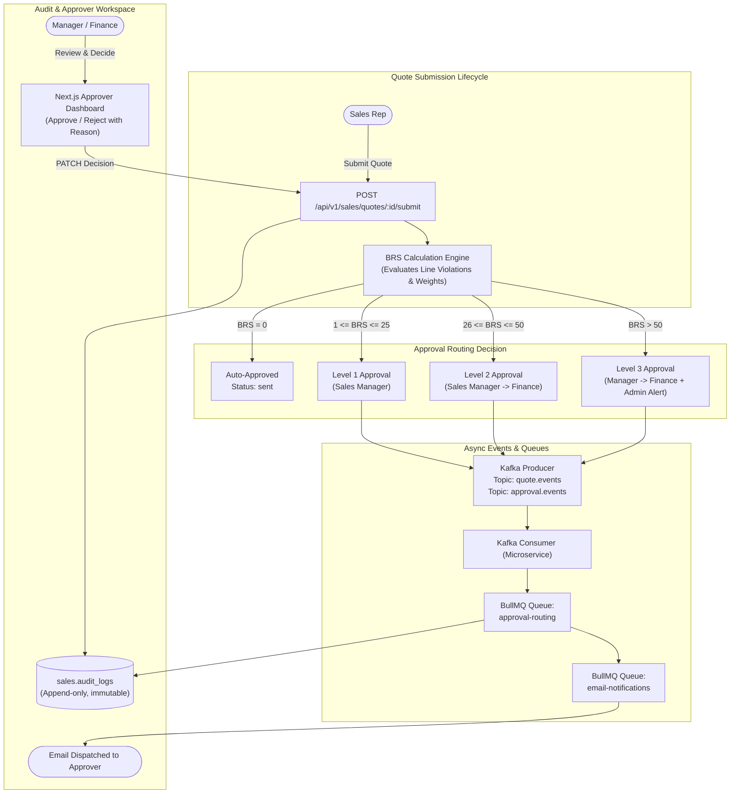
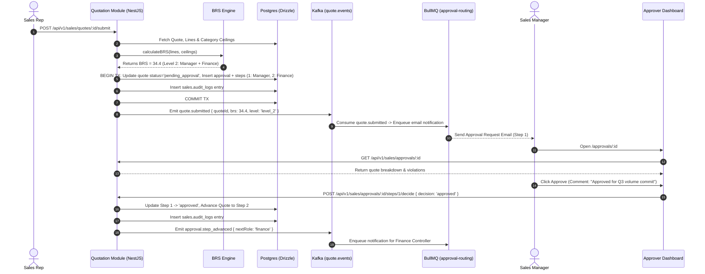

#complete
# Phase 2 — Governance & Approval Engine

> **Document ID:** DF360-PHASE-02  
> **Version:** 1.0.0  
> **Status:** APPROVED  
> **Target Delivery:** Sprint 3–4  
> **Owner:** Lead Solutions Architect & Backend Engineering Lead

---

## 1. Executive Summary & Phase Goal

Phase 2 delivers the core financial safeguards and workflow automation of DealFlow360: the **Governance & Approval Engine**. In enterprise sales, unconstrained discounting erodes operating margins; conversely, rigid manual sign-offs introduce latency that kills deal momentum. This phase implements the mathematical **Blended Risk Score (BRS)** engine to calculate quote-level discount exposure, couples it with a multi-tier dynamic approval routing state machine, integrates Kafka event streams with BullMQ asynchronous job queues for notification and escalation dispatching, enforces append-only immutable audit logging (`sales.audit_logs`), and builds a responsive Next.js Approver Dashboard for sales managers and finance controllers.

Upon completion of Phase 2, any submitted quote will be evaluated in real time against customer tier discount ceilings, assigned an exact BRS value, routed automatically to the appropriate authority (Sales Manager, Finance, or auto-approved if $BRS = 0$), and audited with full cryptographic traceability.



---

## 2. Exact Prerequisites & Input Documents

The implementation of Phase 2 requires strict adherence to the established system specifications:

| Specification Document | Target Anchor / Section | Purpose for Phase 2 |
|---|---|---|
| [01-SYSTEM_ARCHITECTURE.md](file:///home/bow/projects/DealFlow360/docs/01-SYSTEM_ARCHITECTURE.md) | §4.2 (Governance Engine), §7 (Data Flow) | Service boundaries, asynchronous event-driven state transitions, Kafka architecture. |
| [02-DATABASE_SCHEMA.md](file:///home/bow/projects/DealFlow360/docs/02-DATABASE_SCHEMA.md) | §3.1 (`quotes`, `quote_lines`, `approvals`, `approval_steps`, `audit_logs`, `discount_ceilings`) | Physical table schemas, constraints, Drizzle models, and foreign key relationships. |
| [03-REST_API_OPENAPI.md](file:///home/bow/projects/DealFlow360/docs/03-REST_API_OPENAPI.md) | §2.6 (Quotes API), §2.7 (Approvals API), §2.8 (Audit Logs API) | API contracts for quote submission, approval decision recording, pending queue retrieval. |
| [04-ASYNC_EVENT_WORKER_CATALOG.md](file:///home/bow/projects/DealFlow360/docs/04-ASYNC_EVENT_WORKER_CATALOG.md) | §2.1 (`quote.events`), §2.2 (`approval.events`), §4.1 (`approval-routing`), §4.2 (`email-notifications`) | Kafka payload contracts, BullMQ job definitions, retry backoffs, and Dead Letter Queue strategies. |
| [05-QUOTATION_LIFECYCLE_GOVERNANCE.md](file:///home/bow/projects/DealFlow360/docs/05-QUOTATION_LIFECYCLE_GOVERNANCE.md) | §1 (State Machine), §2 (BRS Algorithm), §3 (Approval Routing), §5 (Audit Specification) | The formal mathematical formulation of BRS, state transition guards, rejection rules, and audit logging standards. |
| [07-AUTH_SECURITY_RBAC.md](file:///home/bow/projects/DealFlow360/docs/07-AUTH_SECURITY_RBAC.md) | §3 (RBAC Matrix), §4 (Manager & Finance Roles) | Enforcement of permission keys `quote:approve:manager`, `quote:approve:finance`, `audit:read`. |

---

## 3. Component-by-Component Implementation Checklist

### 3.1 Database Schema Migrations & Drizzle ORM
- [ ] Implement migration `0001_governance_and_approvals.sql`:
  - [ ] Table [`sales.discount_ceilings`](file:///home/bow/projects/DealFlow360/docs/02-DATABASE_SCHEMA.md#L257-L280): Maps `tier_id` and `category` to `max_discount_pct` (decimal 5,2). Unique constraint on `(tier_id, category)`.
  - [ ] Table [`sales.quotes`](file:///home/bow/projects/DealFlow360/docs/02-DATABASE_SCHEMA.md#L282-L320): Columns `brs_score` (numeric 5,2), `status` (`draft`, `pending_approval`, `sent`, `under_negotiation`, `confirmed`, `fulfilled`, `cancelled`, `rejected`), `current_approval_step` (integer).
  - [ ] Table [`sales.quote_lines`](file:///home/bow/projects/DealFlow360/docs/02-DATABASE_SCHEMA.md#L322-L365): Columns `discount_pct`, `unit_price`, `quantity`, `applied_ceiling_pct`, `violation_score`.
  - [ ] Table [`sales.approvals`](file:///home/bow/projects/DealFlow360/docs/02-DATABASE_SCHEMA.md#L367-L400): Primary record linking `quote_id`, `brs_score`, `approval_level` (`level_1`, `level_2`, `level_3`), `status` (`pending`, `approved`, `rejected`).
  - [ ] Table [`sales.approval_steps`](file:///home/bow/projects/DealFlow360/docs/02-DATABASE_SCHEMA.md#L402-L435): Granular step tracking (`step_order`, `role_required`, `assigned_user_id`, `decision`, `decision_reason`, `decided_at`).
  - [ ] Table [`sales.audit_logs`](file:///home/bow/projects/DealFlow360/docs/02-DATABASE_SCHEMA.md#L437-L470): Immutable audit trail with `entity_type`, `entity_id`, `action`, `actor_id`, `actor_role`, `state_before`, `state_after`, `metadata` (JSONB), `created_at`.
- [ ] Add PostgreSQL trigger or rule preventing `UPDATE` and `DELETE` on `sales.audit_logs` to ensure immutability.
- [ ] Export typed Drizzle schema definitions and Zod validation contracts via `drizzle-zod`.

### 3.2 Blended Risk Score (BRS) Engine
- [ ] Implement `BrsCalculationService` in `apps/api/src/modules/governance/`:
  - [ ] Implement per-line violation formula:
    $$\text{lineViolation}_i = \max\left(0, \frac{\text{appliedDiscount}_i - \text{tierCeiling}_i}{\text{tierCeiling}_i} \times 100\right)$$
  - [ ] Implement order weighting:
    $$\text{lineTotal}_i = \text{quantity}_i \times \text{unitPrice}_i \times \left(1 - \frac{\text{appliedDiscount}_i}{100}\right)$$
    $$\text{orderTotal} = \sum_{i=1}^n \text{lineTotal}_i$$
    $$\text{lineWeight}_i = \frac{\text{lineTotal}_i}{\text{orderTotal}}$$
  - [ ] Implement final blended aggregation:
    $$\text{BRS} = \sum_{i=1}^n (\text{lineViolation}_i \times \text{lineWeight}_i)$$
  - [ ] Implement approval level mapping:
    - $\text{BRS} = 0 \implies \text{None (Auto-Approve)}$
    - $1 \le \text{BRS} \le 25 \implies \text{Level 1 (Sales Manager)}$
    - $26 \le \text{BRS} \le 50 \implies \text{Level 2 (Sales Manager + Finance)}$
    - $\text{BRS} > 50 \implies \text{Level 3 (Sales Manager + Finance + Admin Alert)}$

### 3.3 Multi-Tier Approval Routing Workflow
- [ ] Implement `ApprovalRoutingService`:
  - [ ] Evaluate quote state transitions according to [DF360-SPEC-005 Transition Table](file:///home/bow/projects/DealFlow360/docs/05-QUOTATION_LIFECYCLE_GOVERNANCE.md#L71-L90).
  - [ ] Enforce guard conditions:
    - Minimum 1 quote line.
    - All unit prices $> 0$.
    - Valid customer account linked.
    - Expiry date $\ge \text{today} + 1\text{ day}$.
  - [ ] Create `approvals` and sequential `approval_steps` rows in a single atomic transaction.
  - [ ] If $\text{BRS} = 0$, transition quote status directly to `sent` and bypass step creation.
  - [ ] Handle sequential approval advancement: when Sales Manager approves step 1 of a Level 2 approval, advance `current_approval_step` to 2 and notify Finance.
  - [ ] Handle rejection: ensure mandatory rejection reason ($\ge 10$ characters), mark step and approval as `rejected`, transition quote back to `draft`, and attach rejection feedback.

### 3.4 Kafka & BullMQ Async Pipeline
- [ ] Kafka Producer & Consumer:
  - [ ] Publish to `quote.events` on events: `quote.submitted`, `quote.approved`, `quote.returned`, `quote.cancelled`.
  - [ ] Publish to `approval.events` on events: `approval.created`, `approval.step_advanced`, `approval.rejected`, `approval.escalated`.
  - [ ] Consumer service `@dealflow360-approval-svc-cg` listens to `quote.submitted` to enqueue routing jobs.
- [ ] BullMQ Workers:
  - [ ] `ApprovalRoutingWorker` (queue: `approval-routing`): Handles automated step progression, timeout evaluation, and auto-escalation when a pending approval exceeds SLA (48 hours).
  - [ ] `EmailNotificationWorker` (queue: `email-notifications`): Renders MJML/HTML email templates for:
    - *Approval Request to Manager* (Quote ID, Rep, Customer, BRS, Top Violations).
    - *Finance Approval Escalation* (Manager approval timestamp, Margin impact).
    - *Rejection Notice to Sales Rep* (Approver name, rejection reason).
    - *High Risk BRS Alert to Admin* ($BRS > 50$).

### 3.5 Immutable Audit Log Recorder
- [ ] Implement `AuditLogService` with `@Injectable()` lifecycle hook and asynchronous fire-and-forget logging:
  - [ ] Intercept quote and approval state transitions via NestJS Interceptor (`AuditInterceptor`).
  - [ ] Record snapshot diffs (`state_before` vs `state_after`) in `sales.audit_logs`.
  - [ ] Prevent tamper vulnerability: verify table lacks `UPDATE`/`DELETE` API endpoints and DB user permissions restrict mutation.

### 3.6 Approver UI Dashboard (Next.js 14)
- [ ] Pending Approvals Page (`/approvals`):
  - [ ] Tabbed view: `Awaiting My Action`, `Assigned to Team`, `Completed History`.
  - [ ] Data table showing Quote Number, Rep, Customer Tier, Total Value, BRS Risk Badge (Green: 0, Amber: 1–25, Orange: 26–50, Red: >50).
- [ ] Quote Approval Drawer / Review View (`/approvals/[id]`):
  - [ ] Line-item breakdown table with visual highlighting for lines exceeding category ceilings (e.g., applied 28% vs ceiling 15%).
  - [ ] Risk summary card: Calculated BRS, Approval Level required, Margin exposure.
  - [ ] Action Bar:
    - **Approve Button:** Triggers confirmation dialog with optional approval comments.
    - **Reject Button:** Opens modal requiring non-empty rejection explanation ($\ge 10$ chars) with client-side Zod validation.

---

## 4. Step-by-Step Execution Plan



### Step 1: Database Migration & Model Binding
1. Create `libs/db/src/migrations/0001_governance_and_approvals.sql`.
2. Apply migration using Drizzle Kit:
   ```bash
   pnpm --filter @dealflow/db drizzle-kit migrate
   ```
3. Verify table constraints and foreign keys via SQL introspection.
4. Execute test seed populating category discount ceilings:
   - Hardware: Standard (10%), Silver (15%), Gold (20%), Platinum (25%).
   - SaaS Subscriptions: Standard (15%), Silver (20%), Gold (30%), Platinum (40%).
   - Professional Services: Standard (5%), Silver (10%), Gold (15%), Platinum (20%).

### Step 2: Implement BRS Calculation Logic
1. Implement pure calculation function in `libs/common/src/governance/brs-calculator.ts`:
   ```typescript
   export interface LineItemDiscountInput {
     lineId: string;
     quantity: number;
     unitPrice: number;
     appliedDiscountPct: number;
     tierCeilingPct: number;
   }

   export interface BrsCalculationResult {
     brs: number;
     approvalLevel: 'none' | 'level_1' | 'level_2' | 'level_3';
     orderTotal: number;
     lineResults: Array<{
       lineId: string;
       lineTotal: number;
       lineWeight: number;
       violationScore: number;
     }>;
   }

   export function calculateBRS(lines: LineItemDiscountInput[]): BrsCalculationResult {
     if (lines.length === 0) throw new Error("At least one line item required");

     // Compute line totals
     const lineTotals = lines.map(l => ({
       ...l,
       total: l.quantity * l.unitPrice * (1 - l.appliedDiscountPct / 100)
     }));

     const orderTotal = lineTotals.reduce((sum, l) => sum + l.total, 0);
     if (orderTotal <= 0) throw new Error("Order total must be positive");

     let brsAccumulator = 0;
     const lineResults = lineTotals.map(l => {
       const violationScore = Math.max(0, ((l.appliedDiscountPct - l.tierCeilingPct) / l.tierCeilingPct) * 100);
       const lineWeight = l.total / orderTotal;
       brsAccumulator += violationScore * lineWeight;
       return {
         lineId: l.lineId,
         lineTotal: l.total,
         lineWeight,
         violationScore: Number(violationScore.toFixed(4)),
       };
     });

     const finalBrs = Number(brsAccumulator.toFixed(2));
     let approvalLevel: 'none' | 'level_1' | 'level_2' | 'level_3' = 'none';
     if (finalBrs > 50) approvalLevel = 'level_3';
     else if (finalBrs >= 26) approvalLevel = 'level_2';
     else if (finalBrs >= 1) approvalLevel = 'level_1';

     return { brs: finalBrs, approvalLevel, orderTotal, lineResults };
   }
   ```
2. Write comprehensive unit test suite covering zero-violation, single-line violation, multi-line blending, and rounding edge cases.

### Step 3: Implement Quotation Lifecycle State Machine & Guard Validation
1. Create `QuotationStateService` managing transitions:
   - `submit(quoteId, actor)`
   - `approve(quoteId, stepId, actor)`
   - `reject(quoteId, stepId, reason, actor)`
   - `cancel(quoteId, actor)`
2. Enforce atomic Drizzle transactions for all state transitions, bundling quote updates, step decisions, and audit log entries into single `tx` boundaries.

### Step 4: Asynchronous Messaging & Background Workers
1. Implement `KafkaProducerService` emitting strongly typed events conforming to CloudEvents format:
   ```typescript
   await this.kafkaProducer.send({
     topic: 'quote.events',
     messages: [{
       key: quoteId,
       value: JSON.stringify(quoteSubmittedEvent),
       headers: { eventType: 'quote.submitted', correlationId }
     }]
   });
   ```
2. Register BullMQ queues `approval-routing` and `email-notifications` in `GovernanceModule`.
3. Implement `ApprovalRoutingProcessor` and `EmailNotificationProcessor` handling worker logic with automatic retries (3 attempts, exponential backoff).

### Step 5: Approver UI Dashboard in Next.js
1. Build Approver table view using Shadcn `Table`, `Badge`, and TanStack Table.
2. Build Line Breakdown review component with visual conditional formatting (red text for ceiling violations).
3. Connect React Hook Form modal for Rejection Reason with validation rule: `z.string().min(10, "Rejection reason must be at least 10 characters long")`.

---

## 5. Empirical Verification & Test Suite Requirements

```
  ┌─────────────────────────────────────────────────────────────┐
  │ 1. Unit Tests: BRS Math, Ceiling Guards, Zod Validation     │
  ├─────────────────────────────────────────────────────────────┤
  │ 2. Integration Tests: Drizzle Migrations, Atomic TX, Kafka  │
  ├─────────────────────────────────────────────────────────────┤
  │ 3. E2E Tests: Quote Submit -> Multi-Tier Approval Workflow  │
  └─────────────────────────────────────────────────────────────┘
```

### 5.1 Unit Tests (`pnpm test:unit`)
- **BRS Algorithm Verification:**
  - Standard compliant quote (applied $\le$ ceiling) $\implies BRS = 0.00$, Level = `none`.
  - Single line exceeding ceiling by 50% on 100% order weight $\implies BRS = 50.00$, Level = `level_2`.
  - Worked example test matching [DF360-SPEC-005 §2.4](file:///home/bow/projects/DealFlow360/docs/05-QUOTATION_LIFECYCLE_GOVERNANCE.md#L163-L200):
    - Line 1: \$1,600 total, 20% applied vs 15% ceiling $\implies \text{violation} = 33.33$, weight $= 0.2759$.
    - Line 2: \$2,250 total, 10% applied vs 10% ceiling $\implies \text{violation} = 0$, weight $= 0.3879$.
    - Line 3: \$1,950 total, 35% applied vs 20% ceiling $\implies \text{violation} = 75.00$, weight $= 0.3362$.
    - Assert computed $BRS = 34.41 \pm 0.02$ and Level = `level_2`.
- **Rejection Guard Tests:**
  - Rejecting quote with empty reason or $< 10$ characters throws validation exception HTTP 422.

### 5.2 Integration Tests (`pnpm test:integration`)
- **Database Immutability Test:**
  - Attempt `UPDATE sales.audit_logs SET action = 'tampered'` -> Expect database exception / trigger rejection.
- **Atomic Transaction Rollback Test:**
  - Inject artificial failure during approval step generation -> Verify quote status remains `draft` and no partial approval rows exist.
- **Kafka & BullMQ Integration:**
  - Submit quote -> Verify Kafka consumer picks up `quote.submitted` and enqueues job in `approval-routing`.

### 5.3 End-to-End Workflow Tests (`pnpm test:e2e`)
- **Full Level 2 Sequential Approval Flow:**
  1. Rep submits quote with $BRS = 34.41$.
  2. Quote status moves to `pending_approval`, Step 1 (`sales_manager`) is `pending`, Step 2 (`finance`) is `pending`.
  3. Sales Rep attempts to edit lines -> Expect HTTP 403 / 422 (Locked).
  4. Sales Manager logs in -> Approves Step 1 with comments.
  5. Step 1 updates to `approved`. Quote remains `pending_approval`.
  6. Finance Officer logs in -> Approves Step 2.
  7. All steps approved -> Quote status automatically transitions to `sent`.
  8. Query `sales.audit_logs` -> Verify 4 discrete audit records with correct before/after states and actor IDs.
- **Rejection Flow:**
  1. Rep submits quote with $BRS = 18.5$ (Level 1).
  2. Sales Manager rejects with reason `"Discount too high for current volume; cap at 12%"`.
  3. Quote transitions to `draft` with rejection reason attached.
  4. Rep modifies discount -> Re-submits.

---

## 6. Definition of Done (DoD)

Phase 2 is considered complete and production-ready when:

1. [ ] Database migration `0001_governance_and_approvals.sql` applies cleanly and adds all required tables, constraints, and audit immutability triggers.
2. [ ] BRS Calculation Engine produces verified, reproducible mathematical output matching specification formulas across all unit tests.
3. [ ] All guard conditions for quote submission, approval progression, and rejection reasons are fully enforced with descriptive error messages.
4. [ ] Multi-tier approval routing works sequentially (Sales Manager -> Finance Controller) with automated bypass when $BRS = 0$.
5. [ ] Kafka producers emit `quote.events` and `approval.events`; BullMQ workers process routing and notification queues with verified delivery.
6. [ ] `sales.audit_logs` records every quote creation, edit, submission, approval, rejection, and transition without mutation risk.
7. [ ] Next.js Approver Dashboard is fully functional, displaying pending queues, ceiling violation visual indicators, and working approval/rejection dialogs.
8. [ ] Unit, integration, and E2E automated test suites pass with 100% success rate.
