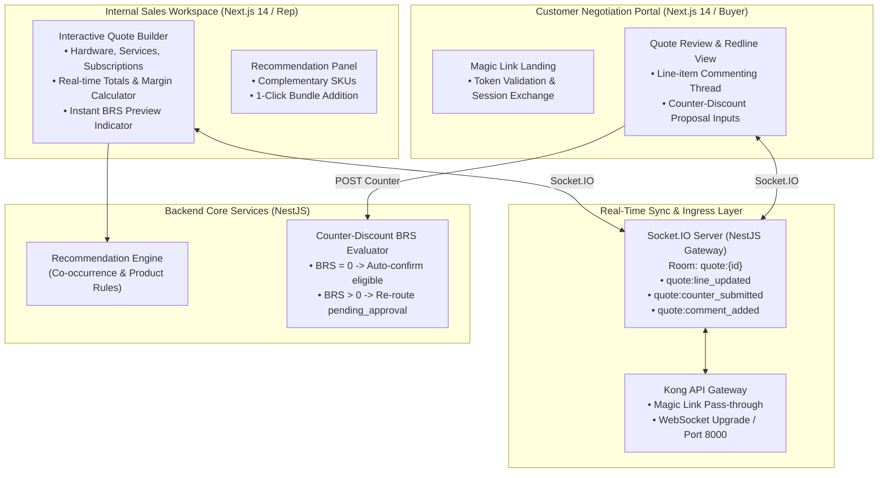
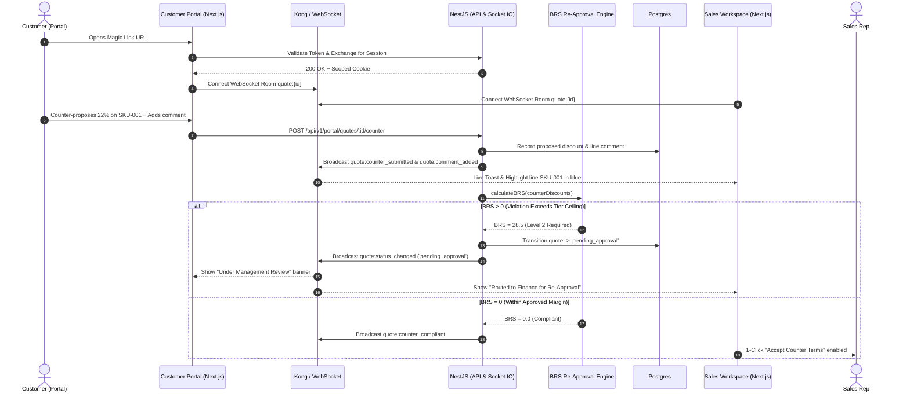

# Phase 3 — Sales Workspace & Customer Negotiation Portal

> **Document ID:** DF360-PHASE-03  
> **Version:** 1.0.0  
> **Status:** APPROVED  
> **Target Delivery:** Sprint 5–6  
> **Owner:** Fullstack Tech Lead & Principal Product Architect

---

## 1. Executive Summary & Phase Goal

Phase 3 delivers the collaborative heart of the DealFlow360 platform: the **Sales Workspace** for sales representatives and the external **Customer Negotiation Portal** for prospective clients. Building complex enterprise deals requires combining physical hardware, one-time services, and recurring subscriptions into a cohesive quote with instant financial feedback (gross margin, net margin, discount roll-ups). Furthermore, closing enterprise deals demands collaborative iteration rather than static PDF exchanges.

This phase implements the high-performance Next.js Quote Builder with real-time margin modeling, an embedded rule-based Upsell/Cross-Sell Recommendation Engine, the stateless Magic Link Customer Negotiation Portal, bidirectional real-time synchronization over **Socket.IO** (enabling live redlining, line-level comments, and counter-discount proposals), and the automated BRS Re-Approval evaluation pipeline when customer counter-terms deviate from established pricing ceilings.



---

## 2. Exact Prerequisites & Input Documents

All designs and contracts for Phase 3 must conform to the authoritative documentation:

| Specification Document | Target Anchor / Section | Purpose for Phase 3 |
|---|---|---|
| [01-SYSTEM_ARCHITECTURE.md](file:///home/bow/projects/DealFlow360/docs/01-SYSTEM_ARCHITECTURE.md) | §4.1 (Sales Workspace), §4.5 (Negotiation Portal), §7 (Data Flow) | Client topology, WebSocket gateway structure, real-time message handling. |
| [02-DATABASE_SCHEMA.md](file:///home/bow/projects/DealFlow360/docs/02-DATABASE_SCHEMA.md) | §3.1 (`quote_lines`, `line_comments`, `product_recommendations`), §3.5 (`portal.magic_links`, `negotiation_sessions`) | Schemas for line-item comments, counter-discount proposals, recommendations, magic links. |
| [03-REST_API_OPENAPI.md](file:///home/bow/projects/DealFlow360/docs/03-REST_API_OPENAPI.md) | §2.6 (Quotes API), §2.9 (Customer Portal API), §2.10 (Recommendations API) | Endpoints for magic link validation, counter submission, line comments, recommendations. |
| [04-ASYNC_EVENT_WORKER_CATALOG.md](file:///home/bow/projects/DealFlow360/docs/04-ASYNC_EVENT_WORKER_CATALOG.md) | §2.1 (`quote.negotiation_received`), §4.3 (`portal-notifications`) | Kafka event structures and notification triggers for customer proposals. |
| [05-QUOTATION_LIFECYCLE_GOVERNANCE.md](file:///home/bow/projects/DealFlow360/docs/05-QUOTATION_LIFECYCLE_GOVERNANCE.md) | §1.3 (Transition T-07, T-10, T-11), §4 (Customer Negotiation Re-Approval) | Rules for quote state transitions (`sent` -> `under_negotiation` -> `pending_approval` / `confirmed`). |
| [07-AUTH_SECURITY_RBAC.md](file:///home/bow/projects/DealFlow360/docs/07-AUTH_SECURITY_RBAC.md) | §2.3 (Portal Magic Link Auth), §5 (Portal Token Lifespan) | Secure HMAC generation, single-use vs multi-session token verification, cookie scopes. |

---

## 3. Component-by-Component Implementation Checklist

### 3.1 Database Schema Migrations & Drizzle ORM
- [ ] Implement migration `0002_workspace_and_negotiation.sql`:
  - [ ] Update [`sales.quote_lines`](file:///home/bow/projects/DealFlow360/docs/02-DATABASE_SCHEMA.md#L322-L365): Add `counter_discount_pct` (decimal 5,2), `counter_status` (`none`, `proposed`, `accepted`, `rejected`), `unit_cost` (decimal 12,4).
  - [ ] Create table [`sales.line_comments`](file:///home/bow/projects/DealFlow360/docs/02-DATABASE_SCHEMA.md#L472-L510): Columns `id`, `quote_line_id`, `author_type` (`rep`, `customer`), `author_id`, `author_name`, `comment_text`, `resolved` (boolean), `created_at`.
  - [ ] Create table [`sales.product_recommendations`](file:///home/bow/projects/DealFlow360/docs/02-DATABASE_SCHEMA.md#L512-L545): Pre-computed rules mapping `source_product_id` -> `target_product_id`, `recommendation_type` (`upsell`, `cross_sell`, `addon`), `confidence_score`.
  - [ ] Create table [`portal.negotiation_sessions`](file:///home/bow/projects/DealFlow360/docs/02-DATABASE_SCHEMA.md#L817-L845): Tracks active customer sessions, IP addresses, user agents, and last activity timestamps.
- [ ] Export updated Drizzle entity models and Zod schemas.

### 3.2 Quote Builder Backend & Financial Computation Engine
- [ ] Implement `QuoteCalculationService`:
  - [ ] Calculate total revenue: $\text{Revenue} = \sum (\text{Qty} \times \text{Unit Price} \times (1 - \text{Discount}/100))$.
  - [ ] Calculate total cost of goods: $\text{COGS} = \sum (\text{Qty} \times \text{Unit Cost})$.
  - [ ] Calculate Gross Margin (\$): $\text{Gross Profit} = \text{Revenue} - \text{COGS}$.
  - [ ] Calculate Gross Margin (%): $\text{Margin \%} = (\text{Gross Profit} / \text{Revenue}) \times 100$.
  - [ ] Calculate live BRS score and trigger dynamic risk warnings as lines are altered.
- [ ] Implement line item management endpoints:
  - [ ] `POST /api/v1/sales/quotes/:id/lines` — Add hardware, subscription, or service SKU.
  - [ ] `PATCH /api/v1/sales/quotes/:id/lines/:lineId` — Inline quantity or discount mutation.
  - [ ] `DELETE /api/v1/sales/quotes/:id/lines/:lineId` — Remove line item.

### 3.3 Upsell & Cross-Sell Recommendation Engine
- [ ] Implement `RecommendationsModule` in NestJS:
  - [ ] Query `sales.product_recommendations` based on existing line item SKUs.
  - [ ] Apply filtering rules: Exclude items already present in the active quote.
  - [ ] Expose `GET /api/v1/sales/quotes/:id/recommendations`: Returns ranked suggestions with estimated margin impact.

### 3.4 Customer Negotiation Portal & Magic Link Access
- [ ] Implement `PortalAuthService`:
  - [ ] Generate cryptographic magic link URL: `https://portal.dealflow360.com/negotiate/:quoteId?token=<hmac_token>`.
  - [ ] Validate token against SHA-256 hash in `portal.magic_links`, verifying quote binding and 72-hour expiration window.
  - [ ] Issue scoped customer session JWT stored in HttpOnly cookie (`df360_portal_session`).
- [ ] Portal APIs:
  - [ ] `GET /api/v1/portal/quotes/:quoteId` — Redacted customer view (hiding internal costs and rep margins).
  - [ ] `POST /api/v1/portal/quotes/:quoteId/counter` — Submit line-by-line counter-discount requests.
  - [ ] `POST /api/v1/portal/quotes/:quoteId/lines/:lineId/comments` — Post line-item questions or notes.
  - [ ] `POST /api/v1/portal/quotes/:quoteId/accept` — Accept terms as-is and advance to `confirmed`.

### 3.5 Automated Counter-Discount BRS Re-Approval Engine
- [ ] Implement Counter Re-Approval workflow:
  - [ ] When customer submits counter: transition quote state to `under_negotiation`.
  - [ ] Invoke `BrsCalculationService` on the customer's proposed discounts:
    - If customer's requested discount produces $BRS = 0$: Flag quote as `counter_compliant`, enabling sales rep 1-click confirmation.
    - If customer's requested discount produces $BRS > 0$: Automatically transition quote to `pending_approval`, generate new `approvals` and `approval_steps` records, and dispatch notifications to appropriate approvers.
  - [ ] Publish Kafka event `quote.negotiation_received`.

### 3.6 Real-Time Socket.IO Synchronization Gateway
- [ ] Implement `NegotiationGateway` in NestJS (`@WebSocketGateway({ namespace: '/negotiation' })`):
  - [ ] Authenticate sockets via JWT (Sales Rep) or Portal Session Token (Customer).
  - [ ] Manage room tenancy: `socket.join("quote:" + quoteId)`.
  - [ ] Broadcast events:
    - `quote:line_updated` — Dispatched when rep edits discount/quantity or customer views changes.
    - `quote:comment_added` — Real-time chat bubble delivery on specific line items.
    - `quote:counter_submitted` — Immediate visual alert for sales rep showing proposed discounts.
    - `quote:status_changed` — Updates UI when quote advances to `pending_approval` or `confirmed`.
    - `quote:presence` — Shows whether customer or rep is actively viewing the document.

### 3.7 Frontend UI Components (Sales Workspace & Portal)
- [ ] **Sales Workspace Quote Builder (`apps/sales-fe/src/app/(workspace)/quotes/[id]`):**
  - [ ] Multi-line table supporting Hardware, Services, and Recurring Subscriptions.
  - [ ] Sticky Header / Footer with Real-Time Totals: Subtotal, Total Discount (\$), Revenue, Gross Margin (\%), and Live BRS Pill.
  - [ ] Upsell Drawer / Recommendation Carousel showing high-confidence add-ons with "Add to Quote" button.
  - [ ] Live counter-proposal diff banner highlighting customer-requested changes in blue.
- [ ] **Customer Negotiation Portal (`apps/portal-fe/src/app/negotiate/[id]`):**
  - [ ] Clean, customer-facing responsive quotation layout.
  - [ ] Interactive discount slider / input with maximum discount boundaries.
  - [ ] Threaded commenting popover attached to each line item.
  - [ ] Prominent primary action bar: "Accept Final Terms" or "Submit Counter-Offer".

---

## 4. Step-by-Step Execution Plan



### Step 1: Database Migration & Schema Setup
1. Execute `pnpm --filter @dealflow/db drizzle-kit generate` and apply `0002_workspace_and_negotiation.sql`.
2. Seed baseline product recommendations linking common server hardware to warranty services and enterprise support subscriptions.

### Step 2: Build Real-Time Quotation Calculator & Line Item CRUD
1. Write pure mathematical engine `QuotationCalculator` in `libs/common/`:
   ```typescript
   export function calculateQuoteTotals(lines: QuoteLineModel[]): QuoteFinancialSummary {
     let grossRevenue = 0;
     let totalCost = 0;
     let totalDiscountAmount = 0;

     for (const line of lines) {
       const listTotal = line.quantity * line.unitPrice;
       const discountedTotal = listTotal * (1 - line.discountPct / 100);
       const costTotal = line.quantity * line.unitCost;

       grossRevenue += discountedTotal;
       totalCost += costTotal;
       totalDiscountAmount += (listTotal - discountedTotal);
     }

     const grossProfit = grossRevenue - totalCost;
     const grossMarginPct = grossRevenue > 0 ? (grossProfit / grossRevenue) * 100 : 0;

     return {
       grossRevenue: Number(grossRevenue.toFixed(2)),
       totalCost: Number(totalCost.toFixed(2)),
       totalDiscountAmount: Number(totalDiscountAmount.toFixed(2)),
       grossProfit: Number(grossProfit.toFixed(2)),
       grossMarginPct: Number(grossMarginPct.toFixed(2)),
     };
   }
   ```
2. Integrate financial computation into `QuotesController` and expose live calculation endpoints.

### Step 3: Implement Socket.IO Gateway & Multi-Tenant Rooms
1. Create `NegotiationGateway` in `apps/api/src/modules/realtime/`:
   ```typescript
   @WebSocketGateway({
     namespace: '/negotiation',
     cors: { origin: ['http://localhost:3001', 'http://localhost:3002'], credentials: true }
   })
   export class NegotiationGateway implements OnGatewayConnection, OnGatewayDisconnect {
     @WebSocketServer()
     server: Server;

     @SubscribeMessage('join_quote')
     handleJoinRoom(@ConnectedSocket() client: Socket, @MessageBody() data: { quoteId: string }) {
       client.join(`quote:${data.quoteId}`);
       this.server.to(`quote:${data.quoteId}`).emit('user_joined', { socketId: client.id });
     }

     broadcastLineUpdate(quoteId: string, line: any) {
       this.server.to(`quote:${quoteId}`).emit('quote:line_updated', line);
     }
   }
   ```

### Step 4: Implement Customer Portal & Magic Link Verification
1. Develop `PortalController` supporting secure token redemption, comment retrieval, and counter submission.
2. Build Customer Portal frontend in `apps/portal-fe/` utilizing Next.js App Router and Tailwind CSS.
3. Configure line-item redlining UI enabling customers to propose alternate percentages or add clarification notes.

### Step 5: Implement Automated Re-Approval Trigger Flow
1. Integrate customer counter-offer submission with `BrsCalculationService`.
2. Ensure state transitions conform to [05-QUOTATION_LIFECYCLE_GOVERNANCE.md §4](file:///home/bow/projects/DealFlow360/docs/05-QUOTATION_LIFECYCLE_GOVERNANCE.md#L250-L310):
   - When counter discount > tier ceiling, atomic transaction creates an approval record and sets quote status to `pending_approval`.
   - Rep and Customer receive live status notification via Socket.IO.

---

## 5. Empirical Verification & Test Suite Requirements

```
  ┌─────────────────────────────────────────────────────────────┐
  │ 1. Unit Tests: Margin Modeling, Recommendation Filter       │
  ├─────────────────────────────────────────────────────────────┤
  │ 2. Integration Tests: Socket.IO Rooms, Magic Link Auth      │
  ├─────────────────────────────────────────────────────────────┤
  │ 3. E2E Tests: Live Multi-Client Negotiation & Re-Approval   │
  └─────────────────────────────────────────────────────────────┘
```

### 5.1 Unit Tests (`pnpm test:unit`)
- **Financial Calculation Engine Tests:**
  - Verify Gross Margin % accuracy: \$10,000 Revenue with \$6,000 COGS $\implies 40.00\%$ margin.
  - Verify multi-currency rounding: fractional cents rounded deterministically using half-even method.
- **Recommendation Filter Tests:**
  - Assert recommendations do not return products already in the quote lines.
  - Assert recommendation ranks follow confidence scores descending.

### 5.2 Integration Tests (`pnpm test:integration`)
- **Magic Link Token Lifecycle:**
  - Generate token -> Verify DB hash matches.
  - Redeem token -> Verify session cookie issued.
  - Attempt replay of expired token (>72 hours) -> Expect HTTP 401.
- **Socket.IO Room Isolation:**
  - Client A joins room `quote:123`, Client B joins room `quote:456`.
  - Dispatch event to `quote:123` -> Assert Client A receives message, Client B receives zero messages.

### 5.3 End-to-End Workflow Tests (`pnpm test:e2e`)
- **Real-Time Redline & Automated Re-Approval Flow:**
  1. Rep builds quote with 2 Hardware SKUs and 1 Subscription SKU in Sales Workspace.
  2. Rep submits quote (BRS = 0); quote status transitions to `sent`.
  3. System generates Magic Link; Customer opens URL in Portal frontend.
  4. Both clients establish WebSocket connections to `quote:{id}`.
  5. Customer adds a line comment: `"Can you match competitor 25% discount?"` -> Rep sees comment popover appear instantly without page refresh.
  6. Customer proposes 25% discount on Hardware SKU (Tier ceiling is 15%).
  7. Customer clicks "Submit Counter Proposal".
  8. API receives counter -> Recalculates BRS $\implies BRS = 22.5$ (Level 1 violation).
  9. Quote status moves to `pending_approval`.
  10. Rep workspace UI immediately renders banner: *"Quote locked: Customer counter-proposal requires Sales Manager approval."*
  11. Portal UI immediately renders banner: *"Counter-offer submitted. Currently pending internal review."*

---

## 6. Definition of Done (DoD)

Phase 3 is complete and ready for production staging when:

1. [ ] Database migration `0002_workspace_and_negotiation.sql` applies cleanly and supports comments, counter-discounts, and recommendation rules.
2. [ ] Sales Workspace Quote Builder allows creating and editing mixed quotes (hardware, services, recurring subscriptions) with real-time gross margin, revenue, and BRS feedback.
3. [ ] Upsell/Cross-sell engine displays valid, contextual suggestions that can be added to quotes with 1 click.
4. [ ] Customer Negotiation Portal functions with passwordless Magic Link authentication, supporting line-item comments and counter-discount submissions.
5. [ ] Socket.IO gateway synchronizes redlines, comments, and counter-proposals between rep and customer in real time with sub-100ms latency.
6. [ ] Customer counter-discounts exceeding pricing ceilings automatically trigger the BRS re-approval flow, updating quote state to `pending_approval` and routing to approvers.
7. [ ] All unit, integration, and multi-client E2E tests pass with 100% success rate.
