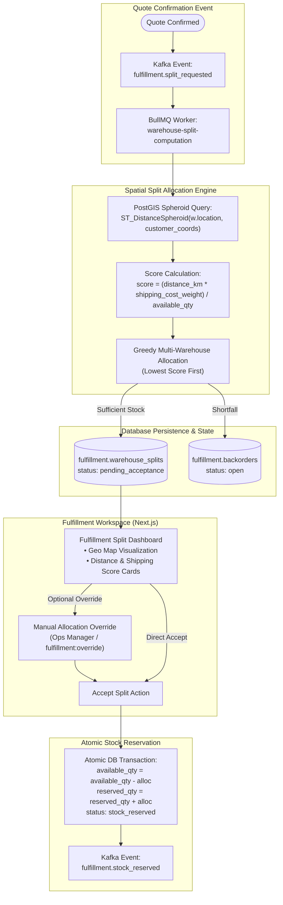
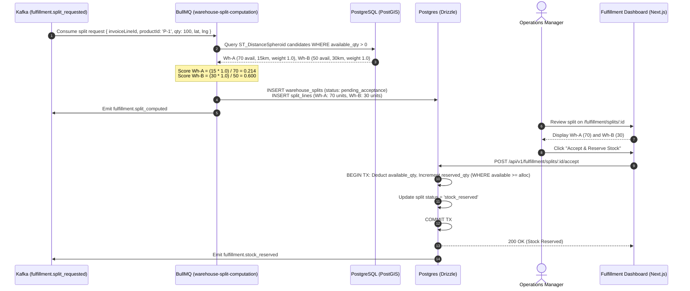

# Phase 4 — Spatial Fulfillment & Inventory Allocation Engine

> **Document ID:** DF360-PHASE-04  
> **Version:** 1.0.0  
> **Status:** APPROVED  
> **Target Delivery:** Sprint 7–8  
> **Owner:** Principal Logistics Architect & Lead Backend Engineer

---

## 1. Executive Summary & Phase Goal

Phase 4 implements the high-performance logistics and spatial allocation backbone of DealFlow360: the **Spatial Fulfillment & Inventory Allocation Engine**. When an enterprise quote containing physical hardware is confirmed, fulfilling orders efficiently requires intelligent routing across geographically distributed fulfillment hubs. A naive nearest-warehouse policy frequently fails because nearby warehouses may lack sufficient stock or have prohibitive regional shipping costs.

This phase deploys **PostGIS 3.4** spatial indexing and spherical geodetic distance calculations (`ST_DistanceSpheroid`), implements a multi-variable **Cost-Weighted Warehouse Split Allocation Algorithm** that balances distance, shipping rate factors, and inventory availability, orchestrates asynchronous split processing via **BullMQ**, provides concurrency-safe stock reservation primitives (`available_qty` vs `reserved_qty`), manages automated backorder generation, and delivers a Fulfillment Management UI in Next.js enabling Operations Managers to review splits, apply manual overrides, and commit stock reservations.



---

## 2. Exact Prerequisites & Input Documents

All architectural logic, mathematical scoring models, and database constraints for Phase 4 are defined in:

| Specification Document | Target Anchor / Section | Purpose for Phase 4 |
|---|---|---|
| [01-SYSTEM_ARCHITECTURE.md](file:///home/bow/projects/DealFlow360/docs/01-SYSTEM_ARCHITECTURE.md) | §4.3 (Fulfillment Context), §6.4 (Spatial Data) | Context boundaries, PostGIS database architecture, event flow. |
| [02-DATABASE_SCHEMA.md](file:///home/bow/projects/DealFlow360/docs/02-DATABASE_SCHEMA.md) | §3.2 (Fulfillment Schema), §4 (PostGIS Spatial Setup), §6 (GIST Indexes) | Table definitions (`warehouses`, `warehouse_stock`, `warehouse_splits`, `warehouse_split_lines`, `backorders`), GIST index creation. |
| [03-REST_API_OPENAPI.md](file:///home/bow/projects/DealFlow360/docs/03-REST_API_OPENAPI.md) | §2.11 (Fulfillment & Warehouses API) | REST endpoints for warehouse CRUD, stock updates, split listing, manual override, and acceptance. |
| [04-ASYNC_EVENT_WORKER_CATALOG.md](file:///home/bow/projects/DealFlow360/docs/04-ASYNC_EVENT_WORKER_CATALOG.md) | §2.3 (`fulfillment.events`), §4.4 (`warehouse-split-computation`) | BullMQ worker contract, concurrency limit, retry policies, and Kafka event definitions. |
| [06-BILLING_FULFILLMENT_SPEC.md](file:///home/bow/projects/DealFlow360/docs/06-BILLING_FULFILLMENT_SPEC.md) | §2 (Spatial Split Algorithm), §2.1 (Formula), §2.2 (SQL Query), §2.7 (Override Rules), §2.8 (Reservation) | Authoritative mathematical formula, PostGIS WGS84 parameters, stock locking, and backorder mechanics. |
| [07-AUTH_SECURITY_RBAC.md](file:///home/bow/projects/DealFlow360/docs/07-AUTH_SECURITY_RBAC.md) | §3, §4 (`fulfillment:override`, `fulfillment:accept`) | Permission guards for `ops_manager` and `finance_manager`. |

---

## 3. Component-by-Component Implementation Checklist

### 3.1 Database Schema Migrations & PostGIS Spatial Layer
- [ ] Implement migration `0003_spatial_fulfillment.sql`:
  - [ ] Table [`fulfillment.warehouses`](file:///home/bow/projects/DealFlow360/docs/02-DATABASE_SCHEMA.md#L547-L578): Columns `id`, `name`, `code`, `location` (`geometry(Point, 4326)`), `shipping_cost_weight` (numeric 6,4, default 1.0), `active` (boolean).
  - [ ] Table [`fulfillment.warehouse_stock`](file:///home/bow/projects/DealFlow360/docs/02-DATABASE_SCHEMA.md#L580-L612): Columns `warehouse_id`, `product_id`, `available_qty` (integer), `reserved_qty` (integer), `total_qty` (generated `available_qty + reserved_qty`), `updated_at`. Unique constraint on `(warehouse_id, product_id)`.
  - [ ] Spatial Index:
    ```sql
    CREATE INDEX CONCURRENTLY idx_warehouses_location_gist
      ON fulfillment.warehouses USING GIST (location);
    ```
  - [ ] Table [`fulfillment.warehouse_splits`](file:///home/bow/projects/DealFlow360/docs/02-DATABASE_SCHEMA.md#L614-L650): Columns `invoice_line_id`, `product_id`, `required_qty`, `status` (`pending_acceptance`, `accepted`, `rejected`, `stock_reserved`, `shipped`, `completed`, `backorder_created`), `override_note`, `overridden_by`, `overridden_at`, `accepted_by`, `accepted_at`.
  - [ ] Table [`fulfillment.warehouse_split_lines`](file:///home/bow/projects/DealFlow360/docs/02-DATABASE_SCHEMA.md#L652-L685): Columns `split_id`, `warehouse_id`, `allocated_qty`, `distance_km` (numeric 10,4), `score` (numeric 12,6).
  - [ ] Table [`fulfillment.backorders`](file:///home/bow/projects/DealFlow360/docs/02-DATABASE_SCHEMA.md#L687-L720): Columns `split_id`, `product_id`, `shortfall_qty`, `status` (`open`, `partially_filled`, `filled`, `cancelled`), `filled_qty`.
- [ ] Implement custom Drizzle geometry type for PostGIS `geometry(Point, 4326)`.

### 3.2 PostGIS Distance & Candidate Retrieval Engine
- [ ] Implement `SpatialWarehouseService` in NestJS:
  - [ ] Parameterized geodetic distance query via `ST_DistanceSpheroid`:
    ```sql
    SELECT
      w.id AS warehouse_id,
      w.name AS warehouse_name,
      w.shipping_cost_weight,
      ws.available_qty,
      ST_DistanceSpheroid(
        w.location,
        ST_SetSRID(ST_MakePoint(:customer_lng, :customer_lat), 4326),
        'SPHEROID["WGS 84",6378137,298.257223563]'
      ) / 1000.0 AS distance_km
    FROM fulfillment.warehouses w
    JOIN fulfillment.warehouse_stock ws ON ws.warehouse_id = w.id
    WHERE ws.product_id = :product_id
      AND ws.available_qty > 0
      AND w.active = TRUE
    ORDER BY distance_km;
    ```
  - [ ] Input validation for latitude $[-90.0, 90.0]$ and longitude $[-180.0, 180.0]$.

### 3.3 Cost-Weighted Split Allocation Algorithm
- [ ] Implement pure allocation module `WarehouseSplitCalculator`:
  - [ ] Compute composite preference score:
    $$\text{allocationScore} = \frac{\text{distance\_km} \times \text{shipping\_cost\_weight}}{\text{available\_qty}}$$
  - [ ] Sort candidate warehouses ascending by `allocationScore` (lowest score is highest priority).
  - [ ] Execute greedy allocation:
    - For each warehouse $j$, allocate $\min(\text{remainingRequiredQty}, \text{available\_qty}_j)$.
    - Decrement $\text{remainingRequiredQty}$ until 0 or all warehouses exhausted.
  - [ ] Shortfall detection: If $\text{remainingRequiredQty} > 0$ after checking all warehouses, calculate $\text{shortfallQty} = \text{remainingRequiredQty}$ and flag for backorder creation.

### 3.4 BullMQ Spatial Computation Worker
- [ ] Create `WarehouseSplitComputationWorker` (queue: `warehouse-split-computation`):
  - [ ] Concurrency: 5 concurrent jobs.
  - [ ] Consume job `{ invoiceLineId, productId, requiredQty, customerLat, customerLng }`.
  - [ ] Execute spatial query + split allocation algorithm.
  - [ ] Persist `warehouse_splits` and `warehouse_split_lines` with status `pending_acceptance`.
  - [ ] If shortfall detected, insert `backorders` record and emit Kafka event `fulfillment.backorder_created`.
  - [ ] Emit Kafka event `fulfillment.split_computed`.

### 3.5 Manual Override & Atomic Stock Reservation
- [ ] Implement manual override API `PATCH /api/v1/fulfillment/splits/:id/override`:
  - [ ] Enforce guard: Split must be in status `pending_acceptance`.
  - [ ] Validate that $\sum \text{allocated\_qty} == \text{required\_qty}$.
  - [ ] Validate that proposed allocation does not exceed warehouse current `available_qty`.
  - [ ] Update split with `override_note`, `overridden_by = currentUser.id`, and `overridden_at = NOW()`.
- [ ] Implement split acceptance & reservation API `POST /api/v1/fulfillment/splits/:id/accept`:
  - [ ] Wrap in strict PostgreSQL transaction (`BEGIN ... COMMIT`).
  - [ ] For each split line:
    ```sql
    UPDATE fulfillment.warehouse_stock
    SET
      available_qty = available_qty - :allocatedQty,
      reserved_qty  = reserved_qty + :allocatedQty,
      updated_at    = NOW()
    WHERE warehouse_id = :warehouseId
      AND product_id   = :productId
      AND available_qty >= :allocatedQty;
    ```
  - [ ] Optimistic locking check: If affected rows $== 0$, rollback and throw `InsufficientStockConflictException` (HTTP 409).
  - [ ] Update `warehouse_splits.status = 'stock_reserved'`, `accepted_by = currentUser.id`, `accepted_at = NOW()`.
  - [ ] Emit Kafka event `fulfillment.stock_reserved`.

### 3.6 Fulfillment UI & Inventory Workspace (Next.js 14)
- [ ] Warehouse Stock Overview (`/fulfillment/warehouses`):
  - [ ] Interactive stock table displaying available, reserved, and total quantities per SKU.
  - [ ] Threshold badges: Red for Out of Stock (`available_qty == 0`), Yellow for Low Stock (`available_qty < 10`).
- [ ] Split Allocation Review Dashboard (`/fulfillment/splits/[id]`):
  - [ ] Split line cards showing Warehouse Name, Distance (km), Cost Weight, Score, and Allocated Qty.
  - [ ] Interactive Manual Override Modal with quantity steppers and real-time validation.
  - [ ] Primary "Accept & Reserve Inventory" button with confirmation prompt.
  - [ ] Backorder alert card showing shortfall quantity and ETA tracking if applicable.

---

## 4. Step-by-Step Execution Plan



### Step 1: Database Migration & PostGIS Extension Verification
1. Verify PostGIS extension is loaded:
   ```sql
   SELECT postgis_full_version();
   ```
2. Apply migration `0003_spatial_fulfillment.sql` using Drizzle Kit.
3. Verify GIST spatial index:
   ```sql
   SELECT indexname, indexdef FROM pg_indexes WHERE tablename = 'warehouses' AND indexname = 'idx_warehouses_location_gist';
   ```
4. Seed test warehouses with geographical coordinates:
   - **Warehouse East (New York):** `POINT(-74.0060 40.7128)`, shipping cost weight `1.0`.
   - **Warehouse Central (Chicago):** `POINT(-87.6298 41.8781)`, shipping cost weight `0.9`.
   - **Warehouse West (San Francisco):** `POINT(-122.4194 37.7749)`, shipping cost weight `1.1`.
   - Seed 100 units of server hardware across New York (40 units) and Chicago (80 units).

### Step 2: Implement Spatial Query & Split Allocation Algorithm
1. Implement candidate query service in `libs/db/src/fulfillment/spatial-candidates.ts`:
   ```typescript
   export async function findCandidateWarehouses(productId: string, lat: number, lng: number) {
     return db.execute(sql`
       SELECT
         w.id AS "warehouseId",
         w.name AS "warehouseName",
         w.shipping_cost_weight::float AS "shippingCostWeight",
         ws.available_qty AS "availableQty",
         ST_DistanceSpheroid(
           w.location,
           ST_SetSRID(ST_MakePoint(${lng}, ${lat}), 4326),
           'SPHEROID["WGS 84",6378137,298.257223563]'
         ) / 1000.0 AS "distanceKm"
       FROM fulfillment.warehouses w
       JOIN fulfillment.warehouse_stock ws ON ws.warehouse_id = w.id
       WHERE ws.product_id = ${productId}
         AND ws.available_qty > 0
         AND w.active = TRUE
       ORDER BY "distanceKm" ASC;
     `);
   }
   ```
2. Implement pure allocation scoring function in `libs/common/src/fulfillment/split-calculator.ts`:
   ```typescript
   export function computeWarehouseSplit(
     candidates: CandidateWarehouse[],
     requiredQty: number
   ): AllocationResult {
     // 1. Calculate scores: lower is better
     const scored = candidates.map(c => ({
       ...c,
       score: (c.distanceKm * c.shippingCostWeight) / c.availableQty
     })).sort((a, b) => a.score - b.score);

     let remaining = requiredQty;
     const allocations: AllocatedSplitLine[] = [];

     for (const wh of scored) {
       if (remaining <= 0) break;
       const take = Math.min(remaining, wh.availableQty);
       allocations.push({
         warehouseId: wh.warehouseId,
         allocatedQty: take,
         distanceKm: wh.distanceKm,
         score: wh.score
       });
       remaining -= take;
     }

     return {
       lines: allocations,
       shortfallQty: remaining > 0 ? remaining : 0,
       isFullyFulfilled: remaining === 0
     };
   }
   ```

### Step 3: Implement BullMQ Worker & Backorder Logic
1. Register `warehouse-split-computation` processor in `FulfillmentModule`.
2. Wrap split and backorder persistence in a database transaction.
3. Emit `fulfillment.split_computed` or `fulfillment.backorder_created` to Kafka.

### Step 4: Implement Concurrency-Safe Stock Reservation
1. Write `acceptSplit` method in `FulfillmentService` executing the optimistic decrement query.
2. If `available_qty < allocated_qty` due to concurrent order placement, rollback and prompt re-computation.

### Step 5: Build Fulfillment UI in Next.js
1. Build warehouse stock viewer with Shadcn UI components.
2. Build split approval drawer with manual override controls.
3. Integrate map-based or visual distance indicators.

---

## 5. Empirical Verification & Test Suite Requirements

```
  ┌─────────────────────────────────────────────────────────────┐
  │ 1. Unit Tests: Allocation Scoring Formula, Greedy Slicing   │
  ├─────────────────────────────────────────────────────────────┤
  │ 2. Integration Tests: PostGIS GIST Scans, Concurrency Lock  │
  ├─────────────────────────────────────────────────────────────┤
  │ 3. E2E Tests: Quote Confirm -> Split Computed -> Reserved   │
  └─────────────────────────────────────────────────────────────┘
```

### 5.1 Unit Tests (`pnpm test:unit`)
- **Allocation Scoring Mathematical Validation:**
  - Verify worked example from [06-BILLING_FULFILLMENT_SPEC.md §2.5](file:///home/bow/projects/DealFlow360/docs/06-BILLING_FULFILLMENT_SPEC.md#L504-L540):
    - Warehouse A: 70 available, 15 km, weight 1.0 $\implies \text{Score}_A = (15 \times 1.0) / 70 = 0.2143$.
    - Warehouse B: 50 available, 30 km, weight 1.0 $\implies \text{Score}_B = (30 \times 1.0) / 50 = 0.6000$.
    - Order requires 100 units $\implies$ Allocates 70 from Wh-A, 30 from Wh-B, Shortfall $= 0$.
- **Shortfall & Backorder Detection:**
  - Order requires 150 units with only 120 total available $\implies$ Allocates all 120 units across Wh-A and Wh-B, flags $\text{shortfallQty} = 30$.

### 5.2 Integration Tests (`pnpm test:integration`)
- **PostGIS Geodesic Accuracy:**
  - Verify distance between New York and San Francisco coordinates yields $4,130 \pm 20\text{ km}$ via `ST_DistanceSpheroid`.
  - Verify GIST index usage via `EXPLAIN ANALYZE` on candidate query.
- **Optimistic Concurrency & Double-Allocation Lock:**
  - Seed warehouse stock with `available_qty = 10`.
  - Trigger two simultaneous acceptance calls attempting to reserve 8 units each.
  - Assert exactly one transaction succeeds (200 OK) and the second fails with HTTP 409 Conflict; assert final stock is `available_qty = 2, reserved_qty = 8`.

### 5.3 End-to-End Workflow Tests (`pnpm test:e2e`)
- **Full Fulfillment Flow:**
  1. Confirm quote containing 100 hardware units with delivery to Chicago lat/lng.
  2. Confirm quote triggers `fulfillment.split_requested`.
  3. Worker executes split computation $\implies$ Splits across Chicago and New York hubs.
  4. Query `GET /api/v1/fulfillment/splits/:id` $\implies$ Status `pending_acceptance`.
  5. Ops Manager issues manual override adjusting split by 5 units.
  6. Ops Manager submits `POST /api/v1/fulfillment/splits/:id/accept`.
  7. Verify `fulfillment.warehouse_stock` reflecting reduced `available_qty` and increased `reserved_qty`.
  8. Verify Kafka event `fulfillment.stock_reserved`.

---

## 6. Definition of Done (DoD)

Phase 4 is complete and ready for production deployment when:

1. [ ] PostGIS 3.4 is properly configured with GIST spatial index on `fulfillment.warehouses.location`.
2. [ ] Database migration `0003_spatial_fulfillment.sql` executes cleanly and provisions warehouses, stock, splits, and backorders tables.
3. [ ] Candidate warehouse retrieval correctly calculates geodetic distance in kilometers using `ST_DistanceSpheroid`.
4. [ ] Cost-weighted allocation score formula and greedy multi-warehouse split logic pass all mathematical test vectors.
5. [ ] BullMQ `warehouse-split-computation` worker processes fulfillment jobs asynchronously and creates split lines and backorder records.
6. [ ] Stock reservation uses optimistic concurrency control to strictly prevent overselling under high concurrency.
7. [ ] Next.js Fulfillment UI displays warehouse inventory, presents split allocations, supports manual overrides with validation, and executes stock reservations.
8. [ ] 100% of unit, integration, and E2E fulfillment tests pass cleanly.
