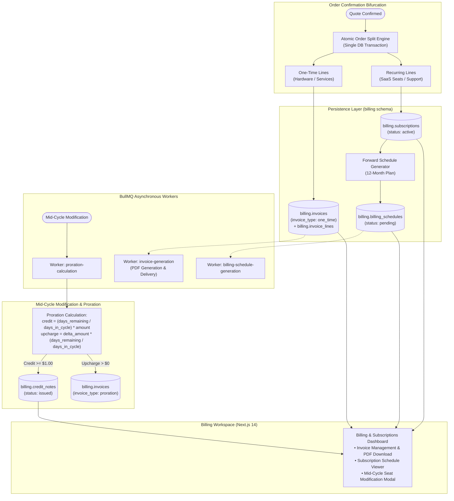
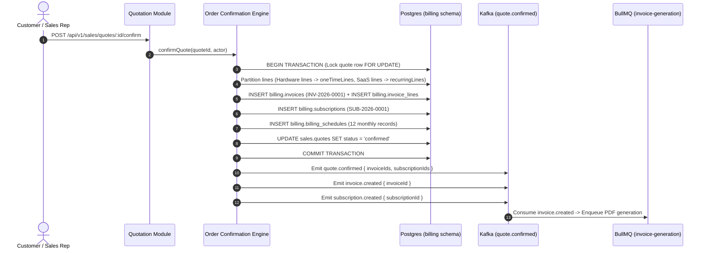

# Phase 5 — Hybrid Billing & Subscription Management Engine

> **Document ID:** DF360-PHASE-05  
> **Version:** 1.0.0  
> **Status:** APPROVED  
> **Target Delivery:** Sprint 9–10  
> **Owner:** Principal Billing Architect & Financial Systems Engineering Lead

---

## 1. Executive Summary & Phase Goal

Phase 5 establishes the enterprise financial transaction and revenue recognition engine of DealFlow360: the **Hybrid Billing & Subscription Management Engine**. Modern B2B contracts rarely consist solely of one-time transactions or pure SaaS subscriptions; deals typically blend physical hardware, upfront implementation fees, and multi-year recurring subscriptions with complex billing cadences.

This phase implements the **Order Bifurcation Split Engine** to atomically segregate confirmed quotes into immediate one-time invoices and active subscription records, builds the **Forward Billing Schedule Generator** to pre-schedule 12-month billing plans, engineers the mathematical **Proration Engine** for mid-cycle subscription modifications (seat additions, downgrades, cancellations), enforces strict credit note issuance and invoice voiding controls, leverages **BullMQ** workers for asynchronous financial document generation, and deploys a comprehensive Billing & Subscription Management UI in Next.js.



---

## 2. Exact Prerequisites & Input Documents

All architectural models, financial state machines, and mathematical formulas for Phase 5 are specified in:

| Specification Document | Target Anchor / Section | Purpose for Phase 5 |
|---|---|---|
| [01-SYSTEM_ARCHITECTURE.md](file:///home/bow/projects/DealFlow360/docs/01-SYSTEM_ARCHITECTURE.md) | §4.4 (Billing Context), §7 (Data Flow) | Domain boundaries, transactional separation, billing event triggers. |
| [02-DATABASE_SCHEMA.md](file:///home/bow/projects/DealFlow360/docs/02-DATABASE_SCHEMA.md) | §3.3 (Billing Schema: `invoices`, `invoice_lines`, `subscriptions`, `billing_schedules`, `credit_notes`, `payments`) | Exact column definitions, numeric precisions (Numeric 12,4), foreign keys, and indexes. |
| [03-REST_API_OPENAPI.md](file:///home/bow/projects/DealFlow360/docs/03-REST_API_OPENAPI.md) | §2.12 (Invoices API), §2.13 (Subscriptions API) | REST endpoints for invoice retrieval, subscription listing, mid-cycle seat adjustment, credit note generation. |
| [04-ASYNC_EVENT_WORKER_CATALOG.md](file:///home/bow/projects/DealFlow360/docs/04-ASYNC_EVENT_WORKER_CATALOG.md) | §2.4 (`billing.events`), §4.5 (`billing-schedule-generation`), §4.6 (`proration-calculation`), §4.7 (`invoice-generation`) | BullMQ worker specifications, Kafka event payloads for billing lifecycle. |
| [06-BILLING_FULFILLMENT_SPEC.md](file:///home/bow/projects/DealFlow360/docs/06-BILLING_FULFILLMENT_SPEC.md) | §1 (Hybrid Order Engine), §1.2 (Confirmation Split Logic), §3 (Proration Engine), §4 (Billing Schedules), §5 (Invoices) | Authoritative bifurcation pseudocode, mathematical proration formulas, credit thresholds, schedule algorithms. |
| [07-AUTH_SECURITY_RBAC.md](file:///home/bow/projects/DealFlow360/docs/07-AUTH_SECURITY_RBAC.md) | §3, §4 (`billing:manage`, `credit_note:issue`) | Permissions matrix for Finance Managers and Controllers. |

---

## 3. Component-by-Component Implementation Checklist

### 3.1 Database Schema Migrations & Drizzle ORM
- [ ] Implement migration `0004_hybrid_billing.sql`:
  - [ ] Table [`billing.invoices`](file:///home/bow/projects/DealFlow360/docs/02-DATABASE_SCHEMA.md#L722-L755): Columns `id`, `invoice_number` (unique), `quote_id`, `account_id`, `invoice_type` (`one_time`, `recurring`, `proration`), `status` (`draft`, `pending`, `paid`, `voided`, `overdue`), `total_amount`, `currency`, `due_date`, `issued_at`, `paid_at`, `void_reason`.
  - [ ] Table [`billing.invoice_lines`](file:///home/bow/projects/DealFlow360/docs/02-DATABASE_SCHEMA.md#L757-L788): Columns `id`, `invoice_id`, `quote_line_id`, `product_id`, `description`, `quantity`, `unit_price`, `total_price`, `fulfillment_required`.
  - [ ] Table [`billing.subscriptions`](file:///home/bow/projects/DealFlow360/docs/02-DATABASE_SCHEMA.md#L790-L830): Columns `id`, `quote_id`, `quote_line_id`, `account_id`, `product_id`, `status` (`active`, `paused`, `cancelled`, `expired`), `quantity`, `unit_price`, `amount`, `currency`, `billing_interval` (`monthly`, `quarterly`, `yearly`), `interval_days` (30, 91, 365), `current_period_start`, `current_period_end`, `next_billing_date`, `cancelled_at`.
  - [ ] Table [`billing.billing_schedules`](file:///home/bow/projects/DealFlow360/docs/02-DATABASE_SCHEMA.md#L832-L865): Columns `id`, `subscription_id`, `schedule_date`, `period_start`, `period_end`, `amount`, `status` (`pending`, `invoiced`, `skipped`), `invoice_id`.
  - [ ] Table [`billing.credit_notes`](file:///home/bow/projects/DealFlow360/docs/02-DATABASE_SCHEMA.md#L867-L900): Columns `id`, `credit_note_number`, `account_id`, `subscription_id`, `invoice_id`, `amount`, `currency`, `reason`, `status` (`issued`, `applied`, `refunded`), `created_at`.
  - [ ] Table [`billing.payments`](file:///home/bow/projects/DealFlow360/docs/02-DATABASE_SCHEMA.md#L902-L935): Columns `id`, `invoice_id`, `account_id`, `amount`, `status` (`pending`, `succeeded`, `failed`), `gateway_transaction_id`, `payment_method`.
- [ ] Export typed Drizzle tables, relations, and Zod schemas.

### 3.2 Order Confirmation Bifurcation Engine
- [ ] Implement `OrderConfirmationService` in NestJS:
  - [ ] Enforce atomic transaction (`db.transaction(async (tx) => { ... })`).
  - [ ] Lock quote with `FOR UPDATE` to prevent concurrent confirmations.
  - [ ] Partition `quote_lines`:
    - `oneTimeLines` = lines where `line_type == 'one_time'`.
    - `recurringLines` = lines where `line_type == 'recurring'`.
  - [ ] One-Time Path:
    - If `oneTimeLines.length > 0`, generate invoice number `INV-YYYY-XXXXXX`.
    - Insert single `billing.invoices` record and batch insert `billing.invoice_lines`.
  - [ ] Recurring Path:
    - For each line in `recurringLines`, insert `billing.subscriptions` record.
    - Compute forward billing dates and insert `billing.billing_schedules` records.
  - [ ] Update quote status: `status = 'confirmed'`, `confirmed_at = NOW()`.
  - [ ] Post-commit side effects:
    - Emit Kafka events: `quote.confirmed`, `invoice.created`, `subscription.created`.
    - If any line has `fulfillment_required = true`, trigger spatial split BullMQ job.

### 3.3 Forward Billing Schedule Generator
- [ ] Implement `BillingScheduleGenerator`:
  - [ ] Support cadences: `monthly` (12 forward cycles), `quarterly` (4 forward cycles), `yearly` (1 forward cycle).
  - [ ] Advance date handling using `date-fns` (`addMonths(startDate, i)`) with leap-year and month-end clamping (e.g. Jan 31 -> Feb 28).
  - [ ] Persist generated schedule entries with status `pending`.

### 3.4 Mid-Cycle Subscription Proration Engine
- [ ] Implement `ProrationEngine` pure calculations:
  - [ ] Calculate cycle metrics:
    $$\text{daysInCycle} = \text{differenceInDays}(\text{currentPeriodEnd}, \text{currentPeriodStart})$$
    $$\text{daysRemaining} = \text{differenceInDays}(\text{currentPeriodEnd}, \text{today})$$
    $$\text{prorationFactor} = \frac{\text{daysRemaining}}{\text{daysInCycle}}$$
  - [ ] Downscale / Cancellation Credit:
    $$\text{credit} = \text{prorationFactor} \times \text{oldAmount}$$
  - [ ] Upscale (Seat Expansion) Upcharge:
    $$\text{proratedUpcharge} = (\text{newAmount} - \text{oldAmount}) \times \text{prorationFactor}$$
  - [ ] Threshold guard: Minimum credit threshold is \$1.00 (`MINIMUM_CREDIT_THRESHOLD = 1.00`). Credits below this do not issue credit notes.
- [ ] Implement `CreditNoteService`:
  - [ ] Generate sequential number `CN-YYYY-XXXXXX`.
  - [ ] Record credit note and link to customer account balance.

### 3.5 Invoice Voiding & Cancellation Logic
- [ ] Implement `InvoiceManagementService`:
  - [ ] `POST /api/v1/billing/invoices/:id/void`:
    - Enforce guard: Invoice must be in status `pending` or `overdue` (cannot void `paid` invoices; paid invoices require credit note refund).
    - Update status to `voided`, record `void_reason` and `voided_by`.
    - Emit Kafka event `invoice.voided`.

### 3.6 BullMQ Workers for Financial Jobs
- [ ] Worker `BillingScheduleWorker` (queue: `billing-schedule-generation`):
  - [ ] Runs daily cron or event-triggered jobs to convert due `billing_schedules` (`schedule_date <= TODAY`) into recurring invoices.
- [ ] Worker `ProrationWorker` (queue: `proration-calculation`):
  - [ ] Asynchronously processes mid-cycle contract modifications requested via API or CRM.
- [ ] Worker `InvoiceGenerationWorker` (queue: `invoice-generation`):
  - [ ] Generates PDF binary using headless PDFKit, uploads to storage, and enqueues email dispatch.

### 3.7 Next.js Billing & Subscription Workspace
- [ ] Invoices Hub (`/billing/invoices`):
  - [ ] Tabbed data table: `All`, `Pending`, `Paid`, `Voided`.
  - [ ] Invoice detail modal showing line items, tax breakdown, and payment history.
  - [ ] "Download PDF" action trigger and "Void Invoice" dialog (with reason input).
- [ ] Subscriptions Management (`/billing/subscriptions`):
  - [ ] Active subscription list with renewal dates, interval badge, and MRR roll-up.
  - [ ] Subscription Detail View (`/billing/subscriptions/[id]`):
    - 12-month billing schedule timeline showing upcoming invoice dates.
    - "Modify Subscription" Button: Opens modal to adjust seat count.
    - Interactive Proration Preview: Shows instant calculation of immediate prorated charge or credit note amount before committing.
- [ ] Credit Notes Table (`/billing/credit-notes`):
  - [ ] Summary of issued, applied, and refunded credit balances.

---

## 4. Step-by-Step Execution Plan



### Step 1: Database Migration & Schema Validation
1. Apply migration `0004_hybrid_billing.sql` using Drizzle Kit.
2. Verify all foreign keys link properly between `sales.quotes`, `billing.invoices`, and `billing.subscriptions`.
3. Create database indices on `billing.invoices(account_id, status)` and `billing.subscriptions(account_id, next_billing_date)`.

### Step 2: Implement Order Split Confirmation Service
1. Write `confirmQuote` in `apps/api/src/modules/billing/order-confirmation.service.ts` matching [DF360-SPEC-006 §1.4](file:///home/bow/projects/DealFlow360/docs/06-BILLING_FULFILLMENT_SPEC.md#L150-L290).
2. Ensure strict atomic rollback: If subscription generation fails, no invoice is written.

### Step 3: Implement Forward Schedule Generator
1. Implement generator in `libs/common/src/billing/schedule-generator.ts`:
   ```typescript
   export function generateScheduleDates(
     startDate: Date,
     interval: 'monthly' | 'quarterly' | 'yearly',
     cycles = 12
   ): Array<{ periodStart: Date; periodEnd: Date; scheduleDate: Date }> {
     const monthsPerInterval = interval === 'monthly' ? 1 : interval === 'quarterly' ? 3 : 12;
     const schedules = [];

     for (let i = 0; i < cycles; i++) {
       const periodStart = addMonths(startDate, i * monthsPerInterval);
       const periodEnd = addMonths(periodStart, monthsPerInterval);
       schedules.push({
         periodStart,
         periodEnd,
         scheduleDate: periodStart, // Invoiced at start of period
       });
     }
     return schedules;
   }
   ```

### Step 4: Implement Proration & Credit Note Engine
1. Implement `computeProration` in `libs/common/src/billing/proration.ts` matching [DF360-SPEC-006 §3.4](file:///home/bow/projects/DealFlow360/docs/06-BILLING_FULFILLMENT_SPEC.md#L760-L800).
2. Write endpoint `POST /api/v1/billing/subscriptions/:id/modify`:
   - Accepts `{ newQuantity, modificationDate }`.
   - Returns proration preview if `dryRun: true`.
   - Commits adjustment, generates upcharge invoice or credit note, and updates subscription if `dryRun: false`.

### Step 5: Build Billing UI in Next.js
1. Scaffold `/billing/invoices`, `/billing/subscriptions`, and `/billing/credit-notes`.
2. Build interactive subscription modification modal with real-time reactive proration preview.

---

## 5. Empirical Verification & Test Suite Requirements

```
  ┌─────────────────────────────────────────────────────────────┐
  │ 1. Unit Tests: Proration Formula, Leap Year Schedules       │
  ├─────────────────────────────────────────────────────────────┤
  │ 2. Integration Tests: Atomic Bifurcation TX, Void Guards    │
  ├─────────────────────────────────────────────────────────────┤
  │ 3. E2E Tests: Quote Confirm -> Invoices & Subscriptions     │
  └─────────────────────────────────────────────────────────────┘
```

### 5.1 Unit Tests (`pnpm test:unit`)
- **Proration Formula Mathematical Tests:**
  - **Cancellation Credit Worked Example:**
    - \$300/month, 30-day cycle, cancelled on Day 10 ($\text{daysRemaining} = 20$).
    - Credit $= (20 / 30) \times 300 = \$200.00$.
    - Assert `creditAmount === 200.00` and `creditNoteRequired === true`.
  - **Seat Upgrade Upcharge Worked Example:**
    - 5 seats $\times \$50 = \$250/\text{mo}$ upgraded to 8 seats $\times \$50 = \$400/\text{mo}$ on Day 15 ($\text{daysRemaining} = 15$).
    - Upcharge $= (400 - 250) \times (15 / 30) = \$75.00$.
    - Assert `chargeAmount === 75.00` and `invoiceRequired === true`.
  - **Minimum Credit Threshold Test:**
    - Modification yields \$0.65 credit $\implies$ Assert `creditNoteRequired === false` (suppressed by \$1.00 threshold).
- **Billing Schedule Date Clamping:**
  - Start Date: Jan 31, Monthly cadence $\implies$ Assert Cycle 2 starts Feb 28 (or 29 in leap year), Cycle 3 starts Mar 31.

### 5.2 Integration Tests (`pnpm test:integration`)
- **Atomic Bifurcation Rollback:**
  - Simulate DB connection interrupt while generating billing schedules.
  - Assert that no invoice and no subscription exist in the database; quote status remains `draft`.
- **Invoice Voiding Guards:**
  - Mark invoice as `paid` -> Attempt `POST /api/v1/billing/invoices/:id/void` -> Expect HTTP 422 Unprocessable Entity (`"Cannot void paid invoice"`).

### 5.3 End-to-End Workflow Tests (`pnpm test:e2e`)
- **Complete Hybrid Order Lifecycle:**
  1. Build and confirm quote with:
     - Line 1: 5 Server Racks (Hardware, \$10,000 one-time).
     - Line 2: 100 SaaS Enterprise Seats (Subscription, \$50/seat/mo, \$5,000/mo).
  2. Confirm quote via `POST /api/v1/sales/quotes/:id/confirm`.
  3. Query `invoices` $\implies$ Exactly 1 invoice with `invoice_type = 'one_time'`, `total_amount = $10,000`.
  4. Query `subscriptions` $\implies$ Exactly 1 subscription with `amount = $5,000`, `billing_interval = 'monthly'`.
  5. Query `billing_schedules` $\implies$ Exactly 12 schedule rows generated for the subscription.
  6. Execute mid-cycle upgrade on Day 15: Upgrade to 150 seats.
  7. Verify prorated invoice created for \$1,250 immediately.
  8. Verify future billing schedules adjusted to \$7,500/month.

---

## 6. Definition of Done (DoD)

Phase 5 is officially complete when:

1. [ ] Database migration `0004_hybrid_billing.sql` executes cleanly and establishes invoices, invoice lines, subscriptions, billing schedules, credit notes, and payments tables.
2. [ ] Order confirmation split engine reliably bifurcates mixed quotes into one-time invoices and recurring subscriptions in a single atomic database transaction.
3. [ ] Forward billing schedule generator creates accurate multi-cycle schedules handling month-end boundaries and leap years.
4. [ ] Proration engine correctly calculates credits and upcharges with verified unit tests matching [DF360-SPEC-006 §3](file:///home/bow/projects/DealFlow360/docs/06-BILLING_FULFILLMENT_SPEC.md#L702-L760).
5. [ ] Credit notes are properly issued for qualified refunds ($\ge \$1.00$) and invoice voiding guards prevent illegal state transitions.
6. [ ] BullMQ workers handle asynchronous PDF generation, schedule transitions, and proration jobs with full error retries.
7. [ ] Next.js Billing UI enables invoicing review, subscription tracking, and interactive seat modification with real-time proration preview.
8. [ ] All unit, integration, and E2E financial test suites pass with 100% success rate.
