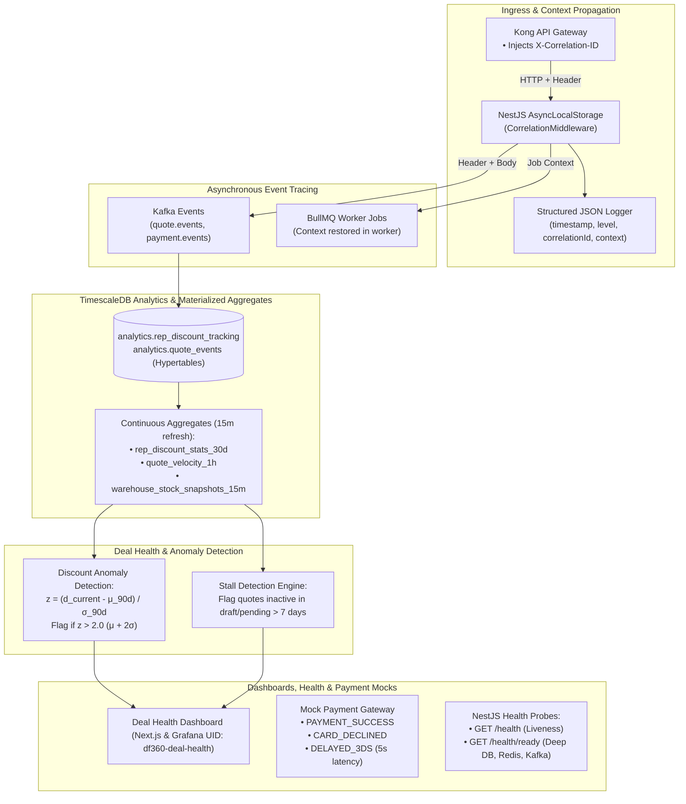
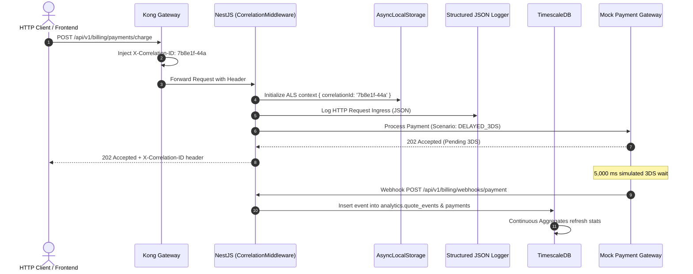

# Phase 6 — Analytics, Observability, Alerting & Mock Integrations

> **Document ID:** DF360-PHASE-06  
> **Version:** 1.0.0  
> **Status:** APPROVED  
> **Target Delivery:** Sprint 11–12  
> **Owner:** Principal Observability Architect & Lead SRE

---

## 1. Executive Summary & Phase Goal

Phase 6 hardens DealFlow360 into a transparent, production-ready enterprise platform through **Analytics, Observability, Alerting & Mock Integrations**. Operating a mission-critical quotation and billing platform demands comprehensive visibility into system health, distributed tracing across asynchronous message boundaries, proactive revenue leak detection (identifying stalled deals and rogue discounting patterns), and dependable simulation harnesses for third-party payment rails.

This phase implements zero-plain-text **Structured JSON Logging** with universal **Correlation ID (`X-Correlation-ID`)** propagation across HTTP, Kafka, and BullMQ boundaries via `AsyncLocalStorage`. It deploys **TimescaleDB** continuous aggregate views to power high-velocity revenue metrics, builds the **Deal Health Dashboard** featuring statistical discount anomaly detection ($z > 2.0$ via $\mu + 2\sigma$) and deal stall tracking ($> 7$ days inactive), provides a **Mock Payment Gateway Service** simulating success, declines, and 5-second 3D Secure (`DELAYED_3DS`) delays, and provisions Grafana dashboards with Kubernetes-compliant NestJS health probes (`/health`, `/health/ready`).



---

## 2. Exact Prerequisites & Input Documents

All architectural specifications, logging envelopes, TimescaleDB SQL scripts, and mock API contracts are defined in:

| Specification Document | Target Anchor / Section | Purpose for Phase 6 |
|---|---|---|
| [01-SYSTEM_ARCHITECTURE.md](file:///home/bow/projects/DealFlow360/docs/01-SYSTEM_ARCHITECTURE.md) | §4.6 (Analytics & Observability), §10 (Cross-Cutting Concerns) | Structured logging policies, OpenTelemetry tracing, monitoring architecture. |
| [02-DATABASE_SCHEMA.md](file:///home/bow/projects/DealFlow360/docs/02-DATABASE_SCHEMA.md) | §3.4 (Analytics Schema), §5 (TimescaleDB Hypertables & Continuous Aggregates) | Hypertables (`rep_discount_tracking`, `quote_events`, `inventory_snapshots`), retention policies. |
| [03-REST_API_OPENAPI.md](file:///home/bow/projects/DealFlow360/docs/03-REST_API_OPENAPI.md) | §2.14 (Health Probes API), §2.15 (Deal Health & Analytics API) | OpenAPI specs for `/health`, `/health/ready`, and `/api/v1/internal/analytics/deal-health`. |
| [04-ASYNC_EVENT_WORKER_CATALOG.md](file:///home/bow/projects/DealFlow360/docs/04-ASYNC_EVENT_WORKER_CATALOG.md) | §2.5 (`analytics.events`), §4.8 (`analytics-rollup`) | Analytics Kafka stream ingestion, continuous aggregate refresh triggers. |
| [08-OBSERVABILITY_ANALYTICS_MOCKS.md](file:///home/bow/projects/DealFlow360/docs/08-OBSERVABILITY_ANALYTICS_MOCKS.md) | §1 (Logging Standard), §2 (Correlation ID), §3 (TimescaleDB Queries), §4 (Grafana), §5 (Mock Gateway), §6 (Health Checks) | The comprehensive canonical specification for envelopes, Z-score formulas, payment scenarios, and Grafana dashboard JSON. |

---

## 3. Component-by-Component Implementation Checklist

### 3.1 Structured JSON Logging & Correlation ID Propagation
- [ ] Implement Canonical JSON Log Formatter conforming to [DF360-SPEC-008 §1.1](file:///home/bow/projects/DealFlow360/docs/08-OBSERVABILITY_ANALYTICS_MOCKS.md#L26-L72):
  - [ ] Compulsory fields: `timestamp` (ISO 8601 UTC), `level` (`error`, `warn`, `info`, `http`, `debug`), `service`, `module`, `correlationId`, `message`.
  - [ ] Conditional fields: `userId`, `traceId`, `context`, `duration_ms`, `error: { name, message, stack }`.
  - [ ] Zero plain-text logging in any environment (including local dev).
- [ ] Ingress Correlation Middleware (`CorrelationMiddleware`):
  - [ ] Intercept incoming `X-Correlation-ID` injected by Kong (or fallback to `crypto.randomUUID()`).
  - [ ] Populate Node.js `AsyncLocalStorage<RequestContext>`.
  - [ ] Echo `X-Correlation-ID` on all HTTP response headers.
- [ ] Context Propagation Interceptors:
  - [ ] **Kafka Producer Interceptor:** Automatically inject `correlationId` into Kafka message headers and payload body.
  - [ ] **Kafka Consumer Interceptor:** Extract `correlationId` from headers and initialize `AsyncLocalStorage` during event processing.
  - [ ] **BullMQ Processor Interceptor:** Pass `correlationId` into job data and restore context inside `@Process()` worker methods.

### 3.2 TimescaleDB Hypertables & Continuous Aggregate Views
- [ ] Implement migration `0005_timescaledb_analytics.sql`:
  - [ ] Hypertable [`analytics.quote_events`](file:///home/bow/projects/DealFlow360/docs/02-DATABASE_SCHEMA.md#L940-L975): Partitioned on `time` by 7 days.
  - [ ] Hypertable [`analytics.rep_discount_tracking`](file:///home/bow/projects/DealFlow360/docs/02-DATABASE_SCHEMA.md#L977-L1010): Tracks every applied discount per rep, category, and quote line.
  - [ ] Hypertable [`analytics.inventory_snapshots`](file:///home/bow/projects/DealFlow360/docs/02-DATABASE_SCHEMA.md#L1012-L1040): Tracks warehouse stock levels over time.
- [ ] Create Continuous Materialized Aggregate Views:
  - [ ] `analytics.rep_discount_stats_30d`: Pre-calculates 30-day rolling `avg_discount`, `stddev_discount`, `min_discount`, `max_discount`, and `p95_discount` grouped by `rep_id`, `category`, and 1-day time buckets. Refresh policy: every 15 minutes.
  - [ ] `analytics.quote_velocity_1h`: Buckets quote transitions (`created`, `submitted`, `approved`, `confirmed`, `rejected`, `cancelled`) into 1-hour windows. Refresh policy: every 15 minutes.
  - [ ] `analytics.warehouse_stock_snapshots_15m`: Pre-aggregates stock levels into 15-minute intervals using TimescaleDB `LAST()` aggregate.

### 3.3 Statistical Discount Anomaly & Deal Stall Detection
- [ ] Implement Statistical Anomaly Detection Query in `AnalyticsService`:
  - [ ] Mathematical Formula:
    $$z = \frac{d_{\text{current}} - \mu_{\text{rep, 90d}}}{\sigma_{\text{rep, 90d}}}$$
  - [ ] Flag quote lines exceeding the rep's 90-day mean by $> 2\sigma$ ($z > 2.0$).
  - [ ] Classify severity:
    - $z \le 2.0 \implies \text{NORMAL}$
    - $2.0 < z \le 3.0 \implies \text{WARNING}$
    - $z > 3.0 \implies \text{CRITICAL}$
- [ ] Implement Deal Stall Detection Query:
  - [ ] Identify quotes residing in non-terminal states (`draft`, `pending_approval`, `under_negotiation`) with no activity for $> 7$ consecutive days:
    $$\text{daysStalled} = \frac{\text{NOW}() - \text{updated\_at}}{86400} > 7$$
  - [ ] Group stalled deals by sales rep to identify pipeline bottlenecks.
- [ ] Expose Internal Deal Health API:
  - [ ] `GET /api/v1/internal/analytics/deal-health` returning pipeline summary, stalled deals list, discount anomalies list, approval SLA compliance, and BRS distribution buckets.

### 3.4 Mock Payment Gateway Service
- [ ] Implement standalone or embedded `MockPaymentGatewayService` in NestJS:
  - [ ] Simulates payment intents and webhooks without third-party dependencies.
  - [ ] Supported Simulation Scenarios via request header `X-Mock-Payment-Scenario`:
    1. `PAYMENT_SUCCESS`: Synchronous 200 OK, returns `{ status: 'succeeded', transactionId: 'txn_mock_...' }`.
    2. `CARD_DECLINED`: Synchronous 402 Payment Required, returns `{ status: 'failed', code: 'card_declined', message: 'Insufficient funds' }`.
    3. `DELAYED_3DS`: Synchronous 202 Accepted with `{ status: 'pending_3ds', redirectUrl: 'https://mock.dealflow360.com/3ds-auth' }`. Spawns background worker delay (5,000 ms) before asynchronously dispatching webhook `payment_intent.succeeded` signed with HMAC SHA-256 secret.
  - [ ] Webhook Verification Guard: Enforce HMAC SHA-256 header validation on payment webhook receiver (`X-DealFlow-Signature`).

### 3.5 Health & Readiness Probes
- [ ] Implement `HealthController` using `@nestjs/terminus`:
  - [ ] `GET /health` (Liveness Probe): Returns `{ status: 'ok', uptime, timestamp }`. Fails only if process is deadlocked or out of memory.
  - [ ] `GET /health/ready` (Readiness Probe): Deep dependency verification executing parallel checks:
    - PostgreSQL connection check (`SELECT 1`).
    - Redis connection check (`redisClient.ping()`).
    - Kafka KRaft broker connectivity check.
    - Elasticsearch health check.
    - Returns HTTP 200 `{ status: 'ok', checks: { ... } }` when all healthy; returns HTTP 503 Service Unavailable if any dependency is degraded.

### 3.6 Deal Health Dashboard UI & Grafana Integration
- [ ] Grafana Dashboard Provisioning (`grafana/dashboards/deal-health.json`):
  - [ ] UID: `df360-deal-health`.
  - [ ] Panel 1: Quote Pipeline Velocity (draft -> confirmed) 30-day conversion rate chart.
  - [ ] Panel 2: Stalled Deals Alert List (Quotes inactive > 7 days).
  - [ ] Panel 3: Statistical Over-Discounting Radar (Lines with $z > 2.0$).
  - [ ] Panel 4: Approval SLA Compliance Gauge (% approved within 48h SLA).
- [ ] Deal Health Executive Dashboard in Next.js (`apps/sales-fe/src/app/(dashboard)/analytics/deal-health`):
  - [ ] Interactive KPI cards for active pipeline, conversion rate, and margin exposure.
  - [ ] Stalled quotes table with "Nudge Rep" action button.
  - [ ] Flagged discount anomalies table with direct links to review quote lines.

---

## 4. Step-by-Step Execution Plan



### Step 1: Database Migration & TimescaleDB Hypertables
1. Verify TimescaleDB extension is active:
   ```sql
   SELECT extname, extversion FROM pg_extension WHERE extname = 'timescaledb';
   ```
2. Apply migration `0005_timescaledb_analytics.sql`.
3. Verify hypertable creation:
   ```sql
   SELECT hypertable_name FROM timescaledb_information.hypertables;
   ```
4. Verify continuous aggregate refresh policies:
   ```sql
   SELECT view_name, schedule_interval FROM timescaledb_information.continuous_aggregates;
   ```

### Step 2: Implement Structured JSON Logger & Correlation ALS
1. Build `CorrelationMiddleware` and register globally in `AppModule`.
2. Build custom `DealFlow360Logger` inheriting from NestJS `LoggerService`:
   ```typescript
   export class DealFlow360Logger implements LoggerService {
     constructor(private readonly als: AsyncLocalStorage<RequestContext>) {}

     private format(level: string, message: string, context?: any) {
       const store = this.als.getStore();
       return JSON.stringify({
         timestamp: new Date().toISOString(),
         level,
         service: process.env.SERVICE_NAME || 'dealflow360-api',
         correlationId: store?.correlationId || 'none',
         userId: store?.userId,
         message,
         context,
       });
     }

     info(message: string, context?: any) {
       process.stdout.write(this.format('info', message, context) + '\n');
     }
     error(message: string, trace?: string, context?: any) {
       process.stderr.write(this.format('error', message, { ...context, stack: trace }) + '\n');
     }
   }
   ```

### Step 3: Implement Anomaly & Stall Detection Queries
1. Implement `DiscountAnomalyService` executing the parameterised statistical query defined in [DF360-SPEC-008 §3.2](file:///home/bow/projects/DealFlow360/docs/08-OBSERVABILITY_ANALYTICS_MOCKS.md#L718-L780).
2. Implement `StalledDealsService` querying non-terminal quotes with `updated_at < NOW() - INTERVAL '7 days'`.
3. Wire results into `GET /api/v1/internal/analytics/deal-health`.

### Step 4: Implement Mock Payment Gateway & Webhook Simulator
1. Create `MockPaymentGatewayController`:
   ```typescript
   @Controller('mock-gateway')
   export class MockPaymentGatewayController {
     @Post('charge')
     async charge(@Headers('X-Mock-Payment-Scenario') scenario: string, @Body() body: any) {
       if (scenario === 'CARD_DECLINED') {
         throw new HttpException({ code: 'card_declined', message: 'Insufficient funds' }, 402);
       }
       if (scenario === 'DELAYED_3DS') {
         // Queue background webhook after 5 seconds
         setTimeout(() => this.dispatchSuccessWebhook(body.invoiceId), 5000);
         return { status: 'pending_3ds', redirectUrl: 'https://mock.dealflow360.com/3ds-auth' };
       }
       // Default PAYMENT_SUCCESS
       return { status: 'succeeded', transactionId: `txn_mock_${crypto.randomUUID()}` };
     }
   }
   ```

### Step 5: Implement Health & Readiness Probes
1. Implement `HealthController` exposing `/health` and `/health/ready` via NestJS Terminus.
2. Verify endpoints return appropriate HTTP 200 and HTTP 503 status codes.

### Step 6: Build Deal Health Dashboard UI & Grafana Manifest
1. Write declarative Grafana dashboard JSON in `grafana/dashboards/deal-health.json`.
2. Build Deal Health overview in Next.js with Recharts metrics visualizations.

---

## 5. Empirical Verification & Test Suite Requirements

```
  ┌─────────────────────────────────────────────────────────────┐
  │ 1. Unit Tests: Z-Score Math, Log Envelope Schema, Mocks     │
  ├─────────────────────────────────────────────────────────────┤
  │ 2. Integration Tests: Timescale Aggregates, Correlation ALS │
  ├─────────────────────────────────────────────────────────────┤
  │ 3. E2E Tests: Probe Liveness, Anomaly Alert, 3DS Webhook    │
  └─────────────────────────────────────────────────────────────┘
```

### 5.1 Unit Tests (`pnpm test:unit`)
- **Structured Log Envelope Compliance:**
  - Emitted log string must be valid JSON parseable by `JSON.parse()`.
  - Asserts required keys exist: `timestamp`, `level`, `service`, `correlationId`, `message`.
  - Asserts `timestamp` passes ISO 8601 validation.
- **Statistical Z-Score Calculation:**
  - Rep 90-day mean $= 15.0\%$, standard deviation $= 5.0\%$.
  - Current line discount $= 26.0\% \implies z = (26.0 - 15.0) / 5.0 = 2.20$.
  - Assert severity $= \text{'WARNING'}$.
  - Current line discount $= 32.0\% \implies z = (32.0 - 15.0) / 5.0 = 3.40$.
  - Assert severity $= \text{'CRITICAL'}$.
- **Mock Payment Gateway Scenarios:**
  - Scenario `CARD_DECLINED` returns HTTP 402.
  - Scenario `PAYMENT_SUCCESS` returns HTTP 200 with `status: 'succeeded'`.

### 5.2 Integration Tests (`pnpm test:integration`)
- **Correlation Context Propagation:**
  - Dispatch HTTP request with `X-Correlation-ID: test-uuid-999`.
  - Verify emitted JSON logs contain `"correlationId":"test-uuid-999"`.
  - Verify Kafka message headers contain `correlationId = test-uuid-999`.
- **TimescaleDB Continuous Aggregate Refresh:**
  - Seed `analytics.rep_discount_tracking` with 20 historical discount records.
  - Trigger manual refresh: `CALL refresh_continuous_aggregate('analytics.rep_discount_stats_30d', NULL, NULL);`.
  - Query view -> Assert aggregated daily averages match raw SQL computation.

### 5.3 End-to-End Workflow Tests (`pnpm test:e2e`)
- **Health Probes Verification:**
  - Query `GET /health` -> Expect 200 OK `{ status: 'ok' }`.
  - Query `GET /health/ready` -> Expect 200 OK with `postgres`, `redis`, `kafka` marked healthy.
  - Stop Redis container (`docker compose stop redis`) -> Query `GET /health/ready` -> Expect 503 Service Unavailable with `redis` marked degraded.
- **Delayed 3DS Payment & Webhook Resolution:**
  - Create pending invoice.
  - Submit charge with `X-Mock-Payment-Scenario: DELAYED_3DS`.
  - Receive HTTP 202 Accepted (`status: 'pending_3ds'`).
  - Wait 5.5 seconds -> Assert invoice status transitions to `paid` via incoming simulated webhook.
  - Assert payment audit log recorded.

---

## 6. Definition of Done (DoD)

Phase 6 is complete and the entire DealFlow360 platform is ready for production certification when:

1. [ ] Structured JSON logging is enforced platform-wide; zero plain-text logs are emitted; all logs include `correlationId`, `service`, and `level`.
2. [ ] `X-Correlation-ID` header is propagated transparently across Kong Gateway, NestJS controllers, services, Kafka messages, and BullMQ workers.
3. [ ] TimescaleDB hypertables and continuous aggregate views are configured with automatic refresh policies and store rolling analytics data.
4. [ ] Statistical discount anomaly detection identifies discounts $> \mu + 2\sigma$ ($z > 2.0$) and categorizes warning and critical risks.
5. [ ] Deal stall detection correctly identifies and surfaces quotes inactive for $> 7$ days.
6. [ ] Mock Payment Gateway handles `PAYMENT_SUCCESS`, `CARD_DECLINED`, and `DELAYED_3DS` (with verified 5-second asynchronous webhook callback).
7. [ ] Grafana dashboard `df360-deal-health` displays pipeline funnel, stalled deals, discount anomalies, and SLA metrics.
8. [ ] `/health` and `/health/ready` probes operate accurately, reflecting live dependency health for Kubernetes orchestrators.
9. [ ] 100% of unit, integration, and E2E observability and analytics tests pass cleanly.
